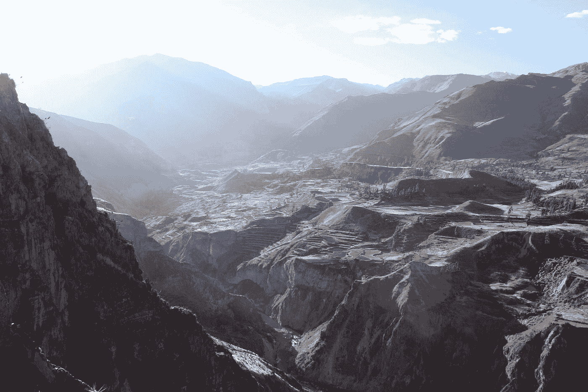

# 判断之前先了解你的地理。

> 原文：<https://medium.datadriveninvestor.com/know-your-geography-before-you-judge-92511b0047a7?source=collection_archive---------17----------------------->

Photo by [Nad Hemnani](https://unsplash.com/@santtd?utm_source=medium&utm_medium=referral) on [Unsplash](https://unsplash.com?utm_source=medium&utm_medium=referral)

> “正如拿破仑所说，了解一个国家的地理就是了解其外交政策”――罗伯特·卡普兰，《地理的复仇:地图告诉我们关于即将到来的冲突和与命运的斗争》

你对当今世界有什么看法？那么正在发生的战争和冲突呢？你对乌克兰危机有什么看法？或者关于伊拉克战争，阿富汗？

有没有可能，你一直在根据你的感觉而不是根据你的观察和必要的教导来判断情况、冲突和国家？

大多数人都持有一种流行的观点，即他们的国家或他们周围的环境。当然，这取决于教育水平，但如今真正思考并对某件事形成坚定看法的人很少。

而最被忽视的科目之一就是地缘政治！
它很可能会改变你所相信的一切。
它会让你理解为什么国家或他们的领导人会以某种方式行事，它会让你明白为什么世界是以这种方式构建的。

我一直喜欢政治，但出于某种原因，我对政客和国家的行为方式缺乏更深入的理解。
当乌克兰政府被推翻并开始变得对欧洲更加友好时，普京为什么会有这样的反应？

我知道很多人简单地认为普京，也就是俄罗斯人，只是一群不重视人权和个人权利的邪恶的人。因此介入只是为了阻止乌克兰人成为欧洲和西方世界的一部分。

长期以来，俄罗斯人一直是众所周知对许多美国人有益的事物的公开敌人。但是根据你的国家告诉你的事情来判断他们真的是公平和明智的吗？毕竟，每个国家都有自己的议程，为了能够辨别谎言和真相，你必须了解你的国家和其他国家的决定背后的原因。

我正在读蒂姆·马歇尔的《地理囚犯:告诉你关于全球政治你需要知道的一切的十张地图》。它完全改变了我的世界观。我终于能够看到我们的领导人和国家所采取的行动背后的原因，因此我能够理解这个世界是如何运作的，因为我决心做出改变和改善这个世界，以便有一天我们能够齐心协力，了解这一点是至关重要的。

如果你想了解这个世界和其中发生的一切，我建议你也投身于这个领域。

# 作为领导者，你必须考虑的事情

Photo by [Jørgen Håland](https://unsplash.com/@jhaland?utm_source=medium&utm_medium=referral) on [Unsplash](https://unsplash.com?utm_source=medium&utm_medium=referral)

> “国际政治从来都不是关于民主和人权。事关各州利益。记住这一点，不管你在历史课上学到了什么。”―埃贡·巴赫尔

这是关于各州的利益，而这些利益来源于各州的地理位置。一个国家，或者更好地说，它的领导人必须把国家的利益放在高于一切的位置，在政治上和军事上必须确保这个国家的繁荣和生存。

为了做到这一点，一个人必须着眼于这个国家及其边界和特定的地理环境，以便制定一个好的防御战略。

例如，在俄罗斯，大多数人生活在西方。那也是莫斯科的所在地。
乌拉尔山脉以东的西伯利亚，一直延伸到太平洋，大部分是荒野，不适合居住。但是在失败的时候，这是一个令人惊奇的地方。

乌拉尔山脉为俄罗斯人提供了来自东部的保护，这就是为什么他们不得不把重点放在西部的防御和进攻行动上。

他们可以肯定，如果他们受到攻击，这将发生在西方。

但俄罗斯人为什么要介入乌克兰危机，为什么这么急于拿下克里米亚？

下周我会在文章中详细介绍地缘政治。

我希望你喜欢这次短暂的地缘政治之旅，并有兴趣了解更多。
欢迎鼓掌，评论和分享这篇文章。

干杯，
Heiko。