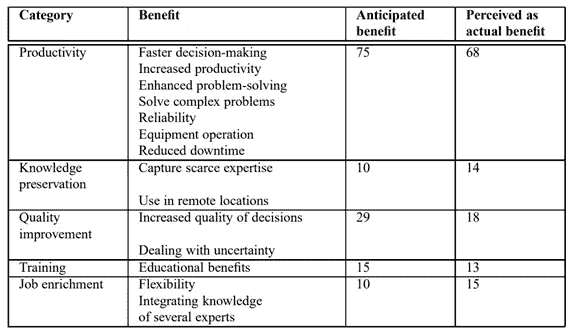
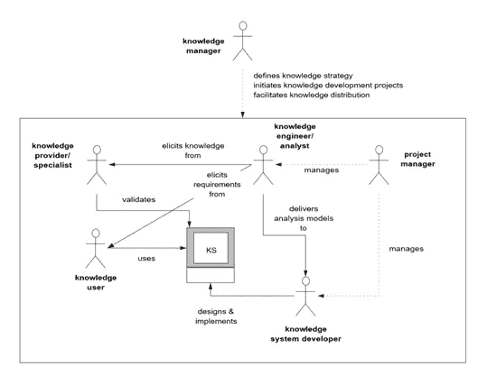
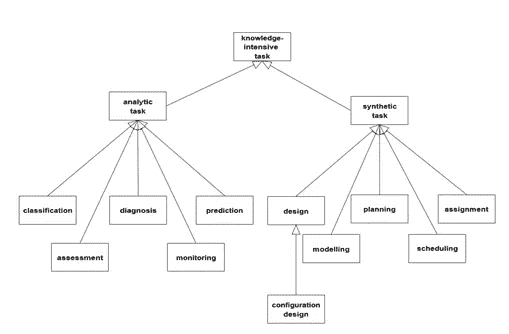
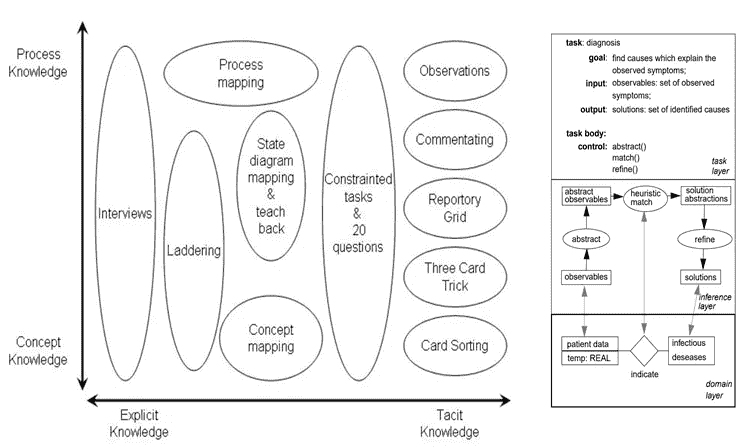

# 知识工程与系统:智力放大的关键

> 原文：<https://medium.datadriveninvestor.com/knowledge-engineering-systems-key-to-intelligence-amplification-ia-6806f3bcdde8?source=collection_archive---------0----------------------->

Photo by [Alfons Morales](https://unsplash.com/@alfonsmc10?utm_source=medium&utm_medium=referral) on [Unsplash](https://unsplash.com?utm_source=medium&utm_medium=referral)

15 年前，当我开始从事数据和分析工作时，一个典型的行业挑战是收集高度分散、支离破碎且质量稍低的信息，并以经济高效的方式构建这些信息以获得洞察力。然而最近，行业需求发生了逆转，新的挑战是将大量密集和大量的信息浓缩为可操作的见解(当然，仍然是以经济高效的方式)。因此，尽管数据的数量、速度和种类发生了巨大的变化，成本函数也从搜索信息转移到了处理信息，但有一个方面在许多方面都保持不变——信息的更大目的:**增强人类的智力！**

 [## 准备在 2019 年改变世界的技术-数据驱动的投资者

### 很难想象一项技术会像去年的区块链一样受到如此多的关注，但是……

www.datadriveninvestor.com](https://www.datadriveninvestor.com/2019/01/17/the-technologies-poised-to-change-the-world-in-2019/) 

在 80 年代早期，当人工智能和机器学习获得最初的牵引力时，知识系统作为增强人类智能的可行方式出现。一个*基于知识的系统*是一个在解决问题的过程中使用人工智能技术来支持人类决策、学习和行动的系统。

一些最初开发的系统集中于医疗诊断或卫星专家系统等。在过去的四十年里，随着我们在全球范围内大力发展知识经济，知识系统的发展也在不断扩大。这给企业和知识工作者带来了巨大的好处。麻省理工学院出版社出版的《知识工程与管理 CommonKADS 方法论》一书提供了这些优势的良好框架:

***然而，尽管知识系统、人工智能的进步以及企业努力开发它们带来了好处，但近来企业知识系统的许多用例并不成功。这就引出了一个问题，为什么？***

根据我的研究和当前的市场动态，得出了一些重要观察结果:

1.超级营销和炒作周期正在扭曲机器能力的背景:人工智能/机器学习(作为人类劳动的终结)的广告承诺是不真实的，至少在可预见的未来是如此。然而，**智能放大(IA)** 的时代肯定在继续，不幸的是，并没有被广泛讨论。IA 指的是利用机器和算法的力量来增强人类的智能。在我看来，基于人工智能的系统(又名知识系统)现在可以在许多用例中产生 30–60%的生产力&质量，然而，由于过度承诺而受到破坏。因此，简单地将叙述从人工智能转变为信息架构，并关注知识自动化，可以对知识系统的目的、方法和期望产生重大影响。这方面有很好的文献，但只强调一个:[https://pdfs . semantic scholar . org/eb82/c 04d 987 C1 db 532 e 0 fa 5 ea f 07d 82839 C5 e24c . pdf](https://pdfs.semanticscholar.org/eb82/c04d987c1db532e0fa5eaf07d82839c5e24c.pdf)

2.**过于关注推理方法而非知识库:**斯坦福大学在 1980 年的一篇研究论文([https://apps.dtic.mil/dtic/tr/fulltext/u2/a092574.pdf](https://apps.dtic.mil/dtic/tr/fulltext/u2/a092574.pdf))中解释说，一个*知识系统的性能主要是其知识库的结果，其次才是应用推理方法的结果。因此，专家系统应该是知识丰富的，即使他们的方法很差！*虽然在 2019 年，鉴于这些进步，我们不需要在推理方法上妥协，但我们花在推理方法上的时间不成比例，而不是开发知识库。这，很多时候，建模知识中被忽视的部分，就是**知识工程**！知识工程能够在计算机系统内对复杂的知识结构进行系统的科学提取、整合和表示。

补充阅读材料:[http://mku suma . staff . guna darma . AC . id/Downloads/files/29404/KBS-review . pdf](http://mkusuma.staff.gunadarma.ac.id/Downloads/files/29404/KBS-Review.pdf)

[https://www . research gate . net/profile/B _ Chandrasekaran/publication/3282122 _ Generic _ Tasks _ in _ Knowledge-Based _ Reasoning _ High-Level _ Building _ Blocks _ for _ Expert _ System _ Design/links/54fd 651 c 0 cf 2c 3 f 52424 a 31 B . pdf](https://www.researchgate.net/profile/B_Chandrasekaran/publication/3282122_Generic_Tasks_in_Knowledge-Based_Reasoning_High-Level_Building_Blocks_for_Expert_System_Design/links/54fd651c0cf2c3f52424a31b.pdf)

3.**知识系统需要考虑知识的进化性质:**像亚马逊和优步这样的公司在他们所做的事情上取得高度成功的一个关键原因不仅仅是因为他们的商业理念。一个重要的贡献者是来自用户的高速反馈回路，允许他们修复/增强他们的供应链、用户体验、产品等。飞速地。相比之下，企业系统一点也不灵活，尽管有很好的技术，却显得非常单一。他们不允许 *Wiki* 类型的功能让专家/用户不断地将新的知识理解吸收到系统中，因此随着时间的推移会失去相关性。

因此，企业在其日常流程中仍然利用不到 15%的已知信息，这反映在生产力、决策和绩效方面表现不佳。

除了市场条件和叙述之外，克服围绕知识系统的许多问题的一个关键方法是有效的知识工程。 ***知识工程是成功的知识体系的核心，将在第四次工业革命中发挥与机械、电气和化学工程在改变体力劳动的工业革命中同样的作用。***

阅读关于 [CommonKADs](https://www.researchgate.net/profile/B_Chandrasekaran/publication/3282122_Generic_Tasks_in_Knowledge-Based_Reasoning_High-Level_Building_Blocks_for_Expert_System_Design/links/54fd651c0cf2c3f52424a31b.pdf) 方法论的书籍和其他出版物，可以了解一些关于知识工程的关键主题:

1.  **认识到知识工程是它自己的学科:**在一些情况下，知识工程是一个影子角色或高度启发式的。这是不恰当的，因为知识工程师在知识获取、组织和表达方面有特定的角色。

因此，当数据工程师专注于构建数据管道，数据科学家专注于推理方法时，知识工程师应该专注于建模结构化用例并详述专家知识的概念。知识工程师的工作是人工智能和软件开发人员的关键输入。

2.**了解要解决的问题&利用知识模型的模板:**知识工程方法适应知识的用例，可以为特定的需求建模，并且在许多情况下产生可重用的格式。该书描述了一个典型的知识模板层次结构，每个模板都部署了一个相对独特的系统开发方法:

2.平衡知识工程和推理方法的努力:开发知识丰富的系统应该是基于知识的系统的首要目标。根据知识的性质，有几种获取和表示知识的方法(如下图所示):

在过去的三十年中，随着本体工程和知识图的发展，将这种概念知识转换成编程语言已经取得了显著的进展，但是，应该在项目中勤奋地应用知识图。

3.**知识工程位于业务专家和技术专家之间:**系统工程团队和业务专家经常与最终目的脱节，这是知识系统失败的主要原因。理想情况下，知识工程师应该坐在中间，促进知识从专家大脑到产品的转换。

知识系统代表了人工智能中最有前途的领域之一。亚马逊等成功的公司将知识工程广泛应用于产品开发(如培训 Alexa)。然而，根据我的研究和经验，更需要认识和部署知识工程的概念，以有效地补充人类的智能。