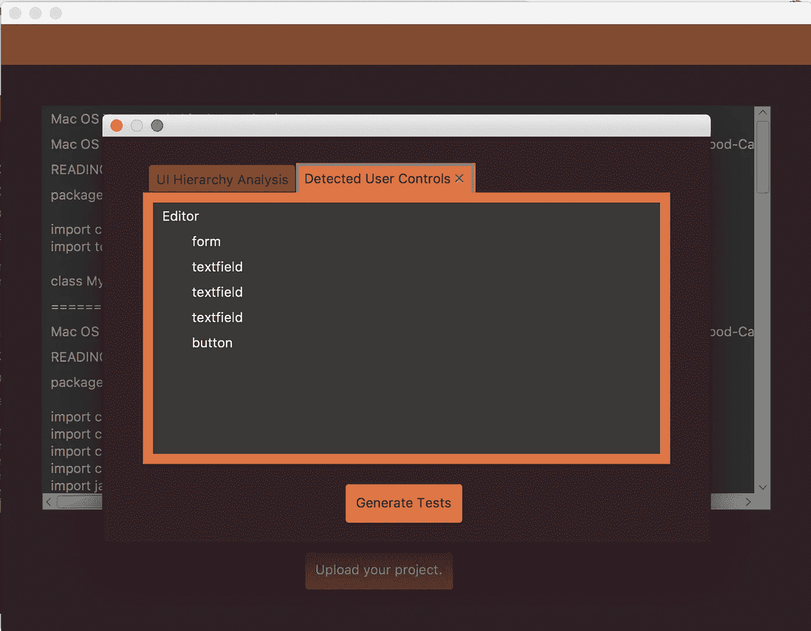
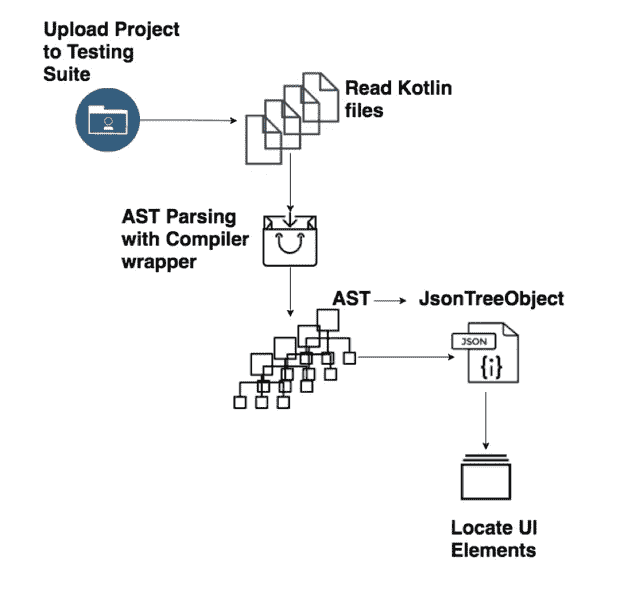
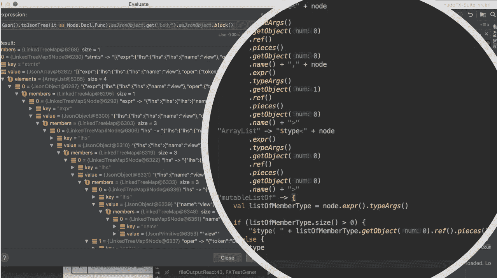
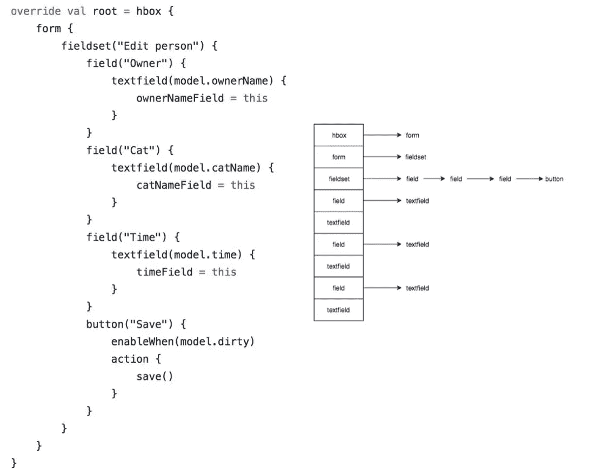
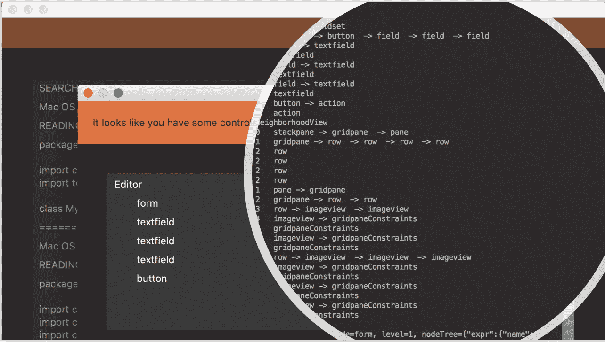

# Kotlin 元编程:UI 环境的定位器机制

> 原文：<https://medium.datadriveninvestor.com/kotlin-metaprogramming-locator-mechanisms-for-ui-environments-cc0074494c90?source=collection_archive---------15----------------------->

## 探索 GUI 中“基于训练的”定位器机制的另一种方法和理念

用户界面对于消费者和商业应用的成功越来越重要。随着 web、移动和本地应用程序的增加，用户对丰富、直观和愉快的体验有了前所未有的更高标准。更重要的是，应用程序必须能够适应不断变化的业务需求。

设计和实现这些图形用户界面(GUI)需要开发者在 UI 本身的像素设计和 GUI 框架的组件名称的语言的 UI 设计之间创建概念上的关系，这些组件名称对应于这些组件的那些交互和组合。这本身就是一个挑战。

为 GUI 编写测试是另一个例子。测试是当今科技界的一个弱点，尤其是在 UI 测试方面。

# 测试质量保证的用户界面

人的因素是保证用户体验成功的必要因素，但是*真正能够对设计施加压力的范围通常受到我们的时间、知识和能力的限制，无法恰当地安排一系列有意义的交互。*

在运行时探索应用程序的环境通常属于*白盒测试*，测试可以自动完成，或者手动完成，不需要了解代码，从用户的角度完成。

探索应用程序本身的环境可能会发现错误，但是如果不知道代码本身有什么，就很难确定不需要的功能的来源。

# 并非一切都是黑白分明的，比如 UI 测试

这是一个我最近才接触到的测试世界。我的故事没那么英雄。当我承认需要 UI 测试时，我意识到我不知道如何去做。我想我可以使用元编程来帮助我为 [TornadoFX](https://www.google.com/search?q=tornadofx&oq=tornadofx&aqs=chrome..69i57j69i60l4j69i59.5234j1j4&sourceid=chrome&ie=UTF-8) 编写这些 UI 测试，这是一个运行在 JVM 上的本地桌面开发框架，在 Kotlin 中得到利用。

这个想法很简单。算是吧。我上传一个龙卷风 FX 项目，[龙卷风 FX-Suite](https://github.com/ahinchman1/TornadoFX-Suite) 读取上传项目的源代码，检测我们关心的 UI 控件，使用 Kotlin 脚本编写测试套件。

在 [TestFX API](https://www.google.com/search?q=testfx&oq=testfx&aqs=chrome..69i57j69i60j69i61j69i60j69i65j0.2711j1j4&sourceid=chrome&ie=UTF-8) 的帮助下，期望的结果给你可以做到这一点的文件，这是一个为你的视图和片段创建测试版本应用程序并使用简单的机器人来模拟用户交互的光滑 API。

接下来几个月的重点将是巩固当前的定位器机制，并在 Kotlin DSLs 的帮助下创建一个合适的系统来生成测试排列的组合。用于定位 UI 元素的系统已经存在，但是在检测 g UI 中的组件时，比较和区分以前的定位器机制方法是很重要的。

# 人工智能定位器机制 UI 组件的元编程定位器机制

与测试相关的人工智能的诀窍在于理解错误的理论；理解*如何*和*在哪里*当我们处理空间/时间复杂性时，我们会犯认知错误。

行动是影响环境的东西。

这就是测试的作用。

**测试是一个探索环境的主动过程，确定它如何响应各种条件。测试人员从这些交互中学习。**

因此，如果我们在谈论一个**生成型机器学习工具**来“做测试”，根据定义，它必须学习。它必须通过采取行动并能够处理这些行动的反馈来做到这一点。

从 Silktest 到 [TestComplete](https://smartbear.com/product/testcomplete/overview/) 到[http://test.ai/](http://test.ai/)，许多人已经开始自动化用户视角测试，以帮助强调 UI 实现设计。其中一些努力已经转向创建“基于训练”的定位机制和围绕生成测试创建人工智能。

这些测试框架，在最坏的情况下，是在一个大的、复杂的代码库中要考虑的大量的强力案例。充其量，复杂的深度学习深度神经网络已经被创建来分析屏幕并对要交互的组件进行分类，就像 [Ebay](https://www.ebayinc.com/stories/blogs/tech/gui-testing-powered-by-deep-learning/) 或[这篇关于创建 UI-图像-GUI-骨架生成的学术论文](https://chunyang-chen.github.io/publication/ui2code.pdf)。但是，即使在最好的情况下，UI 组件的图像分类也面临部分组件暴露的挑战，并且在简单布局中的准确性受到影响。

在 Kotlin 运行时分析代码的众多选项中，我选择了 AST 解析。创建我自己的 AST 解析器帮助我克服了在静态类型语言中尝试“真正的元编程”的挑战，比如不必担心封装和访问级别或者递归中的类型转换。AST 解析更重要的是将解保存在 Kotlin 中，这是借助 [**Kastree**](https://github.com/cretz/kastree) **和** [**Gson**](https://sites.google.com/site/gson/) **完成的。**

I dive deeper into Gson and Kastree implementations [here](https://medium.com/@hinchman_amanda/oop-metaprogramming-series-ast-parsing-in-kotlin-1d6074087612).

Kastree 是 Kotlin 编译器的一个简单包装器，它将代码分解成节点和密封类层次结构中定义的子类型。结果，在运行时检查时，解析揭示了几乎无限的树；这就是 Gson 的用武之地。利用 Kotlin 扩展，我们能够将语言模式的分解简化为类型。例如，在 HashMap(其标签在下图中被可悲地剪掉了)和 ArrayList(定义 HashMap 的键/值类型和定义 ArrayList 的节点类型)之间可以看到惊人的相似之处。

创建这个密集的递归系统来解析整个源代码不仅仅是定位属性、方法和类，还包括这些方法的内容以及构造函数和独立函数。但是目前，我们关心的是获取那些 UI 组件。

当我们定义一个我们关心的 UI 控件的字典时，我们可以使用 AST 解析向下递归 lambdas，直到一个匹配任何字典术语。在下面的图片中，我们用一个龙卷风视图找到了一个根，并且知道我们在正确的地方，向下递归。然后，我们可以通过将节点保存在相邻列表的有向图中来保留节点的层次结构。

实际上，我认为**元编程定位器机制在检测应用程序中的 UI 组件方面可能比当前的 AI 定位器机制更好**，因为与深度学习计算引擎在学习可视化训练组件方面相比，使用抽象语法树(AST)解析的代码自省可能证明更准确、更不密集。这种核心机制的思想可以在以后应用于创建更好的测试，方法是跟踪哪些函数可能影响某些节点，并为这些项目创建关系映射等等。该项目仍在进行中，但它是开源的，我总是欢迎想法和贡献。我期待听到这个项目的反馈。没有你们，我不可能走得这么远。

