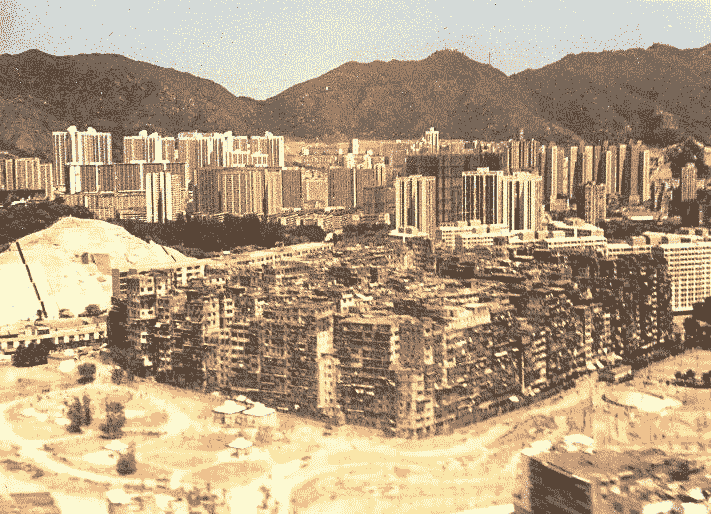
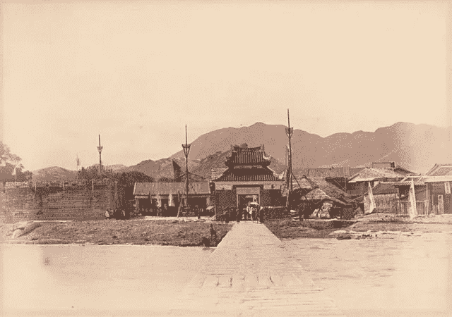
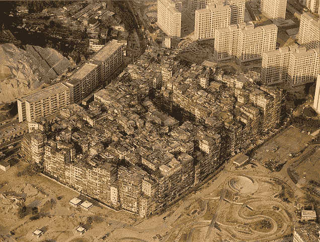

# 九龙城寨:香港无政府的黑暗之心

> 原文：<https://medium.datadriveninvestor.com/kowloon-walled-city-hong-kongs-anarchic-heart-of-darkness-bf62880c70d0?source=collection_archive---------0----------------------->

## 疯狂的赛博朋克城市出现在香港法律体系忽视、警察不敢涉足的一小片土地上。

九龙城寨既是监狱又是避难所。它迷宫般的通道和没有窗户的公寓保护了无辜者和有罪者。它的工厂和车间生产的食品和原料在英国殖民地香港的任何地方都找不到。当警察在离它的外墙几米远的地方巡逻时，一个由 65000 人组成的无政府状态的兔子窝被留下来，在 7 英亩多一点的面积内管理自己的事务。

这座有城墙的城市开始时是一座堡垒，那是在大英帝国的辉煌时期，当时我们为了向中国瘾君子供应鸦片的权利而与中国作战。19 世纪中期，由于担心疫情上瘾，中国取缔了鸦片贸易，导致英国出售鸦片的利润受到打击。作为回应，英国打了一场战争，并赢得了这场战争，以改善其商人的贸易条件。中国被迫开放鸦片贸易，并将香港割让给英国。他们被允许维护那里的堡垒；香港唯一不受英国统治的地方。

1912 年，中国人放弃了它，把它留给了英国人，而英国人没有对它做任何事情。然后，在 1941 年，日本占领了香港，在两周的战斗中打败了英国。胜利后，日本人拆掉了堡垒的墙，用石头扩建了附近的机场。

 [## 在中国做生意:如何优化您的运营|数据驱动的投资者

### 中国是一个受本地和外国公司欢迎的商业中心。在一个国家设立实体存在…

www.datadriveninvestor.com](https://www.datadriveninvestor.com/2019/03/17/doing-business-in-china-how-to-optimize-your-operations/) 

当战争结束，英国重新控制局面时，中国内战的难民逃到香港，占领了这座废弃的堡垒。由于政府的首要任务在别处，他们只能任其自生自灭。这个社区迅速发展到无论如何都无法控制的规模。由于没有向外生长的空间，它反而向上生长，越来越多地挤进它严重受限的范围。堡垒的墙壁现在是简陋的，摇摇欲坠的公寓建筑的墙壁，伸向天空，争夺新鲜空气。

由于英国从未宣布对该地区的管辖权，九龙城寨存在于法律真空中。它被认为是一个可以避开当局视线的地方。一个没有问题的地方。毒品和卖淫在黑社会团伙的操纵下蓬勃发展，传统的中国产品和服务在香港其他地方被禁止。底层的餐馆供应狗肉和猫肉；化学家卖中药；自学成才的牙医在没有认证的情况下为降价而工作。由于不受香港法律的约束，其工厂和车间也不受香港工作场所安全标准的约束。对于那些为了逃离共产主义中国而潜入香港的人来说，这是唯一一个没有身份证也能找到工作和住处的地方。这意味着老板可以随心所欲地对待员工，因为他们知道自己的员工别无选择。

没有监管的束缚，食品制造商等企业可以以无与伦比的低价提供产品。肮脏、潮湿的面条工厂供应全香港的餐馆，他们的产品甚至出现在顶级酒店。使用古老危险机器的纺织厂会为昂贵的裁缝提供西装面料。在屋顶上，在一堆乱七八糟的天线中间，饲养着赛鸽。富裕的香港居民可以打赌哪一个会先到达上海；在香港的其他任何地方，这种赌博都是非法的。

在其鼎盛时期，九龙城寨是世界上人口最稠密的地方。它以一种杂乱无章的方式发展；一群群的居民在年久失修的房子上盖了一堆公寓，就像树的年轮一样，配有简易的排污系统和不可靠的供水系统，只有八条市政管道向 65000 人供水。几乎没有人知道它的底细。住在那里的人知道要保持他们熟悉的通道和楼梯井。一个在墙外活动的毒贩很容易消失在小巷里而失去任何警察。对大多数警察来说，九龙城寨被认为太危险，不能进入。

在空间如此珍贵的情况下，大多数公寓和工作室都没有窗户。一连几天，居民们唯一能看到的光就是电灯。许多小巷漆黑一片；建筑物之间距离太远，太阳光照射不到。如果要养一只宠物鸟，那只能是夜莺了。生活在这种环境下的任何其他鸟类都会忘记如何歌唱。

这座有围墙的城市的大多数居民都不是罪犯，随着时间的推移，犯罪率下降了。在以后的几年里，政府开始提供一些服务，比如邮政服务。普通的邮政工作人员成了唯一熟悉整个城市的人之一。

除了无证牙医、毒贩、非法移民和离家出走者，这座城市还吸引了艺术家、摄影师和电影制作人。救世军在这个城市有业务，他们制作了一部以这个城市为背景的宣传片来展示他们的工作。一个奥地利纪录片团队在 1988 年拍摄了一部引人入胜的纪录片。加拿大摄影师 Greg Girard 为[拍摄了一组引人注目的城市图片](http://www.greggirard.com/work/kowloon-walled-city--13)，发表在他的书《黑暗之城——九龙城的生活》中。

An Austrian documentary about Kowloon Walled City. English subtitles available on YouTube.

尽管九龙城寨与世隔绝，但这是一个令人愤慨的现象，在日益现代化的香港，这是干净景观上的一个污点。它是怎么站起来的？组成这座城市的 300 多栋相互连接的公寓楼是在没有一个专业建筑师的帮助下建造的。这看起来像是一场即将发生的可怕事故。

到 1987 年，当局已经受够了。开放式下水道、不受监管的工厂和不稳定、不安全的公寓不再被接受。香港宣布，九龙城寨将被拆除，变成一个公园。3 . 5 亿美元被发放给在拆迁中失去家园和生计的居民和企业作为补偿。那些对补偿不满意的人被赶出去了。九龙城寨于 1994 年消失。

[*怪异的西班牙*](https://weirdspain.substack.com/) *是一份时事通讯，面向那些想要更深入地了解他们的第二故乡及其人民的移民，以及世界各地想要更多地了解这个神奇的国家正在发生的事情及其原因的西班牙爱好者。* [*订阅这里，在你的收件箱里收到这些文章。*](https://weirdspain.substack.com/subscribe)