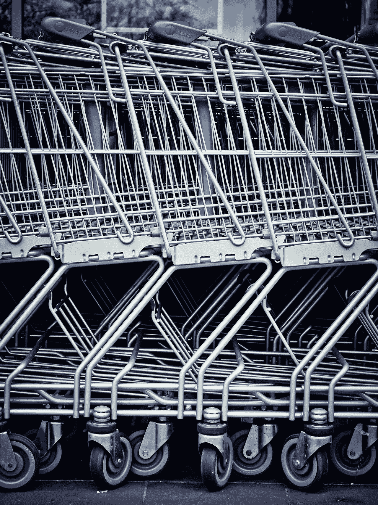
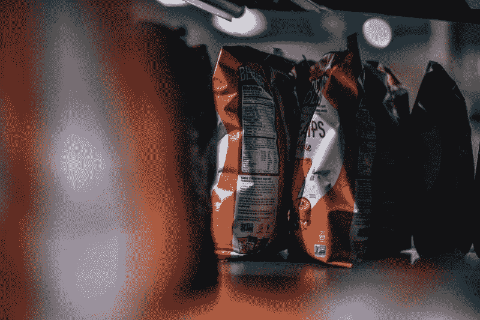
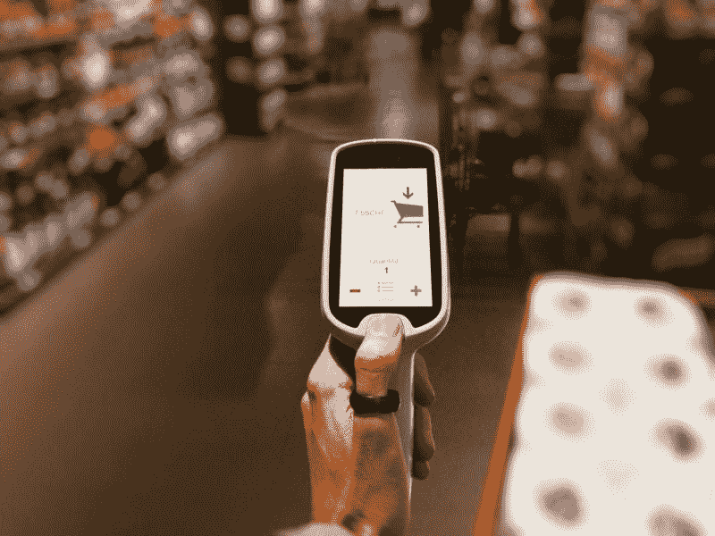
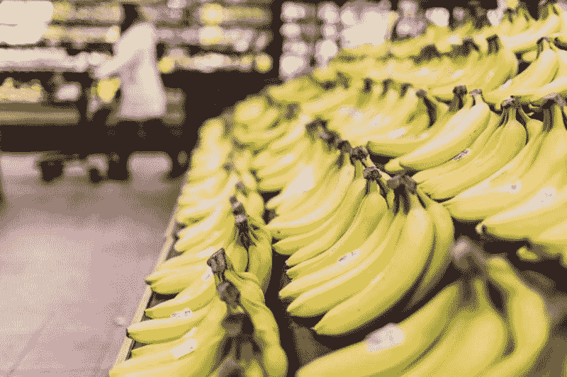
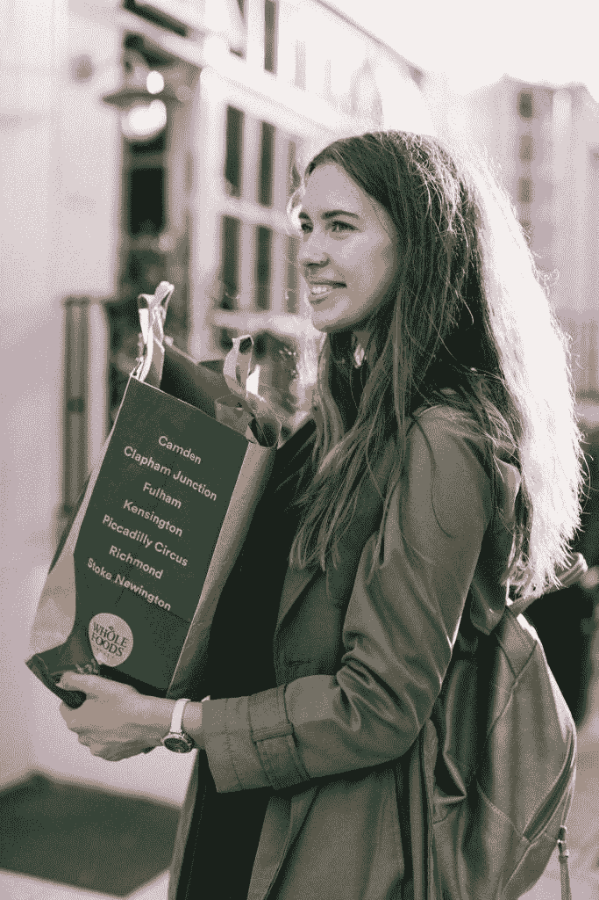

# 克罗格和杂货店的未来——市场疯人院

> 原文：<https://medium.datadriveninvestor.com/kroger-and-the-future-of-grocery-market-mad-house-93e2cb24dfaf?source=collection_archive---------6----------------------->

奇怪的是，传统超市运营商克罗格(纽约证券交易所代码:KR) 正让我们一瞥杂货的未来。

为了解释这一点，Kroger 正与英国 **Ocado Group plc(伦敦证券交易所:OCDO)** 合作，在美国建立 20 个机器人履行中心。事实上，Kroger 已经计划建立三个客户履行中心(CFC ),机器人将在那里挑选和包装食品。

第一个 CFC 正在俄亥俄州的门罗市建造；辛辛那提外，*超市新闻* [报道](https://www.supermarketnews.com/online-retail/kroger-unveils-two-more-ocado-automated-warehouses)。克罗格将在该设施上投资 5500 万美元。此外，他们将在奥兰多郊外的佛罗里达州格罗夫兰建立第二个 CFC。

有趣的是，克罗格在奥兰多市场没有任何店铺。事实上，克罗格在佛罗里达州只经营一家哈里斯蒂特商店。因此，Ocado 可以帮助 Kroger 开拓新市场。

# 克罗格和奥卡多能革新网上杂货店吗？

相反，克罗格可以在奥卡多的帮助下，通过食品杂货配送进入新市场。据路透社(Reuters)估计，具体来说，Ocado 的在线送货服务控制着英国 1.3%的杂货市场。

克罗格拥有 Ocado 6%的股份，但这是该公司的技术，而不是克罗格想要的英国客户。具体来说，Ocado 声称其机器人可以在五分钟内挑选和拉动 50 种杂货。

此外， [Ocado 智能平台](https://www.ocadoengineering.com/applications)可以使用人工智能(AI)在“蜂群”或“蜂巢”中同时操作多达 1000 个机器人。详细来说，Ocado 智能平台是一个用于履行中心机器人的操作系统。

Kroger 管理层认为，智能平台将使他们的 CFC 有能力与亚马逊竞争。值得注意的是，Kroger 声称 Ocado 供电的 CFC 可以满足“任何时间和任何地点的任何事情，”超市新闻指出。

为了澄清，Kroger 计划使用 Ocado 智能平台来挑选和拉动杂货订单。Kroger 的送货服务和 Instacart 等承包商将运送杂货订单。

# 为什么克罗格想要奥卡多

克罗格希望 Ocado 的帮助，因为其收入正在萎缩。具体而言，克罗格报告 2018 年的收入为 1211.62 亿美元。这一数字低于 2017 年的 1226.62 亿美元。

此外，Stockrow 给 Kroger 的 2018 年收入增长率为-1.22%。很能说明问题的是，这是 Kroger 几年来首次出现年度营收负增长。

此外，Macrotrends [估计](https://www.macrotrends.net/stocks/charts/KR/kroger/revenue)克罗格在 2018 年 1 月 31 日至 2019 年 1 月 31 日期间的同比收入下降了 9.47%。因此，克罗格的业务可能正在萎缩。

因此，克罗格的年毛利从 2017 年的 270 亿美元降至 2018 年的 262.58 亿美元。然而，克罗格的年净收入从 2017 年的 19.07 亿美元跃升至 2018 年的 31.1 亿美元。

# 奥卡多为何与克罗格合作

因此，很容易理解为什么奥卡多要与克罗格合作。财务数据显示，如果没有 Ocado 的技术，Kroger 可以从更少的收入中赚更多的钱。

事实上，克罗格的税前收益从 2017 年的 15.02 亿美元增长到 2018 年的 4.01 美元。此外，克罗格的营业收入从 2017 年的 26.12 亿美元小幅增长至 2018 年的 26.14 亿美元。

很明显，克罗格正在创造更多的现金。例如，克罗格的运营现金从 2017 年的 34.13 亿美元增长到 2018 年的 41.64 亿美元。此外，克罗格的年度自由现金流从 2017 年的 6.04 亿美元增长到 2018 年的 11.97 亿美元。因此，尽管收入下降，克罗格仍在增加现金流。

因此，Ocado 与 Kroger 合作，因为 Kroger 可以从美国杂货业务中赚钱。此外，克罗格在美国提供了许多令人印象深刻的资源。

# 克罗格令人印象深刻的资源

Kroger 因为其巨大的足迹赚了更多的钱。例如，Statista 估计 Kroger 在 2019 年 2 月 2 日在美国拥有 2，764 家超市。

然而，这些超市只是克罗格的冰山一角。Kroger 的其他资源包括:

*   弗雷德·梅尔珠宝店 319 号。
*   美国 50 个州中 35 个州的连锁超市
*   37 个食品生产设施。
*   17 个牛奶场。
*   简单的真理自有品牌天然有机品牌。克罗格声称已经售出价值 20 亿美元的简单真理产品，*杂货店潜水* [报道](https://www.grocerydive.com/news/grocery--krogers-simple-truth-brand-tops-2b-in-annual-sales/534300/)。此外，还有超过 1400 个简单的真相产品。
*   各种自有品牌像占克罗格销售额 28.2%的 Simple Truth，*食品潜水* [估计](https://www.grocerydive.com/news/grocery--krogers-simple-truth-brand-tops-2b-in-annual-sales/534300/)。我估计克罗格赚了 34 美元。2018 年来自自有品牌的 180 亿。为了澄清这一点，克罗格报告 2018 年的销售额为 1212 亿美元。

# 克罗格的自有品牌与好市多竞争

自有品牌是杂货业务中利润最高的部分。而且，克罗格的自有品牌销量媲美那些会员制俱乐部巨头[**【Costco 批发】**](https://marketmadhouse.com/costco-makes-money-but-is-it-amazon-proof/) **(纳斯达克股票代码:COST)** 。

具体来说，美国消费者新闻与商业频道估计，好市多在 2018 年销售了价值 390 亿美元的柯克兰签名产品。因此，克罗格的自有品牌销售额正在逼近好市多。

此外，沃伦·巴菲特估计好市多的 Kirkland 招牌销售额超过了历史悠久的食品品牌卡夫-亨氏。为了解释这一点，巴菲特估计伯克希尔哈撒韦公司(纽约证券交易所代码:BRK。H) 子公司卡夫-亨氏 2018 年销售额为 260 亿美元。

因此，克罗格有一个潜在的有利可图的商业模式。例如，好市多 2018 年的收入为 1415.76 亿美元，2019 年 2 月 9 日的季度毛利为 46.76 亿美元。令人难以置信的是，好市多在全球仅经营 510 家门店，但按收入计算，它是美国第四大零售商。

# 克罗格赚了多少钱？

不幸的是，克罗格并没有从它的超市帝国中赚那么多钱。

例如，Kroger 报告 2019 年 2 月 2 日的运营现金流仅为 4.31 亿美元，自由现金流为负-2.79 亿美元。此外，Kroger 在 2019 年 2 月 2 日只有 4.29 亿美元的现金和短期投资。

此外，Kroger 在 2019 年 4 月 29 日的股价为 25.57 美元，市值为 204.1 亿美元。因此，如果没有 Ocado 的技术，Kroger 可能很难吸引投资。

我认为这些低数字解释了 Kroger 与 Ocado 的合作关系。例如，Ocado 的股价很高；1，389.50 美元(1，796.96 美元)和市值；2019 年 4 月 29 日，其规模为 98.27 亿美元(75.9 亿美元)。

相比之下，克罗格的股价很低；25.71 美元，2019 年 4 月 25 日市值 205.25 亿美元。因此，克罗格管理层希望在 Ocado 的帮助下提高市值和股价。

# 为什么克罗格需要奥卡多

此外，Ocado 近年来创造了更多的现金。例如，Ocado 的现金和等价物从 2017 年 12 月的 1.5 亿英镑(1.9416 亿美元)增长到 2018 年 12 月的 4.108 亿英镑(5.3174 亿美元)。

因此，克罗格管理层希望 Ocado 的技术能够帮助它对抗资金雄厚的竞争对手，如亚马逊(纳斯达克代码:AMZN)。值得注意的是，亚马逊在 2019 年 12 月 31 日拥有 412.5 亿美元的现金和等价物。此外，亚马逊在 2019 年 4 月 29 日的股价为 1，984.3 美元，市值为 9，543.5 亿美元。

# 克罗格是价值投资吗？

我认为 Kroger 是一项价值投资，因为它的规模、自有品牌业务以及与 Ocado 的合作关系。

具体来说，Kroger 的 2019 年 4 月 29 日；25.58 美元的股价使其非常值得研究。与亚马逊和每股 1，389.50 英镑(合 1，796.96 美元)的 Ocado 相比，Kroger 很便宜。

另外，与亚马逊不同，克罗格支付股息。事实上，克罗格将于 2019 年 6 月 1 日向 14₵支付每股。这一数字高于 2018 年 6 月 1 日 12.5₵ a 股的水平。此外，Kroger 于 2019 年 10 月 17 日支付了 45.5₵特别股息。

这个股息是可靠的，因为 Dividend.com 认为克罗格有 10 年的股息增长。此外，根据 Dividend.com[的计算](https://www.dividend.com/dividend-stocks/services/grocery-stores/kr-kroger/)，克罗格股票的股息收益率为 2.17%，年化股息为 56₵，股息支付率为 26.4%。

归根结底，Kroger 是一项有价值的投资，可以成长为在线零售的主要参与者。投资者和零售商需要关注克罗格，因为这家历史悠久的杂货商正试图建立一个零售平台，可能会给亚马逊带来资金上的竞争。

*原载于 2019 年 4 月 29 日*[*【https://marketmadhouse.com*](https://marketmadhouse.com/kroger-and-the-future-of-grocery/)*。*