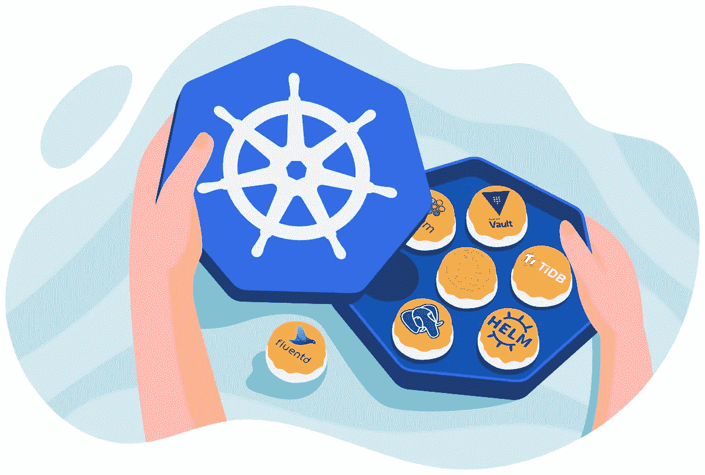

# Kubernetes:特点和为什么 GKE 提供一个即兴编排解决方案给 Kubernetes…

> 原文：<https://medium.datadriveninvestor.com/kubernetes-features-and-why-gke-provides-an-improvised-orchestration-solution-to-kubernetes-5a038f436e5a?source=collection_archive---------3----------------------->

[https://learnk8s.io/a/c4beabbc0e974fd220dd5f132fb7f428.png](https://learnk8s.io/a/c4beabbc0e974fd220dd5f132fb7f428.png)

本文探讨了 Kubernetes 提供的特性和概念，然后讨论了 GKE 如何克服 Kubernetes 面临的某些挑战。如果你想快速直观的了解 Kubernetes 和 Google Kubernetes 引擎可以看看我的 [*往期文章*](https://medium.com/@ajinkyabhanudas/overview-the-google-kuberenetes-engine-4c849c851da7?source=friends_link&sk=c1d217c83379ed69d504dfdf8119bc41) *。*

让我们直接进入 Kubernetes 提供的特性。

*   支持有状态和无状态应用程序。
*   自动缩放
*   展开性
*   资源限制
*   可移植性(没有供应商限制)
*   节点的自动修复
*   容器化操作系统
*   负载平衡

 [## 数据科学和软件工程哪个更有前途？数据驱动的投资者

### 大约一个月前，当我坐在咖啡馆里为一个客户开发网站时，我发现了这个女人…

www.datadriveninvestor.com](https://www.datadriveninvestor.com/2019/01/23/which-is-more-promising-data-science-or-software-engineering/) 

你一定见过大部分的术语，但是节点的自动/自我修复是什么意思呢？Kubernetes 定期检查集群中节点的状态。这基本上意味着它监控节点的健康状况。现在，由于某种原因，某个节点不健康，那么在这种情况下，Kubernetes 会通过耗尽分配给它的所有资源来优雅地降级不健康的节点，并重新创建该节点以恢复工作。这也可能导致服务暂时变慢，因此需要记住这一点。

到目前为止，您应该已经了解了 kubernetes 提供的功能。想象一下，如果您必须在不同的区域和地区调配大量群集，那么 kubernetes 环境将会承受多大的负担。例如，kubernetes **不**创建节点。集群管理员需要创建节点并将它们添加到 kubernetes。另一方面，GKE 通过将计算引擎实例部署和注册为节点来为您实现自动化。

正如我们在 [*之前的文章*](https://medium.com/@ajinkyabhanudas/overview-the-google-kuberenetes-engine-4c849c851da7?source=friends_link&sk=c1d217c83379ed69d504dfdf8119bc41)*中所讨论的，GKE 是一个完全托管的 Kubernetes 服务产品。GKE 提供的附加功能包括:*

*   *应用 IAM(身份访问管理)规则来实现精细的访问控制，从而提供高度安全的环境。*
*   *与 GCP 及其高级网络服务无缝集成*
*   *自动升级(GKE 帮你管理。该过程类似于处理不健康的节点，并保持节点始终可用)*
*   *GCP 提供的用于记录和监控的 Stackdriver 服务。*
*   *最后是 GCP 控制台。Kubernetes 控制台有时也会出现严重问题，使得攻击者有可能利用资源。GCP 控制台要安全得多。它还提供了对 GKE 集群、资源、检查、集群的创建和删除的深入了解。*
*   *节点池的概念是 GKE 的一个特性。(节点池是群集中一组结构相同的节点)。*

*在下一篇文章中，我们将看看 Kubernetes 控制面板以及 Kubernetes 和 GKE 中的其他概念。*

*我尽量保持文章的字节大小，这样在任何时候都不会太大。*

*继续学习，美好的一天:)*