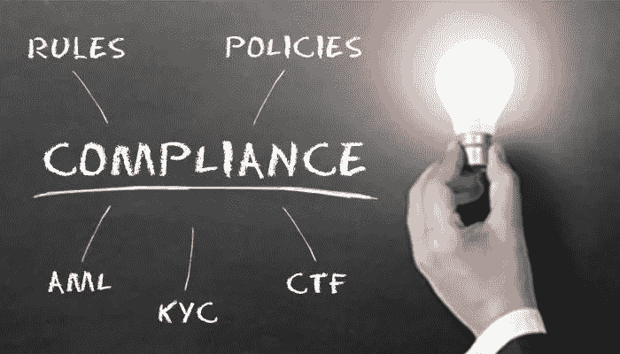

# KYC 和反洗钱合规性——您应该关注的原因

> 原文：<https://medium.datadriveninvestor.com/kyc-and-aml-compliances-reasons-why-you-should-care-e5a32d79569a?source=collection_archive---------10----------------------->

由于技术跨越了距离和语言的障碍，在企业和消费者之间架起了桥梁，它确实创造了一个无与伦比的经济机会的世界。正如有得必有失一样，这样做增加了全球商业的风险和复杂性。企业更容易受到伪造者的攻击，因此他们面临着识别、分析和了解交易对象的压力，尤其是为了减少恐怖主义和金融犯罪的威胁。这种压力是显而易见的，因为了解您的客户(KYC)和反洗钱(AML)法规在全球商业环境中相当统一。每个组织都需要符合 KYC 和反洗钱合规标准，因为它们处于监管机构的监控之下。

**什么是**[**【KYC】和反洗钱合规**](https://shuftipro.com/blogs/3-industries-kyc-aml-compliance-will-gain-significance-2019/) **？**

KYC 代表“了解你的客户”。KYC 是银行和其他相关机构识别和验证客户身份的法规和法律要求。鉴于 AML(反洗钱)是不断发展的法律法规的总称，旨在防止洗钱和其他相关金融犯罪。反洗钱合规更加全面，实际上包括 KYC 合规作为其要求之一。企业也可以用这些术语来表示他们自己的类似过程。目标是识别和调查可疑活动。

**为什么 KYC 反洗钱很重要？**

*   数字诈骗防范:

在线业务有巨大的机会来扩大你的业务，但是，它伴随着诈骗和暴露于新的威胁的增加。去年，网上欺诈案件大幅上升，想象一下今年的比例会有多高，真是令人兴奋。您需要通过正确的 [**身份验证**](https://shuftipro.com/blogs/what-are-the-different-types-and-solutions-of-id-verification/) 渠道来保护自己免受犯罪欺诈。KYC 和反洗钱合规性有助于立即阻止欺诈和滥用，并提供一个过滤器来区分骗子。KYC 合规部核实从可靠来源获得的各种文件。KYC 进程也保护了客户，因为它有助于避免身份盗窃和账户欺诈活动。

*   打击资助恐怖分子的行为:

CFT 条例 [**打击资助恐怖主义行为(CFT)。**](https://www.investopedia.com/terms/c/combating-financing-terrorism-cft.asp) KYC 是一种防止银行/机构卷入犯罪或恐怖活动的方式。金融情报机构是专门的政府机构，负责调查来自个人和机构的潜在可疑金融交易报告。然后，金融情报机构向执法机构提供需要进一步调查的交易信息。您需要雇用 KYC/反洗钱合规人员，以防止自己为这类骗子提供平台，并在以后为此付出代价。参与洗钱和恐怖融资的犯罪分子利用金融系统被认为是对金融系统稳定的威胁。如果金融系统无法发现非法活动，公众可能不会信任该系统的完整性，因此 KYC 和反洗钱合规性是该系统的强制性要求。

*   打击洗钱:

在今天的场景中，世界上每个国家都因 [**洗钱而受害。**](https://www.investopedia.com/terms/m/moneylaundering.asp) 洗钱的最终用途会增加贩毒、恐怖/犯罪活动。洗钱是从非法活动中获取现金，并使这些现金看起来像是从合法商业活动中获得的过程。来自非法活动的钱被认为是“脏的”，这个过程“清洗”这些钱，使其看起来“干净”在关注两用货物监控、价格监控、船只跟踪以及贸易伙伴筛选时，使用 KYC 和反洗钱合规性来发现异常值将是重点关注和发展的关键领域。

**AML & KYC 合规性——一种需求！**

合规之旅始于基础。监管者热衷于清除非法获得的资金进入金融系统，特别是金融机构被监管者要求采取某些程序。预期相对简单，基本流程和系统的实施有效地阻止了这些反洗钱和 KYC 合规部门的洗钱企图。它们通过提供身份验证来确保企业的安全，另一方面帮助监管机构抓获伪造者或洗钱者。因此，在当今时代，我们不能否认反洗钱和 KYC 合规的重要性。