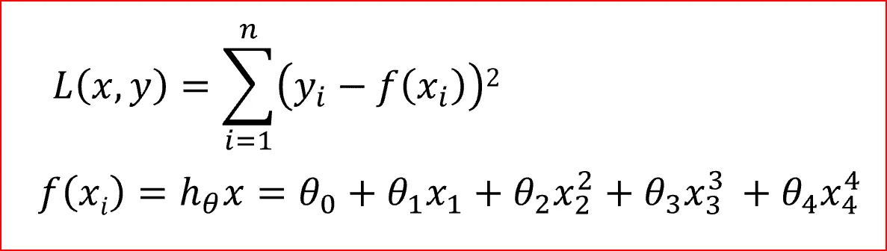
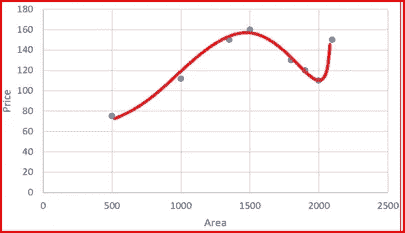
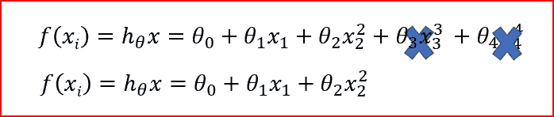
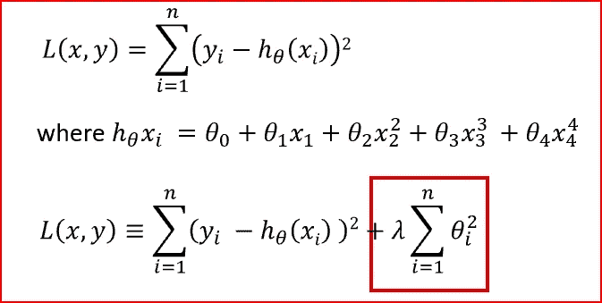
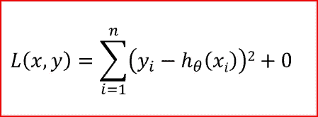
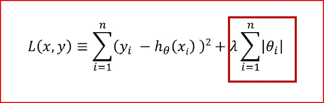
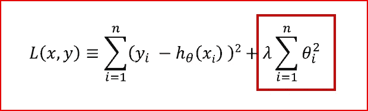

# L1 和 L2 正规化

> 原文：<https://medium.datadriveninvestor.com/l1-l2-regularization-7f1b4fe948f2?source=collection_archive---------0----------------------->

*在本文中，我们将了解为什么我们需要正规化，什么是正规化，L1 和 L2 的正规化有哪些不同类型，L1 和 L2 的正规化有什么不同*

先决条件:[机器学习基础知识](https://medium.com/datadriveninvestor/machine-learning-demystified-4b41c3a55c99)、[线性回归](https://medium.com/datadriveninvestor/linear-regression-794f841adbcf)、[偏差和方差](https://medium.com/datadriveninvestor/bias-and-variance-in-machine-learning-51fdd38d1f86)、[评估机器学习模型的性能](https://medium.com/datadriveninvestor/how-to-evaluate-the-performance-of-a-machine-learning-model-45063a7a38a7)

***我们为什么需要正规化？***

我们想预测学生的 ACT 成绩。对于预测，我们使用学生的 GPA 分数。该模型未能预测一系列学生的 ACT 分数，因为该模型过于简单，因此具有较高的偏差。

我们现在开始添加更多可能会影响学生 ACT 分数的功能。我们向我们的模型添加了更多的输入特征，出勤率、中学生的平均成绩、学生的身体质量指数、平均睡眠时间。我们看到随着更多的输入特征，模型开始变得过于复杂。

我们的模型还学习了数据模式以及训练数据中的噪声。当一个模型试图拟合数据模式以及噪声时，那么该模型具有很高的方差，并且将会过度拟合。

过度拟合的模型在训练数据上表现很好，但不能一般化。

我们的机器学习算法的目标是学习数据模式，忽略数据集中的噪声。

***我们如何解决过拟合的问题？***

我们可以解决过度拟合的问题

*   正则化技术
*   [交叉验证](https://medium.com/datadriveninvestor/k-fold-and-other-cross-validation-techniques-6c03a2563f1e)
*   退出

***什么是正规化？***

正则化是一种降低模型复杂性的技术。它通过惩罚损失函数来做到这一点。这有助于解决过度拟合问题。

***让我们来理解惩罚损失函数如何帮助简化模型***

损失函数是实际值和预测值之差的平方和

Loss function for a linear regression with 4 input variables. In the equation i=4

随着输入要素的程度增加，模型变得复杂，并尝试拟合所有数据点，如下所示

当我们惩罚权重θ_3 和θ_4，使它们太小，非常接近于零。这使得这些项可以忽略不计，有助于简化模型。

正则化基于这样的假设，即较小的权重生成较简单的模型，从而有助于避免过度拟合。

***输入变量对输出有影响怎么办？***

为了确保我们考虑到输入变量，我们通过减小权重来惩罚所有权重。这也使得模型更简单，更不容易过度拟合

Loss function with regularization term highlighted in red box

我们已经将**正则项**添加到实际值和预测值之间的平方差总和中。正则项使权重保持较小，从而使模型更简单并避免过拟合。

**λ** 是惩罚项或正则化参数，其确定对权重进行多少惩罚。

当 **λ** 为零时，则正则项变为零。我们回到了最初的损失函数。

when λ is zero

当λ很大时，我们惩罚权重，它们变得接近于零。这个结果是一个非常简单的模型，具有很高的偏差或拟合不足。

when λ is very large

***那么λ的正确值是多少呢？***

它介于 0 和一个大值之间。我们需要找到λ的最佳值，以便泛化误差小。

一种简单的方法是在数据的子样本上尝试不同的λ值，了解损失函数的可变性，然后将其用于整个数据集。

***什么是 L1 和 L2 正规化？***

# L1 正则化或拉索或 L1 范数

**L1 正则化也被称为 L1 范数或拉索**。

在 L1 范数下，我们将参数缩小到零。当输入要素的权重接近零时，会导致稀疏 L1 范数。在稀疏解决方案中，大多数输入要素的权重为零，极少数要素的权重不为零。

为了预测 ACT 分数，并不是所有的输入特征都对预测有相同的影响。GPA 成绩对 ACT 成绩的影响大于学生的身体质量指数。L1 规范将分配一个零权重给学生的身体质量指数，因为它对预测没有重大影响。GPA 分数将具有非零权重，因为它在预测 ACT 分数时非常有用。

L1 正则化进行特征选择。为此，它将无关紧要的输入要素赋以零权重，而将有用的要素赋以非零权重。

L1 regularization

在 L1 正则化中，我们惩罚权重的绝对值。L1 正则项在红框中突出显示。

Lasso 生成一个简单、可解释且包含输入要素子集的模型

# L2 正则化或岭正则化

L2 Regularization

在 L2 正则化中，正则项是所有特征权重的平方和，如上式所示。

L2 正则化迫使权重变小，但不会使其为零，并且不会产生稀疏解。

L2 对异常值并不稳健，因为平方项放大了异常值的误差差，而正则化项试图通过惩罚权重来修复它

当所有输入要素都影响输出并且所有权重大小大致相等时，岭回归的性能会更好

## L1 正则化和 L2 正则化的区别

## L1 正则化

> L1 处罚重量绝对值总和。
> 
> L1 有一个稀疏的解决方案
> 
> L1 有多种解决方案
> 
> L1 内置了功能选择
> 
> L1 对异常值是稳健的
> 
> L1 生成简单且可解释模型，但无法学习复杂的模式

## **L2 正规化**

> L2 正则化惩罚平方权重之和。
> 
> L2 有一个非稀疏解
> 
> L2 有一个解决方案
> 
> L2 没有功能选择
> 
> L2 对异常值并不稳健
> 
> 当输出变量是所有输入特征的函数时，L2 给出了更好的预测
> 
> L2 正则化能够学习复杂的数据模式

我们看到，L1 正规化和 L2 正规化都有各自的长处和短处。

**弹性网正则化**是 L1 和 L2 正则化的结合。

# 如果你喜欢这篇文章，请鼓掌！