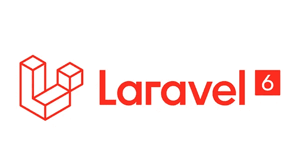
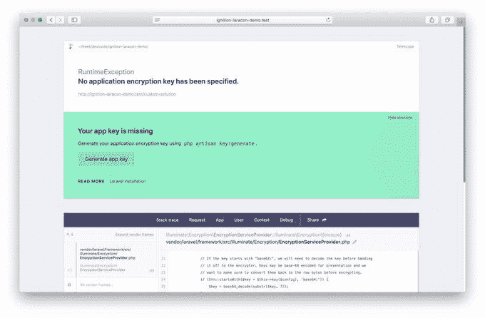
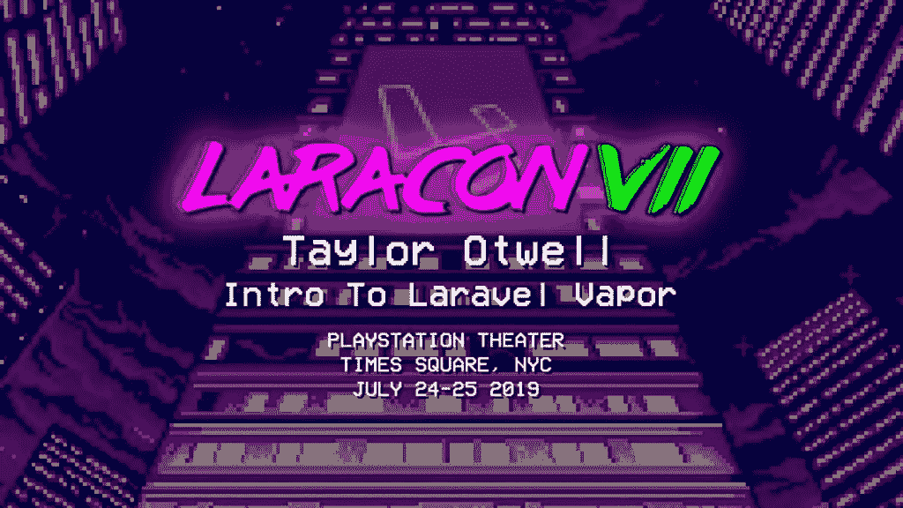

# Laravel 6.0:您应该知道的

> 原文：<https://medium.datadriveninvestor.com/laravel-6-0-what-you-should-know-c3e68e11d1d?source=collection_archive---------3----------------------->

自从大约 4.5 年前 Laravel 5.0 问世以来，Laravel 生态系统已经发展到让用户毫无怨言的地步。Laravel Nova、Laravel Horizon、Laravel Echo、Laravel Scout 和 Laravel Passport 只是此后推出的一些工具。在撰写本文时，我们正在使用 Laravel 5.8，而 Taylor Otwell 已经决定跳过 5.9，于 9 月 3 日升级到 6.0。此前，Taylor 强调这不会是 Laravel 的一个重大范式转变，最重要的变化将是向语义版本化的过渡。然而，这并不意味着没有很多值得谈论的新功能。

让我们先深入了解一些较小的变化。

 [## 2019 年最值得学习的编码语言|数据驱动的投资者

### 在我读大学的那几年，我跳过了很多次夜游去学习 Java，希望有一天它能帮助我在…

www.datadriveninvestor.com](https://www.datadriveninvestor.com/2019/02/21/best-coding-languages-to-learn-in-2019/) 

# 更小的东西

## 批准

授权消息现在可以让用户更容易理解。在 Laravel 6.0 之前，当用户收到与授权相关的错误时，基础设施还不能方便地对用户做出具体的响应。状态代码可以很容易地给出，但是当时给出一个定制的错误消息要复杂得多。给出一个定制的消息需要开发者创建一个新的文件并编写他们自己的异常。

现在，要获得可定制的授权响应，只需在链接到使您能够接收响应的函数时使用`Gate::inspect`方法。向前端传递消息也很容易组织。只需将`$this->authorize`或`Gate::authorize`添加到合适的路线或控制器。

## 不再有默认前端

当您第一次开始一个 Laravel 项目时，您得到的典型的前端设置现在已经不存在了。这意味着你通常看到的 Vue 和引导代码现在已经被删除了。它被什么取代了还不知道。也许，它还没有被取代。奇怪的是，用于提供登录系统框架的 make:auth 命令现在也不是原始 Laravel 安装的一部分。老实说，我不清楚这种变化背后的基本原理。然而，鉴于 Laravel 的版本调整，像 Vue 和 Bootstrap 这样的第三方技术最近没有经历同样的变化可能会导致冲突是有道理的。不过，这仅仅是猜测。

如果您想访问旧的 UI，可以用 CLI: `composer require laravel/ui`和`php artisan ui vue --auth`提取包含它的 composer 包。

## 懒惰的收藏

这是一个更有趣的补充。如果您是 Laravel 的新手，集合是让您更容易操作数组的工具。Laravel 中用于与数据库通信的两个主要工具之一的 concertive 以集合实例的形式返回其查询。如果你认为你马上会缺少上下文，检查一下集合的文档。[https://laravel.com/docs/5.8/collections](https://laravel.com/docs/5.8/collections)

那么，什么是懒人收藏呢？传统集合通常用于处理大量数据。当他们遇到大量数据文件时，他们会尝试一次存储所有数据。这听起来很快也很方便，但缺点是非常耗费内存。惰性收集通过只存储文件中需要的部分来解决这个问题，从而节省内存使用并提高性能。

如果你理解惰性加载是如何工作的，那么你就会熟悉我之前的解释。惰性加载也是同样的工作方式。当你向实现了延迟加载的服务器发出请求时，浏览器将只返回它知道你将立即使用的那部分网页。然后，当用户向下滚动页面或点击内部链接时，服务器将向您提供它知道您需要的必要内容。这样，只有在特定时刻需要的内存才会被使用。这种方法提高了速度。惰性集合有点像惰性加载，但数组来自数据库，而不是网页上的内容。

# 更大的事情

## 拉勒韦尔点火

所以，是的，Laravel 的新错误页面叫做 Ignition，看起来很棒。6.0 发布时，这将是 Laravel 的默认错误页面。然而，如果你还不想切换到 6.0，没关系，你仍然可以在以前的版本上安装点火系统。先说说点火给餐桌带来了什么。

对于 ouws(当前默认的 Laravel 错误页面)，堆栈跟踪和相关的代码片段显示在一个错误页面中，但这并不总是将开发人员引向解决方案。更糟糕的是，有时堆栈跟踪只是引用编译过的路径。这使得很难找到需要修复的非编译文件，因为它们没有列在错误页面的任何地方。谢天谢地，这不是点火的问题，它可以向您显示实际存在问题的非编译文件。通过点击一个铅笔图标，你可以直接进入你选择的编辑器中的文件。

Ignition 的第二个最酷的特性是，当显示错误消息时，它可以显示潜在的解决方案。大多数错误页面只是留给你错误。例如，如果错误是您拼错了属性名，Ignition 将告诉您该属性拼错了，并提供正确的拼写。解决方案建议可以比这复杂得多，我会在下面给你链接。您的建议甚至可以定制！

你想知道最酷的功能吗？这些解决方案建议其实是可以运行的！

是的，真的。看看这个由创作者之一的 Freek Van der Herten 制作的简短演示。

[https://youtu.be/EZu0-CwTU9Q](https://youtu.be/EZu0-CwTU9Q)

此外，您也可以添加自己的可运行解决方案！这很好，因为 Ignition 是开源的，所以 Laravel 社区的人们无疑会贡献他们自己的解决方案供大家使用。

还有一堆其他很酷的功能，如创建自己的标签(是的点火有标签)和与他人分享你的错误信息。这是使用 Flare 来完成的，Flare 是 Ignition 附带的一个工具。

关于 Laravel 点火和火炬的一切，请访问[https://freek . dev/1441-Ignition-a-new-error-page-for-Laravel](https://freek.dev/1441-ignition-a-new-error-page-for-laravel)。

## 拉勒韦尔蒸汽

又一个大的。Laravel Vapor 是 Laravel 的无服务器部署平台。但是等等，我们为什么需要部署平台？我们已经有拉弗尔锻造厂了，对吧？尽管 Forge 在 Laravel 社区广受欢迎，但它也有其局限性。它没有自动缩放功能来处理流量的突然增加，从而防止你的网站崩溃。此外，当操作系统或 PHP 更新时，需要进行配置。Vapor 具有自动缩放功能，因此，您不必担心流量突然激增会导致网站宕机。此外，由于 Vapor 的无服务器结构，它还处理您在使用 Forge 时可能会担心的所有更新。

Vapor 的网站看起来非常干净，一切似乎都很容易找到。当您部署一个项目时，您可以在 UI 上看到部署过程的不同阶段。我觉得这非常令人放心和欣慰。您还可以通过单击按钮回滚您的应用程序。只需点击“回滚”，它就会做到这一点。相当整洁。如果你想让你的应用程序进行维护，也是一样。只需点击“维护模式”按钮。

Laravel Vapor 的另一个很酷的功能是你可以设置闹钟。我这么说是什么意思？例如，要知道您的网站流量何时突然激增，您可以设置每分钟一定数量的 HTTP 请求，如果您的网站达到该限制，警报将会响起，通知您流量激增。Taylor Otwell 在他的 Laravel Vapor 演示中展示了这个和其他条件，我将在下面链接。

Laravel 蒸汽和 Laravel 更新本身覆盖了太多东西。正因为如此，我并不想在这篇文章中过多地探究这些复杂性。要了解更多关于 Laravel 6.0 的技术方面，你可以看看这里的发行说明[https://laravel.com/docs/6.0/releases](https://laravel.com/docs/6.0/releases)。想了解更多关于 Laravel Vapor 的信息，请访问泰勒·奥特威尔[https://www.youtube.com/watch?v=XsPeWjKAUt0&t = 362s](https://www.youtube.com/watch?v=XsPeWjKAUt0&t=362s)的视频。