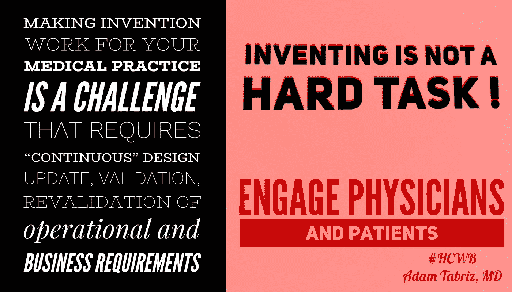

# 大型医疗系统将软件和人员结合在一起，以应对管理和监管障碍——独立的实践也应该如此

> 原文：<https://medium.datadriveninvestor.com/large-health-systems-combine-software-and-people-to-face-administrative-and-regulatory-hurdles-118df1c59f75?source=collection_archive---------7----------------------->

#hcwb #healthcarewithoutborders #healthcarewithoutborder #HealthcareBeyondBorders #politics #policies #lobbying #lobbyist #government ##medicare4all #singlepayer #MedicalFreedom #healthcarereform #aca #HealthReform #healthcareforall #liberty #libertarian #libertarianism #california_libertarian #libertarianhealthcare #freedomandhealthcare

任何医生都希望保持自己的独立性，但他们面临着成本压力和管理负担，而在管理式医疗系统中工作的医生却没有这种压力和负担。这意味着经营一家独立的诊所一年比一年难。

对于在任何环境中执业的任何临床医生来说，诊断疾病和开出疗程处方都是一个巨大的挑战。但是对于独立医生来说，这只是众多挑战中的一个。

与在管理式医疗环境中工作的医生不同，独立执业的医生必须每天努力解决几乎与人类健康一样复杂的问题，包括 HIPAA 合规性、电子健康记录的有意义使用、向基于价值的报销的转变、ICD-10 的实施以及与认证维护相关的成本和时间。

其他威胁底线并使医生远离患者的令人生畏的挑战包括共付额和免赔额的收取、文书工作量的增加、运营成本的上升、支付者对治疗决策的影响越来越大以及跟上快速发展的信息技术的需要。

D 在大型医疗网络中执业的医生不会像独立医生那样强烈地感受到这些压力，因为大型医疗网络的工作人员会花时间去克服那些提供医疗服务的障碍。那些医生可以把全部注意力集中在病人护理上。

但较小的诊所和独立诊所没有专注于监管和合规问题的专家团队。在这种情况下，医生必须在他们已经相当繁重的工作量上再加上这些职责。

今天，许多独立医生正在使用复杂的软件来解决这些挑战。许多人希望软件即服务(SaaS)产品能够缓解 HIPAA 合规性的压力，收集共付费，维护认证并跟上不断增长的文书工作。

但是，他们今天使用的基于 SaaS 的解决方案并没有解决大多数正在压向独立实践的实际压力。事实上，大多数基于 SaaS 的产品只帮助 ICD-10 的实施，电子医疗记录的有意义的使用和“精益业务流程”的采用

其他挑战仅靠技术是无法完全解决的。更大的卫生系统甚至没有试图以这种方式应对挑战，而是让顾问和专家团队来解决问题。

由于独立实践无法做到这一点，现在是他们开始对他们的实践管理系统提出更多要求的时候了。如果他们无力聘请专家团队来解决管理和合规负担，他们至少应该能够获得这方面的专业知识。

这是未来的实践管理系统必须能够做到的。一个强大的系统不仅仅是简化操作和帮助节省时间，还必须让独立的医生与真正能够解决问题的人类专家联系起来。

这样，独立医生可以做更紧迫的工作:治愈病人。

[阅读电子健康解决方案的亚当·塔布里兹博士的更多内容](http://ehealthsln.com/blog)