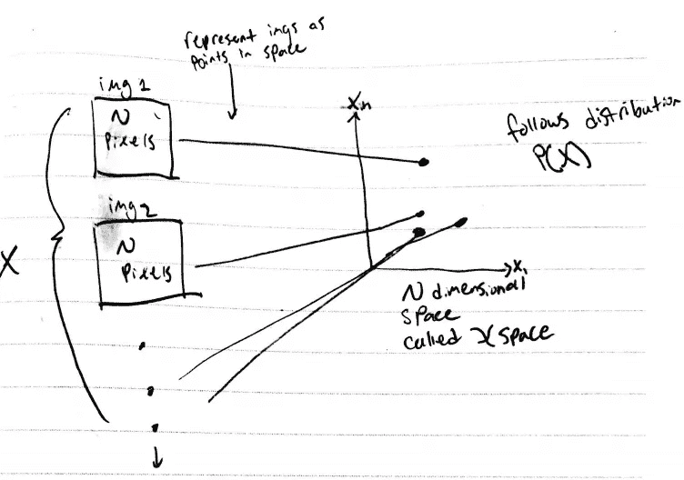
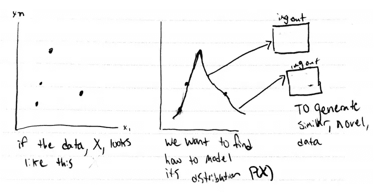
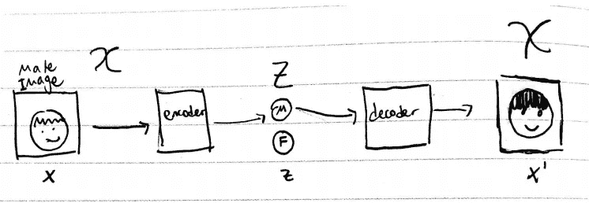
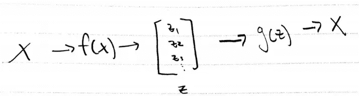
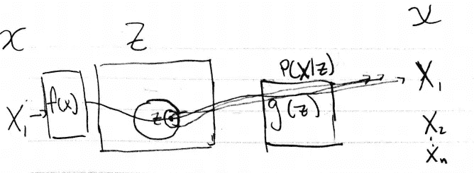

# 生成式自动编码器的潜在变量模型

> 原文：<https://medium.datadriveninvestor.com/latent-variable-models-and-autoencoders-97c44858caa0?source=collection_archive---------6----------------------->

以下是理解自动编码器(AE)的一些注意事项。在以后的文章中，我想探索一下变型自动编码器(VAE)和 Wassertein 自动编码器(WAE)。在这篇文章中，我打破了这个变分自动编码器[https://arxiv.org/pdf/1606.05908.pdf](https://arxiv.org/pdf/1606.05908.pdf)教程的开始。

**背景**

Desire —从现有数据中生成新的相似数据。

给我们一些数据， **X** ，它有一个分布 P( **X** )。然而，P( **X** )对我们来说是未知的，因为我们没有处理数据。一个简单的例子是图像的特征是它的 **N** 个像素，并且位于 **N** 维空间中。将所有这些图像标绘为 **N** 空间中的点，可以显示它们之间的关系(点越近，图像越相似)。

总体目标—找到一个与 P( **X** )尽可能相似的模型，我们可以从中取样。

**潜在变量模型和自动编码器**

假设我们有一个人脸的数据集，目标是生成一张新脸。拍摄一张有 N 个 T21 像素的图像。我们首先可以将每个像素视为一个独立的特征，它提供了一些关于人脸应该是什么样子的有用信息。为了压缩数据，我们可以寻找像素值之间的关系和依赖性。这种数据可以用“高容量模型”大大压缩，然后解压缩。使用高容量模型只是意味着模型可以记住大量信息，因此需要很少的输入来生成令人信服的输出。数据压缩的顶点可以包含关于图像的一些非常基本的信息，可能这个顶点仅存储单个比特(0 或 1 ),并且仅包含该人是男性还是女性。这个顶点压缩点叫做“潜变量”， **z** ，存在于“潜空间”中。因此，在生成人脸图像之前，我们的模型将首先判断人脸是男性还是女性，然后开始构建特定人脸的复杂结构。显然，一个比特确实是有限的，但它说明了一点，即一个潜在变量包含产生与输入相关的输出的信息。

模型的压缩部分称为编码器，解压缩部分称为解码器。

编码器+解码器=自动编码器。

一个经过模型的数据点看起来像**X**->**z**->-**X '**。我输出 **X'** 而不是 **X** 的原因是因为输出可能不同，我们试图用解码器从 **z** 重建 **X** 。

**形式化直觉**

对于以下内容，请确保将 **X** 视为随机变量，即*单输入*。此外，观察图像有助于理解变量间的相互作用。

为了形式化一些直觉，我们有一个单一的输入， **X** ，，它存在于 *X* 空间，还有一个潜在变量的向量， **z** ，它存在于 *Z* 空间。我们可以使用某个函数 f( **X** )生成 **z** ，也就是我们的编码器(有时写成 f(**X；o** )其中 **o** 为从属参数，表示该功能作为神经网络实现)。所以 f( **X** ) = **z.**

由于 **X** 是一个随机变量，我们也可以将 **z** 视为一个随机变量，并且知道 **z** 是某个分布 P( **z** )的一部分。当从 **z** 重新生成我们的输入 **X** 时，我们可以使用另一个函数 g( **z** )，也称为我们的解码器(也可以写成 g(**z；o** )。所以 g( **z** ) = **X.** 注意，对于任意一个 **z，** g( **z** )决定 P( **X** | **z** )。把编码器和解码器放在一起就剩下 g(f(**X**)=**X**。

**z** is a vector whose dimension represents the bandwidth of data sent from the encoder to the decoder

如果我们只看解码器，想知道生成特定 **X** 的概率，知道 **z** 如何分布，却不知道 **z** 的哪些区域生成 **X** 呢？知道 P( **z** )我们确定 P(**X**)= COUNT _ z(g(**z**)***z**)= =**X**)/NUM _ COUNTS。翻译前面的语句:实际生成 X 的次数，循环所有可能的 **z** 除以生成的输出数。知道 g( **z** )决定 P( **X** | **z** )这个可以写得更好。这是因为我们的函数 g( **z** )定义了我们的输出。所以我们想最大化。

P( **X|z** )设置为等于以 P( **X|z** )为中心的正态分布。直观上，这意味着对于每个训练示例，对于我们的分布 P( **z** )中的 **z** 的定义区域，我们希望通过从 **z** 中的该区域随机采样来生成该训练示例的概率与正态分布相匹配(称为我们的先验分布)。注意，我们可以选择不同的先验分布。该分布的平均值被设置为 **X|z** 。方差是我们训练的超参数。当偏离中点时，从周围点生成特定 **X** 的可能性降低。因此，本质上我们想找到一种方法来扭曲 **z** ，以便每个训练示例都获得一个扇区 **z** ，该扇区以遵循正态分布的方式输出训练示例。

Training example **X1** generates a point in **z**. Points varied around that are used to reconstruct **X1** with probability following the normal distribution.

进一步，我们可以使用深度学习来修改 **z** 中区域的半径/方差。如果你跟随下图中的箭头，你可以看到 **z** 是如何被划分以产生每个输出的。 **z** 中的形状看起来像正态分布，峰值是平均值，由 **z|X** 生成。特别注意 **X1** 你可以看到它在 **z** 输出 **X1** 的那部分空间。这表明在 **z** 中的 **X1** 的空间中有许多点对应于与 **X1** 相似但不相等的输出(因此有无限个输出我没有列出，如 **X1“”、X1”“”**，等等**……)**。这个属性有助于实现我们最初的目标，即生成新颖但相似的输出。

我们可以简单地将所有这些与我们在帖子开始时定义的目标联系起来，我们希望找到我们的输入数据， **X** ，如何分布为 P( **X** )。我们为每个输入示例创建了一个具有正态分布的模型，并从 **z** 中的相同空间生成这些分布。如果我们能让这些分布尽可能地接近彼此(所以上图中的圆圈接触)，我们就有一个连续的空间可以采样。然后，无论我们从空间的哪个位置采样，我们都可以生成看起来很像训练样本的东西。这个空间就是我们对 P( **X** )的近似。

**下一步**

我们如何训练我们的函数 f( **x** )和 g( **z** )以使每个输出匹配我们的高斯分布？如果我们在 **z** 中的空间因为不同的训练例子而重叠怎么办？我们如何优化潜在空间分布的界限？在下一篇文章中，我将开始探索变分自动编码器，通过深度神经网络应用这个模型。

在此找到下一个帖子:

[https://medium . com/@ Brandon peck 13/variation-auto encoder-vae-d1cf 436 E1 e 8 f](https://medium.com/@brandonpeck13/variational-autoencoder-vae-d1cf436e1e8f)