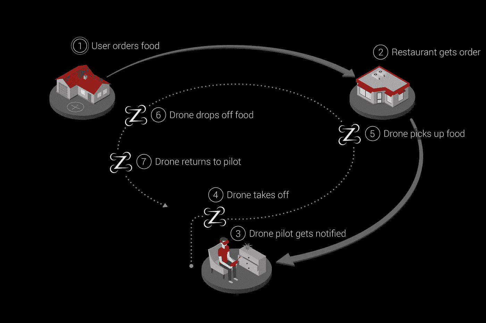
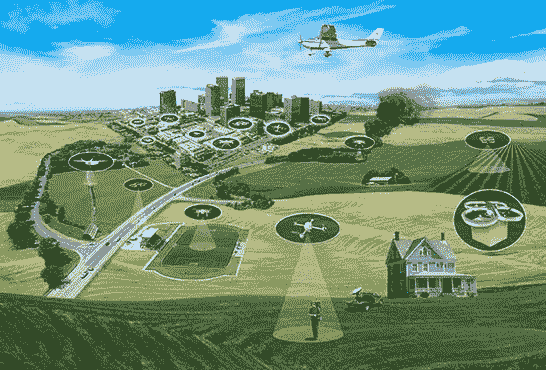

# 在坦帕湾启动无人机送货初创公司

> 原文：<https://medium.datadriveninvestor.com/launching-a-drone-delivery-startup-in-tampa-bay-f896eda4cb42?source=collection_archive---------20----------------------->

在 Zing，我们认为无人机送货的到来比优步和亚马逊等公司的预期要快得多。事实上，我们刚刚推出了一款 [iOS 应用](https://itunes.apple.com/us/app/zing-drone-delivery/id1438380134?mt=8)进行公测。我们没有重新发明轮子，而是让这款应用兼容数百万台预先存在的 DJi 无人机。我们正在收集世界各地无人机飞行员的反馈，使我们能够使系统更加安全和高效。

# 联邦航空局的第 107 部分法律目前阻止交付

## 107.31 目视视线飞机操作。

(a)除了矫正镜片之外，在没有任何设备辅助的情况下，遥控指挥飞行员、目视观测员(如果使用)和操纵小型无人驾驶航空器系统飞行控制的人员必须能够在整个飞行过程中看到无人驾驶航空器，以便:

(1)知道无人驾驶飞机的位置；

(2)确定无人驾驶飞机的姿态、高度和飞行方向；

(3)观察空域是否有其他空中交通或危险；和

(四)确定无人驾驶航空器不危及他人生命或者财产安全。

(b)在小型无人驾驶飞机的整个飞行过程中，本节第(a)段所述的能力必须由以下人员行使:

(1)指挥的远程飞行员和操纵小型无人驾驶航空器系统的飞行控制的人员；或者

(2)视觉观察者。

## 107.39 对人类的操作。

任何人不得在人上方操纵小型无人驾驶飞机，除非该人:

(一)直接参与小型无人驾驶航空器的运行；或者

(b)位于有遮盖的结构下或固定车辆内，能够提供合理的保护，防止小型无人驾驶飞机坠落。

## 107.41 在特定空域的运行。

任何人不得在 B 类、C 类或 D 类空域或为机场指定的 E 类空域表面区域的横向边界内操作小型无人驾驶航空器，除非该人事先获得空中交通管制(ATC)的授权。

## 107.43 机场附近的运行。

任何人不得以干扰任何机场、直升机场或水上飞机基地的操作和交通模式的方式操作小型无人驾驶飞机。

# NASA 是如何铺平道路的

## UAS 交通管理计划

在载人飞机空中交通管理工作的基础上，美国航天局正在研究 UAS 交通管理(UTM)系统的原型技术，该系统可以开发空域集成要求，以实现安全、高效的低空作业。

美国宇航局的近期目标是开发和演示一个可能的未来 UTM 系统，该系统可以安全地实现低空空域和 UAS 操作。NASA 与许多致力于此的政府、行业和学术合作伙伴一起，领导着一系列称为“技术能力水平(TCL)”的研究、开发和测试活动，每项活动的复杂性都在增加。

**UTM TCL1** 于 2015 年 8 月结束现场测试，目前正在美国联邦航空局的一个站点进行额外测试。这项活动中的技术涉及农业、消防和基础设施监测方面的业务，重点是地理围栏、高度“道路规则”和车辆轨迹安排。

**UTM TCL2** ，完成于 2016 年 10 月，利用 TCL1 的成果，专注于在人烟稀少的地区进行超视距作战。研究人员测试了允许动态调整空域可用性和应急管理的技术。

**UTM TCL3** ，完成于 2018 年 5 月，利用 TCL2 结果，重点测试在中等人口区域保持合作(响应)和非合作(非响应)UAS 之间安全间距的技术。

**UTM TCL4** 定于 2019 年初，将利用 TCL3 的成果，专注于高密度城市地区的 UAS 业务，执行新闻采集和包裹递送等任务。它还将测试可用于管理大规模突发事件的技术。

美国宇航局的 UTM 技术研究和开发正在与美国联邦航空局合作进行。空域整合要求形式的研究结果预计将于 2019 年从 NASA 转移到 FAA 进行进一步测试。

# 结论

在 Zing，我们计划与 NASA 和 FAA 合作，最早在 2019 年将第一批合法的无人机交付带到坦帕湾。与此同时，你可能会看到我在坦帕湾放飞我的无人机。

如果您想了解更多信息，请访问[http://zingdrones.com](http://zingdrones.com)。