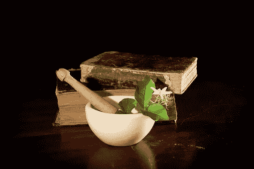

# 创办科技创业公司比许多人想象的更加神奇

> 原文：<https://medium.datadriveninvestor.com/launching-tech-startups-is-more-alchemy-than-many-would-like-to-believe-116740eff2b?source=collection_archive---------7----------------------->

听到炼金术这个词，你会想到什么？我想大多数人会想到疯狂的中世纪人试图用各种其他物质制造黄金。我认为这与现代风险投资有一些关联。

*   不幸的是，大部分是男性，尽管这种情况正在开始改变。
*   通常，至少在人工智能、区块链、混合现实、量子计算甚至数据等新兴技术领域，人们对该技术或其潜力和未来的了解程度，不亚于中世纪炼金术士对点石成金的了解。
*   就像中世纪的炼金术一样，目标是创造许多人认为不可能的东西。

字典对炼金术的定义是“一种看似神奇的转化、创造或结合的过程”。炼金术是化学的前身，化学已经产生了大量令人惊叹的产品，改善并丰富了我们的生活。所以最后，那些炼金术士终究没有那么疯狂。他们感觉到了一些未知的东西，他们的实验带来了整个科学领域。

我相信冒险是现代炼金术。作为风险建设者和投资者，我们正努力让看似不可能的事情成为可能——用一小部分人拥有专业知识和经验的技术创造变革性产品，更不用说知识了；让人们拓展技术/科学和自身能力的界限；用很少的资源做所有的事情，将可用的时间延伸到极限。

我们应该承认，我们对风险投资知之甚少，尤其是在新兴技术领域。虽然自从我六年前开始在这个领域工作以来，我已经看到了一些有趣的演变，各种风险投资公司开发了更复杂的论文，超越了典型的投资一堆，希望 1 超过投资组合的方法，但作为一个行业，我们还没有找到公式。在科学方法中，商业等同于精益创业，当你不知道一些事情时，需要进行大量的实验和失败，并从这些失败中严格学习。我认为我们正处于这一进程的早期阶段。

在 Serval Ventures，我们一直在做实验，试图弄清楚是什么让初创企业成为黄金。我们有一个工作模式草案，并正在努力严格测试和发展它。这是一项巨大的努力，一家公司无法独自完成，我们正在寻找志同道合的人——建设者、创意者、投资者、公司、有前途的人才、连接器、推动者——加入我们或与我们合作，参与新兴科技创业公司 alchemy 的混乱、复杂、有趣和令人兴奋的过程。