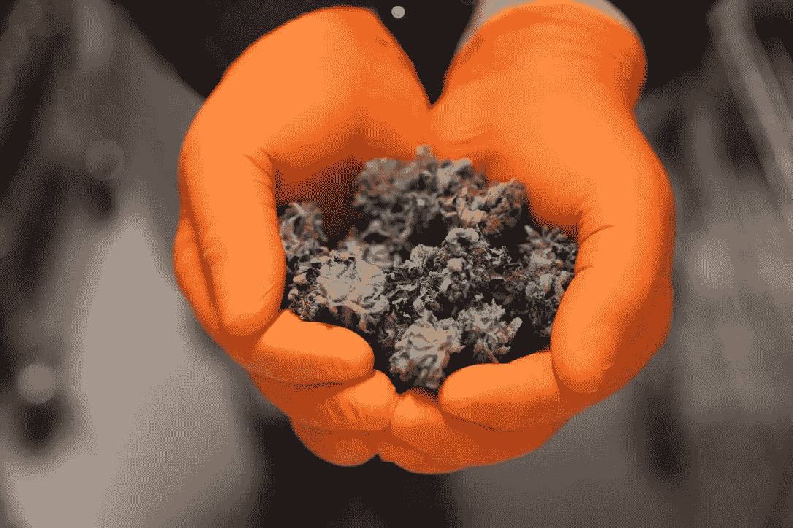

# 法律变化使拉丁美洲成为全球大麻产业的主导

> 原文：<https://medium.datadriveninvestor.com/law-changes-position-latin-america-to-dominate-global-cannabis-industry-54e8ef1b82be?source=collection_archive---------6----------------------->

大麻在卫生部门的声誉正在改变，因为发现其成分含有药性。在世界范围内，各国政府正在重新评估其对大麻的立场，导致对大麻的需求大幅增加。到 2025 年，药用大麻有望成长为价值 430 亿美元的市场。

拉丁美洲就是这样一个集中努力实现非刑罪化的区域。有利的生长条件、农业专业知识和低生产成本使该地区成为世界其他地区大麻的主要供应地。

**背景:药用大麻需求旺盛**

大麻具有医疗价值的特性被称为大麻素。具体来说，有两类大麻素:大麻二酚(CBD)和四氢大麻酚(THC)。

 [## 信息图:大麻的业务-数据驱动的投资者

### 仅在 2017 年，美国就销售了价值超过 8 亿美元的合法大麻产品。生长在 19 个州…

www.datadriveninvestor.com](https://www.datadriveninvestor.com/2018/09/25/infographic-the-business-of-hemp/) 

科学研究和患者反馈表明，大麻素[可以缓解各种诊断患者的慢性疼痛症状](https://www.health.harvard.edu/blog/medical-marijuana-2018011513085)。这方面的一些例子有子宫内膜异位症、纤维肌痛、多发性硬化和间质性膀胱炎。据了解，被诊断患有帕金森病的患者也将其用作肌肉松弛剂。

自从大麻合法化以来，北美市场一直在努力建立可持续的大麻供应链。自 2018 年 6 月以来，加拿大公司和供应商经历了药用大麻的严重短缺。

**拉丁美洲正在为此做些什么？**

拉丁美洲各国已经确定了自己在大麻生产和出口方面取得成功的潜力。认识到它们的最佳生长条件、靠近关键市场、劳动力成本低和农业专业知识饱和，地方政府正在通过立法框架赋予自己权力，以成为大麻产业的主要参与者。

**哥伦比亚成为焦点**

目前，哥伦比亚作为拉丁美洲最有前途和发展最快的大麻生产国，受到了全世界的关注。哥伦比亚仅在 2017 年将其大麻产业正规化后，就已经打算每年生产约 40.5 吨大麻。

哥伦比亚政府设立了四个许可证，个人和企业可以获得这些许可证来种植、制造大麻和大麻产品。这些许可证允许种植或制造精神活性和非精神活性大麻、大麻籽及其衍生物。

**秘鲁**

对秘鲁来说，走向合法化的行动侧重于为虚弱或绝症患者提供更好的生活质量。2017 年，政府[以多数票批准了一项法案](https://www.theguardian.com/world/2017/oct/20/peru-marijuana-cannabis-legal-terminally-ill-children)，使大麻油的生产、进口和销售合法化。这一举措使秘鲁成为该地区第六个以某种形式使大麻合法化的国家或地区。

当地行业人士评论说，这一举措对于让有需要的患者生活得更轻松来说不够宏大。随着游说团体继续推动进一步的法律支持，以及拉丁美洲邻国意识到更开放的大麻方法的经济利益，秘鲁的大麻立法可能会进一步发展。

**墨西哥打击非法毒品交易**

大麻合法化不仅促进了当地经济。对于墨西哥、秘鲁和哥伦比亚等国家来说，大麻合法化旨在遏制猖獗的非法毒品交易所带来的暴力和贫困。

2018 年 11 月，当墨西哥最高法院裁定禁止医药公司出于医疗目的种植大麻时，车轮开始转向墨西哥。

虽然比哥伦比亚和秘鲁的进展稍慢，但墨西哥正在推进立法，允许娱乐性使用大麻。如果通过，墨西哥将成为世界上拥有合法大麻的人口最多的国家之一。

**乌拉圭**

尽管近六年前大麻就已合法化，但乌拉圭在利用全球需求繁荣方面动作稍慢。

乌拉圭是世界上第一个将娱乐性大麻合法化的国家，尽管围绕其销售的法律仍然受到严格监管。药店是唯一允许出售娱乐用大麻的地方。

合法化的先驱国家的大麻部门增长缓慢。这是因为在没有可靠的商业模式可以参考的情况下，必须开辟新的领域并获得大规模生产大麻的经验。

然而，拉丁美洲大麻合法化的势头使得投资者转向乌拉圭，主要是因为其出口能力。其强大的运输系统和基础设施可以支持全球规模的出口。像美国人拥有的 Silverpeak 生命科学乌拉圭公司和加拿大人拥有的 Aurora 公司这样的大公司正在向乌拉圭的大麻产业投资数百万美元。

**区域和全球大麻市场的未来**

随着全世界对大麻的看法发生变化，拉丁美洲有能力满足日益增长的需求。

非刑罪化背后的动机各不相同。不同的地理、气候和基础设施也影响着每个国家大麻部门的动态。因此，在不断发展的立法的支持下，拉丁美洲新兴的大麻市场有能力和灵活性主导全球大麻产业

**与 ExpoCannaBiz 2019 的专家对话**

该地区的顶级大麻行业专家将参加 5 月 9 日至 11 日在哥伦比亚卡塔赫纳举行的 [ExpoCannaBiz 2019 商业会议](https://expocannabiz.com/en/index.php)。

会议的主题发言人和嘉宾包括来自加拿大大麻公司 [Aura](http://auracannabisinc.com/) 、领先的市场准入服务提供商 [Biz Latin Hub](https://www.bizlatinhub.com/) 的专家，以及倡导两国改变游戏规则的大麻立法的前墨西哥和哥伦比亚政治家。