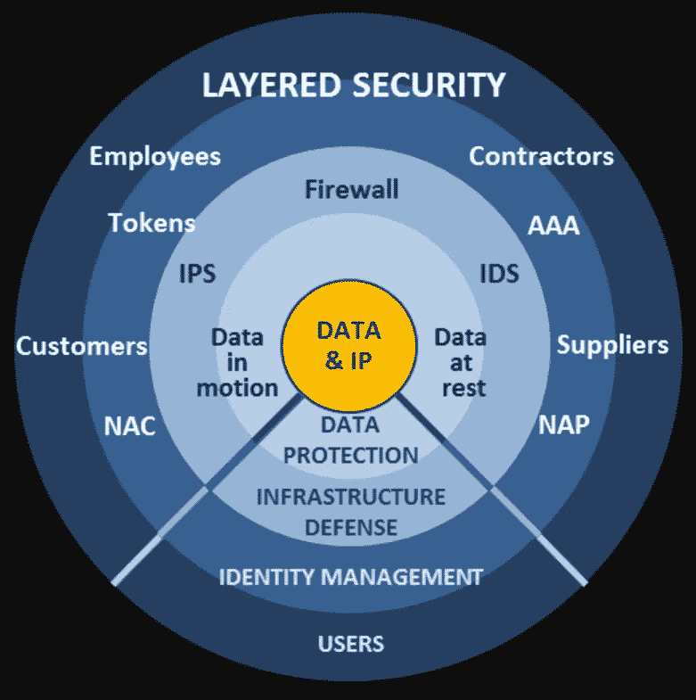
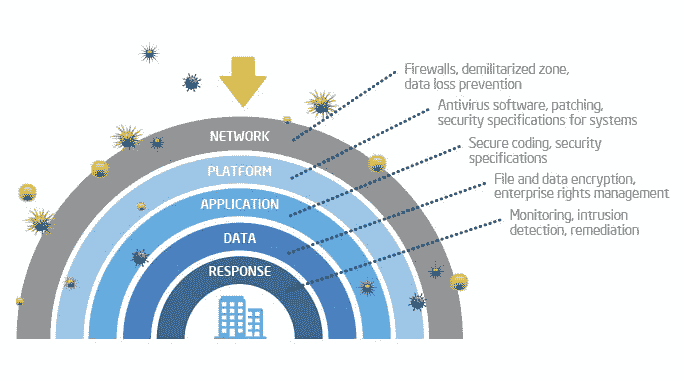
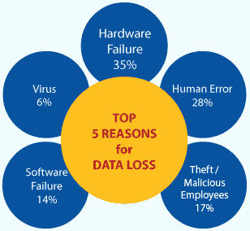

# 面向中小企业保护的分层网络安全模型

> 原文：<https://medium.datadriveninvestor.com/layered-cyber-security-model-for-small-medium-business-protection-64b293133de4?source=collection_archive---------1----------------------->

网络安全正慢慢融入我们的日常生活。数据泄露、隐私保护丑闻、GDPR 准则和新的复杂黑客方法提高了公众意识，并要求对现有问题采取新的解决方案。

根据威瑞森关于[数据泄露 2019 的报告，43%的泄露涉及小企业受害者。这些统计数据有几个原因。首先，大公司有必要的资源投资于复杂的网络防御，而中小企业则非常严格地管理预算。第二，各种黑客攻击的自动化使得针对大型或小型企业的攻击具有预期的回报价值。第三，由于金融交易的虚拟化，即使是最小的公司也可能在某处存储有有价值的机密信息。](https://enterprise.verizon.com/resources/reports/dbir/)

 [## 人们对隐私的不理解是什么？-数据驱动型投资者

### 你知道那种感觉。无论是访问应用程序、订阅还是你最喜欢的运动鞋。你按下…

www.datadriveninvestor.com](https://www.datadriveninvestor.com/2019/04/11/privacy-and-convenience/) 

根据 [Ponemon Institute 的 2017 年“数据泄露成本研究”](https://www.ibm.com/downloads/cas/ZYKLN2E3)，美国每家公司因网络攻击造成的平均财务损失为 413 万美元。这对大公司来说是一个巨大的数目，而对中小公司来说，一次成功的黑客攻击可能是致命的。在本文中，我将概述分层网络安全模型，它可以适用于 SMB 网络安全管理。

## 分层网络安全模型

有一个神话，它仍然存在，并阻止实施和维护足够的网络保护标准。这是一种简单化和狭隘的理解，也是一个神话，即网络安全可以在一个宏大的姿态中实现。没有一种应用程序或实践可以保护您的数据、通信、服务器、设备等。网络安全是一项涉及网络管理员、质量保证、投资者和首席执行官以及人力资源的共同努力。

分层网络安全概念基于纵深防御军事模型。潜在的说法是，任何安全机制都可能被突破，最好有一个备份防御计划，它将包含攻击。此外，这是一个分层系统，这意味着如果一层遭到破坏，第二层也会受到保护，然后是第三层，依此类推。当应用于 IT 时，这意味着所有的系统都被认为是易受攻击的，这反过来意味着它们必须被测试，并且在每一层上实施额外的安全机制:设备，然后是网络，然后是员工培训，步骤和顺序可能会有所不同。

此外，对漏洞的狭隘理解将为网络犯罪分子打开可乘之机。我们举个例子。企业可以运行防病毒软件、VPN 和防火墙，但未经培训的员工可以打开钓鱼电子邮件，这将感染设备，因为防病毒软件尚未更新，并且在 BYOD 公司中，一半的员工使用没有 VPN 的公共 wi-fi。一个很好的理由是，教育被认为是中小企业网络安全的第一道防线。

因此，我们可以将一个完善的网络安全系统分为三个主要部分:人力资源、硬件和软件；只要一个人倒下，就有可能拖垮整个系统。还有，每个段都必须“更新”。接触机密数据的员工必须了解当前的危险，并接受最新防御实践的培训。软件必须更新，硬件必须保持满负荷工作。

换句话说，网络安全是一个复杂和持续的过程，在很大程度上依赖于教育和激励。为了教育员工，必须有人花时间分析黑客社区中正在发生的事情。此外，明智地展示信息，因为网络安全对于不太懂技术的员工来说可能有点棘手。士气低落的系统管理员可能会对最新的更新视而不见，从而导致数据泄露。必须为更新和/或维护硬件/软件分配额外的资金，因此财务部门必须清楚地了解为什么这些费用是必要的。

## 防御的层次

*安全协议和程序*

首先，需要明确定义国家或超国家层面的网络安全协议。例如，在欧盟，许多参与数字营销的企业必须使他们的政策符合现有的和即将出台的 GDPR 规则。数据保留法律可能因国家而异，报告网络犯罪的法律程序也可能不同。

必须同时定义内部程序。有问题的公司是否存储了大量机密信息？也许它的产品可以被滥用于恶意目的？网上银行交易？所有这些都需要定义，以了解什么样的网络安全实践最适用。换句话说，这一步是进一步行动的深入计划。

*软硬件安全*

必须对设备和应用程序进行漏洞测试。必须解决已知问题，并记录下来以备将来参考。在这一阶段，可以对安全系统发起多次模拟攻击，直到成功为止。服务器工作负载限制、路由器密码、安装的应用程序、隔离区以及其他问题都应在此阶段实施。

此外，必须考虑到人身安全。黑客不是反社会的，这是另一个毫无根据的神话。社会工程在黑客中是一种常见的做法，如果他们可以在你公司的大厅里自由漫步，因为没有物理安全，或者很容易绕过，后果可能是可怕的。在我以前的工作场所，我们被黑客拜访，他们假装是擦窗专家，并好心地在半数被拜访的房间里安装了键盘记录器。

*教育和培训*

人为错误仍然是头号漏洞。奥地利航空零部件制造商 FACC 的一名不幸的前雇员在收到其“首席执行官”的电子邮件后，转移了一笔 4000 万欧元的款项。黑客伪造了电子邮件并发起了网络钓鱼企图，如果进行适当的培训，这可能不会有任何结果。网络钓鱼邮件仍然存在，正是因为人们没有被告知如何区分真正的电子邮件和欺诈邮件。

还有，不同部门之间一定要建立信任，因为都是可以针对的。员工经常害怕承认他们犯了错误，或者他们认为他们犯了错误，但不确定。IT 安全人员非常友好，并渴望帮助每个可能遭遇入侵的人。但是，当一个已知的问题因为某种原因被掩盖时，他们不喜欢收拾别人的烂摊子。

*网络和服务器安全*

网络架构必须针对各种网络攻击进行测试。全面检查入侵检测机制、实时防御警报和响应程序、恶意软件防护、虚拟专用网络以及系统管理员了解的其他内容，这些都是完善的安全系统的重要组成部分。此外，必须建立备份并进行测试，以防勒索软件攻击。

*数据安全和泄露保护*

这一部分可以通过上面提到的一个步骤来实现，但是最好分别重新考虑数据安全和泄漏保护。机密信息是大多数当代网络犯罪的主要目标。应该就收集什么样的个人信息进行长时间的讨论，这些信息应该保持在最低限度。

此外，也许一些信息应该以极端安全的方式分离和存储。当系统遭到破坏时，应制定行动计划。目前，未能及时报告数据泄露的欧盟公司将遭受经济罚款。

## 以灵活性为目标

以上只是分层网络安全模型的一般原则和指南，可适用于 SMB 保护。然而，必须时刻牢记已实现系统的灵活性。

不同的业务类型需要不同的方法。当地法律可能会有所不同，这一点应予以考虑。此外，系统应该对更新和修改开放，因为网络罪犯正在不断改进他们的方法，防御结构应该反映这一点。