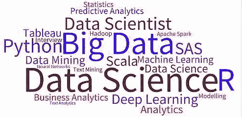
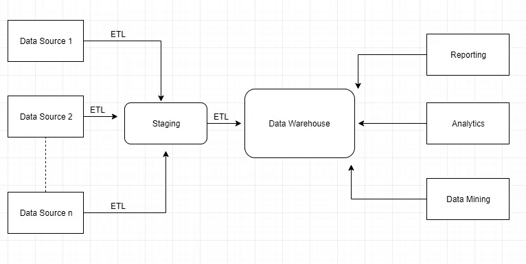
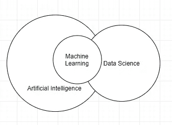

# 外行人概述:大数据，Hadoop，机器学习

> 原文：<https://medium.datadriveninvestor.com/laymans-overview-big-data-hadoop-machine-learning-c79a918af749?source=collection_archive---------5----------------------->

我们都听说过这些术语大数据、人工智能、Hadoop、机器学习、数据科学等等，有时我们无法理解它们之间的区别，也没有意识到这些技术彼此之间有多么紧密的联系。此外，网络上复杂的术语和定义也让人难以理解。

在本文中，我们将尝试简要概述所有的流行词汇，并以简单的术语理解它们，还将理解这些技术是如何关联的，以及通常用于处理它们的不同解决方案/工具是什么。

**什么是大数据和 Hadoop？**

数据是所有技术的核心，因为所有的智能和见解都来自数据。
过去，数据大多以表格的形式出现，通常出现在被称为结构化数据的数据库系统中，但如今，数据以结构化和非结构化的形式出现，并且来自各种来源，如 IOT 设备、Twitter feeds、服务器日志等。
汇总来自各种来源的数据，然后从中得出真知灼见变得越来越重要。

这就是大数据的全部，当我们谈论大数据时，我们通常会谈到 3 V(V 的数量随着时间的推移而增加，在本文中，我们将坚持基本的 3v)

**Volume :** Volume 指的是数据的量，但是什么量的数据被称为大数据呢？对于一些组织来说，这可能是数十 TB 的数据。对于其他人来说，它可能是数百 Pb。

**多样性:**多样性是指可用数据类型的数量。它可以是结构化的，例如存在于关系数据库中，或者它可以是需要额外预处理的非结构化数据/半结构化数据，例如文本、音频和视频。

**速度:**速度是接收数据的速率

这就是大数据，那么**Hadoop 是什么？** Hadoop 是大数据问题的解决方案。

当我们拥有数 Pb 的数据时，我们需要大量的处理能力和存储来处理这些数据。Hadoop 为我们提供了一个高效完成这项任务的框架。
Hadoop 使用分布式架构，即它跨多个集群/节点/服务器分发和处理数据。通过这种方式，它利用并行处理对数据进行各种操作。
关于 Hadoop 需要注意的重要一点是，它是开源的。

大数据处理通常有两种类型:

1.  **处理静态大数据**，也叫批处理。在这种类型中，数据已经存在于我们的服务器上，我们可以选择我们想要处理/加载数据的时间。
    示例:存储在非结构化/半结构化文件或 RDBMS 中的数据。
    使用 Hive、Pig、Scoop 等工具进行 ETL
2.  **动态处理大数据**，也称流处理。在这种类型中，数据是动态处理的。例如:推特信息、实时服务器日志、来自 IOT 设备的实时数据。
    使用 Spark、Kafka 等工具。

Hive、Pig、Scoop、Spark、Kafka 是 Hadoop 生态系统
的一部分，这意味着它们运行在 Hadoop 架构之上，从而利用 Hadoop 的分布式并行处理框架。

那么**大企业会发生什么？**他们有各种数据源，例如多个 OLTP 系统、ERP 系统、半结构化/非结构化文件等。来自这些系统的数据被聚合、清理、转换，并使用 ETL 工具加载到数据仓库中，如下图所示。

数据仓库针对读取操作进行了高度优化，然后支持企业的报告、分析和数据挖掘需求。

**数据科学、机器学习、人工智能**

**人工智能**指由机器展示的智能。它有多种应用，如自动驾驶汽车、语音识别、自然语言处理等。

**另一方面，机器学习**是人工智能/人工智能应用的子集，它提供从历史数据中自动学习的能力，然后提供未来预测，而无需显式编程。

**数据科学**融合了许多学科，如统计学、机器学习、数据处理等，其最终目标是从数据中提取知识。
下图有助于理解这些字段是如何重叠的。

由于数据是所有技术的中心，在企业中，所有的分析(机器学习)、报告和挖掘(数据科学)都是在**数据仓库**中的数据上完成的。这就是这些技术连接的地方！您使用 Hadoop 框架来处理您的大数据，然后通过 ETL 将其加载到数据仓库中。发布您使用分析和报告工具从您的数据中获得洞察力。

需要注意的是，这仅仅是一个/典型的场景，而不是使用这些技术的唯一场景。对于机器学习或数据科学的应用，没有必要拥有数据仓库。
但步骤保持不变，首先清理/转换数据，这被称为数据预处理，然后对数据应用复杂的算法，最后将数据可视化。

这可以在云上或内部完成。有许多云供应商，如微软、亚马逊、甲骨文、谷歌，提供各种各样的服务，可以在企业项目中加以利用。

云平台的优势在于，它通过各种服务提供了巨大的可扩展性和灵活性，而没有管理基础架构的开销。

**有哪些工具？**

**ETL :** 有很多，Pig、Hive、Spark、Scoop 是 Hadoop 生态系统的一部分。除此之外，你还有 Informatica，Talend，Azure Data Factory 等等。

**数据仓库:**你可以通过 Oracle DWH、SQL server DWH 等在本地托管数据仓库，也可以通过 Amazon Redshift、Azure 数据仓库等在云上托管数据仓库。

**报告**:你有 Power BI，Excel，Tableau，Qlikview 等

**分析:**你可以使用用 Python/R 开发的定制程序，也可以使用 Azure ML、Google ML、AWS ML 等，使用它们的软件即服务产品。

我希望你们喜欢这篇文章，请在下面的评论中告诉我你们的想法。

**领英**:[https://www.linkedin.com/in/karan-dama](https://www.linkedin.com/in/karan-dama-46234957/)

# 来自 DDI 的相关帖子:

 [## 用 7 个步骤解释深度学习——数据驱动投资者

### 在深度学习的帮助下，自动驾驶汽车、Alexa、医学成像-小工具正在我们周围变得超级智能…

www.datadriveninvestor.com](https://www.datadriveninvestor.com/2019/01/23/deep-learning-explained-in-7-steps/)  [## 数据科学和软件工程哪个更有前途？-数据驱动型投资者

### 大约一个月前，当我坐在咖啡馆里为一个客户开发网站时，我发现了这个女人…

www.datadriveninvestor.com](https://www.datadriveninvestor.com/2019/01/23/which-is-more-promising-data-science-or-software-engineering/)