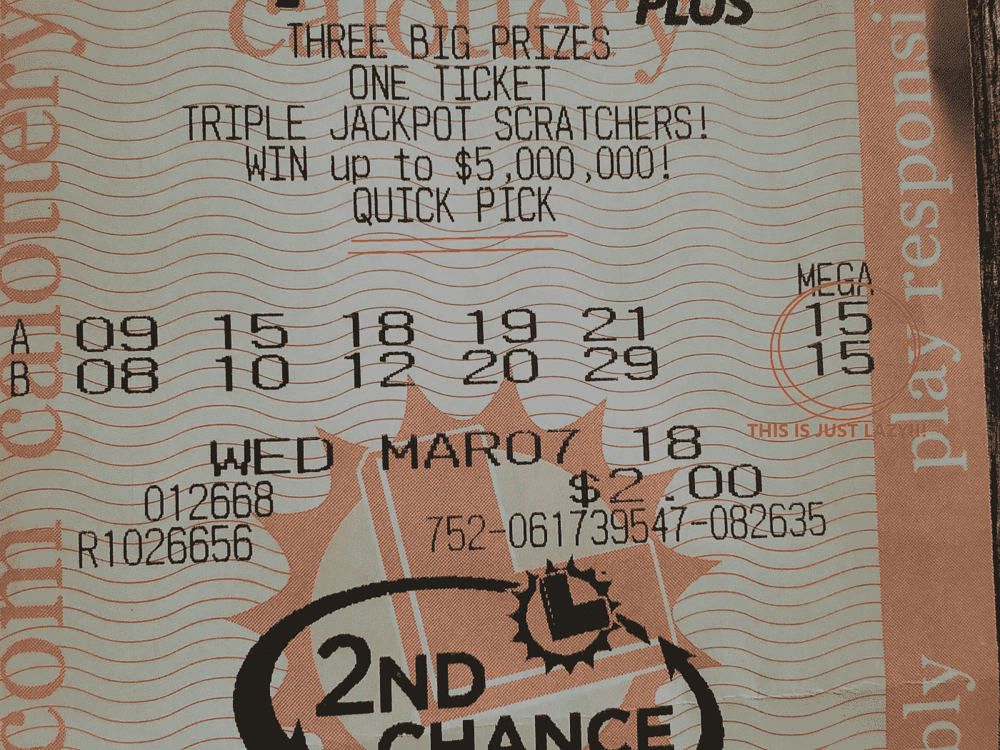
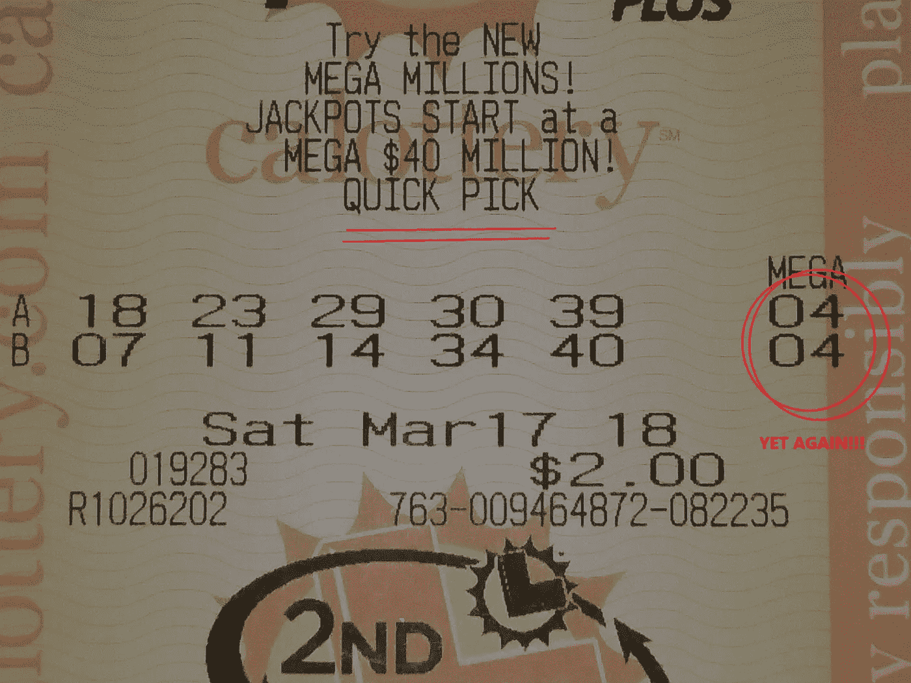
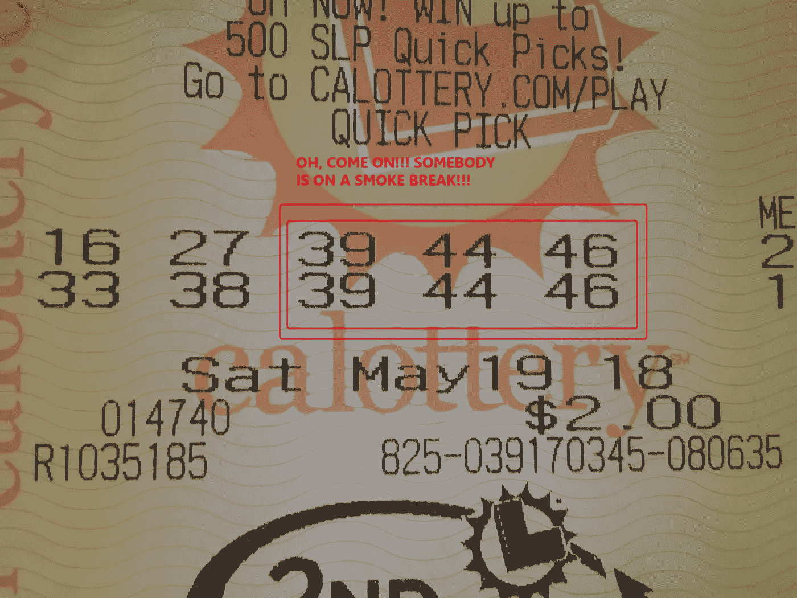
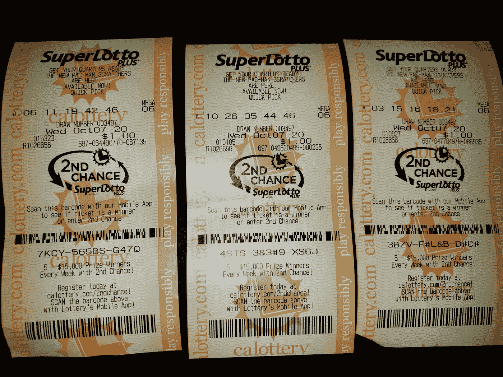

# 懒惰的算法:可悲的是，人工智能每天都在变得更像人类(更新)

> 原文：<https://medium.datadriveninvestor.com/lazy-algorithms-sadly-ai-is-becoming-more-human-every-day-50a48cdb3760?source=collection_archive---------6----------------------->

吉姆·沃克——别把我当回事

我在此陈述一个假设——不，至少是一个理论。我是说，这就要成为事实了。我有研究可以证明这一点。请耐心听我说，我的朋友们，我一会儿就去找证据。第一，理论。

计算机，或者至少是其中的松鼠，是懒惰的。

这是事实。这些神圣和依赖的工具通常采取简单的方式——就像创造和编程它们的人类一样。这真的不应该是一个惊喜。拉丁人是这样说的: *in imago auctoris* 。(真的吗？或者，我自己也很懒，难道我只是通过在谷歌翻译中搜索“作者的形象”得到的吗？我永远不会说的。)

计算机遭受着和它们的创造者一样的疾病，包括中暑、断线、内存堵塞、CP-UTI、主板问题、TMI 和数字嫉妒。他们和我们一样，也遭受着一种叫做网络胡说八道的折磨，这种胡说八道的标题是“垃圾进，垃圾出”。以 Twitter 为例。

而且，就像它们的创造者一样，所有这些计算机问题都会随着年龄的增长而加剧。我的意思是，一旦这些印刷电路失去光泽…

但是尽管有这些问题，计算机只是硬件。就像电脑控制前的汽车一样，东西最终都会磨损。虽然可能有计划淘汰凿成汽车早在一天，没有内置的邪恶意识不断策划引擎盖下，你把它开出了很多。

不幸的是，计算机硬件需要软件。程序和算法是让轮子转动的松鼠。那里是通往天堂和地狱的入口，亲爱的。

现在，这种论述将不会涉及任何内在的邪恶，对俄罗斯黑客的敏感性，甚至是有计划的过时。从理论上讲，我们在这里看懒惰——特别是被称为算法的懒惰、疯狂的毛球。

根据定义，算法是“在计算或其他解决问题的操作中要遵循的一个过程或一组规则。”现在，你可能会想象这些小啮齿动物在绝对和不可改变的数学法则下忍受着时间的流逝。你认为他们是可靠的，诚实的和真实的。在任何情况下，如果同样的数据进去，同样的结果出来。

不是这样的，*朋友们*。

入场:我玩加州彩票，具体来说是超级彩票。现在，当然，我听到过这样的告诫:“彩票是穷人的鸦片。”嗯，我当然是其中之一，彩票是我的退休计划。我的意思是，在生活中总是走“人迹罕至的路”，我真的没有时间做其他事情来积累我的储蓄。事实是，我在巢上，没有蛋。

另外，彩票有助于支付孩子的教育费用，对吗？我不介意时不时给那些忘恩负义的小家伙一点甜头。

但是回到正题…繁荣来了。

创建你的彩票快速选择的算法应该完全随机地选择号码。我们指望它。我们在它上面打赌。但是我认为这些算法经常躺在他们的办公椅上，脚放在桌子上，手里拿着一杯咖啡。在这种无所事事的状态下，他们会选择最容易的路线来快速挑选。他们往往选择最短的路线，根本不动。

几年来，我不断看到快速挑选超级号码，于是我决定保留照片证据，并做一些计算。在最近的一个月里，一次购买两个 SuperLotto Plus quick pick 游戏，总共购买了四次…其中两次购买的游戏在玩的两个游戏中都有相同的超级号码！我认为这是懒惰算法的统计证据。

THIS IS JUST LAZY!

YET AGAIN!!!

(请注意，这只是 8 美元的总支出，所以不要派 12 步计划的代理上门。是给孩子们的。)

不服气？好吧，我们来算一下数字。而且，在你写我数学上的失败之前，请相信我在统计学上得了 C。

我们开始吧:在 SuperLotto Plus 中只有 1-27 的超级号码是可能的，那么在一张两张票的购买中两次获得相同超级号码的几率是多少？它们是 27 x 27 = 729，所以 729 中有一个。这种可能性很大。不疯狂，但如果有人以这样的赔率给我一大笔钱，我会让他们从我头上射下一个苹果。

但我们还没给人留下深刻印象。你看，四分之二的两张票购买有相同的兆的几率是(729 x 729) / 2。这是 265，720 分之一的概率！这是一个令人惊讶的结果，同学们，我已经在各种彩票销售点多次看到这种两票中出百万的事情。这不是随机数生成，这是一个懒惰的算法。

但我可以超越它。今年五月，在两张快速彩票中，五个随机选择的普通号码中有三个完全相同！！！根据我的计算，大概有 400 亿分之一的机会。当这些数字被选中时，肯定有人在抽烟休息。

OH, COME ON!!! SOMEBODY IS ON A SMOKE BREAK!!!

现在，我给算法一个可能的答案。也许这个数学小奴才正在一台有缺陷的机器上工作。也许内存芯片会变得“根深蒂固”,并遵循像一辆插线不好的哑火雪佛兰那样的模式。或者可能是一只油炸蟑螂正在制造一个磁场，把算法弹回到它栖息的最后一个数字。或者，当我的两块钱打电话来的时候，那个守着服务器的人正在睡觉，他的额头正顶着服务器。每当他打鼾时，特定的数字被压入或压出选择。

但是我的钱…你知道，如果我还有剩余的话…会在一个宿醉的算法上思考，“好吧，我已经在五上了，为什么不省点力气再选五个呢？没有人会注意到。”

哦，我注意到了，伙计。

懒惰算法:人工智能是不是变得有点太人性化了？

*在 imago auctoris。*

***********************

附录，2020 年 10 月 7 日

嗯，我还没有赢得超级大奖，但我一直在努力。关于这个游戏的算法，我只能说这么多。很明显它已经没油了。作为证明，请查看这三个 SuperLotto 游戏。10/7/20 一个接一个地打印了三个快速精选…并且这三个都有相同的超级号码！(6)

来吧阿尔戈，老朋友。我保证不再叫你出来，如果你喜欢我的话。

**********************