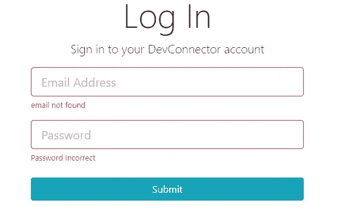
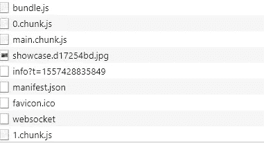
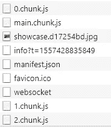

# React 中的延迟加载

> 原文：<https://medium.datadriveninvestor.com/lazy-loading-in-react-5c747b323509?source=collection_archive---------1----------------------->

[](http://www.track.datadriveninvestor.com/1B9E)

**React** 使用像 *WebPack* 这样的捆绑器来打包它的代码并部署到浏览器。浏览器使用这个捆绑包来呈现 React 应用程序。

现在想象一下创建一个有数百个组件的应用程序。默认情况下，bundler 会将所有这些组件合并到一个 bundle.js 中，并加载您的应用程序。这反过来会增加初始包的大小，从而导致加载时间的增加。

[](https://www.datadriveninvestor.com/2019/01/07/the-ultimate-learning-path-for-deep-learning-in-2019-more/) [## 2019 年深度学习的终极学习路径及更多...-数据驱动型投资者

### 又一个美好的一周，一些好的教育内容将会到来。我最喜欢的&最受欢迎的帖子之一…

www.datadriveninvestor.com](https://www.datadriveninvestor.com/2019/01/07/the-ultimate-learning-path-for-deep-learning-in-2019-more/) 

**随着使用的第三方数量的增加，规模将进一步扩大。*

有一种叫做 [*3 秒法则*](https://vsellis.com/how-to-get-customers-to-take-action-the-3-second-rule/) 的东西，它指出，抓住客户的注意力大约需要 3 秒钟。因此，如果花费更多时间，客户/用户甚至可能不会留下来检查最终产品，而是可能会花更多时间寻找替代品。

那么，我们能做些什么来提高我们的绩效，而不使我们非常重要的客户等待呢？

答案很简单，首先加载需要的组件，然后在需要时加载其他组件。这就是**延迟加载**的作用，分部分加载应用程序，而不是在一个包中加载。

想象一下，您有一个具有以下流程的应用程序:

```
Home -> Login/Register -> User Dashboard -> Logout
```

默认情况下，当您加载 react 应用程序时，它将一次加载所有组件。但是，当用户还没有登录时，我们需要用户仪表板和注销组件吗？相反，我们可以加载 Home 和 Login/Register 组件，这样可以减少一半的加载时间。一旦用户登录到应用程序，我们就可以加载其他两个组件了。

* *如果您使用 create-react-app 创建样板文件，则 web-pack 已经配置为支持动态导入(惰性加载)。如果你正在从头开始创建代码库，你将不得不相应地配置*[***we B- pack***](https://webpack.js.org/guides/code-splitting/)**。**

*现在我们知道了为什么，让我们从如何开始？*

*在本文中，我将向您展示实现延迟加载的两种方法*

*   *首先是通过使用 **React.lazy** 和**悬念** ( *min react 版本 16.6.0* )。*
*   *其次通过创建一个**高阶组件(HOC)。***

*因此，让我们从创建一个演示 react 应用程序开始。你可以在 [GitHub](https://github.com/devAbhimanyu/LazyLoadind_In_ReactJS) 上下载/查看我完成的代码。*

** *我将假设你有 React 的基本知识，并将直接进入实施。**

*我有我的主要组件 ***App.js，*** ，在其中我将定义两条路线:*

*   *第一个是注册页面将使用特设的方法。*
*   *第二个是将使用 React 的登录页面。慵懒又悬疑。*

**

> ***利用 React.lazy 和悬念***

*这个特性是在 React 版本 16.6.0 中首次引入的，目的是在生态系统中引入延迟加载。*

**** ***注意*** *:服务器端渲染还不支持。**

*在 React 中，我们使用 *import* 关键字来获取基本上是一个 JavaScript 模块的组件。*

```
***import Landing from ‘./Components/Layout/Landing’;***
```

*默认情况下， *import* 将获取模块并将其合并到包文件中。我们需要的是一个导入，它在本质上更具动态性，也就是说只有在需要的时候才会导入。*

***React.lazy** 让这种动态导入成为可能，也很容易实现。*

```
***const Login = React.lazy(() => import(‘./Components/Login’));***
```

***React.lazy** 接受一个函数作为参数，该函数从动态 *import* 调用中返回一个承诺。这个承诺被解析为加载包含 *React 组件*的模块。*

** ***注意*** *:目前 React.lazy 还不支持命名导出，所以要记得对想要动态导入的组件使用默认导出。**

```
***export default Login;
 export const abc = className; **Not Valid *****
```

*一旦模块被加载，它将返回一个新的包，其中的组件被合并到前面的代码中。*

***

***如上所述，动态导入返回一个承诺，这意味着需要时间来获取模块、更新包和加载所需的组件。所以我们可能需要一个 ***回退内容，*** 在组件加载时显示，这就是 ***悬念*** 出现的地方。***

***首先，我们需要从 React 导入悬念模块:***

```
*****import React,{Suspense} from ‘react’;*****
```

***我们可以将悬念组件视为一个特设组件，它包装了使用 **React.lazy** 定义的组件，例如，下面代码片段中的 Login。***

```
*****<Suspense fallback={<div>Loading…</div>}><Login /></Suspense>*****
```

****回退*属性/属性是我们定义*内容*的地方，该内容将在组件加载时显示。***

******

***Login Component rendered using React.lazy and Suspense***

***要检查我们的更改是否有效，我们可以检查开发工具:***

******

***The 1.chunk gets called when the component in dynamically imported***

****0.chunk* 是没有组件的包，将通过动态导入调用。在登录组件被调用后，另一个文件 *1.chunk* 被加载，它包含更新后的包。***

**** *我们还可以在悬念周围定义* [*错误边界*](https://reactjs.org/docs/error-boundaries.html) *以便在组件加载失败时显示自定义错误。****

> *****创建您自己的定制 HOC*****

***通过创建我们自己的自定义高阶组件来加载组件，我们可以根据需要自由地进行任何修改。***

```
***import React, { Component } from ‘react’;const lazyLoader = (importComponent) => {
 return class extends Component {
 state = {
 component: null
 }
 componentDidMount () {
 importComponent().then(cmp => {
 this.setState({component: cmp.default});
 });
 }
 render () {
 const CustComponent = this.state.component;
 return CustComponent ? <CustComponent {…this.props} /> : null;
 }
 }
 }
 export default lazyLoader;***
```

***让我们看看这个 HOC 的调用，您可能会看到调用方法与 React.lazy 方法的相似之处。***

```
*****const AsyncRegister = lazyComponentLoader(() => import(‘./Components/Register’));*****
```

***正如我们所看到的，组件接受一个函数作为参数，并返回组件 **lazyLoader** 。***

***导入在*componentdimount*生命周期挂钩中得到解析，这样做是为了避免任何副作用。状态得到更新，动态导入的组件被返回。***

******

***The Register Component rendered using our custom HOC***

***就像上面的例子一样，让我们检查一下开发工具:2***

******

***2.chunk gets loaded***

***正如我们可以看到的，当调用 Register 组件时，一个新的块被发送，带有更新的包***

**** **注意:** *我们正在传播道具，要将道具从****lazy loader****组件传递到本例中导入的组件* ***CustComponent。******

***您可以在这里找到上面示例[的存储库。](https://github.com/devAbhimanyu/LazyLoadind_In_ReactJS)***