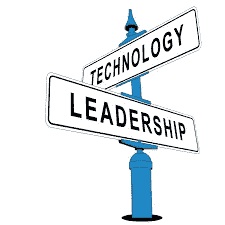

# 领导力:这个概念实际上并不意味着你是负责人

> 原文：<https://medium.datadriveninvestor.com/leadership-that-concept-that-actually-doesnt-mean-that-you-re-in-charge-caea9208d154?source=collection_archive---------28----------------------->

Photo by [Ethan Weil](https://unsplash.com/@weilstyle?utm_source=medium&utm_medium=referral) on [Unsplash](https://unsplash.com?utm_source=medium&utm_medium=referral)

Leadership in Technology

真正的领导者不是掌管一切的人，而是负责任的人。他们必须理解并接受这样的负担:成功应该反映他们的团队，而失败将反映他们的领导力。这是要承受的负担，而不是要赢得的奖赏。所有优秀的领导者都寻求创造变革，并将其传递给继任者，让他们完成向世界展示的理念的目标。

> 【ccstechme.com/coding-duck-blog】原载于编码鸭博客:

**所以，让我们从谈论每个人都同意的事情开始这篇文章:关系。有多少人认为他们有权“掌控”恋爱关系中的事情？有多少女人觉得自己被期望“温顺地坐在角落里表示同意”？可能我们中的很多人都有异性恋关系。即使在性别没有被赋予角色的关系中，两个人中的一个可能会觉得他们的工作是为家庭做领导和决策。关于这是为什么，有许多学派:圣经说女人需要成为男人的奴隶，男性主导的商业和政治景观，现代和公开的沙文主义，等等。**

**虽然我觉得这些结论都可以进行辩论，但真的没有材料说男人必须抓住女人的头发，女人必须让他们抓。《圣经》本身用稍微优雅一点的语言告诉男人，一个不听妻子说话、盛气凌人的混蛋不仅是个白痴，而且也不会得到上帝的青睐。那么，为什么会有男性需要占主导地位而女性不需要的想法呢？**

**这与现代经理人和首席执行官认为“他们的话算数”和“没有人有权告诉他们任何事情，因为他们在掌控大局”的原因是一样的:感知。我们生活的这个世界在应用“领导力”这个词的定义时有一个非常糟糕的方法。韦氏词典对领导力的第一个定义是:**

*****领导者的职位*****

**这并不奇怪。然而，*的第二个*定义是:**

*****能力领先*****

**第三个是:**

*****领导的行为或事例*****

**看到图案了吗？领导者不仅仅是有头衔或资格的人。领导力是一个活跃的概念，需要能力和健康。为什么？**

**首先，因为领导者不是权威，而是榜样。如今，在会议上的主题演讲或社交媒体上的哗众取宠被赋予了太多的权力。“行动比语言更响亮”的概念在现代社会中基本上消失了，因为人们现在认为*给*做主题演讲或选择*在社交媒体上发布*是行动，而实际上，这两者都只是人们说话的形式。**

**第二，许多人看到一家*公司*的慈善行为或者一个*国家*的无知，并将其等同于其领导人或杰出的董事会成员。但塞特亚·纳德拉个人不会向知名慈善机构捐款，也不会在 LinkedIn 上发布，微软会。然后微软将这笔钱作为税收减免注销。这是一个由几个团队设计、发起和营销的商业决策，目标是改善形象。我不是反对萨提亚，我肯定他是一个很棒的人，但事实是他为他的公司所做的一切获得了荣誉。**

**埃隆·马斯克是另一个很好的例子。我们总是提到他建立的公司。他对 SpaceX、特斯拉、The Boring Co 等公司的成功负有全部责任。他曾在推特上写道*“哦，对了，我也在造一个机器人龙。”*真的吗？你会亲自来到 SpaceX 的实验室，发明生物和化学物质，更不用说建造一个半动物半机器的神话生物所需的机械部件了吗？你确定你不会只是在 SpaceX 的数十亿美元支票上签名，这些钱将支付那些领域的一些专家在你与媒体交谈时为你做这些事情吗？**

**你看，几个世纪以来，尤其是近几十年来，领导者的神一般的地位已经导致领导者实际上开始相信他们是唯一对成功负责的人。他们似乎完全忘记了，如果没有一群拿工资做事的人，他们只是另一个有想法的人。当然，这个规则也有例外。独立黑客就是一个很好的例子。**

**但是， ***真正的*** 领导，是一个谦逊地承认这一点的人，即使他们投入艰苦的工作从头开始建设一些东西，最终他们也会成为有名无实的领袖。一个真正的领导者的工作是接受对他们所代表的品牌的批评，并将荣誉传递给他们所代表的人。成为一名真正的领导者是很难的，因为这意味着你的工作就是总是承担责任，从不邀功。许多现任领导人的这种观念完全落后了。**

**为什么马克·扎克伯格的身价和脸书的身价一样高？你是在告诉我公司 CEO 赚的钱和公司本身一样多吗？一点也不。或者说，至少不应该这么估值。根据他的公司，他的年薪肯定不是 400 亿美元。但是现在，由于他的员工的所作所为，更多的人指责雪莉·桑德伯格，而不是他。当然，他受到了很多批评，但即使在泄露的全体会议上，他也告诉他的员工“我们”需要做得更好，“我们”需要做这样那样的事情。好吧，但是当事情进展顺利的时候，所有提到公司的都是“马克·扎克伯格的脸书收入翻了一番”之类的话。那么，如果那是他的公司，为什么脸书的史诗般暴跌*不是他的*问题，也不是他一个人的问题？**

**领导不是权力，也不是控制。领导就是责任，而责任伴随着许多缺点和极少数非常有价值的优点。责任是一项艰难、要求高、艰巨的工作，它要求你超越自我，甚至在你的领导被证明无效或有害时，将自己调离岗位。你不是你的产品或品牌。这些事情都是你造成的。但就像小孩子的行为通常会被归咎于父母一样，真正的领导者会接受这样的事实，即他们会确保身边的人取得成功，并希望他们不要保持自己的统治地位，而是培养和培养他们领导的人，最终取代他们。这很困难，令人谦卑，需要勇气和耐心，而且似乎完全迷失在我们生活的世界中。**

**但我们，作为创新者、思想家、建设者和问题解决者，有能力改变这种状况。我们有能力做很少人想做的事。如果我们希望领导，我们必须在前线这样做。我们不会站在离战场几英里远的作战基地里，用无线电命令我们的下属落入火线。我们将以身作则，训练那些向我们报告的人在我们不可避免地在战斗中倒下时捡起我们的旗帜。我们会倒下。我们希望坠落。我们希望骑着马在我们的士兵面前步行，第一个采取他们的方式，以避免我们领导的人，因此，支持。**

***原载于编码鸭博客:***