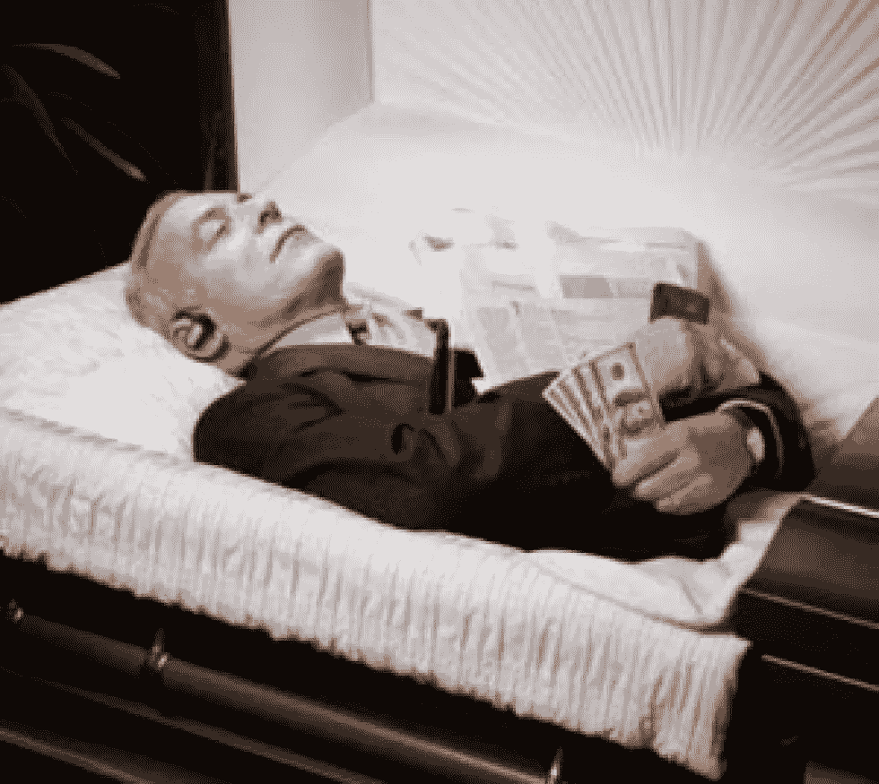
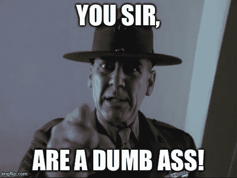
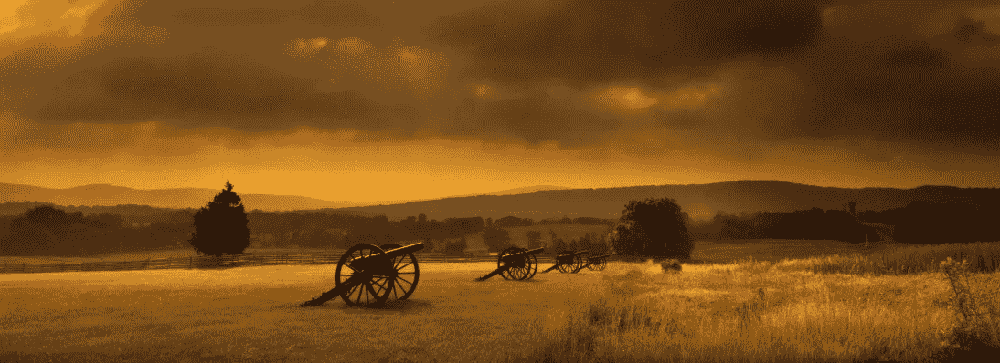
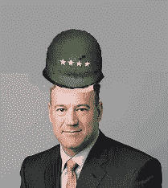

# 带领我的股票投资组合获得非凡的收益

> 原文：<https://medium.datadriveninvestor.com/leading-my-stock-portfolio-to-extraordinary-gains-b38533344603?source=collection_archive---------43----------------------->

我认真对待我的投资。好像我的生死取决于此。

I’d die for these stocks

对我来说，股票比生活中其他任何东西都重要。比我的家人、朋友或我 32 个孩子中的任何一个都重要。我才不管什么 ***什么*** 呢。与我多样化的股票投资组合中非凡的资本收益相比，它们对我来说不算什么。

# 死亡在前线

昨天是我希望能倒带的一天。眺望前线，我看到死亡就在我面前。我的股票在我眼前遭受重创，价值直线下降。作为我股票投资组合的五星上将，我犯了一个战略错误。我在高买低卖。

我坐在我的玻璃大厦里尖叫着 F***********************CK！！！我全力以赴，根据自己的情绪做出决定。我再也看不清了。我的错误加剧了我无法弥补的损失。当我妻子走过来对我说:

My wife giving me investment advice

这让我更加抓狂。我喊道:

> 我这么有钱，怎么会是个蠢驴？！？

她死死地盯着我的眼睛，说出了她最喜欢的十个字。

> 如果你不把这个修好，我就离开你…笨蛋

这正是我需要听到的。看到我的投资组合遭受巨大损失(24 小时内总价值超过 6%)，以及我亲爱的妻子眼中和言语中真诚的威胁，提醒我什么才是重要的。长期增长投资，以消除我的股票投资组合的日常波动。

# 前线的生活

The calm before the storm

恢复我股票投资组合的第一线需要精确、计算和天才。为了平静下来，我做了三次深呼吸，吃了一口半熟的里贝耶牛排，用竖琴演奏了莫扎特的音乐。头脑清醒的我点燃了我的帽子，大喊“去你的！!"， 又把它从益州山顶上扔下来。我在头上戴了一顶五星上将帽。我开始根据公司预期的未来现金流来评估公司。我清算了波动股票的短期头寸。我开始低买高卖。

股票市场开始旋转。我周围突然出现了爆炸性的增长。接下来我所知道的就是我的股票处于攻势。回报收盘时的损失不到当天总价值的 3%，考虑到我在开盘时受到的冲击，这是一个胜利。随着我的新战略到位，我在撤退中有损失。我完全有信心在本季度结束前将它们重新夺回并转化为非凡收益。

# 经验教训

在前线，你不是生就是死。昨天，我的股票投资组合在贬值，挣扎着呼吸。我妻子过来帮忙，给它做了挽救生命的心肺复苏术，还叫我笨蛋。这是我娶她的主要原因。随着亏损的消退，以及合理的投资政策的到位，我们将在我们玻璃大厦的董事会会议室里尽情享受，看着我们的投资以令人难以置信的速度增长。我甚至可能会吃一块牛排，为我可爱的妻子弹奏莫扎特的音乐。

我叫达雷尔·冈恩，是一名本地、国际和全球商人。我的任务是把穷人和富人联系起来。如果你在附近，给我打个招呼。我们来谈谈数字。

Leading my stock portfolio to extraordinary gains