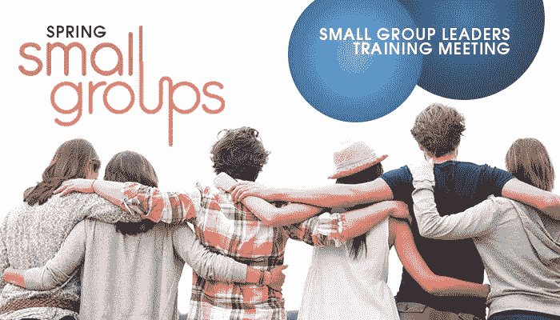

# 领导小组和团队

> 原文：<https://medium.datadriveninvestor.com/leading-small-groups-and-teams-fa4f5aa8d8dd?source=collection_archive---------23----------------------->

Photo Credit: [http://www.gracenorthcounty.com](http://www.gracenorthcounty.com)

# 领导小组和团队

领导小团队可能是世界上最艰难的工作之一，因为它需要许多技能，其中包括耐心、坚持、纪律、透明度、忠诚和宽容。领导者需要这些品质，因为他们必须以身作则，自己遵守这些规则。有时候，这就是为什么大多数高管需要教练来加强他们的领导策略。

Photo Credit: [http://www.gracenorthcounty.com](http://www.gracenorthcounty.com)

让我们来看看五个重要的技巧，它们可以帮助你改善领导策略，帮助你把你的团队提高到一个新的水平。尽早沟通并坚持到底:如果你等到最后一刻才与你的团队就即将到来的事件、事件更新等进行沟通，那么无论你正在努力实现什么，都将有更大的机会面临问题。你需要让团队一直保持在循环中，不断提醒只会做得更好，定期举行会议，必要时通过短信、电话和社交媒体保持联系。

 [## 想知道领导是谁？请他决定。-数据驱动型投资者

### 一个有效的领导者能为组织提供的最有价值的东西之一是决策能力…

www.datadriveninvestor.com](https://www.datadriveninvestor.com/2019/01/25/want-to-know-who-the-leader-is-ask-him-to-decide/) 

2.想清楚并准备好问题:即使你的小组或团队由受过高等教育、专业或有经验的成员组成，也可能会有新手在不同时间加入。确保每个人都在同一页上并正确理解所有事情的最好和最快的方法是提问。准备一份常见问题或技术问题的清单，这将有助于让每个人都了解事情的流程，并帮助新手立即跟上。

3.保持团队活力:有时老成员已经习惯了你，知道你，新成员需要对你是什么，你做什么，你信仰什么有一个清晰和积极的认识。不要分散注意力，不要分享会给新来者传递关于你或你的目的的错误信号的评论或意见。

4.以积极的态度处理冲突:当来自不同背景的人一起工作时，肯定会有一些分歧。如果你作为一个领导者忽略了这些差异，它们可能是一个等待爆炸的燃烧的地狱。因此，您需要立即采取行动，并检查双方。玩指责游戏从来都不是正确的方法，所以要找到一种外交途径。

5.坚持计划并保持乐观:无论你的团队有什么任务，都会有挑战。无论如何，坚持计划，继续前进。保持积极的态度，也让整个团队保持积极的态度。这是成功的关键。如果 A 计划失败了，确保总有 b 计划，参加教练服务以获得更好的领导技能从来都不是个坏主意；这五条建议会帮助你改进你的方法。事实上，可能还有领导力的其他方面，你没有意识到，专业人士可以通过指出你作为领导者的弱点来帮助你。

由...所写

杰拉德·奥多诺万
首席执行官兼创始人——诺布尔·曼哈通教练——[www.noble-Manhattan.com](http://www.noble-Manhattan.com)
首席执行官兼创始人——国际教练新闻——[www.international-coaching-news.net](http://www.international-coaching-news.net)
首席执行官兼创始人——威斯敏斯特弥偿——[www.Westminster-indemnity.com](http://www.Westminster-indemnity.com)
首席执行官兼创始人——阿尔法集团——[www . The-Alpha-Group . biz](http://www.the-alpha-group.biz)
总裁——国际教练与指导学院——[www.iicandm.org](http://www.iicandm.org)

在这里阅读更多内容，不要忘了订阅我的教练博客网站获得免费教练报告:[https://www . coaching-blog . com/leading-small-groups-and-teams/](https://www.coaching-blog.com/leading-small-groups-and-teams/)

查看我们在此提供的课程:[https://www . noble-Manhattan . com/training-courses/coaching-courses/](https://www.noble-manhattan.com/training-courses/coaching-courses/)

并获得我们的免费报道:[https://www.coaching-reports.com/](https://www.coaching-reports.com/)

*原发布于:*[*https://www . coaching-blog . com/leading-small-groups-and-teams/*](https://www.coaching-blog.com/leading-small-groups-and-teams/)