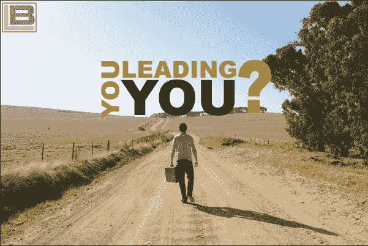

# 引领自己

> 原文：<https://medium.datadriveninvestor.com/leading-yourself-f3d54c27c5cb?source=collection_archive---------24----------------------->

如果你想改善你的生活和/或工作表现，你很可能需要很多自我激励和自我领导能力来提高自己。如果你想做某件事，很可能没有人能像你一样激励自己。即使你不是其他人的领导者，成为自己的领导者也是成为成功人士的重要组成部分，不仅仅是短期的，而是长期的。

领导自己和领导别人没什么不同。就像激励别人一样，为了激励自己，你必须找出是什么事情激发了你的生产力，即使是在你真的不想完成一项任务或工作的情况下。领导别人的时候，你要找到是什么激励了他们(基本上是前面的胡萝卜还是后面的大棒？).为了成为我们自己的有效领导者，你必须找到让你更努力、更长久工作的原因——胡萝卜还是大棒？你还必须发现如何激发这种动力，尤其是在没有其他人愿意的情况下。

这个过程的很大一部分是学会为自己和自己的行为负责，并意识到如果你不在乎自己的成功，没有人会在乎来帮助你。大多数成功的领导者都是自己就是有效领导者的人。

这是一个很难把握的概念，也是一个很难培养的技能。有些人天生有上进心。他们想要成功和取得成就，即使没有人认可他们的成功或成就。其他人仅仅被外在的欣赏所激励，如果没有人的鼓励，他们很少会去做一些事情，即使是为了他们自己的进步和利益。

高管教练对这两个人来说都是一个很好的资源。他可以先帮助一个人，找到他的动力。变得有上进心是一个过程，一天有效的第二天可能就无效了。第二，他可以确保个人有一个出口来接受他需要的那种赞赏，以便愿意继续工作和进步。引领自我是一场耐力跑，而不是短跑。然而，学会影响自己去做你需要甚至想做的事情，只是没有动力去做，并不是不可能的。

成为一个观察自己、能够设定并实现固定目标、合理奖励自己的人，从长远来看，意味着更有成效、更有效率的生活。

作者:

**杰勒德·奥多诺万**
首席执行官兼创始人——诺布尔·曼哈顿教练——[www.noble-Manhattan.com](https://www.coaching-blog.com/leading-yourself/www.noble-Manhattan.com)
首席执行官兼创始人——国际教练新闻——[www.international-coaching-news.net](https://www.coaching-blog.com/leading-yourself/www.international-coaching-news.net)
首席执行官兼创始人——威斯敏斯特弥偿——[www.Westminster-indemnity.com](https://www.coaching-blog.com/leading-yourself/www.Westminster-indemnity.com)
首席执行官兼创始人——阿尔法集团——[www . The-Alpha-Group . biz](https://www.coaching-blog.com/leading-yourself/%20www.the-alpha-group.biz)
总裁——国际教练与指导学院——[www.iicandm.org](https://www.coaching-blog.com/leading-yourself/www.iicandm.org%20)

在这里阅读更多内容，不要忘记订阅我的教练博客网站获得免费的教练报告:[https://www.coaching-blog.com/leading-yourself/](https://www.coaching-blog.com/leading-yourself/)

请访问我们的网站，订阅免费的教练杂志:[http://www.international-coaching-news.net/](https://vk.com/away.php?to=http://www.international-coaching-news.net/&cc_key=)