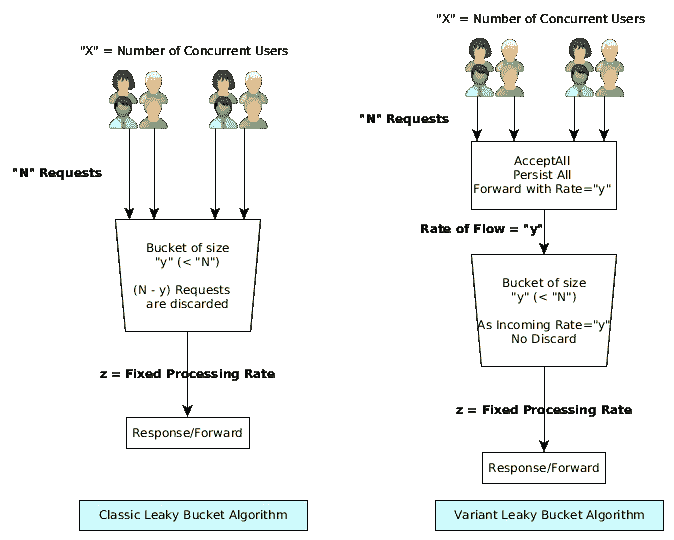

# 流量控制的漏桶算法

> 原文：<https://medium.datadriveninvestor.com/leaky-bucket-algorithm-for-flow-control-6ba600bfee10?source=collection_archive---------2----------------------->

*这个故事最初发表在我的博客@linqz.io* [*这里*](https://www.linqz.io/2018/04/what-is-leaky-bucket-algorithm-for-flow-control.html) *。*

大多数程序员是有神论者，并且是神的坚定信徒，这是一个常见的笑话，因为他们永远无法预测系统何时开始行为不端，或者他们的应用程序何时出现问题。

很多时候，我们会遇到必须处理 http 请求的突发流量的情况，这是开发人员祈祷“上帝啊，给我的服务器足够的能力来处理这些请求吧(开玩笑！)".

每个应用程序都有一个分配给它的最大内存阈值，一旦超过这个阈值，内存不足的问题就成了家常便饭。增加内存(即垂直扩展)似乎并不总是一个可行的选项，因为它有自己的一套限制，并且不是一个经济高效的可扩展选项。

那么有什么可能的方法呢？

> **从一开始就设置用户必须以恒定速率发送的限制，如果超过阈值，将不会提供服务。**

限制用户请求可能是一个解决方案，但是对于许多系统来说，这不是一个显而易见的选择，因为它需要对每个请求进行跟踪。此外，由于业务原因，速率控制的请求似乎不是合适的选择。

> **让您的实例纵向扩展到足以服务 20 倍的请求。**

垂直扩展伴随着巨大的基础架构成本，当日常流量为 1 倍时，这并不合适，但预计突发流量时，它会被分配 20 倍的资源。这不是最优的，而且浪费了宝贵的基础设施。

> **每次看到流量激增时，在负载均衡器下添加一个新实例，并为请求提供服务。**

每当流量增加、突发流量或流量达到峰值时，负载均衡器下会添加一个实例，以便在每个应用程序实例上分配负载。这是一个可行的选择，但在成本和人力资源方面效果不佳。

随着亚马逊 AWS 的出现，它提供了各种自动缩放选项，这个选项似乎是可行的，但它不是免费的。

> **在机器和人力资源方面使用经济高效的可扩展选项**。

# 经济高效的解决方案

计算机科学领域的构建模块是算法和数据结构，有太多的算法来解决这样的问题，优化资源的利用。这里我将讨论其中的一种方法。

[漏桶](https://en.wikipedia.org/wiki/Leaky_bucket)算法在完全控制资源的同时允许很高的精确度。从概念上讲，它的工作原理是当每个请求进来时递增一个计数器。该相同的计数器也基于允许的请求率随时间递减，直到它达到零。桶的容量是您准备接受为“突发”流量的容量。如果桶已满，尽管它已衰减，但进一步的请求将被丢弃(在我们的例子中，我们不会丢弃它)。

因此，漏桶算法非常适合这种类型的突发流量控制。

将很快在 github 上分享一个使用持久性的工作示例程序。

有问题吗？建议？评论？

下一步是什么？ [**在 Medium 上关注我**](https://medium.com/@vaibhav0109) 成为第一个阅读我的故事的人。