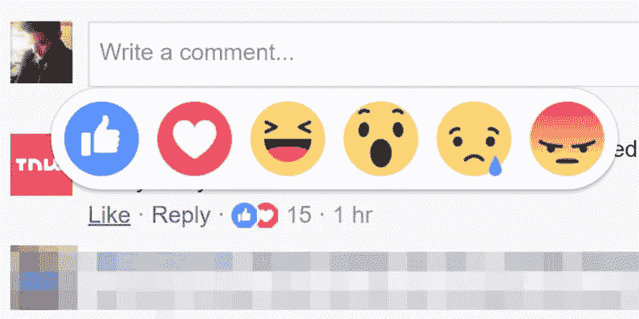
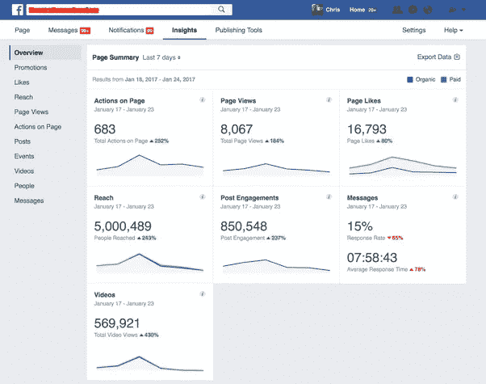

# 向用户学习

> 原文：<https://medium.datadriveninvestor.com/learn-from-users-750f1f72a325?source=collection_archive---------37----------------------->

Photo by [NESA by Makers](https://unsplash.com/@nesabymakers?utm_source=medium&utm_medium=referral) on [Unsplash](https://unsplash.com?utm_source=medium&utm_medium=referral)

无论一个设计师有多有创造力，你都必须首先深入了解用户的需求。这必须得到正确的满足。越来越多的用户有更多的实验行为，因为一切看起来都是新的和令人兴奋的，所以在用户研究期间，首先需要记住的是，一切都应该是可预测的。

就我个人而言，我相信我工作的每一个新元素或模块都有两点，

1.  反应的
2.  预言性的

反应行为给出了用户执行动作的即时反馈，而预测经验给出了执行这些动作的想法。

让我们以 facebook 上的商业页面为例。作为一名企业主，他每天都在 facebook 上发布关于店铺新货和运营商品的信息。脸书总是会给出这些特定反馈的统计数据，比如有多少用户对你的帖子做出了反应，有多少人访问了你在那篇帖子中提到的页面，是什么让用户对你的帖子更感兴趣等等。不需要正式的细节来了解你的页面的活动。

facebook 希望你能从你的用户那里学习，下次让他们更感兴趣，并继续让他们参与你的业务。对于这样一个大巨头来说，他们雇佣一些真正有经验的数字营销人员来制作有趣的帖子，尽可能接触到更多的观众。

如果有很多用户访问了你在文章中提到的某个页面，而你的目标受众是你，这意味着你可以从这类文章中吸引越来越多的用户。这就是你从用户身上学习的方式。

> 哪里有免费的东西，哪里的用户就是你的产品。

一个很有意义的说法在这里。用户可以是一个产品，如果你越学越多越好。他们也可以让你知道他们的兴趣、心情、需求和许多其他事情。

你有没有注意到 facebook 发布的一个有趣的帖子，你只看了一次 feeds？这就是 facebook 从我们的研究中了解到的，我们确实喜欢一个视频，我们看了 85%的时间。所以在这个兴趣类别中，有些东西让我们感兴趣。同样，下一次 facebook 会给你那些类别的帖子来吸引你。

许多应用程序不能理解用户的需求，这是整个产品失败的核心原因。因为如果你得不到用户真正感兴趣的东西，那么这样的生意根本就不会成功。

无论如何，你的用户会在你的系统上表现，这是学会更好地为他们服务的唯一方法。在这个讨论中，我想补充更多关于巨头们目前使用大数据的观点，少数工具是 Google analytics、Microsoft powerbi、CleaverTap 等。

统计数据对于做出有意义的决定非常有用。而给佳音市场也带来了巨大的竞争。有些是免费的，有些也是收费的。

希望这篇文章对你有意义，值得你花时间去读。请鼓掌欣赏。

跟着我做[行为](https://www.behance.net/darshansuthar7)、[脸书](https://www.facebook.com/darshansuthar7)、[推特](http://twitter.com/darshansuthar7)和[运球](https://dribbble.com/darshansuthar7)