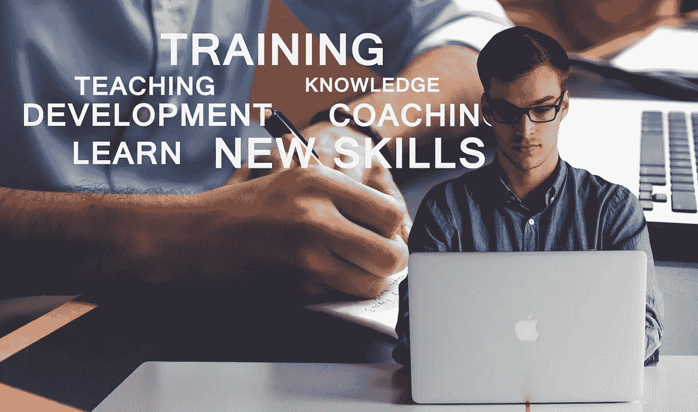

# 学习新技能:让自己成长，变得更好

> 原文：<https://medium.datadriveninvestor.com/learn-new-skills-grow-yourself-and-become-better-e7f2dedd006c?source=collection_archive---------3----------------------->

虽然听起来很模糊，但每个人都是特殊的，每个人都有自己独特的方式，每个灵魂都需要赶上来才能站在队伍的前面。

> 它没有让你想起什么吗？好吧，让我告诉你这意味着什么。

虽然特殊和独特的部分使你成为你自己，但在众多有才华、聪明和成功的人中保持领先同样重要。

> 有无数种方法可以滋养你的大脑，让你从一个普通人变成一个被世人所瞩目的人，我认为其中一个主要的方法就是养成学习新技能和新事物的习惯。

这又一次没能引起你的注意，不是吗？但是相信我，当我说学习新技能很重要的时候，它会从内部改变你。

## 没有特定的路径可循，你可以根据自己的方便，花很少的时间来掌握新的技能。

这些年来我所学到的是，每当你专注于学习新事物时；你实际上是在让你的大脑变得更加丰富，让你比其他人更有优势。这个额外的优势，或者你可以说是一个领先的开始，会带你到你从未想过你能到达的地方。

我见证了我的生活发生了重大转变，令我惊讶的是，这种转变总是朝着正确的方向，并帮助我在多方面成长。

在过了多年主流生活后，当我发现自己对某样东西有潜在的兴趣时，那种渴望征服了我。

就像其他人一样，我喜欢看起来很棒并且有故事可讲的图片，但是当我意识到我对点击这样的图片的热爱更加强烈时，事情实际上开始变得更好了。我并不是说我很擅长这个，但是我可以保证它在很多方面都有帮助。

# **自那以后，沟通技巧、注意力和自信心一直呈指数级增长，我相信一旦你知道了这些好处，你也会努力去发现什么样的技能让你着迷或定义了你。**

以下是一些实际上能激励你爬上人生新阶梯的优势。

# 收入增加

无论我们如何玩弄词语，最终，每个人都知道钱的重要性。对每个人来说，这可能不是最重要的事情，但在许多人的生活中，这确实是最重要的事情。

**学习一项新技能可以让你在成长曲线上遥遥领先，并且有可能让事情以更好的方式蓬勃发展。**

参加一门新的语言学习课程或专注于提高写作技能会带来巨大的好处。甚至像公开演讲、摄影(对我来说)或技术知识这样的事情也能帮助你改善生活方式。

# 增强创造力

创造力不局限于任何个人，你可以通过多种方式滋养你的大脑，使其更具创造力。在某件事情上做得更好可以改善你的神经系统，从而增强你的大脑投入更多的努力，最终变得更加活跃。

关键因素是遵循一门学科，在某项技能上做得更好，看着自己变成天才。听起来可能很奇怪，技能学习也能提高你解决问题的能力。

当我在职业生活中面临挑战，急需放松时，我会让我的大脑专注于如何进一步改善我点击的每张图片。这种做法不仅有助于点击更好的图片，还能让你足够熟练地从不同的角度应对挑战。

# 更好的自尊

采用新技能的最重要的好处之一是你可以完全改变你对自己的看法。像我和其他每个人一样，内心深处你知道自己很了不起，但生活的起起落落经常迫使你以贬低的方式看待自己。

现在，这是一个非常正常的场景，但这是一种不正常的做法，可以通过在心理层面上变得更好来治疗。

**当你学习一项技能并越学越好时，潜意识里你会为这一实际上增强了你自尊的成就感到自豪和自豪。举个例子，当你能用普通话交谈时，相信我，你一定会发现自己处于一个优越的位置。即使在极度紧张的时候，也不断提醒你的能力。**

# 更好的记忆

当你忙于紧张的学习时，你的记忆会发生什么变化？越来越好了。发现对新事物的兴趣表明你的思维越来越活跃，这反过来使它更丰富，从而使你更有能力记住重要的事情。

**我的工作涉及许多不同主题的详细研究，多年来，我确实感觉到了不同。让我惊讶的是，现在的事情都好记多了，哪怕是再小的事情，只是因为我的大脑活跃了，没有一直瞎折腾。**

# 更多满足感

我会告诉你我是如何开始以一种完全不同的方式感到更加满足的。工作一天后，我通常会回家，在笔记本电脑前放松，看一些电视节目或玩一会儿在线游戏。

然而，我并不是说这是不好的或错误的，每个人都需要在忙碌的一天工作后放松一下，但是还有更好的事情。

那些日子里，我遵循同样的惯例，但不是看节目，而是看那些教我如何更好地摄影的视频，不知何故，我的大脑和心脏感觉更好了。

科学地说，当你完成或取得任何成就时，快乐荷尔蒙就会释放出来，将你的满足感提升到一个全新的水平。我坚信，当你对自己感到更加自信和满意时，你在各个方面都会变得更好。

# 改变你的生活

从更广阔的角度来看，你做的每一件事都可以改变你的生活，但是你学到的每一项新技能都有巨大的潜力将你的生活引向正确的方向。很多人考虑在外国定居，当你学习那个国家的母语时，你会比那些不说母语的人有优势。

**在任何乐器上站稳脚跟，都能帮你去到你一直想去的地方。同样，每一项新技能都有这样或那样的好处，除非你深入研究，否则你是看不到的。**

# 我对年轻人、老年人和任何年龄的人的建议；勇往直前，投入热情，做得更好，或许向世界展示你的能力。年龄，时间，金钱，没有什么可以阻止你去学习新的东西，如果你的热情足够强烈的话。