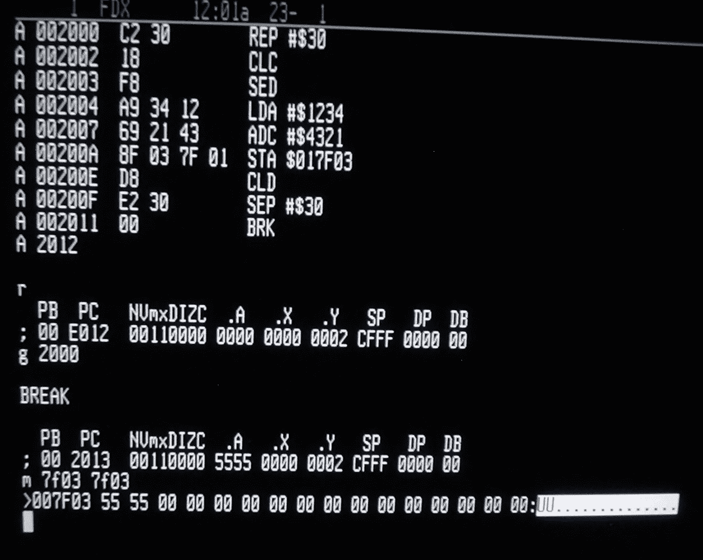
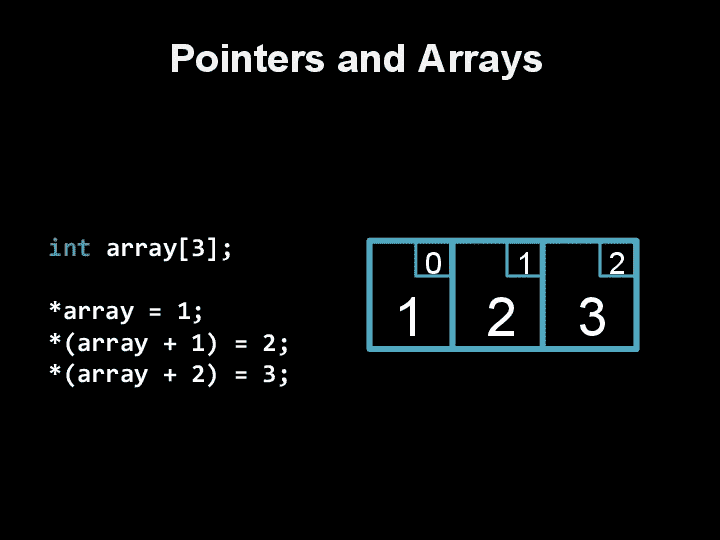
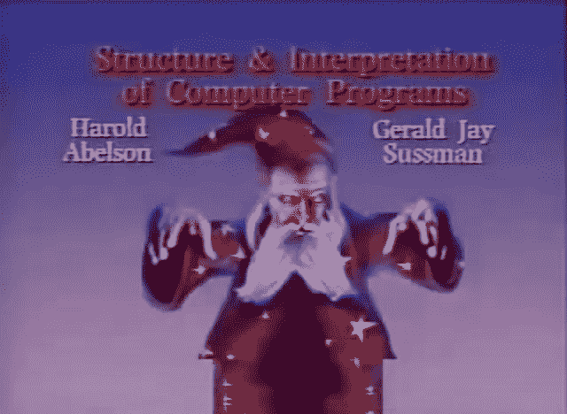
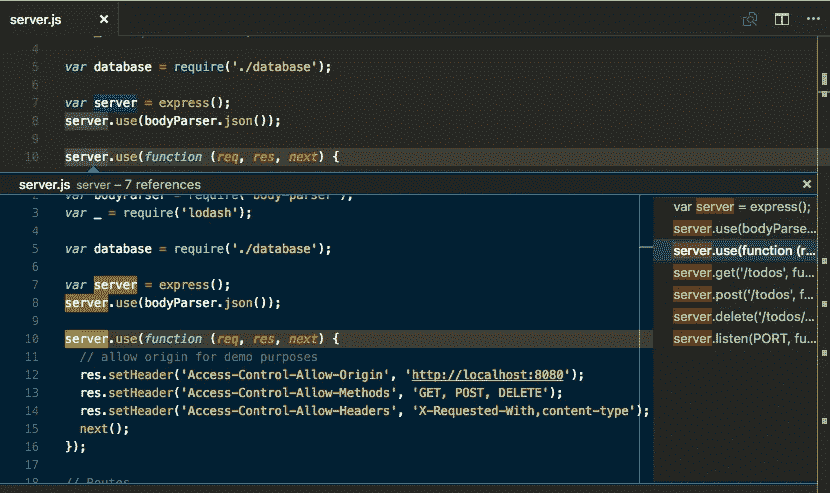

# 学习编码

> 原文：<https://medium.datadriveninvestor.com/learn-to-code-c6ab2e0e8cb9?source=collection_archive---------15----------------------->

“学会编码”是浓缩成三个词的时代精神。这听起来像是自由和满足，更不用说财务安全了。这是一个深受记者、政治家、博客作者、网络迷因创造者喜爱的短语，甚至是你与微软 Office 斗争的祖父母。

人们容易受到这种广泛的社交信息的影响，对命运的变化也很敏感。因此，一个雄心勃勃的年轻人可能会决心学习编码。

然而，甚至不清楚*是什么意思*。即使你不是艺术家，你也看过画，研究过画布上的笔触。你可以想象，如果只是模糊的话，绘画中会涉及到什么样的技巧或决定。即使是技术学科也是如此。虽然我不懂航空航天工程的本质，但我能理解一些基本概念，如“重量”、“升力”、“绝缘”等。

编码不一样。计算机的存在是为了创造和处理抽象概念；他们是天生的 T2，甚至对程序员来说也是如此。我们只知道底部全是 0 和 1。但是，我们如何从二进制(0-1，不-是，关-开)发展到类似亚马逊的东西——数百万页上的文本和图像，即时通信，一个远比任何个人都无法理解的复杂的全球物流组织机构。这似乎是一种炼金术。

编程“语言”是一个自然的隐喻。文字与所代表的感情或意图有着本质的不同，所以它们不可避免地会扭曲它们所代表的东西——但这是为交流付出的小小代价。编程语言正是依靠这样一种方便的变形，在机器的精确性和人类的可理解性之间达成妥协。没有这层抽象，即使是最优秀的程序员也只能写出最简单的程序。

进一步扩展这个比喻:如果你想理解人类，学习许多不同的语言是明智的。在学习他们不同的结构和这些结构使生活方式成为可能的过程中，你会理解我们物种能力的全部范围。

如果你想理解计算机，你应该尝试几个不同的编程语言家族——*范例*。如果你成为一名专业开发人员，你可能会用一种语言完成大部分工作。除非你看到你选择的语言在编程的全球背景中的位置，否则你的理解将被限制在一个孤岛上；你将不得不相信——在任何有意义的意义上——你实际上在做什么，即使有人付钱让你这么做。

我学习的第一门编程语言是 C 语言，同时学习了大卫·马兰著名的 CS50。当时我是东京的一名英语教师，刚到这座城市，当我周末和晚上在我的小公寓里搜寻丢失的分号时(如果我知道什么是 [linter](https://en.wikipedia.org/wiki/Lint_(software)) 就好了)，几乎没有什么能让我从我第一次投身编程的高潮和低谷中分心。

对于初学者来说，c 语言在某些方面是一种奇怪的语言；与大多数现代语言相比，它的句法规则非常严格。c 语言还遵循一种命令式编程范式——也就是说，你不仅要告诉计算机做什么，还要告诉它如何做。这使得几乎任何程序都更难编写，但也允许更好的控制和效率。

例如，C 允许手动管理内存。所有的编程语言都允许你存储文本和数字，但是 C 可以存储“指针”，一种与计算机内存中的物理位置相对应的数据——另一段数据可能驻留的“地址”。一个 C 程序员不仅需要考虑程序存储什么数字和字母，还要考虑这些数据在计算机中的位置。c 语言的“感觉”是直接的、精确的、物质的，总是接近它的硬件。

我回到了美国，致力于编程，并在全职学习。在短暂地浏览了 Zed Shaw 的(死记硬背，毫无创意，需要避免)*之后，我决定学习 [*计算机程序的结构和解释*](https://mitpress.mit.edu/sites/default/files/sicp/index.html) ，并随之学习 Scheme 语言。*

Scheme 摆脱了命令式编程的束缚(无可否认的美丽/强大)。它有一个优雅的，简单的语法，标点符号只有括号，有时嵌套 5 或 10 深。Scheme 程序是一种“函数式”范式的语言，是独立的、模块化的。您只需要从最基本的操作开始，如加法和减法，以及简单的数据结构，如对和列表。然后定义由这些基本构件组成的过程，每个过程都有一个简单的目标。最终，随着你的基础的增长，你开始把越来越复杂的程序放在你已经建立的简单程序之外。令人难忘的是，在《SICP》的第一章中，你编写了一个函数，它可以找到所有的方法来兑换一定数量的钱。

这些问题很有挑战性，但非常有趣，就像解决多维数独难题一样。如果我能在一天内完成五道题，我会感觉很好。目前 Scheme 中做的工作不多(虽然我听说它有一些机器学习应用)，但它鼓励的思维模式是不可或缺的。另外，我听说过开发人员在技术面试中被问到变更计数的问题。

Scheme 给人的感觉与 C 语言完全不同，它是轻盈、轻盈、抽象和数学化的。根据我的经验，这是最有趣的编程语言。

但后来我决定去一个编程训练营，所以我暂停了我的 Scheme 学习，开始学习 Javascript——一种更实用的语言，为了最终就业的实用目的。甚至它的名字也是从另一种语言(Java)中“借用”来的，以引起人们对它本身的注意。

Javascript 是一种方便但不优雅的大杂烩，可以做任何事情——也就是众所周知的多参数语言。它有很多 Scheme 和 C 所缺乏的内置功能；基本的搜索和排序算法值得学习一次，但不必永远打字。它还有一个宽松、宽容的语法。分号是可选的，即使 C 给了我分号斯德哥尔摩综合症。

Javascript 是一门很好的语言，一旦你努力体会到它的便利，并对其中的工作有所了解，你就可以学习它；为了它构建事物的能力，它抽象掉了许多细微差别。Javascript 本身只是故事的一半。结合专门构建的库的生态系统、用于构建网页的便利框架、用于管理和简化服务器的技术等等，Javascript 是 web 的灵活主干。

如果 Scheme 和 C 培养了粒度理解，Javascript 将简化、信任甚至无知武器化。有时你需要学习单个代码是如何工作的，有时你需要把它们放在一起构建一些东西。作为一名软件开发人员意味着要适应一定程度的环境无知——但重要的是要明白，事实上在引擎盖下有一些东西是无知的，其他人曾经不得不努力思考。事实上，所有这些抽象层都一直延伸到二进制、零和一。原则上，它们都是可以理解的。但是如果你要建立更多的抽象层，你可能没有太多的时间来赶上。