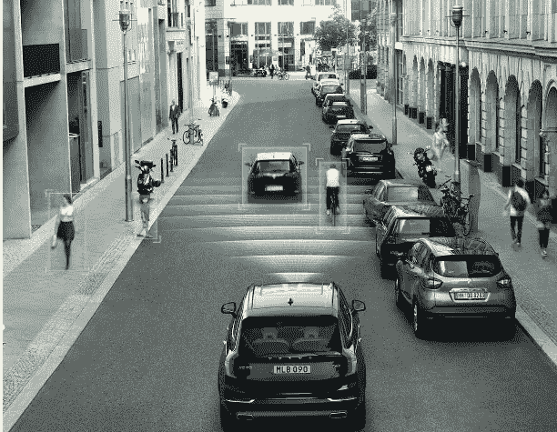
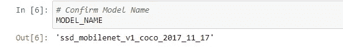

# 利用 tensorflow 和 COCO 数据集模型进行实时对象检测，从城市交通测试中吸取经验教训

> 原文：<https://medium.datadriveninvestor.com/learned-lessons-with-city-traffic-tests-using-real-time-object-detection-with-tensorflow-and-coco-35525815c455?source=collection_archive---------11----------------------->

Source: [http://www.opticlingua.com/autonomous-car-ai-training/](http://www.opticlingua.com/autonomous-car-ai-training/)

在另一篇[帖子](https://medium.com/datadriveninvestor/my-approach-to-real-time-object-detection-using-tensorflow-608a7260efa7)中描述了我对实时物体检测的开发，我在巴西福塔莱萨的城市交通环境中进行了一些技术测试。我的发展可以在 [Github](https://github.com/MRobalinho/Real_time_object_detection_using_tensorflow/blob/master/README.md) 上找到。

使用的设备和软件:

a)为了进行测试，我在车内使用了一台笔记本电脑和一台摄像机。我的电脑有:

- OS Windows 10，英特尔酷睿 i5；装有 Jupyter 笔记本电脑；TensorFlow 版本 1.8.0。

b) COCO 模型

我在同一天进行了两次测试，检查并记录了以下几点:

1.  当大型物体出现时，系统会注意到公共汽车，而它们只是房子。在这一点上，我认为在算法中没有更好地区分总线的精确性。另一个假设是“教导”模型每一个是什么(或构建什么)。
2.  总的来说，我对检测的效率印象深刻。需要注意的是，帧数要增加一点，因为有些物体没有及时识别出来。为此，我需要一台更好的电脑。我需要更多的内存和处理器。
3.  在实验中，信号量并不总是被检测到，一些交通标志也是如此。在这种情况下，摄像机的位置很重要，因为一些交通灯非常高。我认为，在这种情况下，两个摄像机将是必要的，或者一个允许解决物体相遇的幅度的摄像机。

下面是一些关于测试的视频:

另一个例子:

我将致力于提高软件的准确性，进行测试以提高软件效率。在未来的测试中还需要更好的设备。

