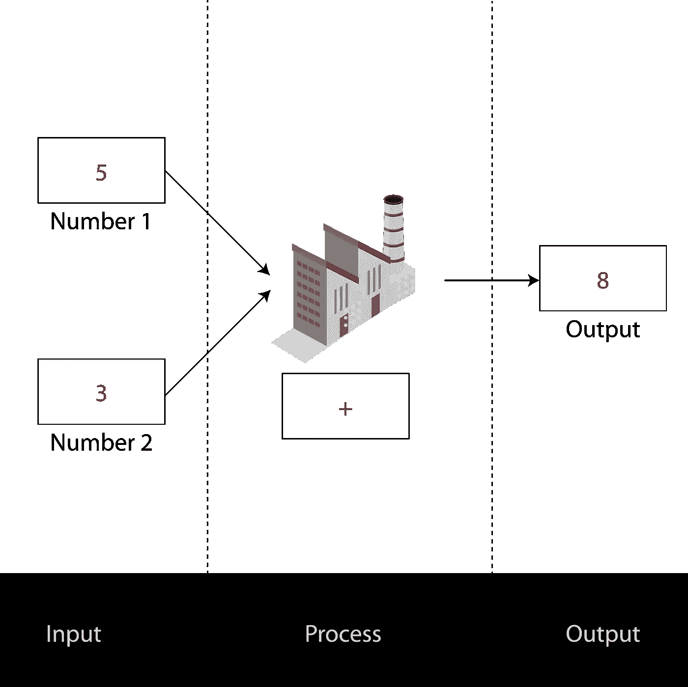
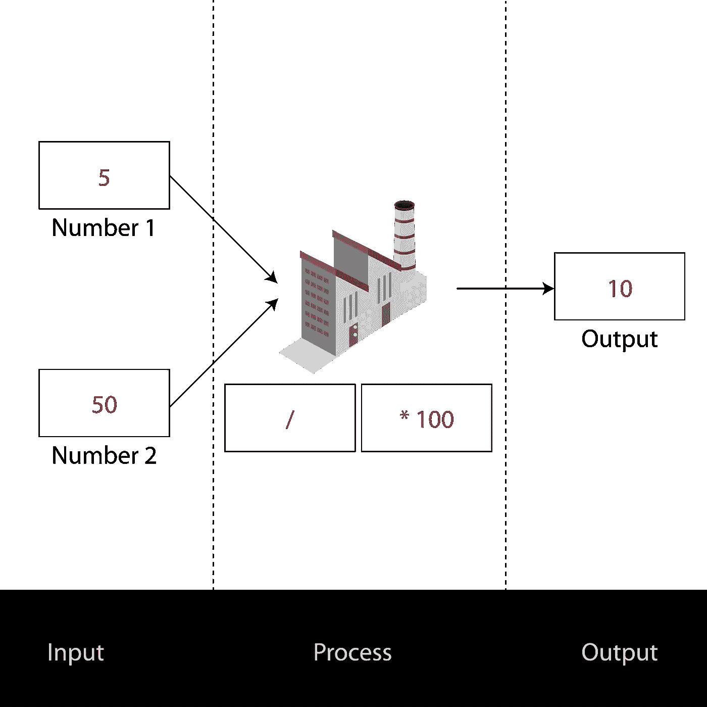
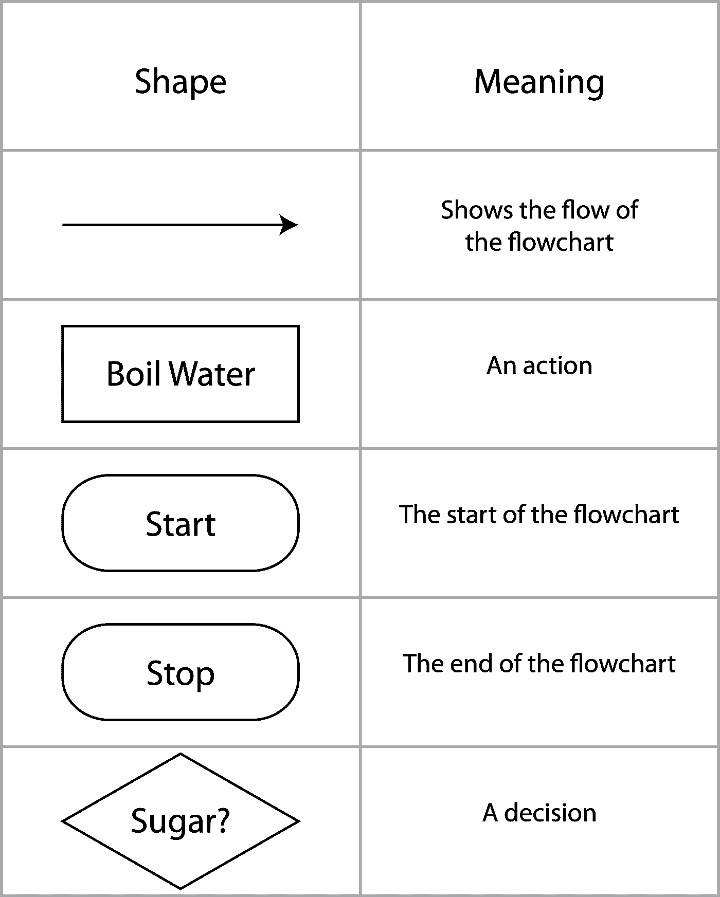
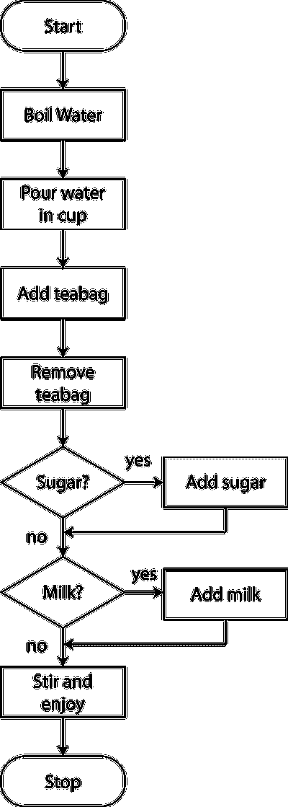
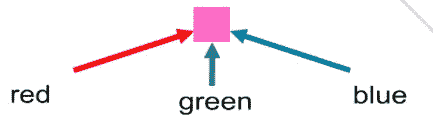

# 计算机编程的学习算法

> 原文：<https://medium.datadriveninvestor.com/learning-algorithms-for-computer-programming-1e4483dcd3fd?source=collection_archive---------8----------------------->

## 它们是什么？如何使用它们？

它们和计算机编程有什么共同点，为什么要用，为什么要关心？

这篇中型文章可以帮助我们了解计算机是如何工作的，对于对计算机编程感兴趣的人来说，这是一个很好的起点。

 [## 算法诱人的商业逻辑|数据驱动的投资者

### 某些机器行为总是让我感到惊讶。我对他们从自己的成就中学习的能力感到惊讶…

www.datadriveninvestor.com](https://www.datadriveninvestor.com/2019/03/22/the-seductive-business-logic-of-algorithms/) 

# 先决条件:

*   了解什么是计算机，以及如何使用它们。

# 术语

抽象:从问题中去除不必要细节的过程。

算法:要遵循的过程或一套规则。

分解:将一个问题分解成一系列子问题的行为，目标是解决最初的问题。

# 算法？

要解决一个问题，你通常需要采取一种系统的、经过深思熟虑的方法。算法是这个系统化过程的一部分。

思考算法的一种方式是接受输入，对其应用一个过程以产生期望的输出。

输入->流程->输出

我们可以把算法想象成执行这三个阶段的**解题机器**。

## 加法机示例

An Adding machine that takes two inputs, adds them and outputs the answer. Here 5 + 3 = 8

这个神奇的加法机将*的两个*数字相加，然后输出结果。很容易想象出执行其他数学运算的其他问题解决机器。

为了成为一个有用的算法，我们通常将这些操作链接在一起。

考虑我们如何计算百分比:

下面的机器算出 5/50 是 10%。

即使使用上面的机器图，事情也不总是清楚的。怎么知道 5 一定要除以 50，而不是 50 除以 5？

一个算法必须**简单易懂，甚至连机器都能做到。**这不是错误；计算机是简单的指令跟随机器，如果你的指令不够清楚，机器就不能跟随它们(至少，不能很好地给出正确的答案！).

有几种方法可以清楚地写出说明，如下所示:

## 伪代码

伪代码是一种编写算法的方式，无需就使用哪种编程语言达成一致。这将算法的本质暴露为一组指令。

*伪代码中的加法器:*

你可能会注意到这里有一些额外的组件。例如，我们需要告诉加法机打印出答案。

## 流程图

流程图是展示算法的一种方式，流程通过指令来开发问题的解决方案。

常用的形状如下所示:

用流程图表示算法的一个经典例子是“泡一杯茶”。使用流程图来表示算法的问题是一个相关的问题:这些动作是否被分解成足够小的块，以便由机器来执行？一个这样的例子如下所示:

## 伪代码还是流程图？

伪代码和流程图是等价的。想象一下查看信息表或条形图。虽然看起来不一样，但其实显示的信息是一样的！伪代码和流程图在算法的世界里是一样的东西。

# 帮助我们解决问题的工具

我们已经看到伪代码和流程图可以帮助我们描述解决问题的算法。为了创建算法，有几种技术可以帮助我们。一种这样的技术是 ***分解。***

## 分解

你如何吃掉一头大象？一次一根象牙。

这个“笑话”触及了分解的核心。要吃一只大动物，把它分成你能吃的小块。要解决一个问题，把问题分解成你能解决的更小的部分。

你可能听说过生物学中的分解，这与有机物质分解成它们的组成部分有相似的含义(树上的枯叶分解成它们的矿物质)。

在计算机科学之外，分解无处不在。如果你想成为一名律师，你需要上大学。要上大学，你需要在学校取得好成绩。为了在学校取得好成绩…我会让你来打破这个想法！

计算机科学的例子经常依赖于简单的数学例子，尽管它们并不一定如此。

1.有趣的例子:

将一次购物之旅分成所有需要完成的任务。

2.简单的数学例子

分解如何用任意两个数计算百分比。用伪代码和流程图解释所有的步骤。

**我们为什么要这么做？**

分解让你的生活轻松多了。一旦你能做拼图的小部分，你会发现把它们拼在一起，得到实际的解决方案就容易多了。

为了补充分解，我们可以使用其他技术，其中之一是 ***抽象。***

## 抽象

然而，我们有时会对问题中给出的额外细节感到困惑。就像地图一样，我们可以用问题的表征来解决问题本身，而不需要那些烦人的细节。或者我们可以驾驶一辆汽车，踩下油门，却不知道汽车是如何工作的。

你知道电脑屏幕的每个像素都是由红、绿、蓝组成的吗？每张图片都被抽象成简单的三种颜色的点！

An abstraction of a pixel on your computer screen

通过从一个问题中剔除细节，我们可以识别出手边的问题。

抽象的一个常见例子是**图**。不必要的细节从世界上被删除，直到我们有一个区域的二维表示。人、地标、天气、建筑和道路的复杂世界以这样一种方式被简化，使你很容易理解你需要走哪条路。

事实证明，抽象可以帮助我们识别类似的问题，所以如果我们解决了一个问题，我们就知道如何解决许多类似的问题。

这方面的一个例子是对动物的研究。在动画中，如果你知道如何画一只奔跑的狗，你就可以很好地画一只奔跑的狼——毕竟，它仍然是一只奔跑的动物。

通过抽象将问题简化，你可以提高解决问题的技能和技巧。

**有问题吗？**

在推特上和我联系！

 [## 史蒂文·柯蒂斯

### 史蒂文·柯蒂斯的最新推文(@stevenpcurtis)。一边学习计算硕士，一边开发 iOS 应用程序…

twitter.com](https://twitter.com/stevenpcurtis)