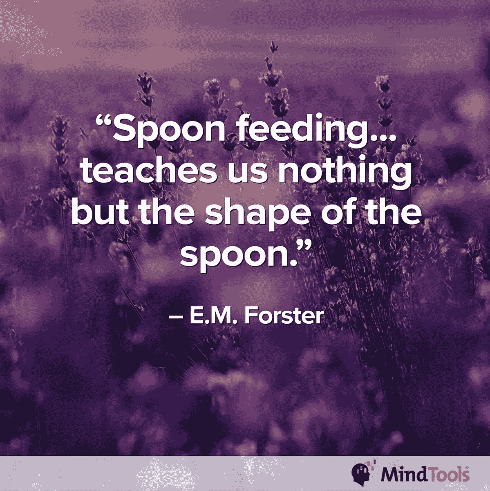
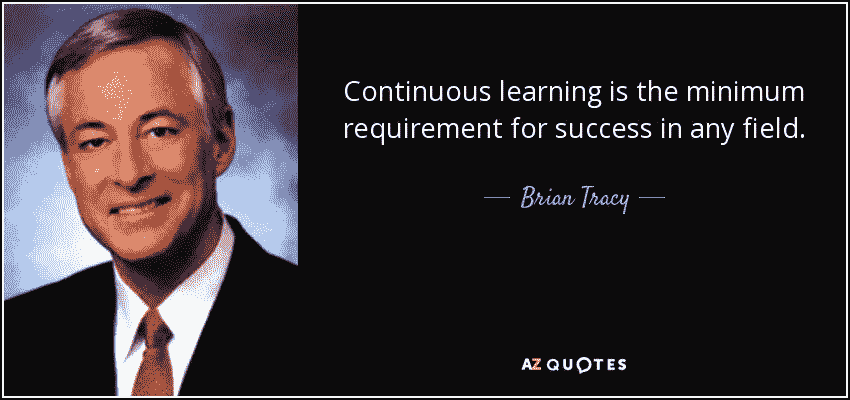
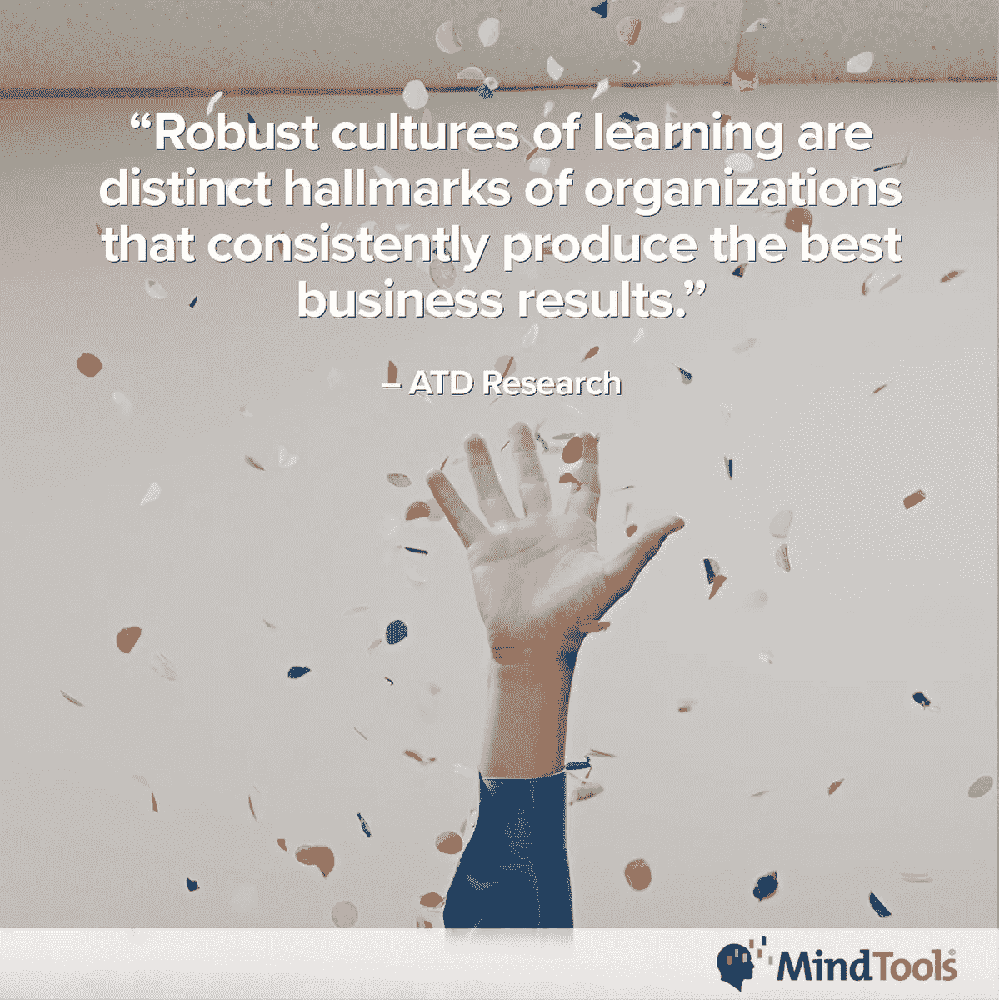
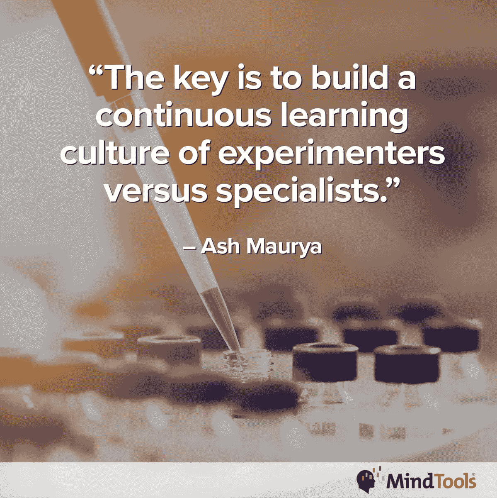
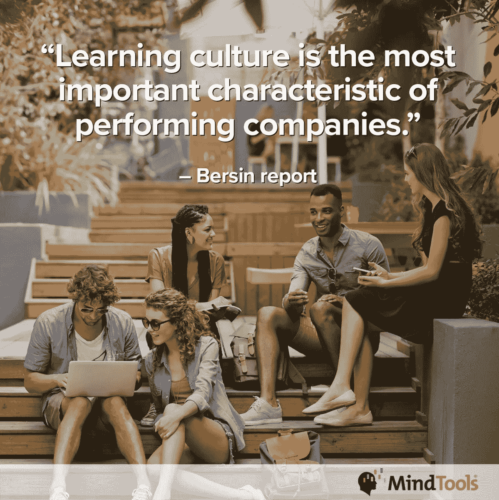
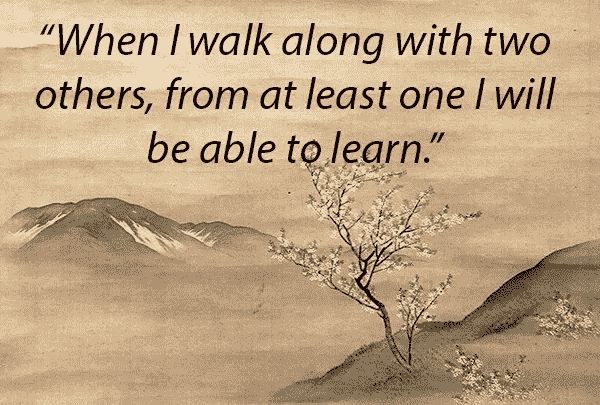
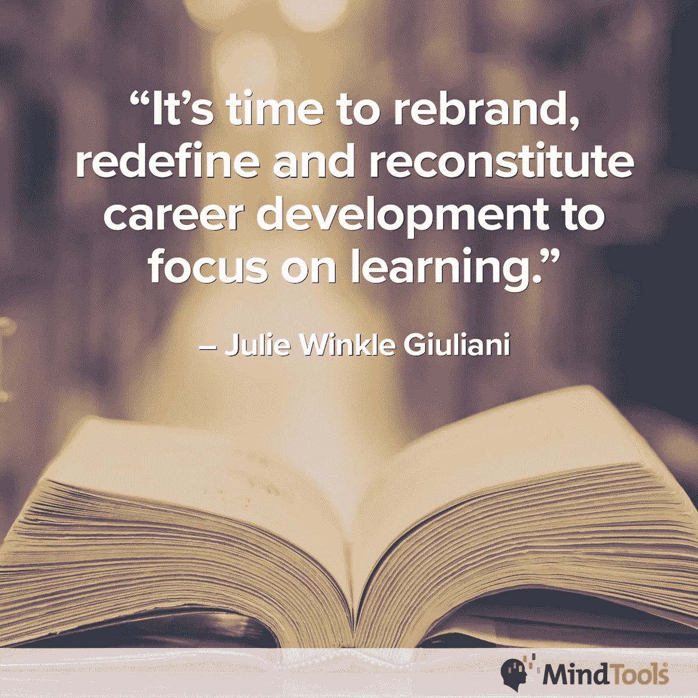
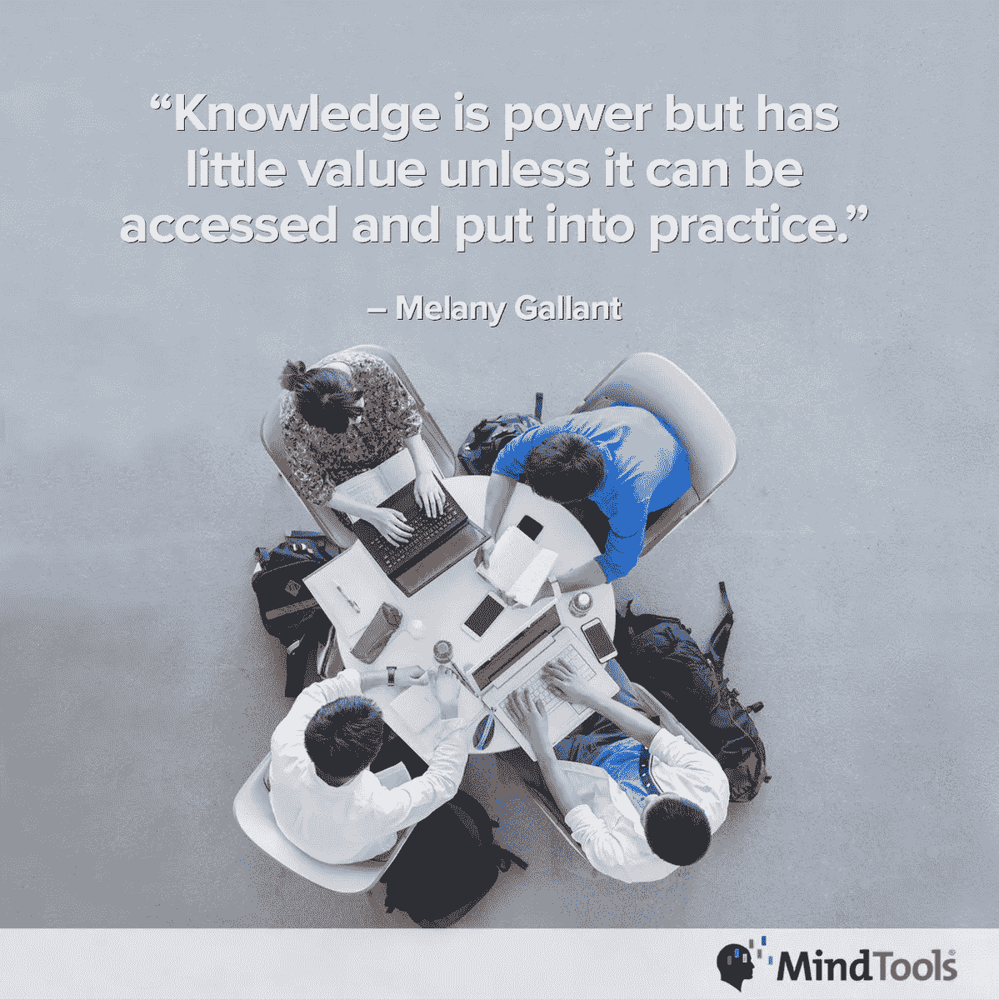

# 学习文化孕育知识，知识就是力量

> 原文：<https://medium.datadriveninvestor.com/learning-culture-breeds-knowledge-and-knowledge-is-power-f37cb146211d?source=collection_archive---------0----------------------->

## 人们需要学习和实验的自由来帮助自己

无论你怎么看，企业文化都比战略更重要。一个公司的环境需要[在没有强迫的情况下成长](https://medium.com/@JKatzaman/in-the-workplace-what-really-matters-6445cf7c44eb)。这源于对学习的渴望。

[社区参与促进者 Michele Doucet](https://twitter.com/MicheleDD_MT) 谈到[向来自](https://www.mindtools.com/blog/corporate/implementing-and-instilling-a-culture-of-learning/) [Mind Tools](https://twitter.com/Mind_Tools) 的团队灌输学习文化，这有助于“传播领导力、管理和个人效率方面的最佳理念”

学习文化是开放的，人们可以超越他们的工作描述，在工作中和工作之外充分利用自己。

 [## 知情人需要知道更多

### 继续教育对你事业的成功至关重要

medium.com](https://medium.com/datadriveninvestor/those-in-the-know-need-to-know-more-829d8ab77031) 

“的确，让人们成长和学习，”杜塞说。“提供土壤、养分和阳光，人们就会兴旺发达。

“学习是这个组织的核心价值观，”她说。“它被有意地融入到流程、实践和工作职责中。我们鼓励、支持学习，并让所有人都能轻松地学习。”

心智工具网站呼吁“建立一种鼓励人们学习和尝试而不是被填鸭式教育的文化。

“学习文化是一种文化，在这种文化中，组织的价值观、信念、过程和实践鼓励各个层面的学习，”Mind Tools 指出。

在学习文化中，当人们采取主动时，他们不那么难伺候，更有动力去成功。

“这是真的，”杜塞说。"当人们主动学习时，牵手就少了."

她解释了增长如何促进成功。

“个人在不断学习和成长，”杜塞说。“让他们成功。他们将不断提高自己的能力，然后变得更加自信和投入。

“对于组织来说，目标是提高生产力、高度参与的劳动力、增加创新和创造性解决问题，”她说。"面对竞争威胁和经济变化，好的组织是敏捷的."

# 提前学习和发展

记住关注最重要的事情。

“优先考虑员工持续学习和发展的组织更有可能取得成功——无论是在业务绩效还是人才招聘市场方面，”Mind Tools 指出。

“在学习文化中工作的个人更有可能保持和增加他们的竞争优势，”该网站称。“他们成了抢手的人才。”

一种学习文化取决于其领导者创造的氛围。那些更关注底线的人可能对从学习中获得的软技能不太开放。

“高管和经理们对人们如何学习缺乏理解，”Doucet 说。“许多人将学习视为培训——或者更糟——是一种成本，而不是对组织成功的投资。

“员工只把学习视为一门课程或一次会议，”她说。“通常存在一种权利文化——这是我应得的。员工没有自己的责任，我要对自己的成长和职业负责。”

 [## 帮助他人，创造最好的自己

### 导师在那里指导和灌输责任感

medium.com](https://medium.com/datadriveninvestor/help-others-and-create-your-best-self-e1d994549308) 

如果不重视，学习就不太可能扎根。

“如果学习被视为可有可无或‘值得拥有’的东西，那就很难创造一种学习文化，”Mind Tools 指出。“如果领导者不认同学习文化，就很难让员工相信学习是必不可少的。

“你不能强迫别人学习，”该网站称。“除非‘学生’有动力，否则他们不太可能学会。了解一个[激励人们学习](https://www.mindtools.com/pages/article/engaging-people-learning.htm?utm_source=social&utm_medium=organic&utm_campaign=tweetchat)的技巧很有帮助

# 所有人的承诺

每个人都有责任创造一种学习文化。领导者激发了这种文化，但如果没有员工的认同和承诺，他们将一事无成。

“如果员工不为他们的学习负责，或者选择不学习，经理或公司都无能为力，”Doucet 说。

 [## 良好的一致性将你的价值观放在首位

### 核心价值观需要与员工相关并反映员工

medium.com](https://medium.com/datadriveninvestor/good-alignment-puts-your-values-top-of-mind-88bab188f6d8) 

不仅自上而下，学习的欲望必须贯穿始终。

“所有人——高管、经理和员工，”杜塞说。“优秀的高管接受学习，并通过提供资源(系统和预算)来支持学习，并将学习作为战略的一部分。

她说:“经理们通过关注员工整个生命周期中的领导力和发展来促进和支持学习过程。”"员工对自己的成长和职业负责。"

根据 Mind Tools，领导和管理必须为创造学习文化定下基调。

“虽然管理层在一个组织中设定了‘学习基调’，但每个人都有责任帮助创造和维持一种学习文化，”该网站称。

当领导者以身作则时，文化的推动力来自高层。

“高管发挥着至关重要的作用，”杜塞说。“学习是商业战略的一部分。他们塑造学习文化，并让管理者对团队的发展负责。

“高管们把领导力和发展视为对人的投资，而不是成本，”她说。"在经济困难时期，高管们保护学习预算和计划，而不是削减它们."

心智工具指向领导者的激励角色。

“他们充当学习催化剂，激励员工，并通过‘领导当老师，项目’分享他们的知识和专长，”该网站称。“领导者还可以在治理和咨询委员会任职，为领导和发展职能提供指导。

“领导者还帮助形成直接影响组织底线的学习方法，”Mind Tools 指出。

网站上有一篇文章，解释了作为教师的领导者如何提供优秀的例子用于基于案例研究的学习。

# 时间问题

那些说自己没有时间或专业知识来指导团队成员的忙碌经理可以委派教练。人是公司最重要的资源。没有时间给员工意味着没有时间来提高生产力和取得成功。

“这是关于建立正确的优先级，不是吗？”杜塞说。“我们说人是我们最大的资产。让我们言出必行。”

 [## 商务攀登者拥抱他们的夏尔巴人

### 教练让人们和团队更上一层楼

medium.com](https://medium.com/datadriveninvestor/business-climbers-hug-their-sherpas-ab2f431041e) 

她补充道，如果没有时间，那就挤出时间。

“指导员工是管理者的主要职责，也是企业成功的重中之重，”Doucet 说。“如果他们不愿意腾出时间，他们需要决定管理职位是属于他们的*还是*，他们的老板需要为他们做出决定。

“不知道怎么教练？学，”她说。“为技能差距承担责任。将学习如何指导作为发展目标。建立一个计划。使用 70–20–10——学习和发展的[模式](https://trainingindustry.com/wiki/the-702010-model-for-learning-and-development/)。伟大的教练往往不会从一门课程中学到东西；他们会发现优秀的人，并向他们学习。”

不要把教练当成“我工作描述的一部分”

“指导不是额外的或者‘超出’你的日常功能，”Mind Tools 说。“这是你最重要的职能之一。

“如果领导者不知道怎么做，这可能意味着他们没有受到训练，”该网站指出。“鼓励他们学习，尝试和提问。引导他们使用在线资源，并对他们进行指导。”

主动学习的人——无论是在课堂上还是在网上——都是有利的。如果结果证明了这一点，无论哪种方式都是好的。

“主动性是其中很大的一部分，也是选择的一部分，”Doucet 说。“那些将学习作为日常工作不可或缺的一部分的人将会保持与时俱进，并预测他们将需要的新技能。”

她喜欢从各种渠道学习。

“我很喜欢自我导向和非正式的学习，”杜塞说。“拿了就走——来自可信网站的文章、YouTube 视频和博客。我也利用我的同事和专业网络。如果有人真的擅长某件事，我会请他们和我一起工作。

“为了我的团队？了解他们的学习风格，”她说。“他们如何学习取决于他们的经历。帮助扩展他们学习采用新方法的方式。使用 70–20–10 创建发展计划。为建立和执行他们的计划提供指导和支持。”

Mind Tools 描述了学习和发展方法。70-20-10 模式平衡了不同的工作场所学习方式:

*   70%来自经验——日常任务、挑战和实践。
*   20%通过接触—面对面或在线的社会学习。
*   10%通过教育——正式学习，包括课程。

“学会问‘谁想学什么，为什么学，什么时候学？’“思维工具声明。”然后选择能够最有效地交付[最合适的学习材料](https://www.mindtools.com/blog/corporate/globalized-learning/?utm_source=social&utm_medium=organic&utm_campaign=tweetchat)的平台和基础设施。

该网站称:“现在，只要能接入互联网，哪里就能进行虚拟学习，组织也越来越多地利用虚拟学习。”。"什么时候[适合你](https://www.mindtools.com/pages/article/online-training.htm?utm_source=social&utm_medium=organic&utm_campaign=tweetchat)？"

# 习惯课

学习必须成为一种习惯。一开始这可能是一个要求，但是结果——晋升、更大的责任、加薪——应该说明问题，并以此为基础。

“我们能拥有的最大技能之一就是学会如何学习，”杜塞说。"一旦成为我们做事的方式，它将终身受益."

 [## 发现你的力量揭示了一个惊人的新世界

### 将多动转化为高度聚焦

medium.com](https://medium.com/an-idea/discovering-your-strength-reveals-an-amazing-new-world-885c53aa9077) 

她提出了促进学习的方法。

“创建工作辅助工具；分步指南；学习微字节或视频；精选内容库；以及支持知识、参考资料和学习资源的链接。“这些都是在需要时提供学习机会的方法。抓起就走。

“将学习融入所有关键人员流程:招聘、定向、入职、绩效管理、发展等等，”她说。"确定流程中每个员工接触点的学习机会."

Doucet 说，公司应该创造访问人力资源的途径:社交网络、聊天小组、维基和实践社区。

“对你自己的学习负责，”思维工具说。“向更有经验的同事寻求反馈或建议。通过观察更有经验的同事或从业者来学习。

该网站称，“使用相关的在线学习材料或资源”。“还要利用社交学习平台，关注你可以学习的人、企业或行业新闻。”

投资技术，获得最好的学习硬件和软件。学习因障碍而死亡。让学习成为一种激情，而不是一件苦差事。

“这是这里的金矿，”杜塞说。“学习应该是愉快的。技术可以激发这种激情。

“利用你所掌握的所有技术，”她说。“SharePoint、wikis、YouTube、在线学习、网络研讨会、聊天组、[大规模开放式在线课程](https://en.wikipedia.org/wiki/Massive_open_online_course)并提供对用户定义的在线内容的访问。”

 [## 工人和技术就不能做朋友吗？

### 人员和技术的差距是一个棘手且昂贵的问题

medium.com](https://medium.com/datadriveninvestor/cant-workers-and-tech-just-be-friends-3d1f7175a039) 

学习也不必局限于工作时间。

“技术可以帮助你有效地进行学习，”Mind Tools 说。“您可以通过各种设备全天候在线访问学习材料。

该网站称，“拥抱移动学习”。“随着新的学习方式的出现，以及年轻一代开始主导工作场所，移动设备将成为一种无价的学习工具。”

头脑工具有一篇关于角色扮演的文章。

# 现实生活中的例子

因为混合学习和知识共享的应用似乎是无限的，该网站也有[的真实例子](https://www.mindtools.com/blog/corporate/technologys-knowledge-sharing-value/?utm_source=social&utm_medium=organic&utm_campaign=tweetchat)可供学习。

为了创造一种学习文化，问问你的员工他们需要什么，想要什么来获得成功。征求如何做到这一点的建议。你必须提出问题才能知道答案。

“通过发现，人们学习，”杜塞说。“学习如何提出好的问题有助于深度学习。”

她说，这些步骤对于创造学习文化至关重要:

*   为学习建立商业案例。将学习与战略目标的实现联系起来。高管需要看到投资的价值，以及它将如何推动组织的成功。
*   识别关键业务流程。寻找与员工接触的地方。在这些点上有机会提供学习吗？
*   利用你所拥有的任何技术来实现工作中的学习。在员工需要时提供内容。

“把所有的学习和发展活动变成积极的、无压力的经历——比如，用幽默来减轻压力，”Mind Tools 说。“打消那些认为学习和发展是为那些因表现不佳而受到惩罚的人准备的想法。

网站上说，“抵制完美主义的影响”。“这些可能来自组织高层中的‘理想’工作者，他们敦促你设定不切实际的学习和发展目标。强调结果才是最重要的，而不是花在学习上的努力或时间。”

Mind Tools 还提供了利用企业学习解决方案的方法。

**关于作者**

吉姆·卡扎曼是[拉戈金融服务公司](http://largofinancialservices.com)的经理，曾在空军和联邦政府的公共事务部门工作。你可以在[推特](https://twitter.com/JKatzaman)、[脸书](https://www.facebook.com/jim.katzaman)和 [LinkedIn](https://www.linkedin.com/in/jim-katzaman-33641b21/) 上和他联系。