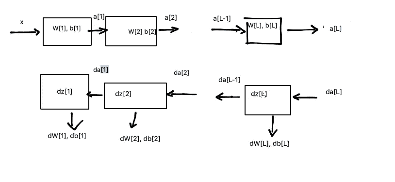

# 深度神经网络的学习流程

> 原文：<https://medium.datadriveninvestor.com/learning-flow-of-deep-neural-network-19f76f855d54?source=collection_archive---------23----------------------->

由于一些原因，例如向量化、前向和后向传播逻辑等，深度神经网络编程可能会使初学者感到困惑..而且大部分计算都是基于矩阵的，比如 np.dot 如果用 Python numpy 的话。因此，有一个可视化的图表来显示计算流程是很有帮助的。下图很好地展示了这些信息。

在 blow 图中，每个方形块表示神经网络模型中的一层。在代表正向传播的上面一行中，块 I 的输入是 a[i-1]。该模块的输出是一个[i]。并且对于 z[i]的每个块有兑现值。在每个块中，W[i]和 b[i]代表权重和偏差。正向计算从块 1 开始，以块 L 结束，其中 L 是层数。在代表反向传播的下一行中，输入是 da[i]。输出为 da[i-1]，dW[i]和 db[i]。反向计算从块 1 开始，在块 1 结束。在向前和向后传播之后，您会得到一个 dW[i]和 db[i]的列表。

下面是实现此逻辑的示例代码:

> ——一次迭代—
> 
> a = []
> 
> a[0] = x

Z = []

> #正向传播
> 
> 对于范围(1，L)中的 I:

z[i] = np.dot(W[i]，a[a-1]) + b[i]

a[i] = g[i](z[i])

#反向传播

对于范围(1，L)中的 I:

dW[i] = …

db[i] = …

#更新参数

——一次迭代的结束——

