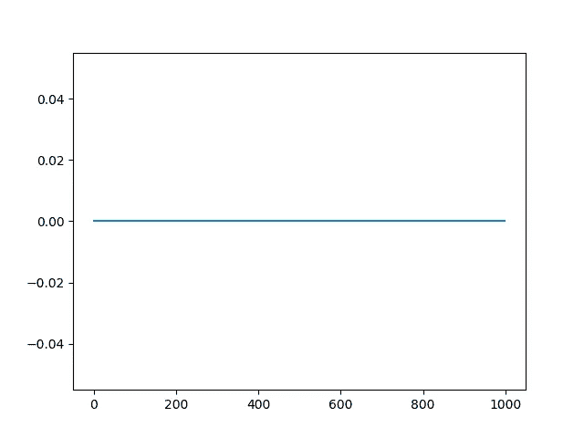
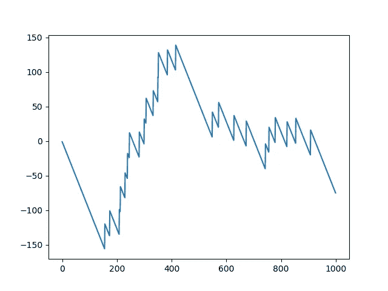

# 学习机器学习:带蒙特卡罗策略的轮盘赌

> 原文：<https://medium.datadriveninvestor.com/learning-machine-learning-roulette-with-monte-carlo-policy-db1b3b788230?source=collection_archive---------6----------------------->

[](http://www.track.datadriveninvestor.com/1B9E)

大约每周我都会用一个新的深度学习或机器学习问题来鞭策自己。我已经连续 124 天每天编写 ML 代码了。本周的挑战是实践我在 Move 37 中学到的东西，这是 Siraj Raval 免费提供的深度强化学习课程。我们已经介绍了蒙特卡罗方法，并看到了一个使用 OpenAI gym 的 21 点环境的例子。所以让我们直接进入正题，用蒙特卡罗技术编码轮盘赌。

Imports、gym 用于轮盘赌、numpy 用于数学、matplotlib 用于绘制结果。打造我们的 21 点环境。设置ε为 5%的时候选择一个随机动作。将 Gamma 设置为 1，我们将不会考虑未来可能的奖励，因为轮盘赌中没有任何保证。根据 OpenAI gym roulette 文档，将其他所有内容初始化为 0 或空，并调整大小。

```
import gym
import numpy as np
import matplotlib.pyplot as pltenv = gym.make('Roulette-v0')
EPS = 0.05
GAMMA = 1.0Q = {}
agentSumSpace = [i for i in range(0,37)]
actionSpace = [i for i in range(0, 38)]stateSpace = []
returns = {}
pairsVisited = {}
for total in agentSumSpace:
    for action in actionSpace:
        Q[(total, action)] = 0
        returns[(total, action)] = 0
        pairsVisited[(total, action)] = 0
    stateSpace.append(total)
```

随机初始化我们的策略。

```
policy = {}
    for state in stateSpace:
        policy[state] = np.random.choice(actionSpace)
```

一百万集的训练应该足以训练出一个好的政策。初始化一些变量来使用每集。每十万集检查一次我们的进度。重置环境。

```
numEpisodes = 1000000
    for i in range(numEpisodes):
        statesActionsReturns = []
        memory = []
        if i % 100000 == 0:
            print('starting episode', i)
        observation = env.reset()
        done = False
```

在游戏结束之前，根据我们的蒙特卡洛策略采取行动，并记录结果。行动可能是下注或从牌桌上站起来。

```
while not done:
    action = policy[observation]
    observation_, reward, done, info = env.step(action)
    memory.append((observation, action, reward))
    observation = observation_
memory.append((observation, action, reward))
```

回顾记忆，根据之前的状态/动作对记录奖励。

```
G = 0
    last = True
    for observed, action, reward in reversed(memory):
        if last:
            last = False
        else:
            statesActionsReturns.append((observed, action, G))
        G = GAMMA*G + reward
statesActionsReturns.reverse()
statesActionsVisited = []
```

下一部分是蒙特卡洛决策过程发生的地方。这看起来有点吓人，但我会试着解释。我们正在检查每一个状态/动作对，以及在那个状态下采取那个动作的回报。如果一个状态/动作对之前没有被访问过，我们将比较来自该状态的其他动作的回报，以确定该状态的最佳动作。在平局的情况下，我们选择随机行动。一开始，它更有可能采取新的行动，但随着时间的推移，ε将会减小，我们将只采取已知的最佳行动。

```
for observed, action, G in statesActionsReturns:
    sa = (observed, action)
    if sa not in statesActionsVisited:
        pairsVisited[sa] += 1
        returns[(sa)] += (1 / pairsVisited[(sa)])*(G-returns[(sa)])
        Q[sa] = returns[sa]
        rand = np.random.random()
        if rand < 1 - EPS:
            state = observed
            values = np.array([Q[(state, a)] for a in actionSpace ])
            best=np.random.choice(np.where(values==values.max())[0])
            policy[state] = actionSpace[best]
        else:
            policy[state] = np.random.choice(actionSpace)
        statesActionsVisited.append(sa)
if EPS - 1e-7 > 0:
    EPS -= 1e-7
else:
    EPS = 0
```

测试我们训练有素的蒙特卡洛政策。

```
numEpisodes = 1000
    rewards = np.zeros(numEpisodes)
    totalReward = 0
    wins = 0
    losses = 0
    print('getting ready to test policy')   
    for i in range(numEpisodes):
        observation = env.reset()
        done = False
        while not done:
            action = policy[observation]
            observation_, reward, done, info = env.step(action)
            observation = observation_
        totalReward += reward
        rewards[i] = totalReward
if reward >= 1:
            wins += 1
        elif reward == -1:
            losses += 1
```

打印结果。

```
wins /= numEpisodes
losses /= numEpisodes
print('win rate', wins, 'loss rate', losses)
plt.plot(rewards)
plt.show()
```



结果很明显，零胜零负。赢得轮盘赌的最好方法就是根本不玩。厚颜无耻的蒙特卡洛政策决定离开桌子每场比赛。这是正确的。庄家总是赢，这是一场输的游戏。只是为了好玩，让我们看看如果我们通过改变一行代码来强制执行蒙特卡洛策略会发生什么。

```
actionSpace = [i for i in range(0, 38)]
```

取消从桌子上站起来的选项。

```
actionSpace = [i for i in range(0, 37)]
```

现在让我们看看会发生什么。



赢的几率是 2.5%，输的几率是 97.5%。第一轮显然是有所发现的。这个星期我学会了不玩轮盘赌，但更重要的是，我学会了如何使用蒙特卡罗策略来解决未知变量的问题。

感谢 Siraj Rival 提供免费的深度 RL 课程，感谢 youtube 和 Phil 的机器学习帮助我了解 OpenAI 健身房的蒙特卡洛政策。

[](https://www.youtube.com/channel/UCWN3xxRkmTPmbKwht9FuE5A) [## 西拉伊·拉瓦尔

### 我是西拉杰。我正在为激励和教育开发人员构建人工智能而奋斗。游戏、音乐、聊天机器人…

www.youtube.com](https://www.youtube.com/channel/UCWN3xxRkmTPmbKwht9FuE5A) [](https://www.youtube.com/channel/UC58v9cLitc8VaCjrcKyAbrw/featured) [## 菲尔的机器学习

### 你好。在菲尔的机器学习中，我们比我们的机器人统治者领先一步。敬请关注机器上的教程…

www.youtube.com](https://www.youtube.com/channel/UC58v9cLitc8VaCjrcKyAbrw/featured)