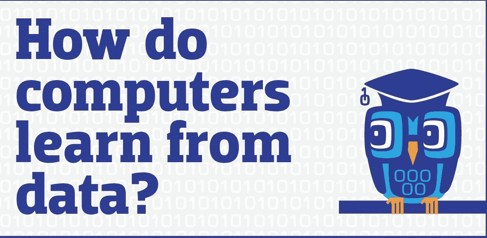

# 机器学习中的学习范式

> 原文：<https://medium.datadriveninvestor.com/learning-paradigms-in-machine-learning-146ebf8b5943?source=collection_archive---------0----------------------->

## 计算机如何从数据中学习？？

**学习范式**基本上陈述了某样东西或某人学习的特定模式。在这个博客中，我们将讨论与机器学习相关的学习范式，即当给定一些数据时，机器如何学习，它对一些特定数据的处理模式。

有三种基本类型的学习范例与机器学习广泛相关，即

1.  **监督学习**
2.  **无监督学习**
3.  **强化学习**

我们将简要讨论所有这些问题。

# 监督学习

*监督学习是一种机器学习任务，其中一个函数使用提供的输入-输出对将输入映射到输出数据。*

上面的陈述表明，在这种类型的学习中，你需要把输入和输出(通常以标签的形式)都给计算机，让它从中学习。计算机所做的是基于这些数据生成一个函数，可以是任何像简单的直线，也可以是复杂的凸函数，这取决于所提供的数据。

这是最基本的学习范式，我们今天学习的大多数算法都是基于这种类型的学习模式。其中的一些例子是:

1.  ****(简单的直线函数！)****

****

1.  **[**逻辑回归**](https://medium.com/coinmonks/introduction-to-machine-learning-studying-about-linear-and-logistic-regression-434fdaf2f709) **(0 或 1 逻辑，表示是或否！)****

****

**我在以前的博客中已经谈到了这两种算法，所以请阅读一下。单击上面的重定向到相同的。**

**这方面的一些实例如下:**

****参考**:[https://www . geeks forgeeks . org/supervised-unsupervised-learning/](https://www.geeksforgeeks.org/supervised-unsupervised-learning/)**

**分类:机器被训练来将某物分类到某一类。**

*   **对患者是否患有疾病进行分类**
*   **对电子邮件是否为垃圾邮件进行分类**

**回归:机器被训练来预测一些值，比如价格、体重或身高。**

*   **预测房价/房地产价格**
*   **预测股票市场价格**

# **无监督学习**

***在这种类型的学习范例中，计算机仅被提供开发学习模式的输入。基本上是从没有结果中学习！！***

****

**这意味着计算机必须识别给定输入中的模式，并相应地开发学习算法。所以我们得出结论**“机器通过观察学习&在数据中寻找结构”**。这仍然是一个非常未开发的机器学习领域，谷歌和微软等大型科技巨头目前正在研究这方面的发展。**

**一些现实生活中的例子是:**

****参考**:[https://www . geeks forgeeks . org/supervised-unsupervised-learning/](https://www.geeksforgeeks.org/supervised-unsupervised-learning/)**

****聚类:**聚类问题是您想要发现数据中的内在分组**

*   **例如根据购买行为对客户进行分组**

**关联:关联规则学习问题是您想要发现描述大部分数据的规则**

*   **比如购买 X 的人也倾向于购买 Y**

# **强化学习**

***强化学习是机器学习的一种，因而也是人工智能的一个分支。它允许机器和软件代理自动确定特定上下文中的理想行为，以最大化其性能。***

****

**Learning pattern in reinforcement learning**

**有一个极好的类比来解释这种类型的学习范式，**“训练一只狗”。****

**这种学习模式就像一个训狗师，教狗如何对特定的信号做出反应，比如口哨、拍手或其他任何东西。每当狗做出正确的反应时，训练员都会给狗一份奖励，可以是“一块骨头，也可以是一块饼干”。**

****以下文字参考**:[https://www.cse.unsw.edu.au/~cs9417ml/RL1/introduction.html](https://www.cse.unsw.edu.au/~cs9417ml/RL1/introduction.html)[http://vmayoral . github . io/robots，/ai，/deep/learning，/rl，/reinforcement/learning/2016/07/06/rl-intro/](http://vmayoral.github.io/robots,/ai,/deep/learning,/rl,/reinforcement/learning/2016/07/06/rl-intro/)**

**使用强化学习可以解决各种不同的问题。因为 RL 代理可以在没有专家监督的情况下学习，所以最适合 RL 的问题类型是复杂的问题，其中似乎没有明显或容易编程的解决方案。其中两个主要的是:**

*****玩游戏****——*在一场游戏中确定最佳走法通常取决于许多不同的因素，因此在一场特定的游戏中可能存在的状态的数量通常非常大。**

*****控制问题****——*如电梯调度。同样，什么样的策略能提供最好、最及时的电梯服务并不明显。对于像这样的控制问题，RL 代理可以在模拟环境中学习，最终他们会提出好的控制策略。**

**这就是这篇博客的内容。喜欢的内容，如果是的话，请给吨的掌声！**

**请关注我，以一种非常易懂的方式获取更多有用的信息！**