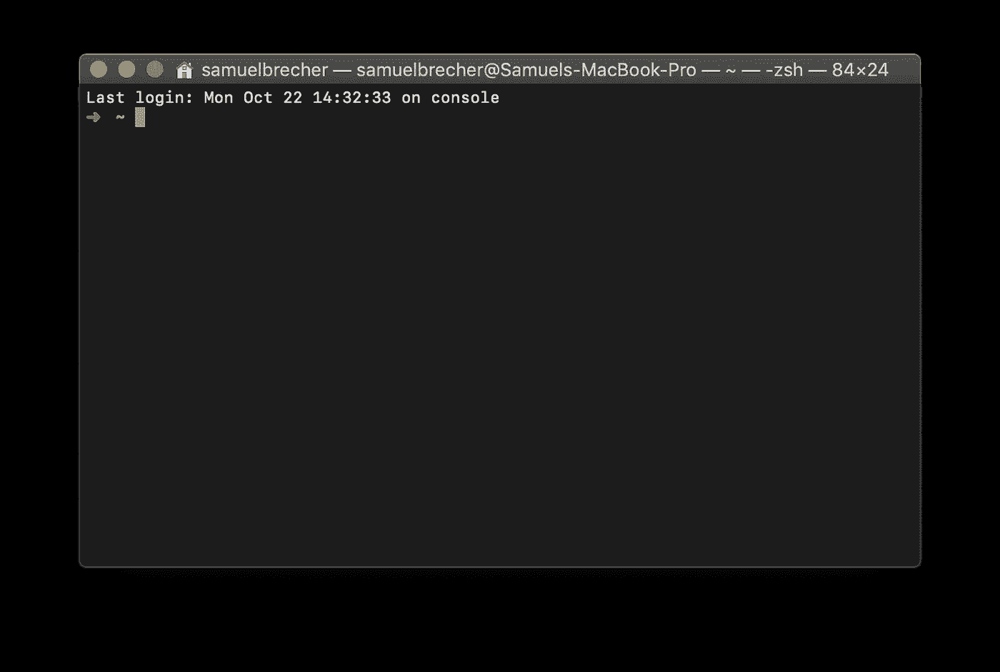
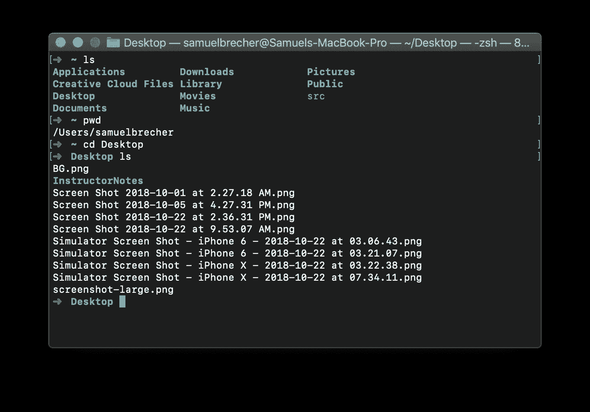
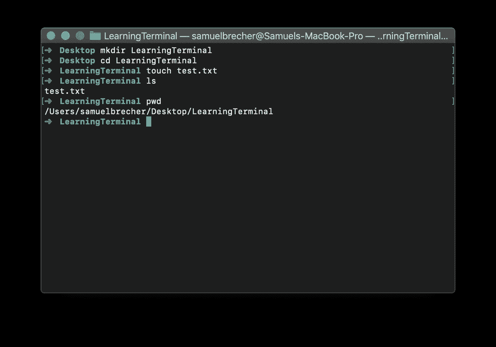
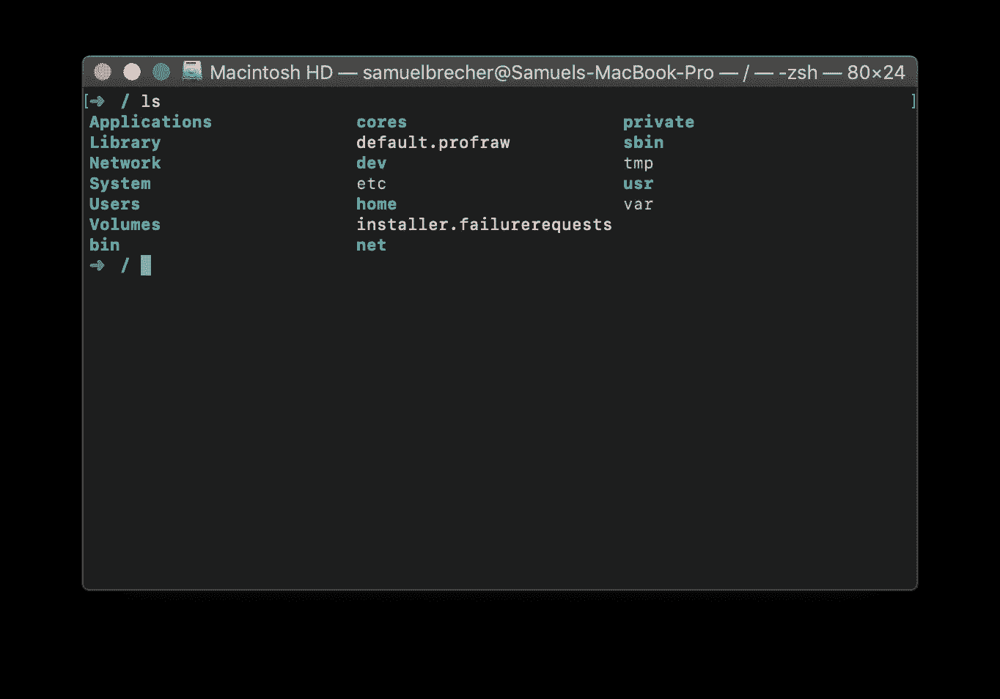
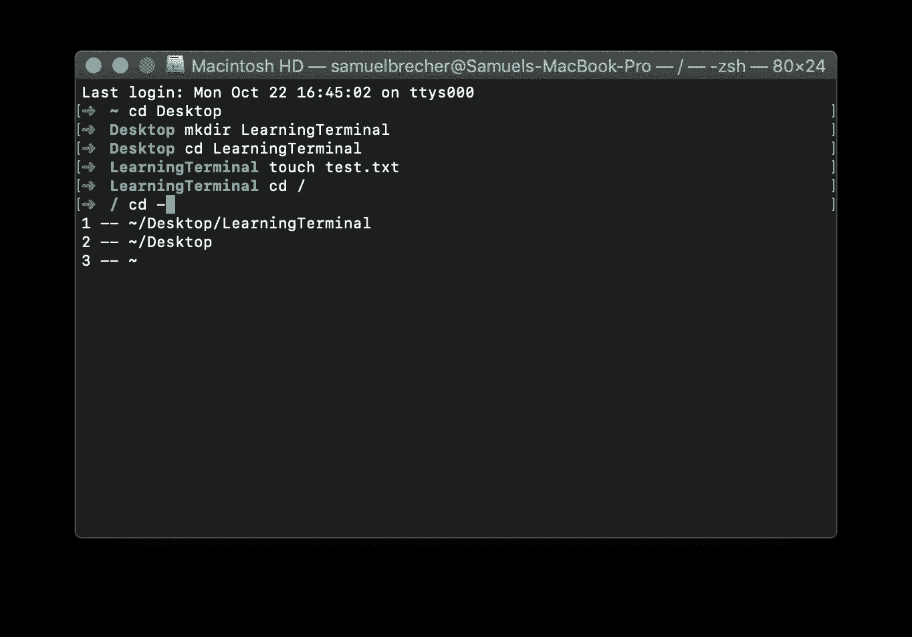
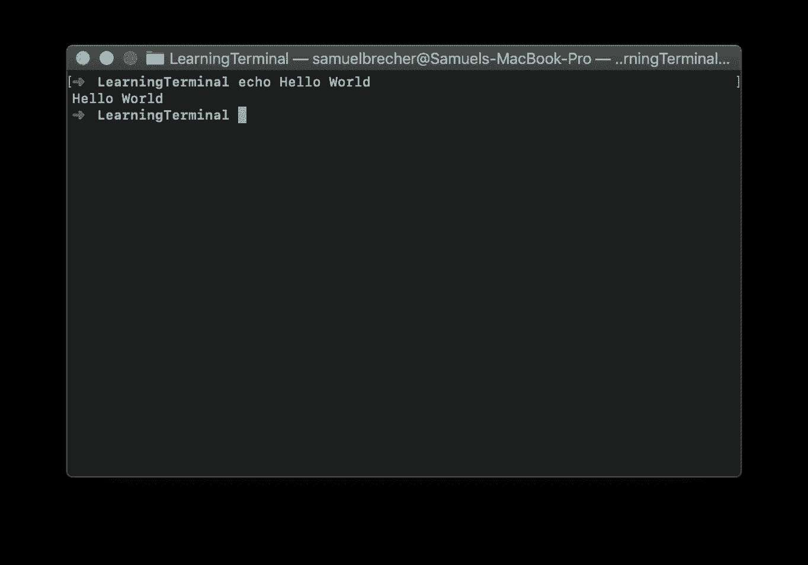
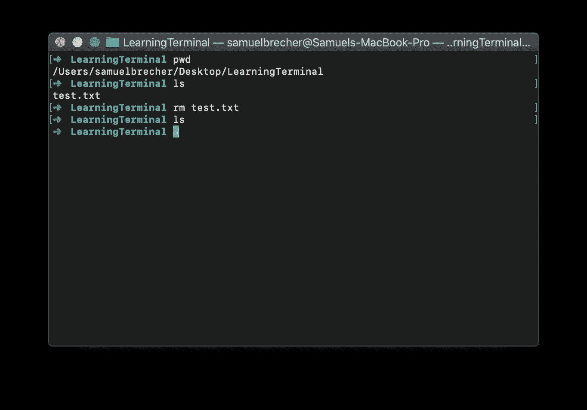
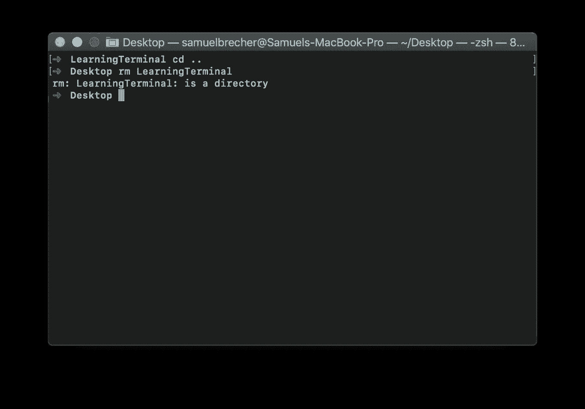

# 什么是终端窗口？

> 原文：<https://medium.datadriveninvestor.com/learning-programming-part-1-what-is-a-terminal-window-e2dcde4e0cf5?source=collection_archive---------13----------------------->

[](http://www.track.datadriveninvestor.com/1B9E)

你是否曾经想创建自己的移动应用程序，但发现自己甚至缺乏完成这项任务的基本编程技能？如果这描述了你，那么这是你的学习系列。

这是向读者介绍软件开发的系列文章的第一部分。我们的目标和重点是让您对计算机的工作原理有一些基本的了解，并开始学习如何开发在 iPhone 和 Android 上运行的移动应用程序。

进来时你唯一需要知道的是如何打开电脑打字。本系列将重点关注使用 macOS 进行开发，因为您无法使用 Windows 为 iPhone 编写应用程序。

通过使用 Spotlight 搜索“终端”，或者打开您的`Applications`目录，转到`Utilities`目录，然后点击终端，打开终端应用程序。


The Terminal app inside the Applications/Utilities directory

**终端 App**



Your terminal app will differ slightly in color and won’t have the green arrow or tilde

macOS 上的终端和 Windows 上的 DOS 提示符都是基于文本的界面的例子。macOS 和 Windows 都是图形用户界面(简称 GUI)的例子。当您打开“终端”应用程序时，您的当前位置被设定为您的个人目录，您的文稿、下载和其他目录都位于该目录中。使用“终端”应用程序时，您总是在电脑的某个目录中。

让我们来看几个您可以在终端应用程序中键入的基本命令:

```
ls - List files
pwd - Print working directory
cd - Change directory
mkdir - Make directory
touch - Create file
rm - Remove file
```

让我们尝试几个命令。首先输入`ls`并按下回车键查看你的主目录中的文件和目录，`pwd`查看你当前所在位置的完整路径，然后按下`cd Desktop`进入桌面目录。最后，你可以再次输入`ls`来查看你桌面上的所有文件和目录。



Using commands to navigate your computer using the Terminal app

让我们键入`mkdir LearningTerminal`在桌面上创建一个名为“LearningTerminal”的目录，然后键入`cd LearningTerminal`切换到这个新目录，最后使用`touch test.txt`在`LearningTerminal`目录中创建一个名为“test.txt”的文件

*P.S .文件和目录名区分大小写，所以* `*cd learningterminal*` *不起作用，因为目录有大写字母。*



Create a folder and a file using the Terminal app

您会注意到在最后我输入了`pwd`来打印我的工作目录名。Print 可能看起来是一个奇怪的措辞，但那是因为它是编程语言的遗迹，在编程语言中“print”意味着向用户显示一些东西。

*术语“echo”在一些编程语言中与“print”意思相同。*

到目前为止，我已经教了你如何进入目录，但现在如何离开它们。计算机文件系统是一个树结构，在树的开始是“根”目录，也称为`/`。

如果你输入`cd /`,你会到达你电脑的根目录。所有其他文件和文件夹都在这个目录中。输入`ls`,你会看到很多你不熟悉的文件和目录，其中大部分控制 macOS



A lot of foreign files and directories

让我们回到`Desktop`目录。去那里有很长的路，有捷径，还有更短的捷径。我会解释这三个原因:

1.  `cd /Users/[username]/Desktop`
2.  `cd ~/Desktop`
3.  `cd -2`

第一个要求你知道自己的用户名，我的是`samuelbrecher`，打字比较长。第二个使用“主目录”快捷键`~`。第三种使用终端应用程序中的历史记录。第三种选择是最快的，但是根据你的历史，这个数字总是不同的。所以，你只需输入`cd —`然后按 tab，它会列出你去过的目录的历史。



Using Terminal history to change directories

既然你第一次使用了 tab 键，我需要让你知道一些我一直隐瞒的事情。您可以使用 tab 键自动完成要导航到的目录的名称。我们试试吧！

你现在应该在`Desktop`目录中，如果不是，输入`cd ~/Desktop`到达那里。现在键入`cd`并按 tab 键。它会给你一个你可以进入的目录列表。如果您再次点击 tab，它会自动完成您的`cd`命令。尝试键入`cd Learn`并按 tab，它应该自动完成到`cd LearningTerminal`，然后您可以按 enter 来完成该命令。

**中场休息**

让我们休息一下，回顾一下到目前为止我们所学的内容。您现在知道如何更改目录`cd`，创建目录`mkdir`和文件`touch`，以及如何导航到您计算机的根目录`cd /`。您还可以列出您当前目录下的所有文件和目录`ls`。

**定期预定编程**

我之前介绍过的一个我们还没有使用的命令是`rm`。这个命令很强大。它会删除文件和目录，并且**无法撤消**。通常情况下，当你删除电脑上的文件时，它会被放入垃圾箱，这实际上是一个特殊的文件夹。当你清空垃圾箱时，它使用`rm`从你的电脑中删除文件和目录。所以通过在终端 app 中使用`rm`，你就跳过了垃圾桶，你**无法** **恢复删除**。

在我们使用`rm`命令之前，让我们做一些有趣的事情，比如在我们之前创建的`test.txt`文件中写一些文本。现在，您的终端应该位于我们之前创建的`LearningTerminal`目录中。如果不是，键入`cd ~/Desktop/LearningTerminal`导航到那里。

还记得我之前说过，一些编程语言使用“echo”这个词来表示向用户展示一些东西。嗯，你可以在终端应用程序中输入的另一个命令是`echo`，那是因为我们实际上一直在用一种叫做 bash 的编程语言输入。继续输入`echo Hello World`



The Terminal app just said “Hello World”

你会注意到终端应用程序刚刚打印了“Hello World”。你可以在`echo`之后输入任何东西，它都会重复给你。现在，不是让终端应用程序重复我们告诉它的内容，而是让它使用所谓的“管道”将其写入我们的`test.txt`文件中

术语“管道”是指将一个命令的输出作为输入发送给另一个命令。在我们的例子中，我们将输入`echo Hello World > test.txt`，这将用“Hello World”替换`test.txt`的内容。请打开文件，自己看看。虽然`>`将覆盖现有内容，但您可以使用`>>`追加(添加)内容。键入`echo Second Line >> test.txt`，您将看到它向文档添加了第二行。

在终端应用程序中键入命令后，您需要关闭并重新打开该文件。“文本编辑”不会自动更新内容。

在我们继续使用破坏性命令`rm`之前，让我们再看一遍非常有用的命令:`open`

您可以使用`open test.txt`在默认程序中打开文件。您也可以使用`open .`在 Finder 中打开当前目录。open 后面的句号有特殊的含义，就像`/`表示你电脑的根目录，`.`表示你当前的目录。在接下来的课程中，记住这一点很重要。

让我们通过删除一些内容来结束这个话题吧！记住，`rm`命令是不能撤销的，一定要确保你在正确的目录下，如果你使用 tab 键自动完成，一定要确认你要删除的文件或目录的名称。以正常的方式删除东西总是最好的，这样如果它是一个错误，你可以把它从垃圾桶里拿出来。我个人曾经删除了一整天关于事故的工作。

您应该仍然在`LearningTerminal`目录中，但是如果不是，键入`cd ~/Desktop/LearningTerminal`到达那里。通过输入`pwd`确认你在正确的地方，应该会打印出`/Users/[username]/Desktop/LearningTerminal`。键入`ls`以查看`test.txt`文件是否存在。现在输入`rm test.txt`并按回车键。键入`ls`以查看文件现在是否消失，没有返回任何内容。



Using rm to permanently delete test.txt

它消失了，你无法挽回。

现在让我们把文件夹也扔掉吧！因为我们在文件夹中，我们需要返回一个目录，到`Desktop`目录。您可以键入`cd ..`返回上一个目录。就像`.`表示当前目录一样，`..`表示父目录

你应该在`Desktop`目录内，如果不是，键入`cd ~/Desktop`和`pwd`确认。现在输入`rm LearningTerminal`



We can’t use rm to remove a directory

我是故意那样做的。这是我在学习使用电脑时遇到的第一个错误。看来我们不能使用`rm`删除目录，只能删除文件。但这不是真的，`rm`实际上是担心我们可能会删除目录中我们不想删除的文件和目录，所以我们需要告诉它这没关系。我们用“flags”来做这件事，flags 是命令中以破折号开头的任何东西。

键入`rm -d LearningTerminal`删除目录

那起了作用。`-d`表示也删除目录。如果在`LearningTerminal`目录中还有文件和目录，它会要求我们确认是否要删除每个文件和目录。我不会详细介绍`rm`命令的所有“标志”,因为那可能是它自己的教训。

终端 app 上的这一课到此结束。这绝不是您可以使用终端应用程序和 bash 编程语言做的所有事情的全面课程，但它足以让您了解我们要去的地方。

**重述**

```
ls - List files
pwd - Print working directory
cd - Change directory
mkdir - Make directory
touch - Create file
rm - Remove file
rm -d - Remove directory
echo - Print text to Terminal
open - Open file in default program
/ - Root directory
. - Current directory
.. - Parent directory
```

**额外积分**

```
ctrl+a - Go to beginning of line
ctrl+e - Go to end of line
ctrl+c - Cancel current command
ctrl+r - Search previous commands
clear - Clear terminal window
up/down arrow - See previous commands
```

# 来自 DDI 的相关帖子:

[](https://www.datadriveninvestor.com/2019/01/23/deep-learning-explained-in-7-steps/) [## 用 7 个步骤解释深度学习——数据驱动投资者

### 在深度学习的帮助下，自动驾驶汽车、Alexa、医学成像-小工具正在我们周围变得超级智能…

www.datadriveninvestor.com](https://www.datadriveninvestor.com/2019/01/23/deep-learning-explained-in-7-steps/) [](https://www.datadriveninvestor.com/2019/01/23/which-is-more-promising-data-science-or-software-engineering/) [## 数据科学和软件工程哪个更有前途？-数据驱动型投资者

### 大约一个月前，当我坐在咖啡馆里为一个客户开发网站时，我发现了这个女人…

www.datadriveninvestor.com](https://www.datadriveninvestor.com/2019/01/23/which-is-more-promising-data-science-or-software-engineering/)