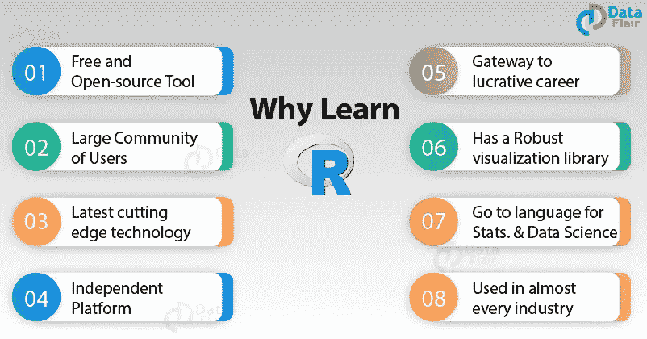
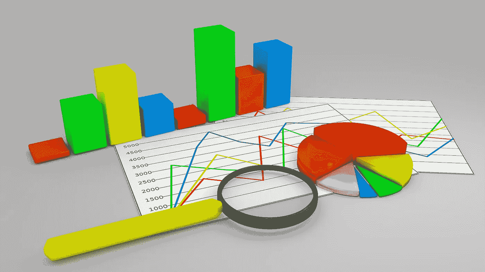

# 学习 R 编程

> 原文：<https://medium.datadriveninvestor.com/learning-r-programming-b0bbd246ada4?source=collection_archive---------8----------------------->

从初级到高级，你需要的所有资源

Source: Towardsdatascience.com

R 是一种用于统计计算和图形的编程语言和免费软件环境，由 R 统计计算基金会支持。任何已经开发了超过 13000 个包的用户都可以很容易地使用它，更多的包还在开发中。由于可用的软件包种类繁多，人们可能会被如此多的资源淹没，不知道从哪里开始，甚至不知道在学习过程中继续学习。

 [## 2019 年最值得学习的编码语言|数据驱动的投资者

### 在我读大学的那几年，我跳过了很多次夜游去学习 Java，希望有一天它能帮助我在…

www.datadriveninvestor.com](https://www.datadriveninvestor.com/2019/02/21/best-coding-languages-to-learn-in-2019/) 

为了让你的学习过程变得非常简单，这篇文章试图给你一些简明的材料，从 pdf 到视频。如果你是一个潜在的用户或者已经是一个用户，并且想要一个流畅的进步，这篇文章是为你准备的。

# R 是什么？

r 是由 Ross Ihaka 和 Robert Gentleman 于 1993 年开发的一种编程语言。r 拥有大量的统计和图表方法。它包括机器学习算法，线性回归，时间序列，统计推断等等。大多数 R 库都是用 R 编写的，但是对于繁重的计算任务，C、C++和 Fortran 代码是首选。

Source: Dataflair

***学习指南将分别分发到初级、中级和高级资源中。***

# 初学者

下面是简单介绍 R 的资料列表:

*   [数据科学 R 入门](https://www.edx.org/course/introduction-to-r-for-data-science-2)
*   [教程点](https://www.tutorialspoint.com/r/index.htm)
*   [数据科学变得简单](http://www.datasciencemadesimple.com/learn-r-what-is-r/)
*   [研讨会简介:数据处理、分析和可视化](https://robwschlegel.github.io/Intro_R_Workshop/)

## 时间序列

这里有一个材料列表，用于深入了解 R 中的时间序列和预测；

*   [时间序列 R 的小本子](https://buildmedia.readthedocs.org/media/pdf/a-little-book-of-r-for-time-series/latest/a-little-book-of-r-for-time-series.pdf)
*   [预测:原理与实践](https://otexts.com/fpp2/intro.html)

# 中间的

*   [R 代表数据科学](https://r4ds.had.co.nz/)
*   [数据天赋](https://data-flair.training/blogs/r-programming-language/)
*   [Cyclismo.org](https://www.cyclismo.org/tutorial/R/)
*   [文字挖掘 R](https://www.tidytextmining.com/)
*   [R 降价](https://bookdown.org/yihui/rmarkdown/)
*   [空间数据](http://geog.uoregon.edu/bartlein/courses/geog490/week04-netCDF.html#reading-restructuring-and-writing-netcdf-files-in-r)
*   [用 R 进行探索性数据分析](https://bookdown.org/rdpeng/exdata/)

## 机器学习

*   [数据识别能力](https://data-flair.training/blogs/r-programming-language/)
*   [机器学习加](https://www.machinelearningplus.com/machine-learning/caret-package/)
*   [用 R 介绍机器学习](https://lgatto.github.io/IntroMachineLearningWithR/index.html)
*   [Bharatendra Rai 博士-机器学习课程(视频)](https://www.youtube.com/channel/UCuWECsa_za4gm7B3TLgeV_A)

## 深度学习

*   [Bharatendra Rai 博士-机器学习课程(视频)](https://www.youtube.com/channel/UCuWECsa_za4gm7B3TLgeV_A)

# 先进的

*   [高级 R](https://adv-r.hadley.nz/introduction.html)

你可能想知道，为什么只有一个高级资源，成为一个高级程序员是主观的，取决于使用。我相信你在 R 编程方面的进步与你能为自己开发多少个人使用的函数有很大关系。

**注:**

以上所有资料都是免费资源，但是，以防万一，我将列出其他非免费资源。

*   [数据营](https://www.datacamp.com/)
*   琳达
*   [Coursera](http://coursera.org)
*   [爱德华卡](https://www.edureka.co/)

## **结论**

现在就开始！不用再等明天了。你已经得到了你需要的一切。

