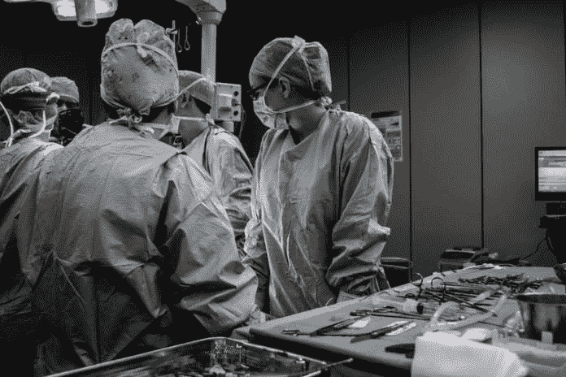
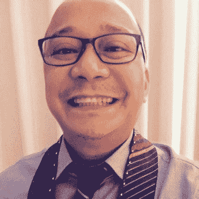
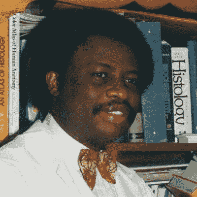
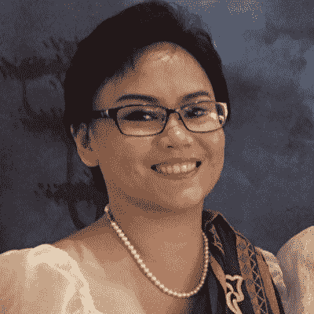
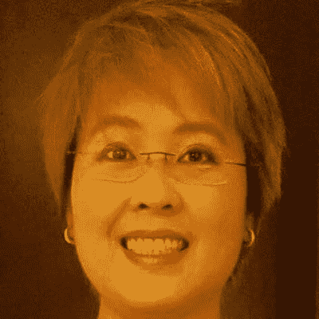
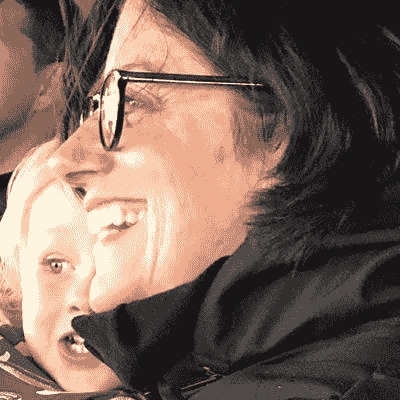
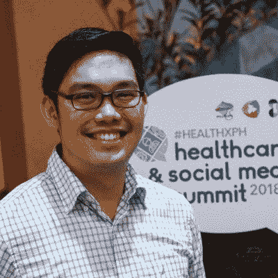
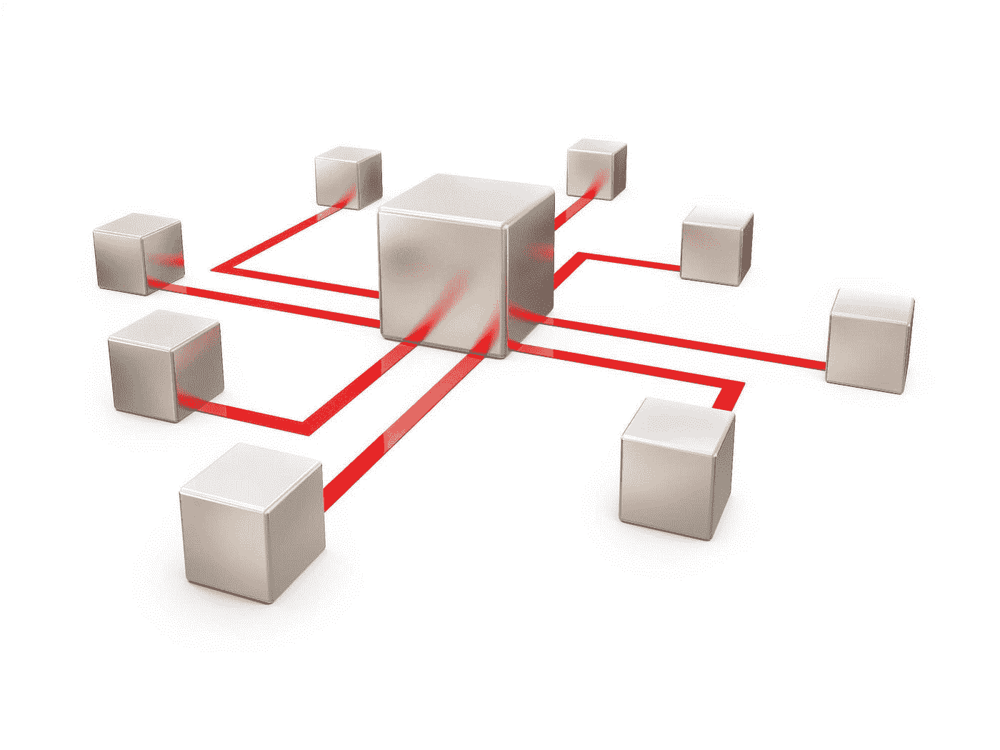

# 当有需要的人敲门时，学习可以拯救

> 原文：<https://medium.datadriveninvestor.com/learning-saves-when-those-in-need-knock-74a2aac1c26d?source=collection_archive---------41----------------------->

Photo by Piron Guillaume on Unsplash

对任何专业人士来说，训练和学习都是最基本的。紧跟最新发展使企业家能够为他们的客户提供最好的服务，并提高他们自己的投资回报。

医疗保健提供者将职业发展向前推进了一步。他们的专业知识对病人来说可能是生与死的差别——尤其是那些患有罕见疾病的病人。

Dr. Remo-tito Aguilar

[Remo-Tito Aguilar](https://twitter.com/bonedoc)医生是骨科医生，也是达沃市南菲律宾医疗中心的诊所主任。他发现自己得了一种多年未治疗的疾病，需要医疗帮助。

“一个邻居敲我的门，问我是否可以看看他 9 个月大的侄子，”阿吉拉尔说。"他的侄子很虚弱，断断续续地发烧了一个星期，从那天早上开始一直在呕吐。"

医生回忆了那次谈话:

*“你的侄子脱水了，”我说。"现在带他去最近的医院。"*

阿吉拉尔说:“我都不记得上一次治疗小儿急性肠胃炎是什么时候了。”。“作为一名骨科医生，我很少处理这种情况，除非我的家人中有一人感染了这种疾病。即便如此，我也很少管理儿科年龄。”

他与其他医疗服务提供者讨论了他们的学习策略，从激励他们学习的东西开始。

Yinka Vidal

“在临床研究和实验室医学中，我们了解到对治疗没有反应的新感染病例，”Yinka Vidal 说。“充血性心力衰竭已经停止反应。骨折愈合的手。疾病的新趋势。”

作为一名医疗保健专业人员和讲师，Vidal 不得不在该领域保持现状，以支持他的工作。

“我们都希望在自己的工作中做到最好，尤其是在为他人服务方面，”他说。“没有人想在医学或任何职业的新创新和新技术方面落后。

“世界总是在变化，”维达尔说。“有时，变化是如此巨大。旧的东西和程序变得不再有用。我记得几年前教我的牙医如何使用电子邮件。”

他不断的学习是支持他职业的一个业余爱好。

“对于一个好奇的人来说，学习新事物总是非常令人兴奋的，”维达尔说。“没有什么比即将发现医学新发现的兴奋更让我夜不能寐。

“我从我的学生那里学到了很多，尤其是当他们问我一些问题，迫使我对这个主题做更多的研究时，”他说。

Dr. Aileen Dualan

艾琳·杜亚兰博士想要成为“一个更好的我”她是 MSD 制药公司亚太区医疗事务主管。

“要学的东西太多了，人生苦短，”杜亚兰说。“充分利用它。

“科学界一直在变化，”她说。“人在变。环境在变。学习帮助我们应对所有的变化。你不可能什么都知道，但至少要学点新东西。这离更好地应对变化又近了一步。”

职业健康专家 Gia Sison 博士也是菲律宾 Livestrong 基金会的负责人。

“医学是一个持续的学习过程，”她说。你同时学习、成长和帮助他人。这是对我的启发。"

Agular 从他照顾的人身上得到启示。

“作为一名医疗保健专业人员，我的学习灵感来自我的病人，”他说。“我可能是学习者，但病人比我大。”

Dr. Iris Thiele Isip Tan

[Iris Thiele Isip Tan](https://twitter.com/endocrine_witch)博士是一名内分泌学家，她很喜欢自己被称为内分泌女巫的绰号。

“当我学习时，我有一些东西可以传递给我的学生，”她说。“他们激励着我。

“作为一名医生，我致力于终身学习，”谭说。“我的病人应该得到我能给予的最好的照顾。我喜欢学习新东西。我就是这样进入 Twitter 的。这是如何工作的？我能用这个做什么？我修补。”

Katy Hanlon

凯蒂·汉伦(Katy Hanlon)专门从事临床研究和健康传播。

她说:“我总是受到启发去学习，从来没有思考过背后是什么或谁。”"也许是因为我在推特上和其他地方遇到的人培养了真正的好奇心."

Dr. Jaifred “Jim” Lopez

jai Fred“Jim”Lopez 博士为自己的求知欲为他人带来了改变而自豪。

“当我的病人和家人走到一起，意识到他们是一个团体时，我更受鼓舞，”他说。“然后他们一起工作，互相学习。想到这里，我的心跳加快了。

洛佩兹说:“我很高兴能学到一些拯救生命的东西，我知道我可以传递给其他人。”“我最终拯救了越来越多的生命。这是一个如此鼓舞人心的想法。”

这个小组比较学习策略，利用每一个出现的学习机会。这可能包括正式的课堂作业或走廊上的非正式聊天。就像人际交往一样，最好的学习发生在休息时间。

“我正在慢慢适应繁忙的学业，”洛佩兹说。“推特帮了大忙。我仍然会接触到这个领域的领导者——甚至和他们交往。

“用现有的东西来学习，”他说。“因为我通常都带着手机，所以我用它来学习。我总是访问维基百科。我关注并联系我所在领域的领导者。”

维达尔知道偷懒的惩罚。

“很难通过定期阅读研究报告来教授和更新知识，”他说。“否则，你会受到学生的挑战。”

维达尔给出了他个人的教育步骤:

*   学习的动力。
*   好奇想知道。
*   不愿意被落下。
*   新发现的兴奋。

“美国一名记者说，‘文凭不是学历的证明，恰恰相反，’”维达尔说。“当我们能够在不同的情况下有效地应用我们所学的东西时，教育的真正证据就来了。

“我相信我们中的许多人都遇到过玷污规范、让有经验的临床医生震惊不已的临床病例，”他说。

谭强调要充分利用她的网络关系。

“Twitter 上的个人学习网络是我的‘地上耳朵’，”她说。“我喜欢饲料的意外收获。“偶尔有好东西时，一个朋友会给我贴标签。”

阿吉拉尔指出，今天的学习环境不同了。

“有内容、媒介以及我们如何传播这些内容，”他说。“如果你的业务繁忙，就需要一个策略。否则，你会迷失在某个地方。

“我的学习模式现在遵循连接主义:从我的网络中的各种来源共同创建、存储、检索和创建内容，丰富我的学习，”阿吉拉尔说。"然后，我根据相关性、可用性和交互性来评估这些信息源."

随着互联网的普及，更多的学习在网上非正式地进行。

“虽然不是直接护理临床医生，但我仍然致力于学习，”汉隆说。“我发现 Twitter 和 Twitter 聊天是开始探索最新出版物和医疗保健技术的地方。他们支持交流和社区建设。”

当教师提供学生无法用谷歌搜索到的信息时，额外的好处就来了。

“利用人际关系和虚拟现实等技术来支持讲座，”汉隆说。

“我使用在线 twitter 聊天和标签作为我的发布和社交点，”她说。“从那里，我开始参加免费的在线网络研讨会、虚拟会议、出版物阅读和一对一的联系。”

汉伦发现 YouTube 最适合学习。

“我学会了如何打帆船结— —以及更多与工作相关的努力，”她说。

杜亚兰也支持学习视频资源。

“YouTube 对现在的医科学生来说会有很大的用处，”她说。“我记得大约 20 年前，我是随叫随到的主治医生。我在电话里指导如何减少保姆的肘关节。今天，你可以谷歌一下。”

她也使用播客有声读物和类似的技术，尤其是在旅行的时候。他们帮助她在休息时间忙碌。

**关于作者**

吉姆·卡扎曼是拉戈金融服务公司的经理，曾在空军和联邦政府的公共事务部门工作。你可以在[推特](https://twitter.com/JKatzaman)、[脸书](https://www.facebook.com/jim.katzaman)和[领英](https://www.linkedin.com/in/jim-katzaman-33641b21/)上和他联系。

*原载于 2018 年 11 月 22 日*[*www.datadriveninvestor.com*](http://bit.ly/2FzemWf)*。*