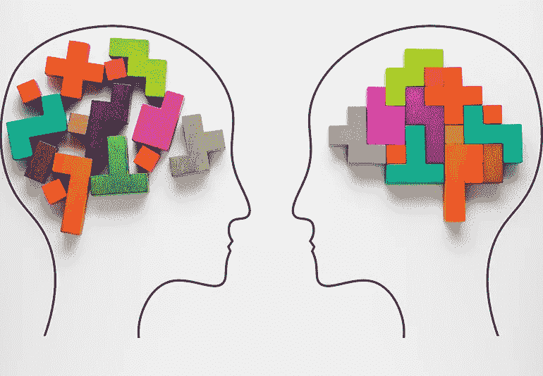
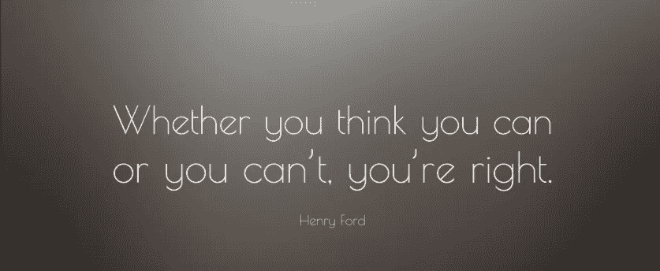

# 学会学习

> 原文：<https://medium.datadriveninvestor.com/learning-to-learn-a29138127af2?source=collection_archive---------17----------------------->

*帮助你更好学习的心态*

你的头脑和想法是你想要实现的任何事情的起点。我经常发现自己在说“事情需要在我做之前在我的脑海中发生”。这是因为我们的行为往往只是我们思想的物理表现。因此，拥有正确的心态是成就任何事情的关键起点。

我最近在 MEST 的融水科技创业学院开始了为期一年的旅程。我参加这个项目的主要动机是学习。我想扩大我的知识基础，帮助从基层建立一个以技术为基础的公司。在我寻求知识的过程中，我意识到我需要适应三种重要的心态来促进最佳的学习体验。

**“有意识学习”的心态**

要想在任何事情上取得成功，包括学习，你需要有一个深思熟虑的、有意识的愿望去做。学习的机会就在我们身边，但是除非你积极地寻求学习，否则你会错过它们。

在我看来，传统的教育体系已经在我们的头脑中根深蒂固，学习是一个发生在四面墙空间的过程。这就像一个渗透过程，信息从一个高度集中的区域，老师或讲师，传递到一个较低集中的区域，学生。我在 10 年级的时候学到了渗透作用，直到现在还没有一个使用案例！

我在 MEST 的这段时间里，这种传统的学习观已经完全被消除了。这个项目进行了一个月，我进入了恐慌状态，因为我不像以前那样学习了。潜意识里，我仍然期待传统的学习体验:片面的讲座、作业、测试和最后期限。MEST 项目有一个结构化的课程；然而，大部分学习都是动手实践。我们进入市场，与人见面，创建原型，展示，获得反馈，然后循环往复。如果我没有有意识地寻求学习，我将会错过通过所有这些活动在我周围不断发生的所有宝贵的教训和见解。

拥有自觉学习的心态也能让你获得不同的学习机会。我来 MEST 是为了通过规定的商业、通信和技术课程来发展我的职业生涯。然而，我的大量学习是在课堂之外和个人发展中进行的。我正在打造新的习惯和思维模式，并敏锐地意识到可以提升我的职业和个人生活的微小增长机会。例如，我的有意识学习心态促使我问自己为什么拖延，如何改变它，而不是接受我是一个拖延者。

**“我不知道”的心态**

在有意识地决定学习之后，下一个需要磨练的心态是“我不知道”的心态，接受你不知道的事实，并对这个想法感到舒服。承认你不知道是一颗难以下咽的苦药丸，这是我在 MEST 开始工作以来每天都要吃的药。

我的团队由一些非洲最聪明的人组成:51 名有抱负的企业家，来自 12 个不同的非洲国家，他们都有不同的专业知识、经验和技能。我们有航空和核工程师、环境和气候变化专家、物流大师、连续技术企业家和机器人天才。在这种环境中，我不断地被提醒，有太多的东西我不知道。起初，我觉得这很吓人，但我有意识的学习心态帮助我把它看作是接触新的学习材料。

“我不知道”的心态也很重要，因为它有助于减少学习过程中的挫败感。这意味着当你“不能”做某事时，你变得更加理解自己。不是因为没能力才觉得自己不行，而是因为不知道才觉得自己还不行。区别在于，一种是永久的无能力状态，另一种是打开了学习的空间。下次你不知道什么的时候，保持冷静，承认你不知道，让谷歌成为你的朋友。

**“能做”的心态**

要掌握的最后一个心态是“能做”心态，简单地认识到你能做和学习你下定决心要做的任何事情。虽然列在最后，但可能是最重要的。当务之急是在开始任何事情之前，有意识地采纳并内化“能做”的心态。这是因为从一个不知道的地方开始意味着你很可能失败，而且经常失败。失败本身并不是一件坏事。这不会让你成为一个失败者。它只是突出了你需要付出更多努力的增长领域。

学习新的东西通常会让你想要放弃，并得出结论说“它不适合你”。这实际上是“我在吮吸；我真的可以这样做吗？”不要等到事情不顺利的时候才回答这个问题，在开始之前就决定你能做到！接受并拥抱失败，将其作为学习过程的一部分。

当你拥抱失败时，记住只有当你花时间反思、回顾并从成长领域中学习时，失败才是有效的。用阿尔伯特·爱因斯坦的话说，“疯狂的定义就是一遍又一遍地做同样的事情，却期待不同的结果。”

如果你想从这篇文章中得到什么，那就是你可以做任何你下定决心要做的事情。有意识地决定去做，当你不知道的时候，承认你自己。

顶部见！