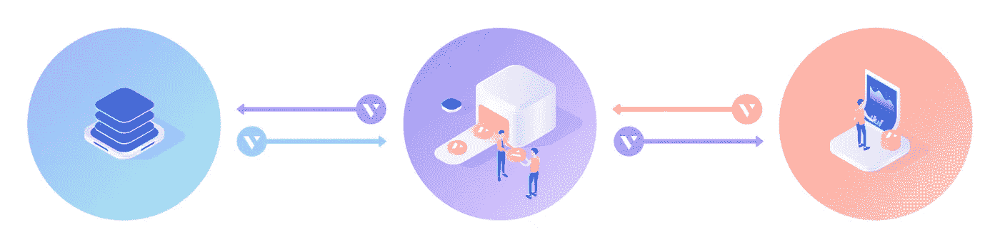
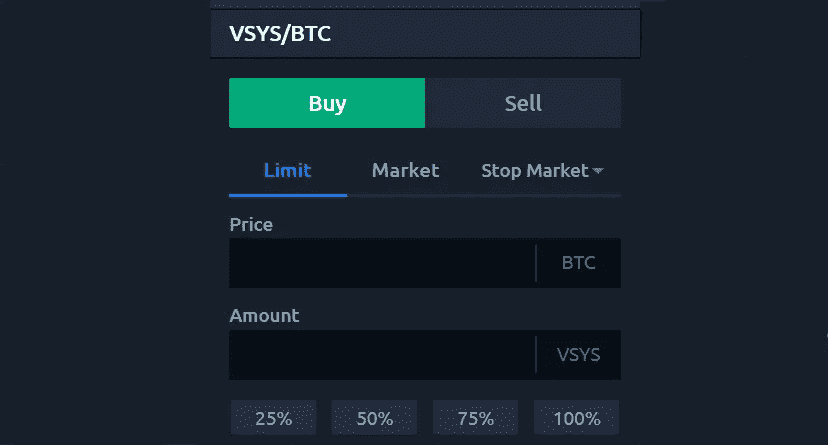
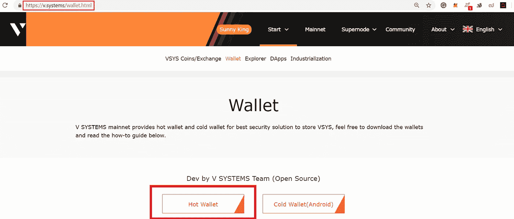
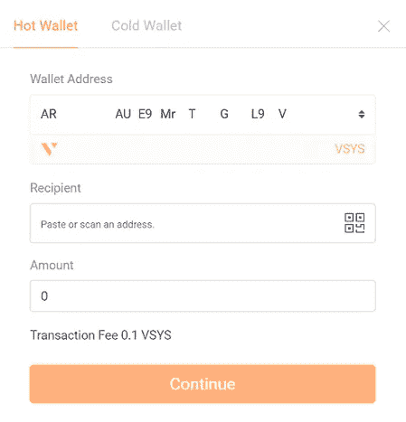
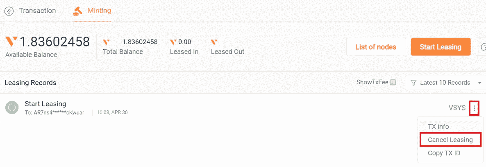

# 租赁密码可以提供 10 倍于传统储蓄账户的回报

> 原文：<https://medium.datadriveninvestor.com/leasing-crypto-can-offer-10x-returns-over-traditional-savings-accounts-7d43e1f49969?source=collection_archive---------1----------------------->

## 了解如何以两位数的年息投资 VSYS 硬币

Current VSYS coin lease rates climb as high as 22%

## Staking =通过将网络的本地加密货币隐藏在适当的位置来帮助保持区块链的安全——本质上是操作一个验证交易的简单微节点。

## 从最初的硬币购买赚取利息支付，这篇文章带你通过赌注(租赁)VSYS 硬币的整个过程。

在今天的区块链环境中，带孩子是一种时尚。这是有原因的。随着网络竞相争取投资者和爱好者的参与，区块链项目正在发放甜蜜的加密奖励。

赌博提供了一种不用动手的简单方法来赚取被动收入——这是我最喜欢的一种。如果你能登录一个网站，你就可以使用密码。

你看，crypto 最有益的品质之一是它允许持有者作为他们自己的银行。假期？什么节日？使用加密货币提供了 365 年 7 月 24 日进行交易的自由。

毕竟，**是你的钱**。为什么要由一周中的哪一天来决定你是否能完全获得资金？如果你的账户随着你的睡眠而增长，那就更好了。

现在，在我解释如何赢得赌注奖励之前，有几件事你应该知道:

> ***免责声明*** *:这不是投资或理财建议。本文中的信息主要是推测性的观点，仅供娱乐。*
> 
> *在参与任何项目之前，无论是在加密市场还是在加密市场之外，都要进行自己的研究。作者持有 V SYSTEM 项目的原生加密货币——$ VSYS。*

虽然今天的收费银行系统为储蓄存款提供微不足道的 2%的利率，但密码行业却拥有高得多的利率。

我们今天将要讨论的项目的回报率*目前*超过 20%。

现在，重要的是澄清赌注支付是以区块链网络的本地加密货币的形式出现的。因此，你的回报受价格剧烈波动的影响。

请记住，尽管利息支出一直很高，但交换价值(转换为菲亚特或比特币)会像过山车的轨道一样上下波动。

但这正是 crypto 最初如此令人兴奋的原因。系好安全带，享受旅程！

# 虚拟系统简介

区块链开发平台 [**V SYSTEMS**](https://v.systems/) 为加密货币行业的赌注系统注入了独特的元素。奖励来自于把你的硬币出租给网络的节点运营商，而不是赌注。

因为在深入研究某个问题之前，先阐明自己的观点总是一个好主意，所以这里有一篇概述文章解释了 V 系统的工作原理:

 [## 超级节点的发明如何提升区块链的 PoS 共识

### 赌注奖励现在飙升得更高

hackernoon.com](https://hackernoon.com/how-the-invention-of-supernodes-upgrades-blockchains-pos-consensus-989f458dba8b) 

所以，如果你看完了那篇文章，你就知道租赁在[**VSYS MainNet wallet**](https://v.systems/wallet.html)内是可用的。您还知道奖励来自每四分钟验证一次网络交易的超级节点 minters。

然而，为了确保我们仍然在说同一种语言，让我们倒回去一点。

Cryptocurrency exchange [**KuCoin**](https://medium.com/@blockchainauthor/how-to-trade-fiat-for-crypto-crypto-for-crypto-and-crypto-for-fiat-bc6fadc0e470) carries **$VSYS** coins

# 如何获得 VSYS 币

我相信你已经自己解决了这个问题，但是在你可以从你的数字资产中赚取利息之前，你首先需要把 crypto 租出去！

> $VSYS 加密货币目前在[库币](https://www.kucoin.com/?rcode=7drude) & more 与$BTC 交易

现在，如果加密交易超出了你的能力范围，没有必要担心。曾几何时，我也不知道怎么做。但是一旦你掌握了窍门，这就非常简单了。

以下是如何获得$VSYS 硬币的一个过于简单的纲要:

## F1)购买比特币

## F2)将比特币发送到 KuCoin

## F3)使用比特币购买 VSYS

我说过，那只是一个基本的解释。为了更深入地执行这三个步骤，我为你准备了另一篇文章。

尽管过程是相同的，但下面的文章涵盖了 XYO/ETH 交易对。只要把“XYO”换成“VSYS”，把“ETH”换成“BTC”，可出租的硬币就是你的了:

 [## 如何将菲亚特换成加密，加密换加密，加密换菲亚特

### 掌握这些基础知识，你就会知道如何在大多数交易所交易加密货币

medium.com](https://medium.com/@blockchainauthor/how-to-trade-fiat-for-crypto-crypto-for-crypto-and-crypto-for-fiat-bc6fadc0e470) 

好了，现在你已经获得了一些硬币来租赁，让我们进入*如何*你可以赚取数字被动收入。

Get your **VSYS wallet** here: [**https://v.systems/wallet.html**](https://v.systems/wallet.html)

# 如何租赁 VSYS 硬币

此时，我们假设您已经从 [**KuCoin**](https://www.kucoin.com/#/?r=7drude) 或[其他交易所](https://coinpaprika.com/coin/vsys-v-systems/#!exchanges)获得了 VSYS。

另外，您已经将硬币转入您的 [**VSYS MainNet 钱包**](https://wallet.v.systems/login) 。在建立你的 VSYS 账户时，记得要保证这些钱包种子词的安全！

出于本教程的考虑，我们将使用 V SYSTEMS 开发团队的开源桌面热钱包。

## 登录钱包后，按照以下步骤租赁 VSYS 硬币:

## 1)单击主页左上角的“铸造”选项卡。

## 2)单击“节点列表”按钮以获取当前超级节点的租用地址(打开一个新选项卡)。

## 3)复制您选择支持的超级节点的节点地址。

Current **Supernodes** listed here: [**https://vsysrate.com/**](https://vsysrate.com/)

在其他标准中，超级节点排名页面显示利息支付百分比，列在“费用”列中。

我喜欢高效率的每日利息循环。混合这些高 APR，超级节点“硅谷”是我目前的选择。

但这只是我！选一个适合自己个人喜好的，复制地址。

## 4)返回钱包，点击“开始租赁”按钮

弹出窗口允许您传输硬币进行租赁:

将您选择的超级节点的租赁地址粘贴到“收件人”字段并完成交易。

恭喜你！你现在正在赚取高加密年利率。

# 赎回存款

根据您选择的超级节点支付利息的方式——每日、每周和每月——赚取的硬币开始出现在您的钱包中。

如果**出于某种原因**——你决定让你租赁的 VSYS 硬币回到你的钱包里，这个过程也非常简单:

## 1)导航至您钱包的“铸造”标签。

## 2)在“租赁记录”部分，单击租赁 VSYS 余额旁边的三个点，如上图所示。

## 3)选择“取消租赁”选项，并按照说明进行操作。

“提前”取款不会受到处罚。你要支付的唯一费用是 0.1 VSYS 交易费，以涵盖超级节点将资金传输回你的钱包的成本。

# 包扎

在 2017 年和 2018 年，大量加密投资者聚集在 HODL 这个词周围，据说这个词代表“坚持住，亲爱的生活”这个缩写词的真正定义有待商榷，但这不是这里的重点。

去年的老派投资策略是“买入并持有”，没错，五个月在 cryptoland 是“老派”

如今，它是“买入并下注”或者，在 VSYS 超级节点的情况下，它是“购买和租赁”

当你相信一个项目的能力，并对长期持有他们的硬币感到放心时，你也可以把你的资金投入到工作中去。

记住，我不是来告诉你怎么处理你的密码的。这是你的决定。但是我*在这里*是为了提醒你我个人认为有前途的项目。

被动的秘密收入是一个增长的趋势，竞争正在升温。这意味着用户——也就是你和我！—获得了最大的利益。

另外，租赁只是整个 [**V 系统项目**](https://www.v.systems/) 的一个诱人的方面。尽管该项目的筹资阶段最近才结束，但他们已经在开发周期中走了很远。

换句话说，VSYS 项目已经打破了其白皮书的界限，目前正在实施他们最初计划中的想法。

一如既往， **D** o **Y** 我们的 **O** wn **R** esearch。过去的表现并不能保证未来的结果…你知道常规。

但不管你是对加密还是被动收入感兴趣，还是两者都感兴趣，有一只小鸟告诉我，VSYS 值得你关注。

## 无耻的插头

如果你喜欢这本书，并且想帮助你把你的加密信息传播给大众，我很想听听你的项目。

即使你只想聊聊加密或你最喜欢的区块链创新，你也可以在这里找到我:Gmail 的 blockchainauthor

并且，你可以随时联系 [**Crypto Twitter**](https://twitter.com/CryptoBlastoff)