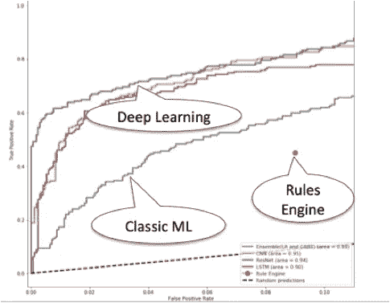
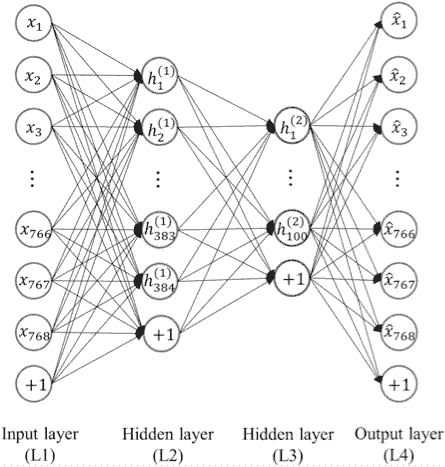
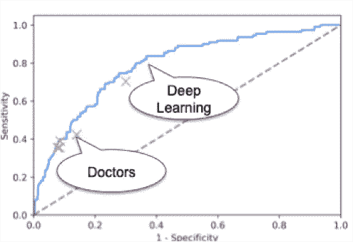

# @企业 AI 最少三个投资机会

> 原文：<https://medium.datadriveninvestor.com/least-three-investment-opportunities-in-enterprise-ai-faa1cc1037a?source=collection_archive---------13----------------------->

最近，我应邀在 NGP 首都的“连接世界”活动上做了 20 分钟关于应用人工智能的演讲。虽然 20 分钟的演讲大约有 2500 个单词，但这将是一个更短的版本。

我们都看到了人工智能在消费者世界的影响，无论是 Alexa 语音识别还是脸书面部识别。但是，企业世界正在发生什么呢？有哪些挑战和机遇？

让我们从三大企业市场开始:金融服务、零售和媒体。

欺诈检测一直是使用分析的领域。通过实施传统的基于规则的软件，Danske Bank 实现了 40%的欺诈检测率和 99.5%的误报率，但这并没有使其受到客户的欢迎。去年 [Teradata](https://www.youtube.com/watch?v=bfCwb5UeF1o) 应用机器学习和深度学习算法来应对提高分析性能的挑战。结果如上所示。如果你以前没有看过 ROC 图，y 轴显示的是检测到的欺诈的百分比，x 轴是假阳性率，即软件喊狼来了的时间百分比。

在零售行业，我们都知道亚马逊使用了多少技术来改进推荐引擎。但下一步将需要更多的机器学习和分析。这种被称为“预期运输”的方式旨在甚至在客户下订单之前就将产品或物品发送给他们。当然，在媒体领域，大约十年前，网飞设立了 Netflix 奖，奖励一个团队 100 万澳元，该团队可以根据人们对电影的偏好，大幅提高对电影喜爱程度的预测准确性。

***其他 2/3:农业、医疗、建筑***

全球 GDP 的三分之二不是金融服务、零售或媒体。即使在这方面，也正在取得进展。萝卜是韩国的主要作物之一，占蔬菜种植面积的 10%。枯萎病是经济损失最大的疾病之一。世宗大学的研究人员创造了一个卷积神经网络(见下文),从航空图像中识别受感染的萝卜块。虽然这很酷，但在世界的另一边，我的朋友尼克·奥古斯特(Nick August)仍在使用 u 盘整合他的农业机器上的数据，他是少数几个了解 HMTL 的农民之一。

医疗保健领域也取得了进步。斯坦福大学的研究人员让四名放射科医生对 420 张胸部 x 光照片进行了注释，以寻找肺炎的可能迹象。在一个月内，该团队开发了 CheXnet，它在灵敏度(正确识别阳性)和特异性(正确识别阴性)方面都超过了放射科医生。点击这里查看 ROC 图。

虽然这些结果确实令人印象深刻，但南加州的一家现代医院仍然只有不到 2%的医疗保健机器联网。深度学习是由数据推动的，其中大部分仍然位于断开的机器上。

在建筑领域，机器人能够砌砖、弧焊，还能给工地上的工人送冰镇饮料。但是，根据麦肯锡的一项分析，虽然技术可能提高了许多行业的生产率，但没有哪个行业比建筑业做得更差。没有哪个行业做得更差。领导者开始崭露头角，如果你想了解更多关于行业数字化转型的现状，请查看新书[精密建筑](https://www.amazon.com/Precision-Construction-Principles-Practices-Solutions-ebook/dp/B07G8JG26X)。

**投资机会**

因为这是一个投资者会议，所以我以三个主要的投资机会来结束我的演讲。摩尔定律的终结导致了通用计算 CPU 性能快速提升的终结。深度学习的核心是低精度线性代数，这导致了 Nvidia 等专用处理器的兴起。但是随着越来越多的工作负载转向使用深度学习，下一代基础设施公司显然存在投资机会，如 [nCorium](http://www.ncorium.com) 、 [Mythic](https://www.mythic-ai.com/) 、 [Graphcore](https://www.graphcore.ai/) 、 [Cerebras](https://www.cerebras.net/) 和 [Wave Computing](https://wavecomp.ai/) 。

第二，虽然连接笔记本电脑和手机可能是微不足道的，但机器就不一样了。连接机器的潜力和现实之间仍有很大差距。鉴于深度学习算法需要输入数据，我们需要找到一种方法来解决新老建筑、医疗保健、电力、水、农业等领域的这一挑战。机器。

最后，对于一类全新的企业应用程序来说，这是一个机会——*打包的企业分析应用程序*。迄今为止，大多数投资都集中在*打包的企业工作流应用*(从购买到支付，从订单到现金，从雇佣到解雇)。这导致了许多大型内部软件公司(Peoplesoft、Siebel、SAP 等)的出现。)以及不断增长的基于云的公司(Salesforce、Workday、ServiceNow 等)。).虽然现在您可以构建自己的自定义 CRM 应用程序，但为什么要这样做呢？这些专注于企业工作流的公司的总市值超过 1 万亿美元。

在分析方面，合并后的市值可能超过 1000 亿美元。因此，如果数据是新的石油，为什么会有这么大的不同。如今，构建一个*定制企业分析应用*需要从 16 个不同类别的 130 多种产品中进行选择；雇佣五种类型的人——业务分析师、devOps、机器学习、数据工程和深度学习专家，以及完全不同的开发生命周期。没有一个 ERP 应用程序是根据它的 ROC 图来判断的。

因此，我们开始看到*打包的企业分析应用*出现，而不是像在企业工作流应用中那样雇佣这些人并做出这些设计选择。例如，考虑人力资源部的 [Visier](https://www.visier.com/) ，服务部门的 [Lecida](http://www.lecida.com) 和 IT 部门的 [Yotascale](http://www.yotascale.com) 。也许最明显的打包分析应用是在消费者领域——谷歌搜索。作为一个打包的分析应用程序，它由工人使用，不需要数据工程师或机器学习专家。同样的事情也必须发生在企业中。

我们仍处于将人工智能技术应用于企业的早期阶段，但机遇和挑战显而易见。