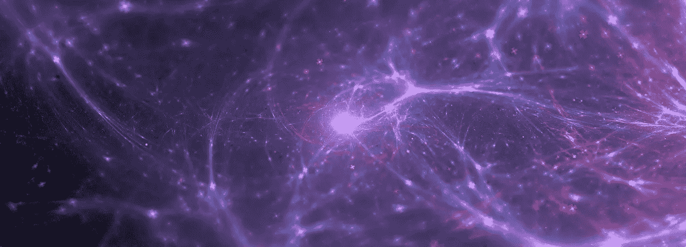
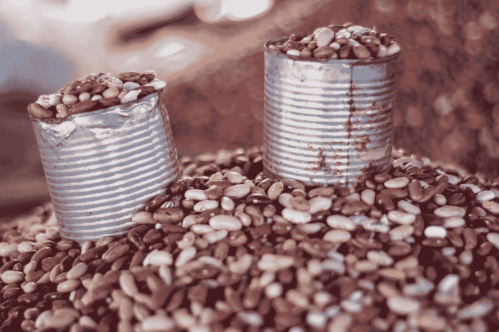

# 从树叶到计算机视觉:产品包装选集。

> 原文：<https://medium.datadriveninvestor.com/leaves-to-computer-vision-an-anthology-of-product-packaging-43126a9ca46d?source=collection_archive---------7----------------------->

[Designed by Starline](https://www.freepik.com/starline)

## *还有几样东西！*

O 显而易见，现在包装是科学的。但是曾经有一个时代，智人和尼安德特人漫游在这个自由的地球上。唯一的包装物品是树叶和坚果壳。几千年来，我们依赖这些自然形成的包装元素。是的，他们保证了食物的安全，并且易于运输。因为我们是游牧民族，所以我们没有/不能把食物/东西长时间保存在包装里。我并没有为此烦恼太久，直到我们开始定居下来务农。

人们认为，5000 年前，我们开始用木箱包装东西。又过了几个世纪，一切都没有改变。它仍然是木箱、树叶和天然贝壳。

 [## 准备在 2019 年改变世界的技术-数据驱动的投资者

### 很难想象一项技术会像去年的区块链一样受到如此多的关注，但是……

www.datadriveninvestor.com](https://www.datadriveninvestor.com/2019/01/17/the-technologies-poised-to-change-the-world-in-2019/) 

大约在公元前 200 年，埃及和中国这两种文明发明了两种新方法。埃及人用玻璃，中国人用纸。在吹管发明之前，埃及人不知道如何制造瓶子。他们制作玻璃罐和水壶。而中国人继续用纸。

Photo by [Tanushree Rao](https://unsplash.com/@tanushreerao?utm_source=medium&utm_medium=referral) on [Unsplash](https://unsplash.com?utm_source=medium&utm_medium=referral)

那是在[拿破仑·波拿巴](https://en.wikipedia.org/wiki/Napoleon)的时代，金属包装可能已经被发明了，当他问，是否有人能制造任何东西来保存他的军队的食物。

金属盒子和食品包装的时代开始了。

金属包装与纸和纸板包装一起统治了市场。然后，塑料带来了巨大的变化。塑料主要是在战后时期开始使用的。从商业角度来看，它是最好的，资源丰富，价格低廉。

Photo by [Peter Bond](https://unsplash.com/@pvsbond?utm_source=medium&utm_medium=referral) on [Unsplash](https://unsplash.com?utm_source=medium&utm_medium=referral)

在这段时间里，有人开始在他推销的产品上使用这个名字。品牌的发展不仅仅是在产品包装上贴上一个名字。现在，品牌利用包装与消费者交流。他们沟通得越好，品牌的知名度和销量就越好。

条形码的引入彻底改变了零售业。这些又细又粗的垂直线向商店里的电脑传送了大量数字信息。但是，消费者对他们来说没有价值。下一个伟大的发明是二维码。二维码本应包含比条形码更多的数据，并为营销人员带来新的可能性，但它怎么了？它没有像预期的那样成功，也没有给营销行业带来革命性的变化。它出现在 20 世纪 90 年代中后期。在那个时期，没有太多的消费者持有能够破译 2D 密码的设备。消费者需要一段时间来掌握设备，智能手机。但是 20 年是一段时间，那项技术不会在产品包装中发挥作用。它在那个领域已经过时了。

Photo by [Hermes Rivera](https://unsplash.com/@hermez777?utm_source=medium&utm_medium=referral) on [Unsplash](https://unsplash.com?utm_source=medium&utm_medium=referral)

达尔文主义是普遍的，一旦有更好的出现，事物就会过时。

T 母鸡来了[电脑视觉](https://en.wikipedia.org/wiki/Computer_vision)。它的子域[物体检测](https://en.wikipedia.org/wiki/Outline_of_object_recognition)，将改变品牌、商店和消费者的互动方式。这样，用户(通过他们的摄像设备)现在可以了解更多关于产品的信息，品牌可以整合更好的沟通方法，品牌现在有更大的画布来与消费者进行对话。

到此为止了吗？不会。超市可以了解购买模式，提供更好的定制优惠。客户使用模式的数据将会涌入，现在处于胚胎阶段的人工智能将会爱上它。

我会喜欢它的第一个原因是，我不需要输入产品名称就可以知道用它能做什么。现在我所要做的就是把摄像机对准一个产品；瞧啊。整件事都是为我准备的。

现在，品牌可以很容易地从顾客的网上帖子中收集数据，并更多地了解他们的顾客。

有了这些东西，品牌/商店可以为每个顾客设置定制的产品信息。当一个健身爱好者扫描一个产品时，品牌/商店可以显示更多的营养价值，而不是糖分。

有人可能会说这是对隐私的侵犯。但人工智能是不可避免的，它正在到来，它以这样或那样的方式需要数据，我们必须满足它。

## 一个 *我既非善也非恶。它是一种工具。这是我们可以使用的技术。—柳文欢·埃齐奥尼*