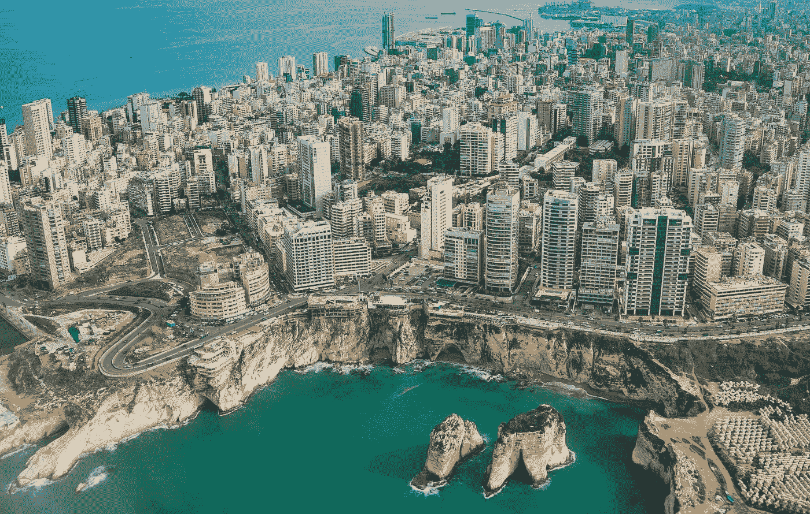

# 黎巴嫩的创业生态系统:社会企业家精神缺失的一环

> 原文：<https://medium.datadriveninvestor.com/lebanons-start-up-ecosystem-the-missing-link-of-social-entrepreneurship-4708ad854139?source=collection_archive---------6----------------------->

by [Piotr Chrobot](https://unsplash.com/@chrumo?utm_source=medium&utm_medium=referral) on [Unsplash](https://unsplash.com?utm_source=medium&utm_medium=referral)

自 2013 年实施黎巴嫩央行 331 号本地投资项目以来，贝鲁特迅速发展成为中东甚至不知道自己需要的科技初创企业中心。各种信仰的黎巴嫩国民的反向散居带来了更多人力资本和资源的回流，这是未来创新的燃料。包括 Berytech、SPEED@BDD、英国黎巴嫩技术中心和 AltCity 在内的生态系统推动者为知识经济中的企业家提供了试验、改进和扩大规模的机制。2018 年带来了投资者在未来几年寻找潜在退出机会的令人兴奋的挑战。毫无疑问，Circular331 的种子已经成长为一种成功的作物，投资的资金为黎巴嫩企业家和工程师创造了十年前没有人想象得到的机会。然而，331 号通知和这一新生的创业生态系统忽略了一个比任何部门都更有潜力大幅改善国家和地区未来的领域:社会和环境创业领域。

**黎巴嫩的环境和社会挑战**

在政治体制、宗教共存和地区影响力方面，黎巴嫩的历史和社会与众不同。黎巴嫩与其联合政治制度和战略地理位置相关的一系列战争挑战了人民保持强大和共同努力的能力，尽管令人生畏的经济和社会考验今天仍在继续。尽管央行通过 331 号通知等投资努力解决失业和缺乏金融刺激的问题，但它忽视了这些经济差异与该国面临的大量环境和社会挑战之间不可分割的深刻联系。

由于叙利亚危机，黎巴嫩人口增长了 25%,目前有超过 150 万叙利亚和巴勒斯坦难民，由此引发了黎巴嫩一些最严重的社会问题。这些难民需要食物、水、住所、医疗、教育和工作，而在黎巴嫩工作的非政府组织无法提供所有这些资源。严峻的形势导致难民在非正规经济中的工资比黎巴嫩人低得多，政府正在努力解决缺乏支持这些人的基础设施的问题。

在过去的 20 年里，黎巴嫩在废物管理方面面临着巨大的挑战，自 1997 年以来，贝鲁特和黎巴嫩山拥有私人废物管理系统，但该国其他地区没有得到任何援助。黎巴嫩各地涌现出数百个露天垃圾场，其中许多经常被焚烧，对附近居民的健康造成严重影响。该国缺乏国家废物管理系统导致了最近的紧急行动:2016 年开发了两个新的沿海垃圾填埋场，现在填充速度超过了预期。

伴随着黎巴嫩政府面临的许多令人生畏的社会和环境挑战，是经济中的高度财富不平等。根据基尼指数，印度是世界上第六个最不平等的国家，资源极度集中，最富有的 10%的人拥有 70%的财富。对于一个正在从 50 年断断续续的武装冲突中恢复过来的国家来说，这种程度的不平等极大地限制了经济、社会甚至环境层面可持续增长的机会。

**黎巴嫩社会企业家的成功故事**

因此，长期解决方案的第一步是将这些社会和环境原因与科技世界涌现的创业推动者和融资机制联系起来。黎巴嫩的社会企业家已经在将点与点连接起来，并取得了长足的进步。以下社会企业只是黎巴嫩众多变革者成功故事中的一小部分。

ShareQ

ShareQ 由萨梅尔·斯菲尔、埃利·马塔和尚塔勒·萨阿德创办，是一家非营利组织，致力于为黎巴嫩弱势群体提供金融普惠和创造就业机会。其中一个项目“M 社会餐饮”从难民和东道社区招募、培训和雇用面临社会、身体和经济挑战的妇女和青年，否则他们将无法养家糊口。ShareQ 还运行 ProAbled，为有身体残疾或经济困难的个人提供工作技能、心态准备、简历开发等方面的培训。培训之后，通过在线平台 ProAbled.com 进行工作整合，以便与雇主联系并促进就业。

INAASH

INAASH 成立于 1970 年代初，致力于支持黎巴嫩的巴勒斯坦社区，通过艺术宣传他们的遗产，并为巴勒斯坦难民妇女提供有尊严的就业。INAASH 培训难民营中的妇女设计高端的巴勒斯坦传统刺绣服装、家居用品和时尚配饰，然后以能够为这些妇女提供生活工资的价格出售这些商品。INAASH 不仅对巴勒斯坦社区产生了经济影响，因为它增强了这些妇女的社会权能，并努力与世界分享她们的遗产和文化。

MMKN

MMKN 致力于帮助公立学校系统，特别是九年级，旨在降低辍学率，让小学生能够继续接受教育。MMKN 招募和培训大学生作为志愿导师，帮助年轻学生准备中学入学考试，并教导他们教育的重要性。结果不言自明:在过去的 8 年里，MMKN 创建了一个由 220 名志愿导师组成的网络，覆盖了黎巴嫩各地的 1699 名学生，其中 96%通过了入学考试。MMKN 正致力于通过针对私立学校儿童的收费课外项目，提高财务可持续性。这些孩子的父母支付的费用为公立学校的贫困儿童项目提供了资金。MMKN 正在连接黎巴嫩的两个世界:贝鲁特美国大学、黎巴嫩美国大学以及 Balamand 和 Haigazian 的最有特权、最有动力的学生与来自资源不足的学校的儿童见面，弥合差距并为社会和学术学习提供机会。

这些只是许多社会创新者积极创造和努力改善社区的一小部分例子。黎巴嫩的社会创新生态系统是存在的，并且正在成长，但是它没有得到足够的关注和支持。

**为什么社会创新者被排除在外？**

与企业家、生态系统推动者和风投的一系列讨论表明，技术企业家可用的资源和 4 亿美元的 331 号通知很少被关注影响的企业家获得或向他们开放。为什么？

Beyond Reform & Development (BRD)的 Natalia Menhall 说,“331 号通知没有创造空间，也没有增加对社会影响的关注”,它“主要是为技术生态系统考虑的，直到最近，黎巴嫩的生态系统一直被认为与社会影响无关。她还解释说，需要对生态系统中的核心参与者进行更多关于社会影响和创新的教育，以及社会企业可以带来的潜力，以制定像 331 促进社会创业这样的有利举措。

世界银行的 Priya Vithani 补充说，“在许多投资界，社会企业家仍然被视为慈善工作”，围绕这一现象需要更多的文化意识。正如 Alfanar Venture Philanthropy 的 Michelle Mouracade 进一步解释的那样，投资者认为在 impact 上的支出是不必要的、昂贵的支出。对许多风险资本家来说，一个关注社会或环境的企业被视为一种风险，而不是一个机会。

尽管有这些观察，这项研究中几乎每一个来自科技生态系统的受访者都支持在这个国家更多的社会企业家的概念。英国黎巴嫩技术中心的 Elie Mouawad 解释说,“黎巴嫩的许多问题都是非常本地化的问题，社会企业可以成为解决方案。我们希望这些解决方案能够被政府采纳。”

虽然这种支持经常被公开，但技术生态系统的参与者并没有采取必要的措施将社会和环境企业家纳入他们的模型，而是像 Mouawad 一样回应说:“这不是我们的重点，但是如果我们确实有一个好主意的社会企业家，我们支持他们没有问题”。中东风险投资伙伴的 Rami Panayoti 对此表示赞同，他说:“在 MEVP，财务回报比影响重要得多。然而，我相信最成功的社会公司也是最值得投资的。所以，我们不歧视。我还知道，在黎巴嫩，市场需要社会影响力，社会企业家可以填补服务方面的缺口”。

SPEED@BDD accelerator 的 Kevin Schoucair 评论说，SPEED@BDD“拥有潜在巨大社会影响的初创公司”，但他们目前没有与将社会影响视为目标的企业家合作。SPEED@BDD 的一些客户包括 Spike，这是一款针对糖尿病患者的移动应用程序，以及 Teens Who Code，这是一个致力于帮助年轻人为科技职业做准备的组织。凯文认为这些初创企业是潜在的社区变革者，但如果投资者不关注社会影响或支持特定 se 的孵化器，就会错过很多机会。黎巴嫩的许多风险资本和加速器情况就是如此。

英国黎巴嫩科技中心的首席运营官拉玛·查希尔(Lama Zaher)认为，缺乏社会企业法律框架是进一步将社会企业纳入科技中心孵化模式的障碍。查希尔强调，“周围的所有企业都需要开始考虑它们的影响”，但接着说，“我们作为一个国家处于政策层面”，完全忽视了她的组织目前在更大规模上支持小企业的潜力。这是许多受访者的趋势。

BRD 的门霍尔得出结论，除非社会企业是一个超级社会企业，否则在试图满足 331 资助的投资者和加速器的需求时，很难保持他们的影响力。Berytech 的 Joanna Abi Abdallah 进一步解释了传统投资者和社会企业脱节的根本原因:“社会企业家很难用投资者理解的术语来量化他们的影响。他们需要看到可伸缩性对投资者来说真的很重要，他们需要用投资者的行话来解释他们的工作，并牢记他们的愿景。"

来自黛安基金会的 Tracy Achkar 是该国第一位环境影响投资者，她从风险投资家的角度肯定了这种对可扩展想法的需求。她解释说，黎巴嫩是一个利基市场——可以说是一个原型——在这里，企业家可以尝试一切，然后在国际上发展。对于社会和环境变革者来说，这几乎是不可能的情况，因为环境因国而异。当你为黎巴嫩创造一个创新的解决方案时，你不一定要像在另一个国家那样推广它。因此，风险资本家对不可扩展的业务不感兴趣。

LEAP Ventures 的创始人哈拉·法德尔举了一个恰当的例子，说明社会企业家在经历孵化项目和与风投合作时所面临的经历。Jalissa 是一家出色的社会企业，它经历了两个加速项目，然后向一位风险投资家推销。这位企业家决定在推介的任何时候都不提贾莉萨的社会影响，因为她担心如果风投了解公司的这一方面，他们就不会投资。法德尔对这种情况进行了反思:“我认为，当他们通过这些加速计划时，他们肯定会提高他们的创收能力，但他们不会受到影响。这对社会方面没有帮助，但也不能真正帮助他们筹集更多的资金。因为，从长远来看，将会有更多的资金从海外影响力投资者那里流入中国，而这些海外影响力投资者需要看到与影响力相关的关键绩效指标。”由于没有本地加速器或风险投资公司教授社会企业家如何将影响衡量纳入他们的推介，黎巴嫩的社会企业家在竞争与影响相关的资金时可能处于不利地位。

在风险投资和技术领域之外，与黎巴嫩社会企业家本身的讨论，突显了他们在生态系统中面临的各种各样但令人生畏的困难。

正如 INAASH 的 Mohammad Hassan 所强调的，缺乏对小企业的包容性不仅限于技术领域。哈桑解释说，“较大的非政府组织没有鼓励社会企业家精神，因为他们中的许多人，特别是那些与联合国有关的人，在削减预算方面有自己的问题，这导致了对当地小型、潜在依赖的社会企业的忽视。”MMKN 的奥马尔·哈比卜(Omar Habib)也有同感，他解释说，MMKN 过去和现在都经常被认为是一个“妇女组织”,在企业部门或主要国际捐助者那里不受重视。他们的创新模式和深刻的影响第一的思维模式实际上在一段时间内被视为可持续资金来源的障碍。传统投资者对社会企业持谨慎态度，但该地区的传统捐助者也是如此。

ShareQ 的萨梅尔·斯菲尔将部分责任归咎于黎巴嫩经济中一个更大的角色:消费者。萨梅尔解释说，“从财务上来说，作为一个系统工程师在黎巴嫩很难生存，主要原因是消费者还不积极支持。消费者倾向于去找大牌，而不是那些有社会影响力的人。因此，消费者群体很难应对。”Sfeir 提供了一个挑战的例子，解释了他以社交为重点的餐饮业务的潜在客户如何愿意花 150 美元购买一家声誉良好、备受推崇的餐饮公司，该公司提供的配方与 M Social 餐饮公司提供的 50 美元相同。他解释说，黎巴嫩社区“不幸的是，喜欢声望，他们更愿意为更令人印象深刻的名字支付更高的价格”。在社会企业在黎巴嫩变得有声望或流行之前，这将是另一个进入壁垒。

Diane 基金会的 Achkar 从环境角度回应了 Sfeir 的观点。她解释说，大多数消费者在购买时不会考虑生态意识。这个问题的部分原因是企业家高估了他们的产品，以至于某些人买不起。在其他市场，环保商品可以作为奢侈品出售，但在黎巴嫩不行。根据 Achkar 的说法，大约 20%的黎巴嫩消费者买得起奢侈品，其中许多人宁愿从欧洲购买奢侈品。他们看不到仅仅因为可持续而购买更贵产品的吸引力。

**建议:让社会企业家更容易进入生态系统**

*“虽然黎巴嫩绝对有潜力成为地区科技创业中心，但由于固有的基础设施、法律和投资障碍，这一过程可能需要几十年时间，这些障碍阻碍了真正数字经济的创建。对于科技企业家来说，这意味着需要从一开始就制造全球产品(这是一件好事)，并最终将部分高管团队转移到海外，以发展自己的公司，并靠近他们的主要客户和投资者(这是黎巴嫩的人才损失)。如果你关注社会企业家，你会注意到在黎巴嫩有大量的机会，因为我们周围有无数的社会问题；换句话说，社会企业家可以很容易地进入当地市场，并在黎巴嫩彻底测试他们的商业模式，然后通过在他们扩张到的国家的伙伴关系和当地招聘扩展到其他国家。虽然我对科技企业家有偏见，但我相信社会企业家有一个黄金机会在黎巴嫩建立有利可图的企业，并在这个过程中履行更高的社会使命。”——Abdallah Jabbour，黎巴嫩企业家(LFE)*

正如生态系统中的许多参与者所强调的那样，社会企业家精神既有发展的机会，也有发展的需要，并成为黎巴嫩经济的一个重要组成部分。然而，要实现这一点，事情需要改变。以下建议涉及社会企业家在黎巴嫩面临的挑战的不同方面，这些建议的实施将为该国的社会创新提供坚实的道路。

*1。* *应该为社会和环境企业家提供更多创新的融资机制和资金选择。*

目前，在该国工作的唯一有影响力的投资者是 Alfanar Venture Philanthropy 和 Fondation Diane。正如萨梅尔·斯菲尔所说，黎巴嫩真正缺少的是社会企业的中间资金。你可以从 Alfanar 获得 40 万美元，从外国投资者那里获得大约 100 万美元，但这 40 万到 100 万美元是扩张和可持续发展的关键。许多外国投资者不会资助一家之前没有获得 30 万到 50 万美元投资的社会企业。总体而言，需要更大的融资机会和更多的股权或特许权投资基金。另一种选择是围绕影响力衡量和影响力投资的概念对黎巴嫩的现有投资者进行教育，并鼓励他们积极将影响力企业家纳入其投资组合。然而，更多深入了解社会创新领域的影响力投资者可以确保该行业的长期增长。

Zeina Saab 提到了社会影响债券(SIBs)或其他混合融资模式的潜在实施，这些模式可以鼓励政府、基金会和投资者之间的合作。

*2。* *黎巴嫩政府需要开始积极支持社会企业，并将其纳入政府计划。*

社会企业 Jardins d'Eden 的创始人 Rima Nazer 解释说，在黎巴嫩做生意要花一大笔钱，因为作为社会企业从银行获得贷款几乎是不可能的，而且没有向政府注册的明确协议。社会企业法律形式的发展将改变该国的游戏规则，但政府对制定任何法律框架都没有太大兴趣。第一步至少是让社会创新者参与政府项目和竞赛。

*3。* *围绕社会创新的交流需要加强。*

很大一部分黎巴嫩人不知道什么是社会企业家。来自 Alfanar 的 Michelle Mouracade 敦促说，“我们需要更多地谈论它对社会的影响，特别是在创造就业方面，以及它如何使人们摆脱贫困。”她解释说，总理办公室最近要求联合国开发计划署提供关于黎巴嫩中小企业的统计数据，以及它们在过去三年中取得的成果。开发计划署的代表决定，他不仅要给出中小企业的结果，而且还要看看社会企业的结果，他发现，在创造就业方面，社会企业比中小企业做得更多。这是需要与投资者、公司、政府和潜在企业家分享的信息，因为对这种深刻的可持续影响理解得越多，就会有越多的拥护者。

Caroline Fattal Fakhoury 赞同这一观点，并补充说，生态系统需要减少封闭性，提高透明度。生态系统越多地交流其成就和挑战，越多的人就会理解社会创新在这些社区中的作用。

*4。* *涉及私营部门。*

Fakhoury 还指出，私营部门和社会创新生态系统之间的合作很薄弱。大多数小企业从种子投资者和天使投资者那里寻求资金，而此时或许公司会对投资感兴趣，但他们不知道如何弥补与创业者之间的差距。与公司投资者的不同之处在于，他们可能是战略投资者，与被投资者合作，比寻求在五年内退出的种子投资者更加长期。

Michelle Mouracade 更尖锐的观点是，企业应该考虑社会采购，并将社会企业纳入其供应链。因为黎巴嫩是一个小市场，这些合作对这些社会企业的成长绝对是关键。此时，小企业无法与大企业竞争，但如果黎巴嫩企业与这些变革者结成战略伙伴，这可能是一个双赢的局面。

*5。* *支持和培养社会企业家。*

Arcenciel 的 Kim Issa 评论说，“许多社会企业家有着美好的意图，但仍然没有足够的商业知识来经营一个成功的企业。你必须同时具备商业和社会知识才能成功”。许多受访者对此表示赞同，尽管除了 Alfanar 的名为 Alfanar 可持续社会企业培训(ASSET)的 10 模块培训计划之外，黎巴嫩目前没有针对社会企业家的培训计划。此外，参与传统孵化和加速计划的社会企业家缺少重要的特定社会创新技能发展，如影响测量和讲故事。

**包容性可以持续下去:包括边缘化人群**

一旦社会企业能够获得更具支持性的基础设施和资金，包容性就可以而且应该超越这些生态系统，将边缘化和资源不足人口中的创新者纳入进来。

Fakhoury 指出，“创业公司的人往往是商学院或商学院的毕业生——我见过的那些人都是有特权背景的人，做这件事需要很多钱。我认为今天仍然是有特权的人从事创业文化。对于来自弱势背景的人来说，创业需要很多……仅仅是有收入。”她进一步解释了将来自贫困背景的企业家纳入其中的重要性，指出他们中的许多人遭受着上层阶级从未见过的痛苦，如果给予适当的支持，这些人可以成为其社区中最有效的变革者。

ShareQ 的萨梅尔·斯菲尔表达了类似的观点，他说:“我们希望社会企业家将成为每个人的选择。但是开始是超级有挑战性的，你需要负担得起这个。你可能在 3-4 年内只有一半的薪水，对诱人的工作机会难以容忍。我总是得到国际非政府组织的经理职位，薪水大约是我的两倍。就我而言，我拒绝了这些邀请，不是因为我太富有，而是因为我相信我们在 ShareQ 所做的事情。如果我有家庭和孩子，我可能会再考虑 3 到 4 次。”因此，边缘化或资源不足的社会企业家的准入门槛甚至高于社会企业家，因为这些人往往是最有想法的，并准备在实地工作，确保产生影响。

令人兴奋的是，来自 Nawaya 网络的 Zeina Saab 正在努力做到这一点:通过创业赋予难民解决其社区问题的能力。她认为赋权是这项工作最重要的方面，因为当你被告知你有能力和支持来解决你所在社区的问题时，即使在最绝望的情况下，你也能找到意义和灵感。

风险投资家和区域变革推动者哈拉·法德尔从投资者的角度评论了包容问题，他表示，大多数风险投资公司在将边缘化群体纳入其项目方面做得不多。然而，LEAP Ventures 已经将对风险人群的关注纳入了他们基金的 KPI，因为他们是一只 ESG 基金。法德尔认为这是显而易见的，他表示“如果不考虑我们生活的环境，很难在黎巴嫩生活。因此，LEAP 有许多公司雇用资源不足的人，如果这些人有逻辑和数学能力，技术提供了一个独特的机会在 6-12 个月内培训他们。如果难民和贫穷的黎巴嫩人抓住这个机会，他们可以得到一份 5000 美元的高薪工作，这将改变这些社区的生活。”

**生态系统促成因素:今天做了什么来改善明天**

黎巴嫩生态系统中的变革者正在尽可能积极地支持社会企业家。随着环境的变化和发展，强调正在采取的步骤非常重要。

纳瓦亚网络

2011 年，Zeina Saab 成立了一个非营利组织，旨在支持缺乏技能发展资源和指导的贫困青年。Nawaya 网络帮助这些年轻人联系到导师、培训师、资金机会和他们自己无法获得的物质供应——所有这些都可以帮助他们发展自己的才能和技能。随着 2013 年黎巴嫩社会环境的变化，Nawaya 网络不断发展，以考虑叙利亚难民涌入该国以及纳入他们的具体需求。

贫困、极端主义、犯罪和青年失业率都在上升。2015 年，Zeina 和她的团队坐下来考虑这些更紧迫的社会问题，并调整他们的计划，以便他们可以继续致力于青年的发展，但要让他们感到经济上有能力，帮助他们自立，并帮助他们在更不稳定的环境中增加收入。他们决定将人才作为创收的手段。新计划包括 SE Factory，这是一个针对青年的编码训练营 Talent Program，将资源不足的青年与改变生活的机会联系起来 Impact Lab，这是一个针对失业的黎巴嫩和难民青年的设计思维和业务发展培训计划。Impact Lab 帮助黎巴嫩青年和难民青年创造性地思考如何创办自己的小企业来创收。由于工作机会很少，特别是对难民来说，Nawaya 网络帮助他们想出一种产品或服务，他们可以向社区出售，但也触及他们可能有的天赋或激情。一些例子包括年轻人在巧克力制作、肥皂制作、缝纫、农业和教育方面发挥他们的才能。影响实验室设计思维和业务发展培训促使学生考虑他们社区中的挑战、差距以及如何解决它们。他们问自己:我有什么技能可以应对这些挑战？我如何从这些技能中赚钱？我们如何保持这种持续状态？

这个项目正在创造一代社会企业家，并为他们提供支持结构，这将有望产生连锁反应。

黎巴嫩社会企业家中心

LSE 是当地社会企业家、学者和投资者之间的合作项目，旨在增强黎巴嫩社会企业的能力。伦敦经济学院由 ShareQ、Beyond Reform & Development、Alfanar 和其他人发起，将作为一个生态系统推动者，帮助创建和组织社会企业部门，引进投资者，并积极致力于社会企业法律框架的发展。截至 2018 年 6 月，LSE 成立了一个专家评估委员会，该委员会将制定社会企业标签，以授予黎巴嫩的合法 SE。他们将逐一评估每个社会企业，以检查其是否满足适当的要求:注重影响、可持续、创新等。我们的目标是，这个标签最终可以被政府用来授予组织社会企业的法律地位，淘汰绿色/社会清洗企业，并包括创新的非营利组织。伦敦经济学院目前正在计划的另一项行动是购买社会活动，他们将在该国最大的公司中推广社会采购。

黎巴嫩社会企业家中心可能会填补支持所有社会创新的主要生态系统推动者的空白，它与其他行为者的合作暗示了一个充满希望的未来生态系统。

Arcenciel

第一个黎巴嫩社会企业 arcenciel 成立于 1985 年黎巴嫩内战期间，目的是支持黎巴嫩最贫困和边缘化的社区。arcenciel 的引人注目之处在于，它是第一个为所有社区服务的非营利组织，无论宗教、政治派别或国籍如何。由于这在当时分裂的政治环境中几乎是不可能的壮举，arcenciel 无法接受捐款，而是发展了持续至今的创收活动。其使命是通过支持围绕环境、健康、青年赋权、负责任的旅游和社会支持的行动来促进多样性、一体化和发展。

除了本身是一家社会企业之外，arcenciel 现在还是一个关键的生态系统推动者，填补了孵化器、加速器和其他机构留给社会企业家的空白。它们是一个开放的资源，供企业家就法律问题、融资模式、从非政府组织向社会企业的转变以及影响衡量等问题寻求建议。它们还提供一个物理空间来支持社会企业功能，这个物理空间允许社区内更多的协作和授权。

黛安基金会

黛安基金会成立于 2016 年，是当今黎巴嫩生态系统中唯一的官方环境影响投资者。Diane 基金会除了其教育计划之外，还管理着 Viridis 投资基金，孵化绿色创业公司，举办竞赛，授予奖项，并为其他投资者提供一个平台，以发现黎巴嫩最有前途的环境企业家。

超越改革与发展(BRD)

BRD 是一家使命驱动的咨询公司和社会企业，专门从事政策研究、公共管理和能力发展。在黎巴嫩，BRD 一直在绘制社会企业生态系统图，致力于制定社会企业法律框架，汇集生态系统参与者，以推进这一政策，并提高对社会企业家概念的认识。BRD 还开发了一些工具，如 arcenciel SE 孵化器、Nabad 和当地大学的社会企业家课程。BRD 帮助民间社会组织过渡到更可持续的融资和影响模式。

阿尔法纳尔风险慈善事业

Alfanar Lebanon 是仅在阿拉伯地区工作的第一个 VP 组织的分支，致力于帮助社会企业提高财务可持续性，从而改善更多人的生活。Alfanar 为基层组织提供量身定制的财政支持和技术援助，帮助他们变得更加高效和创新。黎巴嫩的许多社会企业家表示，需要“十个以上的 Alfanar ”,因为像 Alfanar 这样的影响力投资者不仅提供急需的资金，还提供网络和指导，以帮助社会企业实现其目标。

**结论**

黎巴嫩的创业生态系统的增长是一个令人兴奋和迷人的现象，无论如何都不应该低估这个生态系统中以技术为重点的方面。相反，技术生态系统可用的资源和支持是社会企业家应该能够获得的工具，而社会企业家培养的技能和实地知识也可能对技术企业家有所帮助，特别是在技术和环境可持续发展的交叉领域。

正如 Zeina Saab 所表达的，难民的涌入和黎巴嫩的环境危机促使生态系统思考社会企业家精神，跳出编码和复制粘贴的想法，考虑当地问题和初创企业在这些社区中的作用。随着更多成功故事的分享，就连央行也开始质疑社会创新。Berytech 的 Constantin Salameh 解释说，捐助者现在询问环境创业公司和影响考虑，大型风险投资基金最终需要考虑社会包容才能生存。

这些趋势并不意味着 2018 年在黎巴嫩市场导航对社会和环境企业家来说很容易。他们面临资金缺口、社会排斥、政府忽视和可扩展性限制。

然而，对于社会企业家的支持者来说，一个令人欣慰的提醒是，尽管有各种障碍，社会企业家决心实现他们的影响。环保初创企业 IO Tree 的克里斯蒂娜·查科举例说明了这一现象:

*“在我们与孵化器和加速器的整个经历中，我们试图询问导师他们正在做什么或者我们应该做什么，但是这些问题总是被忽视和忽略。然而，在我们训练的每一步，我和我的搭档都会打开一扇窗，问‘我们产生了什么影响？’，无论是经济还是环境。因为在我们看来，你的成功取决于你的影响有多大。盈利或者营收其实并不重要，重要的是产生影响，留下痕迹。”*

**致谢**

感谢我在这个项目中的两位优秀导师，东北大学的 Sophie Bacq 博士和耶鲁大学及 Alfanar 的 Teresa Chahine 博士。没有你，这项工作是不可能完成的。

这项研究是对黎巴嫩社会、环境和技术创业生态系统中的行为者进行 22 次采访的结果。这些鼓舞人心、积极向上的个人在中东北非地区留下了巨大的印记，他们的故事都值得分享。

感谢您:

乔安娜·阿比·阿卜杜拉——贝瑞泰克

Tracy Achkar 黛安基金会

法迪·比兹里——B& Y 合伙公司

克里斯蒂娜·查科—木卫一树

哈拉·法德尔——飞跃创投

Caroline Fattal Fakhoury-Alfanar，代表妇女

奥马尔·哈比卜——MMKN

穆罕默德·哈桑·伊纳什

金·伊萨·阿肯塞尔

Abdallah Jabbour——企业家的黎巴嫩(LFE)，SPEED@BDD

杰里·麦克纳利——有道理

娜塔莉亚·门霍尔——超越改革与发展

Elie mou Awad——英国黎巴嫩技术中心

米歇尔·穆拉卡德·阿尔法纳尔

帕纳约蒂支

Rima Nazer——伊甸园

zeina Saab-SE 工厂

康斯坦丁·萨拉梅—贝瑞泰

Kevin Schoucair —速度@BDD

萨梅尔·斯费尔·沙克，黎巴嫩社会企业家中心

Priya vit Hani——世界银行

Lama Zaher——英国黎巴嫩技术中心