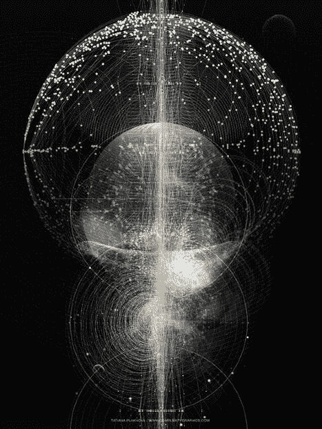

# 遗留和提炼复杂系统

> 原文：<https://medium.datadriveninvestor.com/legacy-and-distilling-complex-systems-997123b06bd8?source=collection_archive---------8----------------------->

当思想倾向于在回家的漫长旅途中漂移时，它们不可避免地转向对人类状况的假设。

这一次，从系统理论出发，它们变成了人类逃避现实的欲望和(我认为是我们的)“留下遗产的要求”。

我将指出我的几个观点，并希望在未来的文章中进一步阐述这些观点— *对于本文的内容，您可以选择跳过这些观点*:

1.  只有系统本身能够建立系统的突现属性——它决定着增长的方向——它引导着增长。这里的要点是，*涌现的*地产来自于推动这种增长的更大的*规模*。
2.  只有*无限*系统，才能建立一个*无限*涌现属性

—如果进一步探索，我可以把这看作是“上帝”的潜在论据(请尝试去除这里的宗教内涵—这只是对“现实的无限合作系统”的总结)

*撇开题外话，这是思想最终引导我们的地方……*

人类希望留下遗产——他们希望作为有限的能量群产生无限的影响——我们是雄心勃勃的生物，渴望超出我们能力范围的影响。

给定可用的能量资源(时间只是能量扩散的一种度量)，我们试图将自己扩展到我们的“局部”影响区域之外——我们所能达到的界限。

和所有生命一样，我们努力成长——生命试图扩张并最终控制它的环境。

生活中有两种策略可以做到这一点——区别在于长期成功。

1.  *配合*主持人
2.  *主宰*宿主

考虑一下从宿主体内吸收比可用资源更多的资源的“病毒”,以及那些吸收更少的资源的“病毒”——后者是净积极的。成为寄生虫总比彻底感染或感染病毒来侵蚀宿主的生命要好。

*合作*不如主导，因为这意味着*双方*的最终生存。

现在看看地球作为人类的宿主——我们能看到一些相似之处吗？

从某种意义上说，我们是地球的寄生虫，只有现在我们的影响才是显著的——因为相对于我们的宿主，我们正在接近一个“可怕”的点。

很快，我们会超越它——很快，我们会杀死我们的宿主——所以我们正在寻找一个新的，可持续地*吸取和转化能量的*。帮助我们生存的新宿主。

我们*需要*一个。

人类是相互依赖的——彼此之间以及与他们所在的各种系统之间。移走一个人，孤立地看，他会死。

现实的*完整的*生态系统是复杂且错综复杂的，确实是无限的。然而，有一些“微型”系统——比完整完整的系统尺度小，但仍然巨大而复杂得不可思议——我们可以聚集起来形成一个结构的表象和我们对现实的理解的模糊图像。

正是在研究这些系统的过程中——那些我们可以理解的系统，那些我们在缺乏客观数据和真相的情况下必须依赖的系统——我们开发出了存在的模型。

没有一个模型会包含真实而完整的现实视角——但它可能会以一种简单易懂的方式阐明一个系统或系统集合的功能——例如，你不能吃一头牛，但你可以吃一块牛排，这块牛排展示了牛的 1:1 子集，但永远不会超出它的范围。

看任何东西*特别是*都是有限制的——“视觉”只是一种感觉，不考虑自身以外的其他系统，在这种情况下，是感觉系统——但我们需要简化以便消化。

我们必须*将*转化为我们的尺度，以便设计出可连接的结构。

那样做，意味着那个信息失去了完美，但是完美只能在现实本身中找到。

只有生命才能创造生命——生命是我们系统的一种突现属性，需要一个系统网络才能继续存在。

将复杂提炼为简单，将方法带入疯狂的过程，摧毁了真理，但创造了意义。