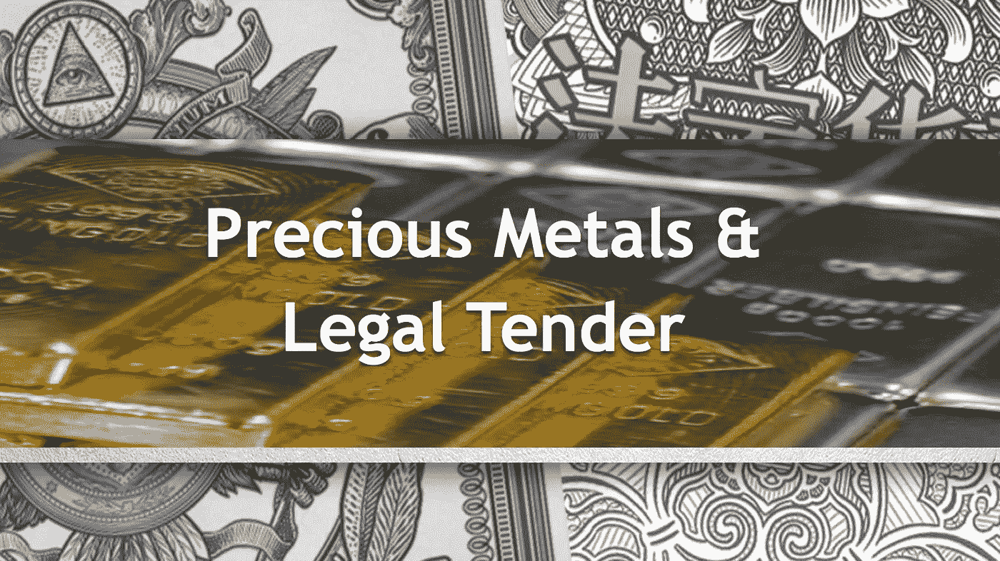
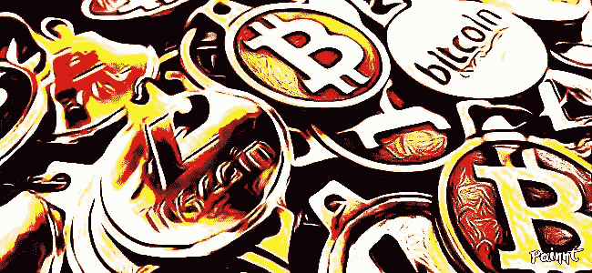

# 法定货币、贵金属和未来的货币

> 原文：<https://medium.datadriveninvestor.com/legal-tender-precious-metals-and-the-currency-of-the-future-404efd363c6c?source=collection_archive---------0----------------------->

在历史上的大部分时间里，我们的交换媒介和价值储存手段保持不变。尽管数百年来发生了很多变化，但我们的货币和黄金遵循着与首次推出时相同的规则和原则。

但重大突破第一次引领我们迎来了一种新货币的曙光，这种货币就像现有的系统和资产一样被广泛接受。

首先，重要的是理解我们是如何到达那里的。

# 法定货币:用于买卖的货币

> 用专业术语来说，法定货币是“法律认可的任何官方支付媒介，可以消除公共或私人债务，或履行财政义务。”

法定货币，也称为货币或金钱，持有由发行者创造的价值。例如，美元是最受欢迎和最强大的货币之一，由美国财政部发行，作为国家货币。美元被用来购买商品和服务，无论是在当地餐馆就餐，还是为抵押贷款融资。金钱为许多弱势群体提供了机会，并操纵着整个国家的经济。

尽管金钱创造了许多好处，但它也是许多弊端的根源。银行和其他金融机构可以因为你不遵守他们的规则而扣留你的钱，这已经造成了多年的严重不平等。一些国家，如希腊和委内瑞拉，由于货币贬值，经历了经济衰退和革命。

当时期变得动荡和不确定时，人们会转向投资替代产品，有时被称为“价值储存”。

# 贵金属:稀有而有价值的投资工具

贵金属是不言自明的——它们是价值很高的稀有金属。最受欢迎的贵金属是黄金、铂金和白银，可以通过购买期货合约、共同基金或金条(实物金条或硬币)来购买。

每当一种货币经历波动时，贵金属就会成为有吸引力的资产。与国家货币相比，它们不仅被普遍认为是有价值的，而且随着时间的推移，它们的价值储存保持一致。

与法定货币类似，贵金属作为一种有价值的资产可能会出现短缺。高额的手续费和加工费以及陡峭的投资学习曲线使得普通大众很难依赖贵金属。

这让我们想到了加密货币和加密代币，这是一种全新的数字货币形式。

# 加密货币:未来的货币

随着越来越多的公司和国家认识到最受欢迎的加密货币比特币的价值，加密货币在过去几年中成为头条新闻。自 2009 年首次推出以来，比特币和其他替代货币的价值已呈指数级飙升。

由匿名中本聪创建的比特币和其他加密货币使用了一些新颖的技术，有助于避免货币和黄金经历的一些相同的陷阱。

加密货币是数字化的，它只存在于电脑或手机上的数字钱包中，因此每笔交易和余额都保留在公共账本上。加密货币不由第三方发行或控制。这意味着没有任何公司或国家可以设定或定义加密货币的价值。有了加密技术，加密货币就不能被复制或伪造。

# 昆特里克:未来的加密货币

谜题的最后一块是一个将法定货币、贵金属和加密货币以如此新颖的方式结合起来的想法，其影响尚未实现。

Quintric 是一种新的货币系统，提供加密代币，1)使用与其他加密货币相同的技术，2)存储金银支持的价值，3)可用作法定货币和交易媒介。

五分硬币系统由五个代币组成:金特(由五个美国金币支持)、五分硬币(由五个美国银币支持)、iQuint 和 iQuintS(代表国际金银)和金特 X(早期金特创造者和投资者可获得的特殊资产)。没有招致任何保管费用，可用作法定货币，并应满足要求，以符合税收。与其他需要数小时才能完成交易的加密货币不同，Quintric 令牌运行在 Bitshares 平台上，提供了无与伦比的速度和效率。

当金特启动时，它将成为一个独特的经济实验，一个数百年来商业和投资方式的范式转变。在他们的网站上了解更多关于 [Quintric 的信息。](https://quintric.com/)

# 一个值得相信的未来

技术的发展与不断变化的全球经济格局相结合，带来了这一时刻——一种彼此做生意的新方式，从购买另一个国家的产品到投资可靠的资产。

一路上肯定会有挑战，从国家监管到网络威胁，但在很大程度上，加密货币继续彻底改变着世界各地人们的生活。虽然加密货币的未来仍然不确定，但加密货币将带来一个令人兴奋和充满希望的未来。

*作者不是律师或财务顾问。作者希望读者注意，他是 Quintric 的联合创始人和董事会成员。呈现的任何内容都不应被解释为投资建议或法律建议。*