# LeNet-5——经典的 CNN 架构

> 原文：<https://medium.datadriveninvestor.com/lenet-5-a-classic-cnn-architecture-c87d0b03560d?source=collection_archive---------3----------------------->

Yann LeCun、Leon Bottou、Yosuha Bengio 和 Patrick Haffner 在 1990 年代提出了一种用于手写和机器印刷字符识别的神经网络体系结构，他们称之为 LeNet-5。该架构简单易懂，这就是为什么它通常被用作讲授[卷积神经网络](https://engmrk.com/convolutional-neural-network-3/)的第一步。

# LeNet-5 架构

Original image published in [LeCun et al., 1998]

LeNet-5 架构由两组卷积和平均池层组成，随后是平坦卷积层，然后是两个全连接层，最后是 softmax 分类器。

**第一层:**

LeNet-5 的输入是 32×32 灰度图像，它通过具有 6 个特征图或滤波器的第一卷积层，特征图或滤波器的大小为 5×5，跨距为 1。图像尺寸从 32x32x1 变为 28x28x6。

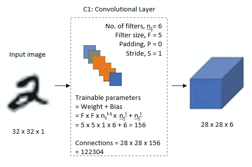

C1: Convolutional Layer

**第二层:**

然后 LeNet-5 应用平均池层或子采样层，滤波器大小为 2×2，步长为 2。生成的图像尺寸将缩小到 14x14x6。

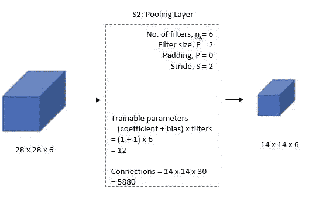

S2: Average Pooling Layer

**第三层:**

接下来，第二个卷积层有 16 个特征映射，大小为 5×5，步距为 1。在该图层中，16 个要素地图中只有 10 个连接到前一图层的 6 个要素地图，如下所示。

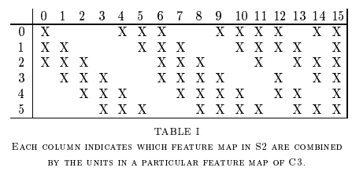

Snapshot of TABLE 1 from [LeCun et al., 1998]

主要原因是打破了网络中的对称性，使连接数保持在合理的范围内。这就是为什么这一层中的训练参数的数量是 1516 而不是 2400，同样，连接的数量是 151600 而不是 240000。

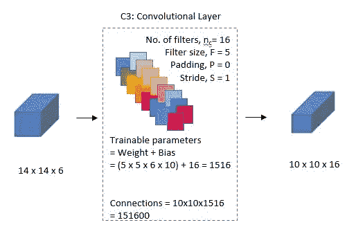

C3: Convolutional Layer

**第四层:**

第四层(S4)也是一个平均池层，过滤器大小为 2×2，跨距为 2。此图层与第二个图层(S2)相同，只是它有 16 个要素地图，因此输出将减少到 5x5x16。

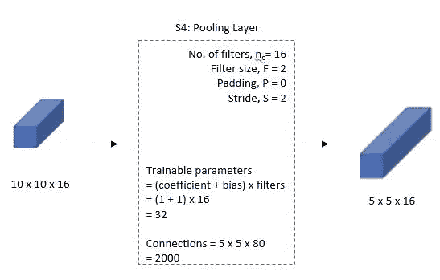

S4: Average Pooling Layer

**第五层:**

第五层(C5)是具有 120 个特征映射的全连接卷积层，每个特征映射的大小为 1×1。C5 中的 120 个单元中的每一个都连接到第四层 S4 中的所有 400 个节点(5x5x16)。

C5: Fully Connected Convolutional Layer

**第六层:**

第六层是具有 84 个单元的全连接层(F6)。

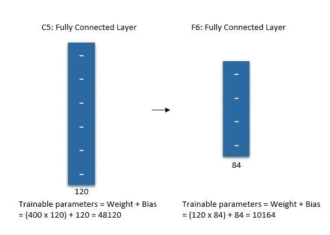

F6: Fully Connected Layer

**输出层:**

最后，有一个完全连接的 softmax 输出层ŷ，具有 10 个可能的值，对应于从 0 到 9 的数字。

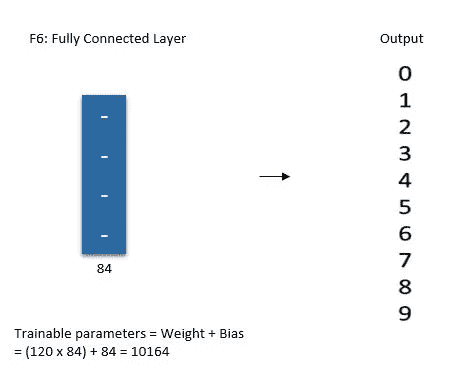

Fully Connected Output Layer

## LeNet-5 架构综述

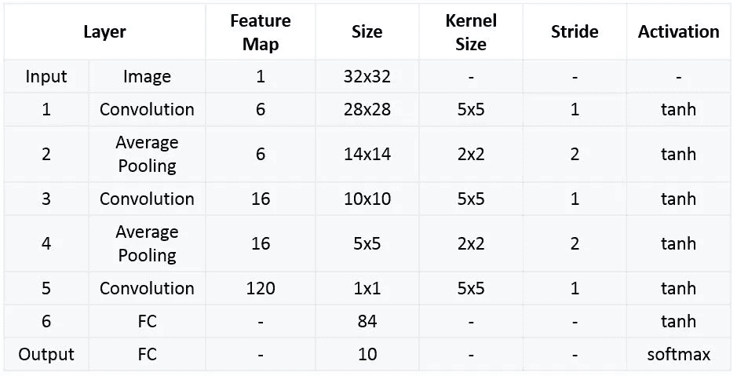

LeNet-5 Architecture Summarized Table

# 使用 Keras 实现 LeNet-5

## 下载数据集并标准化

我们将在 Keras API 下下载 MNIST 数据集，并像我们在之前的帖子中所做的那样对其进行规范化。

详情请访问:[使用 Keras 实现 CNN](https://engmrk.com/module-22-implementation-of-cnn-using-keras/)

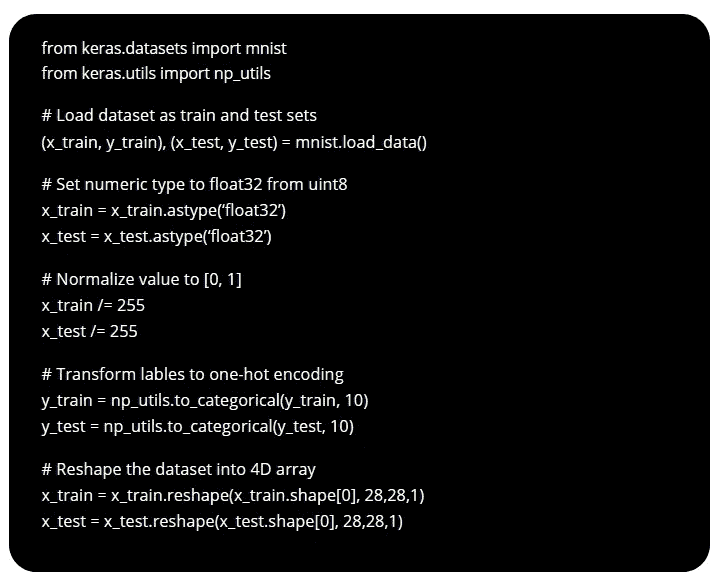

## 定义 LeNet-5 模型

使用顺序模型 API 创建模型对象的新实例。然后按照前面讨论的 LeNet-5 架构向神经网络添加层。最后，用“分类交叉熵”损失函数和“SGD”成本优化算法编译模型。在编译模型时，添加 metrics=['accuracy']作为计算模型精度的参数之一。

*需要强调的是，MNIST 数据集中的每幅图像的大小都是 28 X 28 像素，因此我们将对 LeNet-5 输入使用相同的尺寸，而不是 32 X 32 像素。*

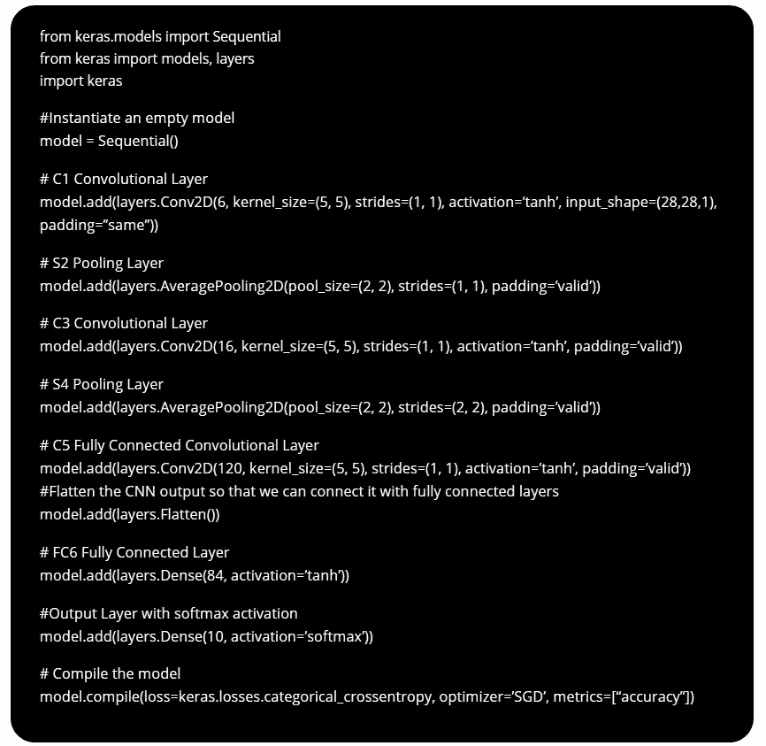

我们可以通过调用 model.fit 函数来训练模型，并传入训练数据、预期输出、时期数和批量大小。此外，Keras 还提供了一个工具来评估每个历元结束时的损失和准确性。为此，我们可以使用“validation_split”参数拆分训练数据，或者使用另一个使用“validation_data”参数的数据集。我们将使用我们的训练数据集来评估每个历元后的损失和准确性。

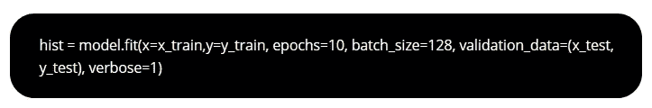

## 评估模型

我们可以通过调用 model.evaluate 并传入测试数据集和预期输出来测试模型。

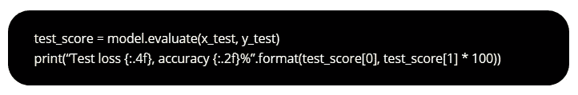

## 可视化培训过程

我们将通过绘制每个历元之后的训练精度和损失来可视化训练过程。

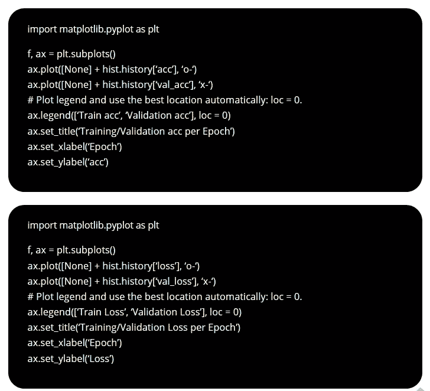

# 摘要

*   我们详细了解了 LeNet-5 架构。
*   我们学习了使用 Keras 实现 LeNet-5。

[点击这里下载 ipython 笔记本](https://estore.engmrk.com/product/lenet5-implementation-using-keras/)

*原载于 2018 年 9 月 30 日*[*engmrk.com*](https://engmrk.com/lenet-5-a-classic-cnn-architecture/)*。*