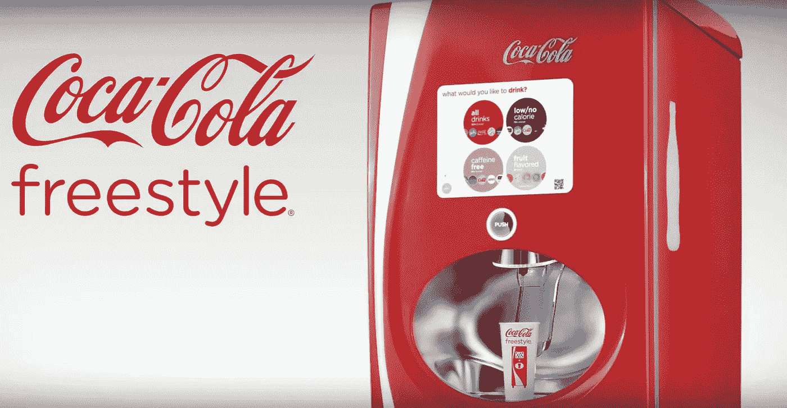

# 更少的选择—更好的用户体验

> 原文：<https://medium.datadriveninvestor.com/less-choices-better-user-experience-eff78f060295?source=collection_archive---------24----------------------->

Don’t be this machine.

根据上下文而不是内容来设计用户体验自然会减少选择。想想吧。当你去 Amazon.com 的时候，你会被大量的内容和导航菜单和选项所淹没。只有当你开始检查，一个更小的环境被设置好，你才会感觉不那么难以应付。菜单和 *chrome* 被移除，你的选择只*与购买环境相关*。另一方面，如果你在 Twitter.com，选择会少得多，菜单也会小得多。到了之后语境就小了。你甚至不会感到不知所措。

设计一个好的 UX 最困难的部分之一是预测用户需求并交付工具，而*只在他们需要的时候*交付这些工具。虽然用户研究和用户测试可以帮助我们区分用户在某个页面上最有可能寻找什么，但这需要时间和巨大的成本。用过多的选项填满一个页面，并使用指标来查看用户选择了什么，会给人留下不好的第一印象。这种压倒性的感觉会让用户远离你的产品。

让我用一个真实的例子来说明选择的数量如何与用户体验直接相关。你见过可口可乐的自由式机器吗？它有触摸屏和无限的选择，可以手工制作任何你想要的苏打水鸡尾酒。听起来很棒，对吧？

> 它有触摸屏。它有 187 种口味组合。这是未来之路。

不幸的是，这些机器提供了糟糕的用户体验。你有没有发现自己排队只是为了买一杯传统汽水？让我们经历一次与可口可乐自由式机器的邂逅。要得到冰，你按一个杠杆。要选择一种饮料，你必须在一个滞后的触摸屏上做出两个，也许三个选择。一旦你选择了你渴望的含糖饮料的大圆形按钮，你的饮料最终开始分配。不，你必须按下一个物理按钮？！大量的选择和不熟悉的触摸界面要求每个人做出无数的决定和选择，只是为了得到他们的饮料。一次只有一个顾客可以操作它。不要再说“向左走，让你后面的人拿冰”了。相比之下，传统的汽水机只有一种选择——选择是清楚地呈现出来的，我选择我的饮料，然后简单地按下控制杆就可以装满我的杯子，而不用想太多。我没有被在屏幕上触摸什么，什么时候按下按钮，或者控制杆会做什么所困扰。当然，我做不出覆盆子和桃子混合的雪碧，但是要付出什么代价呢？

幸运的是，我们制造的大多数产品只能通过触摸屏使用，而不是人们不耐烦地在你身后等待的杠杆、物理按钮和数字按钮的混合。

当制作 UX 页面流时，我们需要认识到用户所处的环境，并根据环境仔细制作选择的数量。屏幕上的每一个按钮都有一个认知权重，每增加一个按钮都会成倍地增加辨别页面用途和下一步该做什么所需的思考。需要考虑的越少，你的产品就越容易使用。

当开发原型时，不要害怕将复杂的特性分成几页。作为开发商，我们是我们产品的城市规划者。我们建造我们应用程序的所有道路和十字路口，我们有无限的土地来开发。我们有能力以我们认为合适的方式指挥交通。有了现代的浏览器和今天功能强大的手持处理器，另一个选择较少的页面是一个成本相对较低的提供高价值的页面。现在的用户不怕走丢无路可退。他们也不怕打碎东西。用户希望能够*撤销*事情，并轻松找到返回的路。他们本能地轻松滚动、导航和探索页面上的每个像素。这是一个很棒的启示，然而，它并不证明把所有功能都放在一个页面上，让用户筛选他们*想做或不想做的事情是合理的。当一个产品的页面是页面的瑞士军刀时，用户很可能会认为你的产品复杂难用。*

大多数网络应用的范围很窄，通常做一些非常具体的事情。我们拥有*独一无二的*机会来评估我们的用户偏好的上下文，并与我们的产品进行深思熟虑的无缝交互。

作为 UX 设计师，我们面临的挑战是在少即是多和瑞士军刀之间找到平衡。小心修建你的道路。

请支持这篇文章与你的👏👏👏帮助它传播给更广泛的受众。无论如何，请在下面分享你的想法。