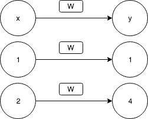

# 不到一个简单的神经网络介绍(2/4)

> 原文：<https://medium.datadriveninvestor.com/less-than-a-simple-introduction-to-neural-networks-2-4-35326721f6af?source=collection_archive---------14----------------------->

第一部分:[简介](https://medium.com/datadriveninvestor/less-than-a-simple-introduction-to-neural-networks-1-2-d48c9843102b)

第二部分:[权重和参数](https://medium.com/datadriveninvestor/less-than-a-simple-introduction-to-neural-networks-2-4-35326721f6af)

第三部分:[优化和反向传播](https://medium.com/datadriveninvestor/less-than-a-simple-introduction-to-neural-networks-3-4-60e60a482eb3)

第 4 部分:[隐藏层和非线性](https://medium.com/@ahmedbahaaselim/less-than-a-simple-introduction-to-neural-networks-4-4-c11ecbfc6c11?sk=cc093344c56ad045af667454c78b61ab)

让我们快速启动，更详细地了解权重，通过一些代码和神经元获得更好的直觉，并变得更有想象力。首先，确保你已经安装了 Pytorch，我希望你有一个 Jupyter 笔记本或者类似的东西。此外，如果你不想担心设置任何东西，而只是开始编码，Google Colab 是一个很好的解决方案。

```
import torch
import torch.nn as nn# f(x) = 2x, y = 2xx = torch.tensor([1,2,3,4]).float() # Creating a new Vector/Tensor
print('row vector',x)
x = x.view(-1,1) # making x a column vector
print('Column vector',x)y = [2 * i for i in x] # y= [2,4,6,8]
y = torch.tensor(y).float()
y = y.view(-1,1) # making y a column vectorfc = nn.Linear(1,1) # Creating a fully connected layer with 4 inputs          
                    # and two outputs
print(fc.weight.size())
```

f(x) = 2 *x* 也可以写成 y = 2 *x*

第一行我们使用 torch 模块创建了一个变量 x，它相当于定义了一个新的列表 x = [1，2，3，4]。我在这里使用 torch 的原因是神经网络的输入必须是类型**张量**，我将在后面解释。我包含了 print 语句，给你一个行列向量的直觉，因为它经常在矩阵乘法中使用，你不需要理解为什么，只需要知道这是一种方法。

[](https://www.datadriveninvestor.com/2019/03/03/editors-pick-5-machine-learning-books/) [## DDI 编辑推荐:5 本让你从新手变成专家的机器学习书籍|数据驱动…

### 机器学习行业的蓬勃发展重新引起了人们对人工智能的兴趣

www.datadriveninvestor.com](https://www.datadriveninvestor.com/2019/03/03/editors-pick-5-machine-learning-books/) 

现在，这是非常重要的，关于神经网络最重要的理解是它学习映射。为了学习这种映射，我们必须提供一些例子。这就像教一个婴儿苹果是什么或看起来像什么，每次你看到一个苹果，你告诉婴儿看这是一个苹果。有红苹果、绿苹果、黄苹果，但它们都是苹果。所以为了让宝宝理解这个想法，他需要看到许多不同颜色的苹果。这个例子中的苹果就是**训练数据**。更重要的是！！！你必须每次都告诉宝宝这是一个苹果。你告诉婴儿这是一个苹果被称为**标签**。所以如果我们给婴儿看 10 个苹果，我们会有 10 个标签。这同样适用于一个函数，比如我们正在使用的函数，X = [1，2，3，4]是苹果，y = [2，4，6，8]是标签。**注** : **y 值计算为 2 乘以 x，如公式 y = 2 *x* 所示，代入 x 中的值**

到目前为止一切顺利，但是我们要学什么呢？我们没有这个功能吗？是的，我们知道，但是如果我们不确切知道函数，但是我们有输出 y，在我们的函数的例子中，我们正在尝试学习将 *x* 乘以 2，让我们做一个变量 *w* =2.0，我们的函数现在是 *y= wx。*让我们忘记已经为我们写好的函数，假设我们不知道什么 *w* 等于 *w=？*并努力学习给出的方程*X*=【1，2，3，4】和*y*=【1，4，9，16】。

如果您看下面的图 2，第一行显示了函数的映射，第二和第三行是来自给定 x 的例子。



Figure 2\. Edit: The second row is mapping 1 to 2.

```
print('init',fc.weight) # Print the value of w before training
# tensor([[0.5346]], requires_grad=True)import torch.optim as optim
optimizer = optim.Adam(fc.parameters(),lr=0.01) #optimizer
loss_fn = nn.MSELoss() # Define loss function

for i in range(10000):
    optimizer.zero_grad() output = fc(x)
    loss = loss_fn(output, y)
    loss.backward()
    optimizer.step()
print('init',fc.weight)# Print the value of w after training
#tensor([[2.]], requires_grad=True)
```

我们将我们的层称为 fc，为了检索权重的值，我们可以使用 fc.weight 这样简单的属性名称。初始值(0.5346)不会在每次初始化权重时都相同，所以如果您有不同的值也没关系。显然，如果我们用这个值乘以任何一个 x，我们得到的是错误的 y。我不会解释优化器和损失函数，所以现在只是把它们作为代码复制和粘贴的一部分。回到本教程的第一部分，了解优化器正在做什么。现在重要的是要明白，当你在训练后打印重量的值时，你得到的 a 值是 2！这就是我们的功能。简而言之，任何神经网络都试图学习乘以输入 *x* 得到一个 *y* 的权重值。

我想为下一部分做一个小练习，看看你能否对函数 y = x**2 做同样的练习。提示:这是行不通的，所以不要惊慌。这是一个很好的动机的一部分，其中将谈到**隐藏层**和**非线性**。