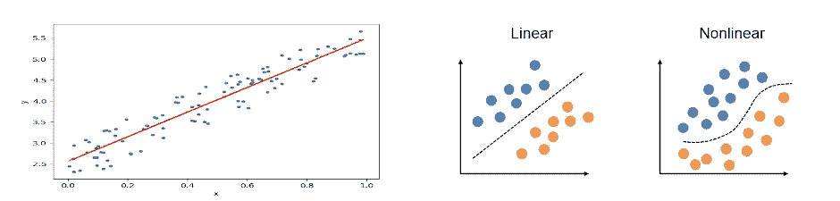
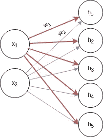
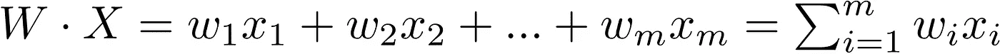

# 不到一个简单的神经网络介绍(4/4)

> 原文：<https://medium.datadriveninvestor.com/less-than-a-simple-introduction-to-neural-networks-4-4-c11ecbfc6c11?source=collection_archive---------7----------------------->

第一部分:[简介](https://medium.com/datadriveninvestor/less-than-a-simple-introduction-to-neural-networks-1-2-d48c9843102b)

第二部分:[权重和参数](https://medium.com/datadriveninvestor/less-than-a-simple-introduction-to-neural-networks-2-4-35326721f6af)

第三部分:[优化和反向传播](https://medium.com/datadriveninvestor/less-than-a-simple-introduction-to-neural-networks-3-4-60e60a482eb3)

第 4 部分:[隐藏层和非线性](https://medium.com/@ahmedbahaaselim/less-than-a-simple-introduction-to-neural-networks-4-4-c11ecbfc6c11?sk=cc093344c56ad045af667454c78b61ab)

这篇文章会比前几篇长。因为我想为您提供一个导航指南，其中包含神经网络的一般介绍，您必须知道的关键术语以及这些概念如何连接在一起的地图(处理图表，但我的艺术技能真的很差)。这篇文章将包含非线性(激活函数)和隐藏层的相应代码的解释。完整代码可以在 github 上获取:[完整代码](https://github.com/W1ndSurf3r/Medium/blob/master/Simple_Intro/Classification/Tutorial_1.py)。

[](https://www.datadriveninvestor.com/2019/02/18/the-challenge-of-forex-trading-for-machine-learning/) [## 机器学习的外汇交易挑战|数据驱动的投资者

### 机器学习是人工智能的一个分支，之前占据了很多头条。人们是…

www.datadriveninvestor.com](https://www.datadriveninvestor.com/2019/02/18/the-challenge-of-forex-trading-for-machine-learning/) 

在前面的部分中，我们一直在处理的是一个非常简单的线性回归的例子。有很多很棒的教程，可以达到你想要的详细程度。到目前为止，我们使用了非常简单的函数 *f(x) = 2 + x* 这是一个线性函数，在回归的情况下，这意味着只要一条线就可以表示数据 *X* 并预测新的数据点。在**分类的上下文中**意味着一条线可以将属于两个组的点分开(稍后将详细讨论分类)，如图 1 所示。我发现这篇文章 [**在这里**](https://towardsdatascience.com/visualizing-the-non-linearity-of-neural-networks-c55b2a14ad7a) 与我们到目前为止所讨论的一致，并且很好地解释了非线性。



Figure 1: On the left side, a linear regression example. On the right side, linear separable data points and nonlinearly separable data points.

我们将实现的例子将用于分类。分类任务只是识别事物是什么，例如，分类器可以辨别图片是狗还是猫，是男人还是女人。区分两个事物，我们将这些标签如(猫、狗、男人、女人)称为**类**。如果我们区分一个男人和一个女人，那么我们有两个类——一只猫和一只狗，那么我们还有两个类——一只猫，一只狗和一匹马，这是三个类，以此类推。当我们只有两个类时，通常这被称为二进制分类，因为一个类可以是 0，另一个类可以是 1，即猫= 0，狗= 1。在下一个系列中，我将解释数据准备和**预处理。**在此阶段，我们将为每个类别分配一个数字，因为神经网络基于数字，我们需要提供它可以理解的输入。

我也想给你们一点挑战，在一定程度上使用真实的数据集。我不喜欢跟随教程的一个部分是下载整个数据集。所以我们将使用虹膜数据集。它可以很容易地从 **sklearn 导入。**完整代码可从[这里](https://github.com/W1ndSurf3r/Medium/blob/master/Simple_Intro/Classification/Tutorial_1.py)获得。在我们的例子中，鸢尾属植物可以属于三类之一:Setosa，Versicolour 和 Virginica(因此:我们有 3 类)。数据集中的标签是 0、1 和 2，对应于每个类别。我们将在第一轮中使用两个**特征**，即萼片长度和萼片宽度。然后我们会在使用四个特征时进行比较:萼片长度、萼片宽度、花瓣长度、花瓣宽度。这里的特征是指我们一直在谈论的 X，网络的输入。因此，对于每个批次(培训示例)，我们将有两个点 x₁和 x₂.因此，输入的大小将是{ *批* x *2}。*

```
**from** **sklearn** **import** datasets
iris = datasets.load_iris() # load the datasetX = iris.data[:, :2]  # we only take the first two features.
y = iris.target # The labelsprint(X[0:2])) # lets see how two examples of X looks like
print(y[0:100]) # let see how the labels look like
```

我们将数据集加载到变量名 iris 中。为了访问数据集中的 *X* ，我们使用 iris.data 和(标签/目标/类)iris.target。注意，对于目标，标签是 0，1，2。

```
import torch
import torch.nn as nn
import torch.optim as optimmodel = 
nn.Sequential(nn.Linear(2,5),nn.ReLU(),
nn.Linear(5,20), nn.ReLU(),
nn.Linear(20,3))optimizer = optim.Adam(model.parameters(),lr=0.01)
print(model)
```

我们已经在前一篇文章中介绍了如何实现一个单层。提醒一下，这个博客是为了用简单的方式解释正在发生的事情，所以让我们把这个模块分成更小的部分。

```
nn.Linear(2,5) ## A fully connected layer.
nn.ReLU() ## activation function.
```



Figure 2: Fully connected layer with 2 inputs and 5 hidden units.

首先，函数 nn 的第一个输入。Linear()取多少个输入神经元(2)，这是将要使用的**特征**。第二个(5)，是输出神经元。所以我们说我们有两个**层**,**第一层**是有 2 个神经元的**可见**输入层，**第二层**是有 5 个神经元的隐藏层。为什么我们说它是隐藏的呢？原因是我们并不真正知道它在学习什么(现在更有可能),这与我们知道输入是什么和那里有什么的可见层相反。此时，我们正在计算每个**隐藏单元**，与第 2 部分中的相似，但现在我们有两个特征，例如 *h₁ = x₁w₁ + x₂w₂* 和每个 *hᵢ* 相同，其中 *i* 是隐藏单元的数量，我们说 *m* 是输入/特征的数量。换句话说，我们将每个输入乘以重量，然后将它们加在一起，这就是**点积**(如果你遇到这个术语的话)。作为参考，它被定义为:



Dot product

这样就不那么混乱了(如果你不在乎数学的话就忽略它)，隐藏层数将是 *W* 的行数所以在我们的例子中， *W = {5* x *2}和 X= {2* x *1}，H = {5 x 1}的形状。*

其次，nn。ReLU()这就是整个非线性的来源。该功能被称为**激活功能。**再次展示一下它的功能，我喜欢这个[帖子](https://towardsdatascience.com/visualizing-the-non-linearity-of-neural-networks-c55b2a14ad7a)。但是，我们在这里简化一下。之所以称为激活，我们认为大脑是如何工作的，是因为当有输入时，大脑中相应的区域表现出更多的活动，据说这些大脑区域被激活了。对于神经网络也是一样，我们希望激活一些区域，所以这些函数将**转换**输入，这意味着它会将它们转换为不同的表示形式，并且每个隐藏单元都有一个数字，如您所见 *H = {5 x 1}。*

通常，教程从 sigmoid 函数开始，但我喜欢用 ReLU 来解释，它代表校正的线性单位，你可以在这篇文章中了解更多信息。ReLU 函数被定义为 *z = max(0，x)，*，因此如果我们计算 *h₁ = x₁w₁ + x₂w₂* ，并且输出是一个负数，那么我们将它插入 ReLU 函数，它将被**转换为 0，如果它大于 0，那么它将等于计算的值。因此，现在我们可以将方程写成 *z₁ = ReLU(h₁)，* ***其中 z 现在是隐藏单元激活的张量。*****

需要注意的是，激活函数对于计算梯度也很重要，这在我提到的所有帖子中都有涉及。不同的目的有不同的激活功能，你可以在 Github 中摆弄[代码](https://github.com/W1ndSurf3r/Medium/blob/master/Simple_Intro/Classification/Tutorial_1.py)，改变激活功能。一个非常好的学习术语是潜在特征或潜在空间，它指的是隐藏层中存在的转换输入。

最后，为什么我们有隐藏的单位/层？在下面的代码行中，我们有更多完全连接的层。嗯，这是一个很长的话题，有几种方法可以深化模型(增加更多的隐藏层)和变化。但是已经发现，对于复杂的数据集，更深的模型具有更好的性能。我的想法是，假设你已经嵌套了 if 条件，让我们举一个神经网络的例子，它试图用完全虚构的假设对狗和猫进行分类，比如:

```
If the nose exists:
    if the nose is > 2cm:
       if the nose is black:
           probably its a dog (probability)
    if the nose is < 2cm:
       if the nose is not black:
           probably its a cat
```

在这个例子中，一只猫可能有一个小于 2 厘米的黑色鼻子，但网络永远无法知道这一点。因为它受限于那些标准，这是它能够学习的。顺便说一下，这些可能是例如卷积神经网络的潜在空间中的学习特征但是，如果我们在 if 条件中增加更多内容:

```
If the nose exists:
    if the nose is > 2cm:
       if the nose is black:
           if the nose has hair:
              if the size of the shoulder > 50 
                 then probably its a dog (probability)
    if the nose is < 2cm:
       if the nose is not black:
           probably its a cat
```

我想你明白了，我就不用把剩下的写在猫的部分了。对我来说，隐藏层就像嵌套的 if 条件。越深，意味着添加更多的隐藏层，我们可以覆盖的条件就越多。**然而**，有时如果网络太深，可能会导致混乱甚至更糟，**过度拟合**，这显然我们不会在这里讨论，但肯定会讨论。

在你开始你的旅程之前，还有一件事要知道，或者耐心一点，跟随下一篇文章，这将使我们更接近神经网络。最后一层总是将隐藏的单元映射到类，所以在我们的例子中，nn。Linear(20，3)，我们在第二个隐藏层中有 20 个隐藏单元，连接到三个神经元，这是我们每个类的概率。

我现在要告诉你的是，去这里提供的 git 库，我添加了打印重量大小的函数，你会在顶部找到一些激活函数的列表，如果你准备好了，你可以玩或搜索。更改数字并检查准确性。代码非常简单，可以作为下一篇教程和文章的框架。

这个系列到此结束。如果你觉得它有用，或者发现任何错误或不清楚的部分，有任何问题。欢迎私信或留言给我。