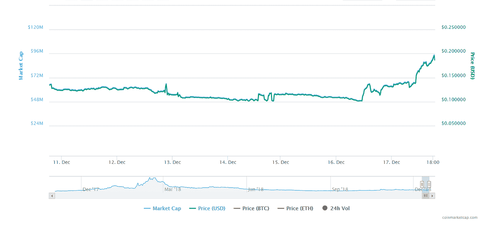
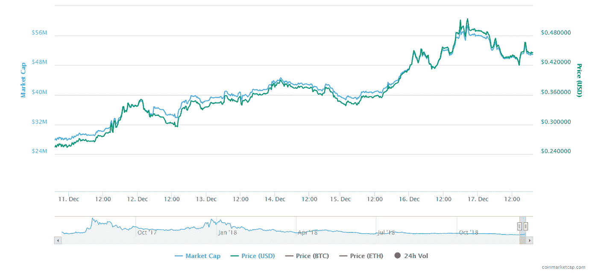

# 鲜为人知、被低估、性能卓越的加密货币。他们会是未来吗？

> 原文：<https://medium.datadriveninvestor.com/lesser-known-undervalued-cryptocurrencies-with-great-performances-could-they-be-the-future-f093e0b4ce52?source=collection_archive---------18----------------------->

在过去的十年中，如此多的加密货币浮出水面并声名鹊起。
例如，无论某人是否是密码爱好者，他们都知道一些关于比特币的事情。比特币在其繁荣时期声名鹊起，现在 Ripple、Etheruem 和 Litecoin 等货币或多或少每天都在为自己扬名。由于它们之前的表现和巨大的市值，它们的排名高于其他可用的加密货币。然而，还有许多其他的加密硬币表现出色，却没有得到应有的关注。本周的回顾不是关于你日常使用的加密货币，而是关于过去一周表现出色的鲜为人知的货币。(10/12/2018–17/12/2018).

**瑞文。**T3【瑞文币】基于 Revain.org 网站。这个网站是一个类似 Yelp 的反馈网站，但是有点曲折；它基于区块链技术。当您在页面上留下反馈时，不仅可以保证它不会被删除或丢失，而且您还可以从您的反馈中获得报酬。Revain (R)于 2017 年以 ICO 的身份成立。截至本周，它的定价为 0.135 美元(USDT 汇率)，市场上限为 65，264，331 美元。在过去的一周里，它的图形非常稳定，截至今天(2018 年 12 月 17 日)，它的价格已经跃升至 0.1925 美元，涨幅近 45%。市值也增加了约 28，034，383 美元，达到 93，298，714 美元。在过去的 24 小时里，它与昨天的价格相比有 58%的变化。

**TenX**
TenX (PAY)与母公司 TenX 有关联。TenX 是最具创新性的公司之一，因为它让你用加密货币装满你的钱包(这是他们的应用程序)，然后在你的日常生活中使用这些货币。所以基本上，这是一种将区块链和我们生活的世界联系起来的方式。TenX 于 2017 年 7 月首次以 ICO 的身份上市。2018 年 10 月 12 日，其价格为 0.254 美元，市值为 27，835，861 美元。它本周的表现真的很好，它几乎有一个全面增长的图表，比上周增长了约 77%，TenX (PAY)目前的股价为 0.44 美元。

**Digitex**
(此处显示的数据基于 2018 年 12 月 18 日的价格)
Digitex 是期货交易所。他们让他们的用户在没有任何交易费用的情况下兑现利润。然而，他们只向用户支付他们自己的加密货币“DGTX”ICO 始于 2018 年 5 月。与昨天的价格相比有+27%的变化，DGTX 度过了出色的一周，在周末，他们的市值和价格上涨了约 35%。DGTX 现在售价 0.0466 美元，市值 34146990 美元。

*如果你想了解更多，请访问 BIDITEX 页面并提出你的问题，关注我们的* [*推特*](https://twitter.com/biditex_com) *，* [*脸书*](https://www.facebook.com/biditex/) *，* [*中型*](https://medium.com/@biditex) *，* [*电报*](https://t.me/biditex%20%28edited%29) *，*[*LinkedIn*](https://www.linkedin.com/company/biditex)*。投标变更用* [*投标变更用*](https://medium.com/@biditex/biditex.com) *。*