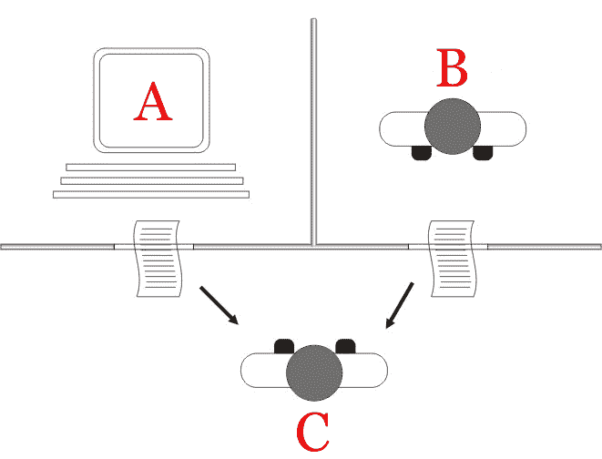
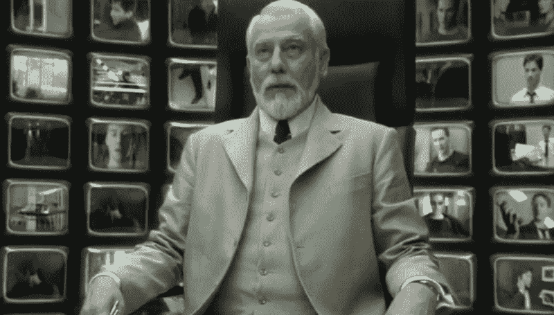

# 来自中国的教训:Instagram、图灵测试和虚拟专用网上的时空旅行

> 原文：<https://medium.datadriveninvestor.com/lessons-from-china-time-and-space-travel-on-instagram-turing-tests-and-vpns-f443d99fcdd9?source=collection_archive---------27----------------------->

# 冲浪尺寸

今年，我开始在 Instagram 上积极发帖，纯粹是作为一个开放日记的现代版本，也作为一个我可以对照“现实”检查的个人账户。

由于我位于 Mainland China，屏蔽脸书和 Whatsapp 等西方社交媒体主要是为了获取信息，而不是为了支持国内垄断，所以每当我想联系英国的朋友时，我都必须使用 VPN 来将我的 IP 地址更改为没有防火墙的地方，例如香港。

这让我产生了数字太空旅行(DST)的想法，因为这正是 VPN 所做的。它会在瞬间将你的数字位置改变到其他地方，准确地说接近光速。我可以假装在世界上的任何地方，那些与我在线交流的人不会知道任何不同。我甚至和我的好朋友山姆开玩笑说在温布利我就坐在他旁边！

有一次，我贴了一张香港铜锣湾站的照片。很快，一个 10 岁的失散多年的朋友打来电话，要求见面。她说时间是一个如此奇怪的概念，对此我打趣道“这就是为什么赌场没有时钟”！不幸的是，我上传的照片是几周前的，但对她来说，我就好像现在就在那里。这毕竟是 Instagram 上传照片的默认假设(除非你是那些预先安排好并完美过滤过的图片的影响者之一)。我现在已经闯入第二维空间，在时间和空间中旅行。现在我们有了 DSTT(数字空间和时间旅行)。这让我意识到“现实”是意识的 n 个维度。我们再深入一点。

Image Source: [https://www.entitymag.com/falling-rabbit-hole/](https://www.entitymag.com/falling-rabbit-hole/)

这让我产生了一个想法:如果是一个机器人自己上传的图片呢？调度器，例如[缓冲器](https://buffer.com/instagram)已经存在，并且做得很好。把这个想法带到下一个层次，如果我可以创建一个聊天机器人，模拟我对我的每个朋友的回应方式，并且回应可以变化，因为我可以根据我与谁互动来改变我的幽默风格和话题兴趣。但是我的编程技能没有达到标准。也许我应该磨更多的扑克，雇一个 Tensorflow 程序员。或者自己学 Python。或者找合作者和投资人。

那么，我的在线存在会有任何用处吗？因为这个机器人实际上正在做我会做的事情，过着和我一样的数字生活，只要它能像我一样“自然地”学习和适应它的反应。因此，这个机器人会通过愚弄我的朋友来通过图灵测试！

Image Source: [https://en.wikipedia.org/wiki/Turing_test](https://en.wikipedia.org/wiki/Turing_test)

这个想法甚至延伸到“真实”世界。什么是真实的？我们在母体里吗？我们是动物还是计算机程序？还是两者都有？还是都不是？上面有神圣的造物主吗？建筑师？这些都说不通。科幻小说也许比科学更真实。这都是迷因迷因。我们都只是迷因。

Image Source: [http://vsbattles.wikia.com/wiki/The_Architect_(The_Matrix)](http://vsbattles.wikia.com/wiki/The_Architect_(The_Matrix))

# 虚拟专用网及其在中国的现状

中国禁止 VPN。原因很清楚:促进稳定。

每个人都知道知识就是力量，对于那些没有受过教育的人来说，太多的信息会导致社会动荡。同样，这是社会与个人自由的概念。如果突然老一代人在网上发现了某些信息和真相，你觉得会发生什么？如今在互联网上什么是真实的？将会有大规模的抗议和可能的暴力，这违背了中国的和平和防御原则。

当然，考虑到[间谍芯片](https://www.zerohedge.com/news/2018-10-09/new-evidence-chinese-spy-hardware-found-ex-mossad-investigators-super-micro-shares)和允许中国国内公司剽窃西方知识产权的法律，这种防御的想法并不完全正确。我只关心创新和开源，所以这个问题还没有真正困扰我。这也是为什么 UBI(普遍基本收入)会在几十年后发挥作用。

我以前在金融市场的经历告诉我要成为一个坚定的资本家，但也许有更好的解决方案来避免波动。毕竟，如果华尔街真的相信资本主义和[创造性破坏](https://en.wikipedia.org/wiki/Creative_destruction)，那么他们就不应该乞求援助。伪君子。可以说，救助或许是一个好主意，所以很明显政府干预确实有其优点，至少特斯拉也应该这么认为，如果他们使用补贴的话。

中国太专注于经济增长和生活水平的提高，以至于没有时间去担心少数人。我不知道这是不是[的最佳策略](https://en.wikipedia.org/wiki/Trolley_problem)。我不知道对于像中国这样一个多样化和分裂的国家来说，什么更好。集中的自上而下的方法目前看来效果最好。完全接受新的想法和模式是找到最佳解决方案的唯一途径。或许我们应该重新思考资本主义、共产主义和民主的含义，尤其是考虑到最近发生的特朗普和英国退出欧盟等事件。我跑题了。

对于数据科学家来说，VPN 的使用因此可以作为社会阶层的有用指标(摘自[吴娜奥米](https://twitter.com/realsexycyborg?lang=en))。你可以放心地假设“工薪阶层”没有 VPN。虽然不确定传统的英国课堂方法是否适用于中国。你经常会发现那些极其富有的人没有“文化”。尽管文化意味着什么取决于你的定义，但是让我们把“美酒和鱼子酱的好品味”作为一个典型的回答。我不喝酒，也不吃鱼蛋，所以也许我没有足够的知识来谈论这种“文化”。

如果你想从一个 100%西方人的角度更多地了解中国(作为白人改变了一切，我敢说至少在 10 年前是积极的)，看看 Serpentza 的 YouTube 频道，他是一个长期的中国博客作者，也在中国电视台播出。显然，只要有利于政府的目标，法律是可以被曲解的。或者更好的办法是，预订下一班飞往深圳的航班！积极进取，大胆探索真理。

让我知道你的想法，如果你有任何建议或批评。

感谢 Oz 的校对。