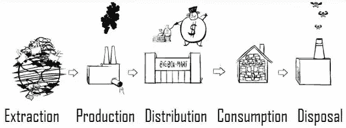
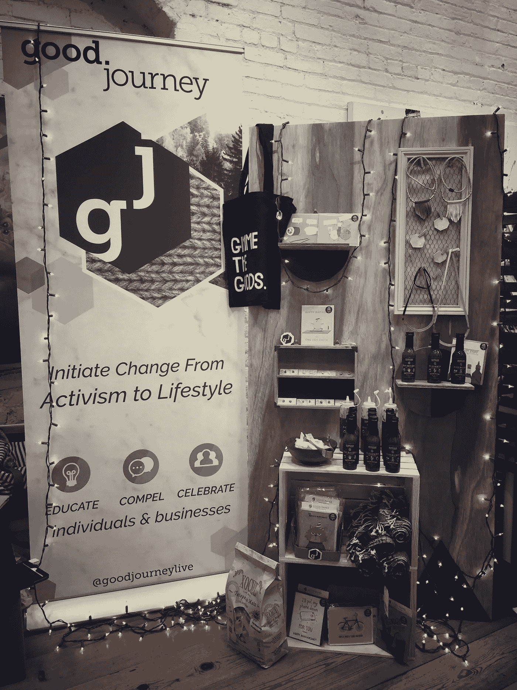
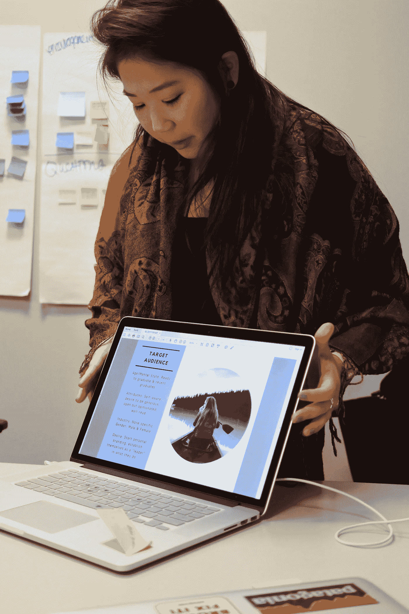
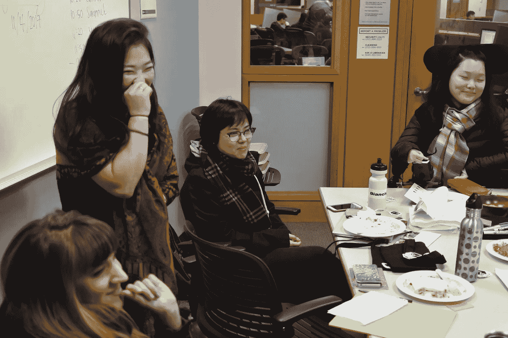
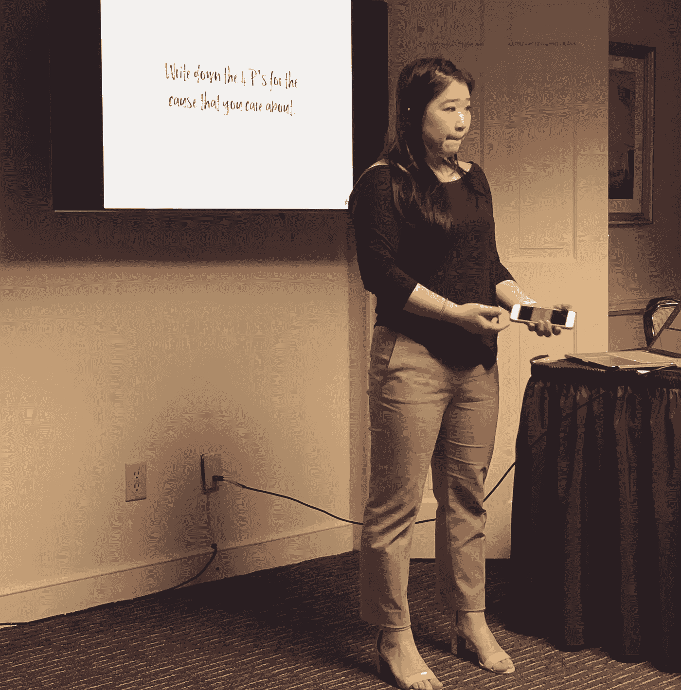
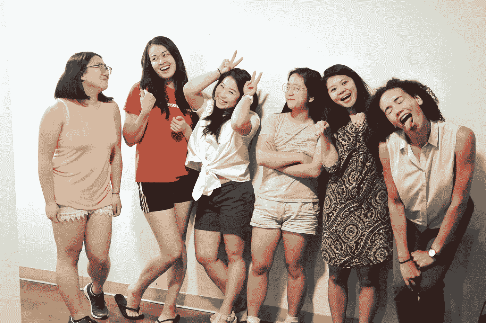

# 从一个 Noob 企业家身上学到的教训

> 原文：<https://medium.datadriveninvestor.com/lessons-learned-from-a-noob-entrepreneur-7d30aca267a1?source=collection_archive---------11----------------------->

## 千禧一代对道德消费的崇高追求

你知道在我创业期间什么最让我伤心吗？不是公众问“那么你们又是做什么的？”，但是我的一个队友在我们深入 4 个月的时候问了我同样的问题。哎哟。

有两种类型的组织——一种是从使命开始并找到解决方案的组织(想想 Kiva 的小额信贷),另一种是找到需求的解决方案，然后提出使命的组织(想想脸书)。第一个背后的故事要强烈得多，但后者通常更有希望，并朝着硅谷的成功走得更远。我们在第一个桶里。我们的使命很明确:我们希望教育并迫使消费者成为更好的管理者。但是我们的解决方案呢？这是我们的追求。

Story of Stuff, YouTube

让我们后退一点。Good Journey 建立在这样一个原则上，即制造一件产品需要成本——人力成本和环境成本。这些成本在从原材料提取到产品处理的整个供应链中累积起来(见图表)。Good Journey 的名字来源于想了解我们商品的整个旅程。我们不需要知道接触他们的人的名字，但他们可以被核实，他们会得到公平的对待。我们从未使用行话“用你的钱包投票”,但本质上这就是我们所提倡的。此外，巴塔哥尼亚、阿迪达斯和 Everlane 等品牌的发展势头良好，证明公众确实关心产品制造过程中的环境和人力成本。但是，即使风向发生了变化，合乎道德地购物也不容易做到，我们希望找到一种解决方案，让它变得更简单。

在我们的头脑风暴阶段，这个舞台上有一些玩家试图将消费和学习联系在一起。项目只是试图成为道德时尚维基百科，良好的贸易与美丽的生活方式博客道德一切蓬勃发展，全球公民除了每年的节日外，还开设了电子商务商店。因为 Good Journey 心中没有解决方案，我们开始同时做三件事:

1.  写文章教育(*买 xyz 的时候注意这些东西*
2.  卖东西强迫(*选这个牌子不选那个*
3.  创建社区来庆祝(*看看这些做好事的人们！*)

进入:缺乏睡眠、方向和注意力。我的团队一团糟。

# 第一课:一次只做一件事

Our beautiful pop up shop event in Lower East Side

如果我能回到过去，我会一次做其中的一件事，如果没有达到成功的标准，我会继续下一个解决方案。这三个组织并不需要成为我们的竞争对手——不是一下子。即使他们有相似的使命，他们有非常不同的目标市场，因此不同的声音和媒介来传达这些信息。

同时做 3 件事是非常困难的，不仅因为我被拉得太瘦，而且主要是因为我们开始在所有 3 个方面都获得“好的”牵引力，这使得更难选择哪一个是最好的。

# 第二课:找到你擅长的东西并加以利用

如果让我选一个开始，我会选哪一个？不确定，但肯定不是在网上卖产品。我和我的导师都不擅长电子商务或营销，试图在不雇佣有经验的人的情况下解决这个问题是一个严重的错误。

想想在纽约一个 700 平方英尺的小公寓里，数百盒巧克力、围巾和圣诞礼物。在图片中加入弗洛拉和一个舔邮票的同事。然后想象一下，我们穿过半融化的雪去当地的美国邮政投递包裹。)

我们擅长并喜欢做的是教学和与学生一起工作。因此，我们应该集中精力生产好的内容，并在不久之后建立社区。

然后发生了什么？

我艰难地认识到，库存管理不是开玩笑，每周制作和编辑高质量的内容至少需要 3 个人的工作，我们没有创造新的管家。你知道我们是怎么知道的吗？因为在这个“现在就回答我”的时代，人们来找我，问我问题，而不是阅读文章来理解“为什么”

> "弗洛拉，有哪些好的道德胸罩品牌？"
> 
> "我应该在哪里购买不使用童工的新鞋？"

我喜欢回答这些问题！我认真对待每一个问题，把它们变成下周的内容话题，瞧？成功的公司？不。我是个资源。他们不是我推荐的品牌的顾客。但他们是我们的观众，因为他们信任我们的研究。所以我们有了一个顿悟的时刻。我们更适合教书，而不是销售。所以我们转向了电子学习。输入从好旅程到做管家的改名。

# 第三课:人们现在购买体验

如果产品或服务是值得拥有的，它最好能带来良好的体验。电子学习作为主要的学习方式是行不通的。面对网上如此多的低价信息，我们陷入了瘫痪。我们可以学习的东西太多了，我们根本什么都不学。没有身体上的动作，我们几乎不可能全神贯注于某件事。我们的用户采访称，我们的课程将在受过大学教育、有稳定工作的单身千禧一代中销售，但我们的目标市场没有转化为学生，因此也没有转化为我们的客户，因为电子学习缺乏“体验”因素，因为没有像编码这样的直接投资回报。

从好的一面来看，与我们的 5 轮电子学习测试相比，我们在与大学生的测试研讨会期间有很大的参与度。工作坊是一种人们全身心地投入的体验。我认为，电子学习作为一种重新学习或复习的方式是非常强大的，就像如果你在那一刻第一次体验，图片和视频会有更大的意义一样。

所以我们决定弃牌。抛开感觉不谈，我学到了关于团队建设、法律结构、熬夜、人们的购买习惯和品牌试图改变的宝贵经验。包括感觉在内，这是一场旋风般的 2 年，我几乎每天都感觉自己是个失败者，大约一个月一次感觉自己是冠军。我现在非常尊敬那些有勇气站起来做出改变的企业家。我更尊重那些努力以道德方式经营企业的企业家。我将来会尝试做类似的事情吗？也许吧，但就目前而言，我会用我的美元投票，直到机会出现。下面再来几张图，说服自己不是在做梦…

All hands meeting to share vision and plan for the next quarter

In-Person Workshop at DCON with Circle K Clubs in the Northeast

Our summer interns whom I come to love dearly!